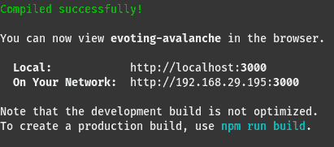
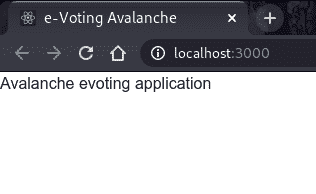
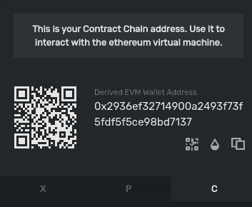
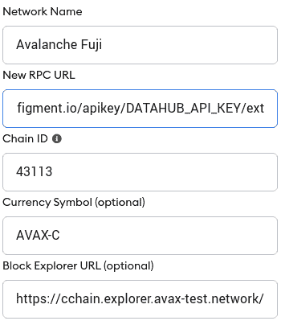
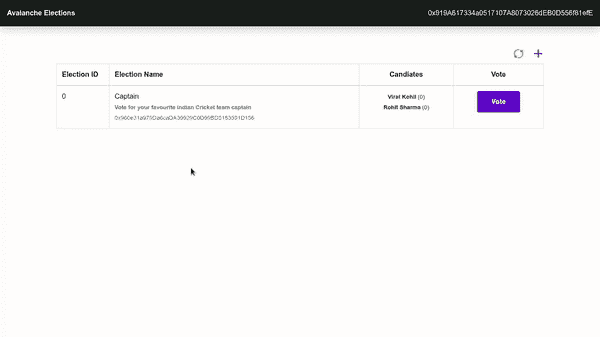

# 介绍

> 原文：<https://github.com/figment-networks/learn-tutorials/blob/master/avalanche/advanced-evoting-avalanche-reactjs.md>

在教程[制作高级电子投票 dApp](https://learn.figment.io/tutorials/making-advanced-e-voting-dapp-avalanche-fuji-using-trufle) 中，我们学习了如何构建智能合约，在 Avalanche 上部署它们，并使用 jQuery 与它们交互。

我们将使用`create-react-app`生成 [ReactJS](https://reactjs.org) 样板代码，我们将为我们的 dApp 前端修改这些代码。React 是高效、开发人员友好的区块链交互的好选择。对于后端， [Solidity](https://docs.soliditylang.org/en/v0.8.4/) 智能合约将使用[松露套件](https://www.trufflesuite.com)部署到[雪崩](/figment-networks/learn-tutorials/blob/master/avalanche/advanced-evoting-avalanche-reactjs.md)区块链。

Truffle Suite 是一个工具包，用于在以太坊虚拟机(EVM)兼容的区块链(如 Avalanche)上启动分散式应用程序(dApps)。使用 Truffle，您可以编写和编译智能合同，构建工件，运行迁移，并与部署的合同进行交互。本教程说明了如何松露可以用于雪崩的 C 链，这是一个 EVM 的实例。

# 先决条件

*   您已经在[数据中心](https://datahub.figment.io/sign_up?service=avalanche)上创建了一个帐户。
*   基本熟悉 [Avalanche 的架构](https://docs.avax.network/learn/platform-overview)和智能合同。
*   基本熟悉[反应堆](https://reactjs.org)。

# 要求

*   [NodeJS](https://nodejs.org/en)>= 10.16[NPM](https://www.npmjs.com/)>= 5.6 已安装。
*   [松露](https://www.trufflesuite.com/truffle)，可以全球安装`npm install -g truffle`
*   添加到浏览器的 Metamask 扩展，必须只能从 Metamask 官方网站获取: [https://metamask.io](https://metamask.io) 。**不要从非官方渠道下载 meta mask**。

# 初始化工作目录

我们的 dApp 的客户端是使用 **ReactJS** 制作的。智能合同将使用 **Solidity** 语言制定，并将部署在带有 **Truffle Suite** 的 **Avalanche** 网络上。因此，我们需要根据 ReactJS 和 Truffle 来设置我们的工作目录，以使开发过程更加顺利。

打开终端并导航到我们将创建应用程序的目录。通常，这将是在我们的用户主目录，但可以位于任何可行的地方。在大多数 Linux 发行版中，这将变成/home/。在 macOS 上，它将是/Users/。在 Windows 上，用户目录位于 C:\Users 中。

```js
cd ~
```

## **建立 ReactJS 项目**

使用 npx 创建新的 react 应用程序。npx 是一个 npm 包运行程序(x 可能代表 eXecute)。典型的用途是临时下载并运行一个包或进行试用。使用 npx 执行 create-react-app 的包二进制文件将在指定目录中生成一个新的 React app 脚手架。

```js
npx create-react-app avalanche-voting 
```

移动到新创建的目录并安装基本的依赖项。

```js
cd avalanche-voting
npm install --save dotenv web3 @truffle/contract @truffle/hdwallet-provider 
```

打开`public`目录中的文件`index.html`，用以下 HTML 替换现有代码:

```js
<!DOCTYPE html>
<html lang="en">
  <head>
    <meta charset="utf-8" />
    <meta name="viewport" content="width=device-width, initial-scale=1" />
    <title>Avalanche Elections</title>
    <link
      rel="stylesheet"
      href="https://cdn.jsdelivr.net/npm/bootstrap@4.6.0/dist/css/bootstrap.min.css"
    />
  </head>

  <body>
    <div id="root"></div>
  </body>
</html>
```

打开`src`目录中的文件`App.js`，用以下代码替换现有代码:

```js
import React from "react";

// 1\. Importing other modules

class App extends React.Component {
  constructor(props) {
    super(props);
    this.state = {
      web3: null,
      account: null,
      mainInstance: null,
    };
  }

  componentDidMount() {
    this.init();
  }

  async init() {
    // 2\. Load web3
    // 3\. Load Account
    // 4\. Load Smart-Contract instance
  }

  render() {
    return <div>Avalanche evoting application</div>;
  }
}
export default App;
```

这个`App`组件有一个构造函数来声明和初始化状态属性。`web3`是用于与雪崩网络交互的`Metamask`提供者的实例，`account`是用户地址，`mainInstance`是我们的智能契约的实例。

打开`src`目录中的文件`index.js`，用以下代码替换现有代码:

```js
import React from "react";
import ReactDOM from "react-dom";
import App from "./App";

ReactDOM.render(
  <React.StrictMode>
    <App />
  </React.StrictMode>,
  document.getElementById("root")
);
```

React 项目设置现在已经完成。

### **建立松露项目**

在项目根目录下运行以下命令，为 Truffle 项目创建一个样板文件。

```js
truffle init 
```

这将建立初始的项目结构。坚固性代码将存储在`contracts`目录中。用 JavaScript 编写的部署函数将存储在`migrations`文件夹中。默认情况下，`/build/contracts`文件夹包含关于编译和部署的契约的信息，如 JSON 格式的 ABI。这些元文件通常被称为`artifacts`。

上面命令创建的还有 1 个 **config** 文件， **truffle-config.js** 。在这个文件中，有许多关于如何部署契约、如何选择部署它们的网络以及许多其他信息。因此，我们应该保存这个文件以供参考。因此，使用下面的命令复制这个文件。这将创建一个名为`truffle-config-default.js`的副本。

```js
cp truffle-config.js truffle-config-default.js 
```

现在，我们将使用在 Fuji 测试网络上部署智能合约所需的信息来更新`truffle-config.js`文件。该文件帮助我们连接到 DataHub Avalanche 节点，并且我们将需要 Avalanche API 密钥以及 Avalanche wallet 助记符，以便在网络上部署合同。

```js
require("dotenv").config();
const HDWalletProvider = require("@truffle/hdwallet-provider");

// Account credentials from which our contract will be deployed
const MNEMONIC = process.env.MNEMONIC;

// API key of your Datahub account for Avalanche Fuji test network
const DATAHUB_API_KEY = process.env.DATAHUB_API_KEY;

module.exports = {
  contracts_build_directory: "./src/build/contracts",
  networks: {
    development: {
      host: "127.0.0.1",
      port: 7545,
      network_id: "*",
    },
    fuji: {
      provider: function () {
        return new HDWalletProvider({
          mnemonic: MNEMONIC,
          providerOrUrl: `https://avalanche--fuji--rpc.datahub.figment.io/apikey/${DATAHUB_API_KEY}/ext/bc/C/rpc/`,
        });
      },
      network_id: "*",
      gas: 3000000,
      gasPrice: 470000000000,
      skipDryRun: true,
    },
  },
  compilers: {
    solc: {
      version: "0.8.0"
    }
  }
};
```

注意，我们将`gasPrice`和`gas`设置为雪崩 C 链的适当值。在这里，你可以看到我们已经使用`contracts_build_directory`将`artifacts`的默认位置从项目根目录更改为`src`文件夹。这是因为 React 无法访问位于`src`文件夹之外的文件。

# 获取雪崩凭证

要部署智能合约，我们需要两样东西:一个连接到雪崩网络的节点和一个只有少量 AVAX 的帐户。要通过 RPC(远程过程调用)访问 DataHub Avalanche 节点，我们需要一个 API 密钥。访问 DataHub 上的 [Avalanche 服务仪表板](https://datahub.figment.io/services/avalanche)以获取 Avalanche 特定的 API 密钥。


现在，我们需要一个雪崩钱包，在那里我们将保持我们的资金，需要在网络上的所有交易。因此，请访问此处的并创建一个帐户。将助记符保存在安全的地方(我们以后会用到)。添加资金的说明将在本教程的后面提供。

### **补充。环境文件**

在项目根文件夹中创建一个`.env`文件。请注意点号(。)是`.env`文件名所必需的。现在，在。env 文件如下所示。在。env 文件，**助记符**应该用双引号(" ")括起来。如果您在设置时遇到任何困难。然后请参考**附加指南**上的 [dotenv 和。env](https://docs.figment.io/network-documentation/extra-guides/dotenv-and-.env) 。

```js
MNEMONIC="<avalanche-wallet-mnemonic>"
DATAHUB_API_KEY=<your-api-key> 
```

切勿共享或提交您的`.env`文件。它包含您的凭证，如`mnemonics`和`API`密钥。因此，建议将`.env`添加到您的`.gitignore`文件中。

我们的项目设置现在已经完成。

要确认我们在同一页上，请在项目根文件夹中运行以下命令。

```js
npm start 
```

这可能需要几秒钟的时间，显示如下图所示的输出。



在浏览器中，访问我们正在运行的 dApp 的 URL:[http://localhost:3000](http://localhost:3000)。如果您遵循上述步骤，您将看到如下所示的页面。



# 创建选举智能合同

在`contracts`目录下创建文件`Election.sol` ( `.sol`代表坚固性)并粘贴以下代码:

```js
// SPDX-License-Identifier: UNLICENSED
pragma solidity >=0.8.0;

contract Election {
  // Election details will be stored in these variables
  string public name;
  string public description;

  // Structure of candidate standing in the election
  struct Candidate {
    uint256 id;
    string name;
    uint256 voteCount;
  }

  // Storing candidates in a map
  mapping(uint256 => Candidate) public candidates;

  // Storing address of those voters who already voted
  mapping(address => bool) public voters;

  // Number of candidates in standing in the election
  uint256 public candidatesCount = 0;

  // Setting of variables and data, during the creation of election contract
  constructor(string[] memory _nda, string[] memory _candidates) public {
    require(_candidates.length > 0, "There should be atleast 1 candidate.");
    name = _nda[0];
    description = _nda[1];
    for (uint256 i = 0; i < _candidates.length; i++) {
      addCandidate(_candidates[i]);
    }
  }

  // Private function to add a candidate
  function addCandidate(string memory _name) private {
    candidates[candidatesCount] = Candidate(candidatesCount, _name, 0);
    candidatesCount++;
  }

  // Public vote function for voting a candidate
  function vote(uint256 _candidate) public {
    require(!voters[msg.sender], "Voter has already Voted!");
    require(
      _candidate < candidatesCount && _candidate >= 0,
      "Invalid candidate to Vote!"
    );
    voters[msg.sender] = true;
    candidates[_candidate].voteCount++;
  }
}
```

`Election`是一个可靠的合同，它允许我们查看候选人的名字和描述，并为他们投票。对于这个 dApp，我们将使用他们的`address`和`ABI`访问部署的选举合同。每当我们创建一个新的选举时，这个可靠性代码将被部署到区块链。

**让我们来理解这个智能合约**

智能合约的代码是`contract Election { }`内的所有内容。

**关于选举**的基本字段——这段代码将存储每个`Election`合同的基本字段。字段包括`name`和`description`。

```js
// Election details will be stored in these variables
string public name;
string public description;
```

**存储候选人详细信息**-`Candidate`结构由数据字段`id`、`name`和`voteCount`组成。我们将定义一个无符号整数(`uint`)和每个候选实例之间的映射。这将使我们能够通过映射- `candidates[n]`中的索引来引用每个候选项，其中`n`是对应的`uint`值。

```js
// Structure of candidate standing in the election
struct Candidate {
  uint256 id;
  string name;
  uint256 voteCount;
}

// Storing candidates in a map
mapping(uint256 => Candidate) public candidates;
```

**存储已经投票的投票人地址和候选人数量** - `voters`是投票人地址和布尔之间的映射。在 Solidity 中，默认的布尔值是`false`，所以如果`voters(address)`的返回值是`false`我们可以理解为这个地址没有投票。`true`表示账户已经投票。

```js
// Storing address of those voters who already voted
mapping(address => bool) public voters;

// Number of candidates in standing in the election
uint public candidatesCount = 0;
```

**构造函数调用并将候选人添加到选举中**——当在 Avalanche 上部署智能合约时，第一个要调用的函数是`constructor()`函数。无论我们想在 Solidity 智能契约中初始化什么，我们都在`constructor()`函数中完成。我们将为选举添加名称、描述和候选人。在这里，`addCandidate()`是一个私有函数，所以它不能被公开调用。这个函数在第一个参数中将`name`和`description`作为一个名为`_nda`的数组，在第二个参数中将候选人的名字作为一个数组。

```js
// Setting of variables and data, during the creation of election contract
constructor (string[] memory _nda, string[] memory _candidates) public {
  require(_candidates.length > 0, "There should be atleast 1 candidate.");
  name = _nda[0];
  description = _nda[1];
  for(uint i = 0; i < _candidates.length; i++) {
    addCandidate(_candidates[i]);
  }
}

// Private function to add a candidate
function addCandidate (string memory _name) private {
  candidates[candidatesCount] = Candidate(candidatesCount, _name, 0);
  candidatesCount ++;
}
```

**选举候选人**——我们做了一个`vote()`函数。它将`candidateId`作为参数，并增加各自候选人的投票。它需要两件事，一个投票人不应该通过检查`voters`映射的布尔运算在特定的选举中投票，并且`candidateId`应该是有效的，即`0 <= candidateId < candiatesCount`。

```js
// Public vote function for voting a candidate
function vote (uint _candidate) public {
  require(!voters[msg.sender], "Voter has already Voted!");
  require(_candidate < candidatesCount && _candidate >= 0, "Invalid candidate to Vote!");
  voters[msg.sender] = true;
  candidates[_candidate].voteCount++;
}
```

# 创建主合同智能合同

在`contracts`目录中创建文件`MainContract.sol`，并粘贴以下代码:

```js
// SPDX-License-Identifier: UNLICENSED
pragma solidity >=0.8.0;

import './Election.sol';

contract MainContract {
  uint public electionId = 0;
  mapping (uint => address) public Elections;

  function createElection (string[] memory _nda, string[] memory _candidates) public {
    Election election = new Election(_nda, _candidates);
    Elections[electionId] = address(election);
    electionId++;
  }
}
```

`MainContract.sol`是我们 dApp 的切入点。为了创建一个新的选择，我们需要从这个已部署的契约中调用`createElection()`函数。它将维护已部署的选举合同总数及其在网络上的地址，还将帮助部署这些合同。我们还[进口](https://docs.soliditylang.org/en/v0.8.4/layout-of-source-files.html?highlight=import#syntax-and-semantics) `Elections.sol`。

这里的`electionId`用于为用户创建的每个选举分配 ID，并在创建下一个选举时递增。另外，`Elections`是`electionId`和部署的选举契约的地址之间的公共映射。

```js
uint public electionId = 0;
mapping (uint => address) public Elections;
```

我们创建了一个`createElection()`函数，它将用于部署我们的`Election`智能合同。这个函数在第一个参数中将`name`和`description`作为一个名为`_nda`的数组，在第二个参数中将候选人的名字作为一个数组。

```js
function createElection (string[] memory _nda, string[] memory _candidates) public {
  Election election = new Election(_nda, _candidates);
  Elections[electionId] = address(election);
  electionId++;
}
```

使用关键字`new`在网络上部署`Election`契约，关键字`new`部署契约、初始化契约变量、运行`constructor()`函数并将新部署契约的**地址**返回给调用者。然后地址被存储在`Elections`映射中。一旦选举合同部署成功，`electionId`就会递增。

## **创建用于迁移智能合同的文件**

在`migrations`目录中创建一个名为`2_deploy_contracts.js`的新文件，并添加以下代码块。这处理将`MainContract`和`Election`智能合同部署到区块链。

```js
const MainContract = artifacts.require("MainContract");

module.exports = function(deployer) {
  deployer.deploy(MainContract);
};
```

我们只部署了`MainContract`，因为`Election`契约将由`MainContract`在运行时使用函数`createElection()`自行部署。

## 用块菌编合同

如果我们修改了 Solidity 源文件中的代码或者制作了新的代码(比如`Elections.sol`，我们需要在终端中从项目根目录中运行`truffle compile`。

预期的输出看起来类似:

```js
Compiling your contracts...
===========================
> Compiling ./contracts/Election.sol
> Compiling ./contracts/MainContract.sol
> Compiling ./contracts/Migrations.sol

> Artifacts written to /home/guest/blockchain/avalanche-voting/build/contracts
> Compiled successfully using:
   - solc: 0.8.0+commit.c7dfd78e.Emscripten.clang 
```

编译后的智能合约作为 JSON 文件写入/src/build/contracts 目录中。这些是存储的 ABI 和其他必要的元数据——工件。

 `ABI`是指应用程序二进制接口，它是用于从区块链外部与智能合同交互以及合同到合同交互的标准。请参考 Solidity 关于 about】这里的文档了解更多。

# 为帐户提供资金，并在 C 链上运行迁移

将智能合约部署到 C 链时，将需要一些部署成本。正如您在`truffle-config.js`中看到的，HDWallet 提供商将帮助我们在 Fuji C-chain 上进行部署，部署成本将由账户管理，该账户的助记符已存储在`.env`文件中。因此，我们需要资金帐户。

## 向您的帐户注入资金

我们的 C 链地址需要资金，因为智能合同部署在 C 链上，即合同链上。这个地址很容易在 [Avalanche Wallet](https://wallet.avax.network) 仪表盘上找到。雪崩网络有 3 条链:X 链、P 链和 C 链。所有这些连锁店的地址都可以通过切换分区底部的标签找到，那里有一个二维码。所以，切换到 C 链，复制地址。现在使用水龙头链接[在这里](https://faucet.avax-test.network/)为你的账户注入资金，并将你的 C 链地址粘贴到输入框中。请参考下图，以识别地址部分。



您需要至少向帐户发送`135422040` nAVAX，以支付合同部署的成本。这里的`nAVAX`指的是 nano-AVAX 即十亿分之一的`AVAX`或者简称为 1 `nAVAX` = (1/1000，000，000) `AVAX`。虽然通过水龙头融资会给你足够的`AVAX`在网络上运行多个部署和交易。

## 运行迁移

现在，运行迁移和部署`MainContract`的一切都已就绪:

```js
truffle migrate --network fuji 
```

这可能需要一段时间，取决于您的互联网连接或网络流量。

注意——出于开发目的，我们可以通过运行 Ganache (Truffle 的本地区块链模拟)并使用命令在本地网络上部署我们的合同

```js
truffle migrate --network development
```

成功执行该命令后，您应该会看到:

```js
Starting migrations...
======================
> Network name:    'fuji'
> Network id:      1
> Block gas limit: 8000000 (0x7a1200)

1_initial_migration.js
======================

   Deploying 'Migrations'
   ----------------------
   > transaction hash:    0x094a9c0f12ff3158bcb40e266859cb4f34a274ea492707f673b93790af40e9e9
   > Blocks: 0            Seconds: 0
   > contract address:    0x0b1f00d0Af6d5c864f86E6b96216e0a2Da111055
   > block number:        40
   > block timestamp:     1620393171
   > account:             0x80599dd7F8c5426096FD189dcC6C40f47e8e3714
   > balance:             39.71499696
   > gas used:            173118 (0x2a43e)
   > gas price:           20 gwei
   > value sent:          0 ETH
   > total cost:          0.00346236 ETH

   > Saving migration to chain.
   > Saving artifacts
   -------------------------------------
   > Total cost:          0.00346236 ETH

2_deploy_contracts.js
=====================

   Deploying 'MainContract'
   ------------------------
   > transaction hash:    0xbeb13fc6bbee250eea9151faf02bfe247ec497294acc84c9b8319ed609ced086
   > Blocks: 0            Seconds: 0
   > contract address:    0xf30D372A6911CCF6BBa1e84c3CEd51cC0F3D7769
   > block number:        42
   > block timestamp:     1620393172
   > account:             0x80599dd7F8c5426096FD189dcC6C40f47e8e3714
   > balance:             39.69235442
   > gas used:            1090212 (0x10a2a4)
   > gas price:           20 gwei
   > value sent:          0 ETH
   > total cost:          0.02180424 ETH

   > Saving migration to chain.
   > Saving artifacts
   -------------------------------------
   > Total cost:          0.02180424 ETH

Summary
=======
> Total deployments:   2
> Final cost:          0.0252666 ETH
```

如果您没有在 C 链上创建帐户，您将看到以下错误:

```js
Error: Expected parameter 'from' not passed to function. 
```

如果您没有为该帐户提供资金，您会看到以下错误:

```js
Error:  *** Deployment Failed ***

"Migrations" could not deploy due to insufficient funds
   * Account:  0x090172CD36e9f4906Af17B2C36D662E69f162282
   * Balance:  0 wei
   * Message:  sender doesn't have enough funds to send tx. The upfront cost is: 1410000000000000000 and the sender's account only has: 0
   * Try:
      + Using an adequately funded account 
```

已部署合同的信息和 ABI 作为`Election.json`出现在`src/build/contract`目录中。合同地址、网络信息等信息。可以在这里找到。

# 构建用户界面

我们已经建立了我们的 React 项目目录。与雪崩区块链交互的客户端文件位于`src`目录中。首先，我们将制作一个包含几个函数的 ReactJS 组件，将我们的浏览器与 Avalanche 网络连接起来。这些函数将保存在一个名为`BlockchainUtil.js`的单独文件中。

## BlockchainUtils 组件

在项目`src`目录中创建文件`BlockchainUtil.js`，并粘贴以下代码:

```js
import React from "react";
import Web3 from "web3";
import TruffleContract from "@truffle/contract";

export class GetWeb3 extends React.Component {
  async getWeb3() {
    let web3 = window.web3;

    if (typeof web3 !== "undefined") {
      // Setup Web3 Provider
      this.web3Provider = web3.currentProvider;
      this.web3 = new Web3(web3.currentProvider);
      return this.web3;
    } else {
      this.isWeb3 = false;
    }
  }
}

export class GetContract extends React.Component {
  async getContract(web3, contractJson) {
    // Setup Contract
    this.contract = await TruffleContract(contractJson);
    this.contract.setProvider(web3.currentProvider);
    return await this.contract.deployed();
  }
}

export class GetAccount extends React.Component {
  async getAccount(web3) {
    return await web3.eth.getAccounts();
  }
}
```

## 更新 App.js

`App.js`是我们 React 应用程序的入口点。因此，我们需要用我们希望在应用程序中显示的组件来更新`App.js`。随着我们继续前进并构建组件，我们将更新`App.js`并导入组件，以便我们可以利用它们的功能。

所以，现在在`App.js`的`//Importing...`部分下添加下面一行来导入`BlockchainUtil.js`模块。

```js
// 1\. Importing other modules
import {GetWeb3, GetContract, GetAccount} from './BlockchainUtil';
```

将以下代码粘贴到`App.js`的`init()`函数中

```js
// 2\. Load web3
const Web3 = new GetWeb3();
this.web3 = await Web3.getWeb3();
this.setState({web3: this.web3});

// 3\. Load Account
const Account = new GetAccount();
this.account = await Account.getAccount(this.web3);
this.setState({account: this.account[0]});

// 4\. Load Contract
const Contract = new GetContract();
this.mainInstance = await Contract.getContract(this.web3, contractJson);
this.setState({mainInstance: this.mainInstance});
```

## 创建选择组件

现在，让我们创建一个组件，它将使用我们部署的智能契约创建新的选举。在项目`src`目录中创建文件`CreateElection.js`，并粘贴以下代码。代码被注释以引起对重要部分的注意。

```js
import React, { Component } from "react";
import App from "./App";

class CreateElection extends Component {
  constructor(props) {
    super(props);

    this.onChangeElectionName = this.onChangeElectionName.bind(this);
    this.onChangeDescription = this.onChangeDescription.bind(this);
    this.onSubmit = this.onSubmit.bind(this);

    // These state variables would maintain inputs of the form
    this.state = {
      electionname: "",
      description: "",
      candidates: [],
    };
  }

  // To store App.js instance
  app = null;

  // Connect application with Metamask and create smart-contract's instance
  async init() {
    this.app = new App();
    await this.app.init();
  }

  componentDidMount() {
    this.init();
  }

  onChangeElectionName(e) {
    this.setState({
      electionname: e.target.value,
    });
  }

  onChangeDescription(e) {
    this.setState({
      description: e.target.value,
    });
  }

  // Function to be called when the form is submitted
  async onSubmit(e) {
    e.preventDefault();

    // Structuring Election details from the form before submitting transaction to the smart-contract
    const electionDetails = {
      electionname: this.state.electionname,
      description: this.state.description,
      candidateObjects: document.getElementsByName("candidate").values(),
      candidates: [],
    };

    var i = 0;

    for (var value of electionDetails.candidateObjects) {
      electionDetails.candidates[i] = value.value;
      i++;
    }

    // Making transaction to the MainContract instance, for creating a new election
    await this.app.mainInstance.createElection(
      [electionDetails.electionname, electionDetails.description],
      electionDetails.candidates,
      { from: this.app.account[0] }
    );

    window.location = "/active";
  }

  render() {
    return (
      <div className="container card">
        <h3>Create New Election</h3>

        {/* New Election Form */}
        <form onSubmit={this.onSubmit}>
          <div className="form-group">
            <label>Name</label>
            <input
              type="text"
              required
              className="form-control"
              placeholder="Enter election name"
              onChange={this.onChangeElectionName}
            />
          </div>

          <div className="form-group">
            <label>Description</label>
            <textarea
              type="text"
              required
              className="form-control"
              placeholder="Describe your Election here"
              onChange={this.onChangeDescription}
            ></textarea>
          </div>

          <table>
            <tr>
              <td id="1" className="form-group">
                <label>Candidate 1</label>
                <td>
                  <input
                    type="text"
                    required
                    className="form-control"
                    placeholder="Candidate Name"
                    name="candidate"
                  />
                </td>

                <br />
                <label>Candidate 2</label>
                <td>
                  <input
                    type="text"
                    required
                    className="form-control"
                    placeholder="Candidate Name"
                    name="candidate"
                  />
                </td>
              </td>
            </tr>
          </table>

          <br />

          <div>
            <button
              className="btn btn-success grid-item"
              style={{ width: 100 }}
              type="submit"
            >
              Submit
            </button>
          </div>

          <br />
        </form>
      </div>
    );
  }
}

export default CreateElection;
```

## ActiveElections 组件

在项目`src`目录中创建文件`ActiveElections.js`，并粘贴以下代码:

```js
import React, { Component } from "react";
import { Loader } from "rimble-ui";
import { Link } from "react-router-dom";

import App from "./App";
import ElectionJSON from "./build/contracts/Election.json";
import VoteModal from "./VoteModal";

// Election component for organising election details
var Election = (props) => (
  <tr>
    <td>{props.election.electionId}</td>

    <td>
      {props.election.electionName} <br />
      <font className="text-muted" size="2">
        <b>{props.election.electionDescription}</b>
      </font>
      <br />
      <font className="text-muted" size="2">
        {props.election.electionAddress}
      </font>
    </td>

    <td style={{ textAlign: "center" }}>{props.candidateComponent}</td>

    <td style={{ textAlign: "center" }}>
      {!props.election.hasVoted ? (
        // Vote Modal would be mounted if the user has not voted
        <VoteModal election={props.election} candidates={props.candidates} />
      ) : (
        <font size="2" color="green">
          You have voted!
        </font>
      )}
    </td>
  </tr>
);

// Candidate component for organising candidate details of each candidate
var Candidates = (props) => (
  <font size="2">
    <b>{props.name}</b> ({props.voteCount}) <br />
  </font>
);

// ActiveElections component would fetch and display all the the elections deployed by the MainContract.sol
class ActiveElections extends Component {
  constructor(props) {
    super(props);
    this.state = {
      data: [],
      loading: false,
    };
  }

  // To store App.js instance
  app = null;

  // Connect application with Metamask and create smart-contract's instance
  async init() {
    this.app = new App();
    await this.app.init();
    await this.loadData();
  }

  loader = false;

  componentDidMount() {
    this.init();
  }

  loadData = async () => {
    this.setState({ loading: true });

    // electionId maps to total elections created
    var eCount = await this.app.mainInstance.electionId();
    var elections = [], electionDetails = [], electionComponents = [];

    // Election details of every election created by MainContract
    for (var i = 0; i < eCount; i++) {
      elections[i] = await this.app.mainInstance.Elections(i);
      var election = await new this.app.web3.eth.Contract(ElectionJSON.abi, elections[i]);

      electionDetails[i] = [];

      // Account address of the voter
      electionDetails[i].account = this.app.account[0];

      // Each contract's instance
      electionDetails[i].contractInstance = election;

      // Address of each election contract
      electionDetails[i].electionAddress = elections[i];

      // Boolean indicating wether the contract address has voted or not
      electionDetails[i].hasVoted = await election.methods.voters(this.app.account[0]).call();

      // Name of the election
      electionDetails[i].electionName = await election.methods.name().call();

      // Description of the election
      electionDetails[i].electionDescription = await election.methods.description().call();

      // Election id
      electionDetails[i].electionId = i;

      // Organising candidates into components
      var candidatesCount = await election.methods.candidatesCount().call();
      var candidates = [], candidateComponents = [];
      candidates[i] = [];
      candidateComponents[i] = [];

      for (var j = 0; j < candidatesCount; j++) {
        candidates[i].push(await election.methods.candidates(j).call());
        candidateComponents[i].push(
          <Candidates
            name={candidates[i][j][1]}
            voteCount={candidates[i][j][2]}
          />
        );
      }

      // Saving the electionDetails in the form of a component
      electionComponents[i] = (
        <Election
          election={electionDetails[i]}
          candidates={candidates[i]}
          candidateComponent={candidateComponents[i]}
        />
      );
    }

    this.setState({
      data: electionComponents,
      loading: false,
    });
  };

  render() {
    return (
      // Simple container to store table with election data
      <div className="container">
        <div style={{ float: "right", marginBottom: "10px" }}>
          
          <Link to="/createElection">
            
          </Link>
        </div>

        <table className="table table-hover table-bordered">
          <thead>
            <tr>
              <th style={{ width: "120px" }}>Election ID</th>
              <th>Election Name</th>
              <th style={{ textAlign: "center" }}>Candiates</th>
              <th style={{ textAlign: "center" }}>Vote</th>
            </tr>
          </thead>

          <tbody>{this.state.data}</tbody>
        </table>

        <center>{this.state.loading ? <Loader size="40px" /> : <></>}</center>
      </div>
    );
  }
}

export default ActiveElections;
```

## 涡流分量

在上面的组件`ActiveElections.js`中，我们使用了一个名为`VoteModal`的组件，它包含候选人的详细信息和一个投票按钮。现在我们将通过在`src`目录中创建一个名为`VoteModal.js`的文件来使这个组件可用。创建后，将以下代码放入其中:

```js
import React, { useState } from "react";
import { Box, Flex, Modal, Button, Text, Card, Radio, Field, Loader } from "rimble-ui";

// Data like election and candidate details will be passed in the props by ActiveElections.js (parent)
function VoteModal(props) {
  // These are React Hooks and are used only for UX like opening and closing of Voting Modal and loaders
  const [isOpen, setIsOpen] = useState(false);
  const [loading, isLoading] = useState(false);

  // This Hook will be used to maintain the selected candidate ID by a voter
  const [cid, changeCid] = useState(0);

  const closeModal = (e) => {
    e.preventDefault();
    setIsOpen(false);
  };

  const openModal = (e) => {
    e.preventDefault();
    setIsOpen(true);
  };

  const onRadioChange = (e) => {
    changeCid(e.target.value);
  };

  // vote() function would be used to transact a vote
  const vote = async (eid) => {
    isLoading(true);
    await props.election.contractInstance.methods.vote(cid).send({ from: props.election.account });
    isLoading(false);
  };

  var candid = [],
    candidVote = [];
  for (var i = 0; i < props.candidates.length; i++) {
    var candidDetail = props.candidates[i][1] + " (" + props.candidates[i][2] + ")";

    candid.push(
      <Radio
        name="candidate"
        key={i}
        label={candidDetail}
        my={2}
        value={props.candidates[i][0]}
        onChange={onRadioChange}
      />
    );

    candidVote.push(props.candidates[i][2]);
  }

  return (
    // This is a rimble-ui builtin modal for triggering vote() function
    <Box className="App" p={0}>
      <Box>
        <Button onClick={openModal}>Vote</Button>

        <Modal isOpen={isOpen}>
          <Card width={"420px"} p={0}>
            {/* Close icon to close the modal */}
            <Button.Text
              icononly
              icon={"Close"}
              color={"moon-gray"}
              position={"absolute"}
              top={0}
              right={0}
              mt={3}
              mr={3}
              onClick={closeModal}
            />

            {/* List of candidates with their vote count */}
            <Box p={4} mb={3}>
              <h3>{props.election.electionName}</h3>
              <Field label="Choose candidate from below">{candid}</Field>
            </Box>

            {/* Vote button to cast a vote */}
            <Flex
              px={4}
              py={3}
              borderTop={1}
              borderColor={"#E8E8E8"}
              justifyContent={"flex-end"}
            >
              {loading ? (
                <Loader size="40px" />
              ) : (
                <Button.Outline
                  onClick={() => {
                    vote(props.election.electionId);
                  }}
                >
                  Vote
                </Button.Outline>
              )}
            </Flex>
          </Card>
        </Modal>
      </Box>
    </Box>
  );
}

export default VoteModal;
```

## 将组件集成到 App.js 中

现在我们需要更新我们的`App.js`文件，包含我们到目前为止制作的所有组件。

**导入模块**——首先通过在`// 1\. Importing other modules`部分添加以下代码，将所有模块和组件导入到`App.js`文件中。

```js
// 1\. Importing other modules
import { BrowserRouter as Router, Route, Link, Redirect } from "react-router-dom";
import CreateElection from "./CreateElection"
import ActiveElections from "./ActiveElections";
import contractJson from './build/contracts/MainContract.json';
```

**加载组件**——在`App.js`中`return()`函数的`<div>`标签内，用以下组件的代码替换样本文本(`Avalanche evoting`)。

```js
// For routing through the react application
<Router>
  {/* Default route to ActiveElections component */}
  <Route path="/" exact>
    <Redirect to="/active"/>
  </Route>

  {/* Navbar */}
  <nav className="navbar navbar-dark shadow" style={{backgroundColor: "#1b2021", height: "60px", color: "white", marginBottom: "50px"}}>
    {/* Link to Active election page (nav-header) */}
    <Link to = "/active"><b style = {{cursor: "pointer", color: "white"}}>Avalanche Elections</b></Link>

    {/* Account address on the right side of the navbar  */}
    <span style={{float: "right"}}>{this.state.account}</span>
  </nav>

  {/* Route to CreateElection page */}
  {<Route path="/createElection" exact component={() => <CreateElection account={this.state.account}/>}/>}

  {/* Route to Active election page */}
  {<Route path="/active" exact component={() => <ActiveElections account={this.state.account}/>}/>}
</Router>
```

我们使用了一些之前没有安装的其他依赖项。因此，在项目目录的终端中运行以下命令。

```js
npm install --save rimble-ui react-router-dom --force 
```

 Rimble UI 库附带了一个对等依赖项`react@16.9.0`，它不是我们正在使用的 React 的最新版本，即`react@17.0.2`。运行没有`--force`标签的`npm install`命令会导致`unable to resolve dependency tree`冲突。因此，`--force`标签用于覆盖任何类型的冲突，并继续安装。解决这种冲突的另一种方法是使用`--legacy-peer-deps`标签，但是这会忽略我们不需要的所有对等依赖，因为冲突只发生在`react`和`rimble-ui`之间。

现在转到项目根目录，即`avalanche-voting`目录，运行命令`npm start`。ReactJS 服务器将自动启动。在浏览器中访问 [http://localhost:3000](http://localhost:3000) 与 dApp 前端交互。

别忘了用富士测试网设置 Metamask，也用富士 C 链测试代币资助账户投票。在 Metamask 扩展中，通过单击扩展中心的 network 下拉菜单添加一个自定义 RPC。如下图所示填写详细信息。将 Avalanche 的特定数据中心的 API 键放在**新的 RPC URL** 字段中，以代替`DATAHUB_API_KEY`



| 信息 | 价值 |
| :-- | :-- |
| 网状名字 | 雪崩富士 |
| 新 RPC URL | [https://雪崩-富士-rpc.datahub.figment.io/apikey/DATAHUB_API_KEY/ext/bc/C/rpc](https://avalanche--fuji--rpc.datahub.figment.io/apikey/DATAHUB_API_KEY/ext/bc/C/rpc) |
| 链 ID | Forty-three thousand one hundred and thirteen |
| 货币符号 | AVAX-C |
| 阻止浏览器 URL | [https://cchain . explorer . avax-test . network](https://cchain.explorer.avax-test.network) |

# 结论

您已经成功构建了一个成熟的电子投票 dApp，具有创建自定义选举、在其中投票等高级功能，并使用 Truffle Suite 在富士测试网络上部署了智能合同。除此之外，我们还使用 ReactJS 构建了客户端应用程序，用于与网络进行交互。从本教程中，您不仅学习了如何创建和部署智能合约，还学习了如何使用 Truffle Suite 将 ReactJS 与区块链集成。



# 后续步骤

既然我们已经构建并部署了投票 dApp，我们可以使用标题和描述进行新的选举，并分别对它们进行投票。一些推荐添加的特性是能够添加选举的开始和结束日期，在选举结束后宣布获胜者，或者 UI 增强，如模态窗口和样式按钮。

# 关于作者

本教程由 [Raj Ranjan](https://www.linkedin.com/in/iamrajranjan) 创作，你可以在 [GitHub](https://github.com/rajranjan0608) 上与作者取得联系

如果您在学习本教程时有任何困难，或者只是想与我们讨论雪崩技术，您可以今天就 [**加入我们的社区**](https://discord.gg/fszyM7K) ！