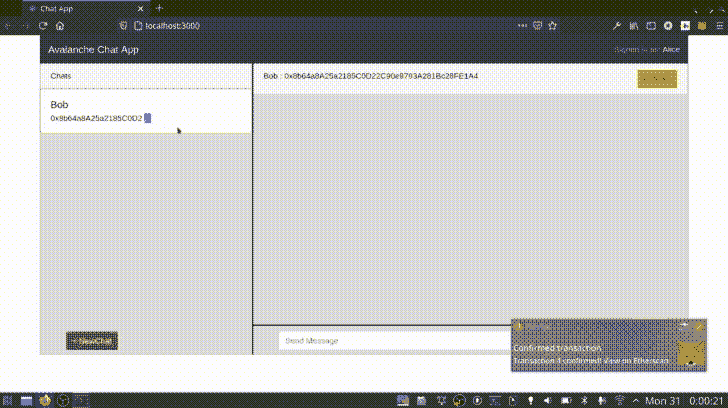
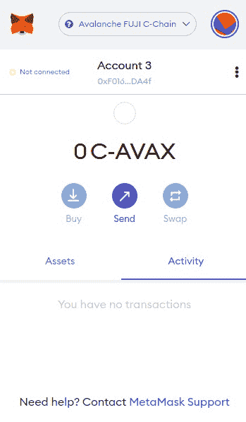
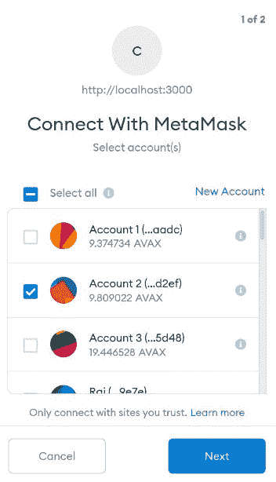
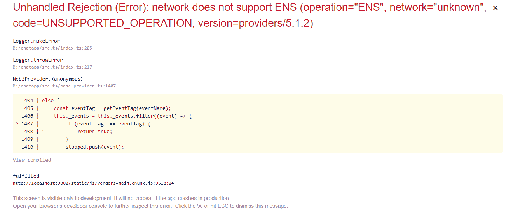

# 介绍

> 原文:[https://github . com/fig ment-networks/learn-tutorials/blob/master/avalanche/create-a-chat-application-using-solidity-and-react . MD](https://github.com/figment-networks/learn-tutorials/blob/master/avalanche/create-a-chat-application-using-solidity-and-react.md)

今天，我们将从头开始在 Avalanche 的 Fuji 测试网络上构建一个分散式聊天应用程序。dApp 将允许用户与其他人联系并聊天。我们将使用 Solidity 开发我们的智能合同，该合同将部署在 Avalanche 的 C 链上。我们将拥有一个使用 ReactJS 开发的简单易用的 UI。所以，让我们开始吧！

# 先决条件

*   基本熟悉反应和稳定性
*   应该已经完成[使用 Remix 和 MetaMask 在 Avalanche 上部署智能合约](https://learn.figment.io/tutorials/deploy-a-smart-contract-on-avalanche-using-remix-and-metamask)教程

# 要求

*   [Node.js](https://nodejs.org/en/download/releases/) v10.18.0+
*   浏览器上的[元掩码扩展](https://metamask.io/download.html)

# 实施智能合同

我们的聊天 dApp 需要允许用户与朋友联系和分享消息的基本功能。为此，我们将编写负责创建帐户、添加好友和发送消息的函数。

# 帐户创建

我们将定义 3 个函数:

*   `checkUserExists(pubkey)`函数用于检查用户是否在我们的应用程序中注册。这将有助于确保不会创建重复的用户，并且还将从其他函数调用它来检查它们的存在。
*   `createAccount(username)`函数用提供的用户名在平台上注册一个新用户。
*   `getUsername(pubkey)`函数将返回给定用户的用户名(如果存在的话)。

# 添加朋友

这里我们也将定义 3 个函数:

*   `checkAlreadyFriends(pubkey1, pubkey2)`函数检查两个用户是否已经是朋友。这是防止相同方之间的重复信道所需要的，并且也将用于防止用户向其他用户发送消息，除非他们是朋友。
*   如果两个用户都在平台上注册并且彼此已经不是朋友，则`addFriend(pubkey, name)`功能将这两个用户标记为朋友。
*   `getMyFriendList()`函数将返回给定用户的朋友数组。

# 信息发送

Solidity 合同的最后一部分将实现用户之间的消息交换。我们将任务分成两个功能`sendMessage()`和`readMessage()`。

*   `sendMessage()`功能允许一个用户向另一个注册用户(朋友)发送消息。这是通过`checkUserExists(pubkey)`和`checkAlreadyFriends(pubkey1, pubkey2)`完成的。
*   `readMessage()`函数返回两个用户之间到目前为止发生的聊天历史。

# 用户数据收集

我们将有三种类型的用户定义数据:

*   `user`将有属性`name`存储用户名，属性`friendList`是其他用户的数组。
*   `friend`将具有属性`pubkey`和`name`，前者是朋友的公共地址，后者是用户希望将他们称为的名称。
*   `message`有三个属性:`sender`、`timestamp`和`msg`，是“报文”的缩写。

我们将在数据库中维护两个集合:

*   平台上的所有用户都映射了他们的公共地址。
*   `allMessages`储存信息。由于 Solidity 不允许在映射中使用用户定义的密钥，我们可以改为散列两个用户的公共密钥。然后，可以将该值存储在映射中。

# 部署智能合同

# 设置元掩码

登录到元掩码->单击网络下拉菜单->选择自定义 RPC

[](https://github.com/figment-networks/learn-tutorials/raw/master/assets/create-an-amm-on-avalanche_metamask.png)

**富士测试网设置:**

*   **网络名**:雪崩富士 C 链
*   **新建 RPC URL**:[https://API . avax-test . network/ext/BC/C/RPC](https://api.avax-test.network/ext/bc/C/rpc)
*   **ChainID** : `43114`
*   **符号** : `C-AVAX`
*   **探索者**:[https://cchain . Explorer . avax-test . network](https://cchain.explorer.avax-test.network/)

从给定的[水龙头](https://faucet.avax-test.network/)中为您的地址提供资金。

# 使用 Remix 部署

打开[混音](https://remix.ethereum.org/) - >选择实度

[](https://github.com/figment-networks/learn-tutorials/raw/master/assets/create-an-amm-on-avalanche_remix.png)

在 Remix 文件资源管理器中创建一个`Database.sol`文件，并粘贴以下代码:

```
// SPDX-License-Identifier: GPL-3.0

pragma solidity >=0.7.0 <0.9.0;

contract Database {

    // Stores the default name of an user and her friends info
    struct user {
        string name;
        friend[] friendList;
    }

    // Each friend is identified by its address and name assigned by the second party
    struct friend {
        address pubkey;
        string name;
    }

    // message construct stores the single chat message and its metadata
    struct message {
        address sender;
        uint256 timestamp;
        string msg;
    }

    // Collection of users registered on the application
    mapping(address => user) userList;
    // Collection of messages communicated in a channel between two users
    mapping(bytes32 => message[]) allMessages; // key : Hash(user1,user2)

    // It checks whether a user(identified by its public key)
    // has created an account on this application or not
    function checkUserExists(address pubkey) public view returns(bool) {
        return bytes(userList[pubkey].name).length > 0;
    }

    // Registers the caller(msg.sender) to our app with a non-empty username
    function createAccount(string calldata name) external {
        require(checkUserExists(msg.sender)==false, "User already exists!");
        require(bytes(name).length>0, "Username cannot be empty!"); 
        userList[msg.sender].name = name;
    }

    // Returns the default name provided by an user
    function getUsername(address pubkey) external view returns(string memory) {
        require(checkUserExists(pubkey), "User is not registered!");
        return userList[pubkey].name;
    }

    // Adds new user as your friend with an associated nickname
    function addFriend(address friend_key, string calldata name) external {
        require(checkUserExists(msg.sender), "Create an account first!");
        require(checkUserExists(friend_key), "User is not registered!");
        require(msg.sender!=friend_key, "Users cannot add themselves as friends!");
        require(checkAlreadyFriends(msg.sender,friend_key)==false, "These users are already friends!");

        _addFriend(msg.sender, friend_key, name);
        _addFriend(friend_key, msg.sender, userList[msg.sender].name);
    }

    // Checks if two users are already friends or not
    function checkAlreadyFriends(address pubkey1, address pubkey2) internal view returns(bool) {

        if(userList[pubkey1].friendList.length > userList[pubkey2].friendList.length)
        {
            address tmp = pubkey1;
            pubkey1 = pubkey2;
            pubkey2 = tmp;
        }

        for(uint i=0; i<userList[pubkey1].friendList.length; ++i)
        {
            if(userList[pubkey1].friendList[i].pubkey == pubkey2)
                return true;
        }
        return false;
    }

    // A helper function to update the friendList
    function _addFriend(address me, address friend_key, string memory name) internal {
        friend memory newFriend = friend(friend_key,name);
        userList[me].friendList.push(newFriend);
    }

    // Returns list of friends of the sender
    function getMyFriendList() external view returns(friend[] memory) {
        return userList[msg.sender].friendList;
    }

    // Returns a unique code for the channel created between the two users
    // Hash(key1,key2) where key1 is lexicographically smaller than key2
    function _getChatCode(address pubkey1, address pubkey2) internal pure returns(bytes32) {
        if(pubkey1 < pubkey2)
            return keccak256(abi.encodePacked(pubkey1, pubkey2));
        else
            return keccak256(abi.encodePacked(pubkey2, pubkey1));
    }

    // Sends a new message to a given friend
    function sendMessage(address friend_key, string calldata _msg) external {
        require(checkUserExists(msg.sender), "Create an account first!");
        require(checkUserExists(friend_key), "User is not registered!");
        require(checkAlreadyFriends(msg.sender,friend_key), "You are not friends with the given user");

        bytes32 chatCode = _getChatCode(msg.sender, friend_key);
        message memory newMsg = message(msg.sender, block.timestamp, _msg);
        allMessages[chatCode].push(newMsg);
    }

    // Returns all the chat messages communicated in a channel
    function readMessage(address friend_key) external view returns(message[] memory) {
        bytes32 chatCode = _getChatCode(msg.sender, friend_key);
        return allMessages[chatCode];
    }
}
```

导航到左侧导航栏上的 Solidity 编译器选项卡，点击蓝色按钮编译`Database.sol`合同。记下`ABI`,因为下一节需要用到它。

导航到“部署”选项卡并打开“环境”下拉菜单。选择“注入的 Web3”(确保元掩码已加载)，然后单击“部署”按钮。

在 Metamask 弹出界面上审批交易。一旦我们的合同成功部署，记下`contract address`。

应用程序二进制接口(ABI)是一个 JSON 对象，它存储有关协定方法的元数据，如输入参数的数据类型、返回数据类型和方法的属性，如 payable、view、pure 等。你可以从 [solidity 文档](https://docs.soliditylang.org/en/latest/abi-spec.html) 中了解更多关于 ABI 的信息

# 在 React 中创建前端

现在，我们将创建一个 React 应用程序框架，并设置应用程序的前端。

打开终端并导航到我们将创建应用程序的目录。

```
cd /path/to/directory
```

现在使用`npm`来安装 create-react-app。`-g`标志表示软件包应该全局安装。

```
npm install -g create-react-app
```

创建新的 react 应用程序。

```
create-react-app avalanche-chat-app
```

移动到新创建的目录并安装给定的依赖项。

```
cd avalanche-chat-app
npm install --save ethers@5.1.4 react-bootstrap@1.5.2 bootstrap@4.6.0
```

打开`public`目录下的`index.html`文件，粘贴以下 HTML:

```
<!DOCTYPE html>
<html lang="en">

<head>
    <meta charset="utf-8" />
    <meta name="viewport" content="width=device-width, initial-scale=1" />
    <meta name="theme-color" content="#000000" />
    <title>Chat dApp</title>
</head>

<body>
    <div id="root"></div>
</body>

</html> 
```

使用以下命令，移出公共目录并在`src`目录内创建一个新目录`components`，我们将在其中保存所有的 React 组件:

```
mkdir ./src/components
cd ./src/components
```

现在让我们创建具有 dApp 导航条的组件。创建一个名为`NavBar.jsx`的新文件，并粘贴以下代码:

```
import React from "react";
import { Button, Navbar } from "react-bootstrap";

// This component renders the Navbar of our application
export function NavBar(props) {
  return (
    <Navbar bg="dark" variant="dark">
      <Navbar.Brand href="#home">Avalanche Chat App</Navbar.Brand>
      <Navbar.Toggle />
      <Navbar.Collapse className="justify-content-end">
        <Navbar.Text>
          <Button
            style={{ display: props.showButton }}
            variant="success"
            onClick={async () => {
              props.login();
            }}
          >
            Connect to Metamask
          </Button>
          <div
            style={{ display: props.showButton === "none" ? "block" : "none" }}
          >
            Signed in as:
            <a href="#">{props.username}</a>
          </div>
        </Navbar.Text>
      </Navbar.Collapse>
    </Navbar>
  );
}
```

所有的联系人都将拥有一张有联系人姓名和公钥的卡。创建一个名为`ChatCard.jsx`的新文件，并粘贴以下代码:

```
import React from "react";
import { Row, Card } from "react-bootstrap";
import "bootstrap/dist/css/bootstrap.min.css";

// This is a function which renders the friends in the friends list
export function ChatCard(props) {
  return (
    <Row style={{ marginRight: "0px" }}>
      <Card
        border="success"
        style={{ width: "100%", alignSelf: "center", marginLeft: "15px" }}
        onClick={() => {
          props.getMessages(props.publicKey);
        }}
      >
        <Card.Body>
          <Card.Title> {props.name} </Card.Title>
          <Card.Subtitle>
            {" "}
            {props.publicKey.length > 20
              ? props.publicKey.substring(0, 20) + " ..."
              : props.publicKey}{" "}
          </Card.Subtitle>
        </Card.Body>
      </Card>
    </Row>
  );
}
```

每条消息都将由消息组件呈现。这个组件将有时间戳，发件人的名字和消息。创建一个名为`Message.jsx`的新文件，并粘贴以下代码:

```
import React from "react";
import { Row, Card } from "react-bootstrap";

// This is a functional component which renders the individual messages
export function Message(props) {
  return (
    <Row style={{ marginRight: "0px" }}>
      <Card
        border="success"
        style={{
          width: "80%",
          alignSelf: "center",
          margin: "0 0 5px " + props.marginLeft,
          float: "right",
          right: "0px",
        }}
      >
        <Card.Body>
          <h6 style={{ float: "right" }}>{props.timeStamp}</h6>
          <Card.Subtitle>
            <b>{props.sender}</b>
          </Card.Subtitle>
          <Card.Text>{props.data}</Card.Text>
        </Card.Body>
      </Card>
    </Row>
  );
}
```

要添加新联系人，我们将创建 AddNewChat 组件。点击 NewChat 按钮会显示一个模式，询问联系人的详细信息。创建一个名为`AddNewChat.jsx`的新文件，并粘贴以下代码:

```
import React from "react";
import { useState } from "react";
import { Button, Modal, Form } from "react-bootstrap";

// This Modal help Add a new friend
export function AddNewChat(props) {
  const [show, setShow] = useState(false);
  const handleClose = () => setShow(false);
  const handleShow = () => setShow(true);
  return (
    <div
      className="AddNewChat"
      style={{
        position: "absolute",
        bottom: "0px",
        padding: "10px 45px 0 45px",
        margin: "0 95px 0 0",
        width: "97%",
      }}
    >
      <Button variant="success" className="mb-2" onClick={handleShow}>
        + NewChat
      </Button>
      <Modal show={show} onHide={handleClose}>
        <Modal.Header closeButton>
          <Modal.Title> Add New Friend </Modal.Title>
        </Modal.Header>
        <Modal.Body>
          <Form.Group>
            <Form.Control
              required
              id="addPublicKey"
              size="text"
              type="text"
              placeholder="Enter Friends Public Key"
            />
            <br />
            <Form.Control
              required
              id="addName"
              size="text"
              type="text"
              placeholder="Name"
            />
            <br />
          </Form.Group>
        </Modal.Body>
        <Modal.Footer>
          <Button variant="secondary" onClick={handleClose}>
            Close
          </Button>
          <Button
            variant="primary"
            onClick={() => {
              props.addHandler(
                document.getElementById("addName").value,
                document.getElementById("addPublicKey").value
              );
              handleClose();
            }}
          >
            Add Friend
          </Button>
        </Modal.Footer>
      </Modal>
    </div>
  );
}
```

现在让我们创建一个名为`Components.js`的新文件，并将所有组件一起导出。粘贴以下代码:

```
export { NavBar } from "./NavBar";
export { AddNewChat } from "./AddNewChat";
export { Message } from "./Message";
export { ChatCard } from "./ChatCard";
```

移至`src`目录，创建一个名为`App.jsx`的新文件，并粘贴以下代码:

```
import React from "react";
import { useState, useEffect } from "react";
import { Container, Row, Col, Card, Form, Button } from "react-bootstrap";
import {
  NavBar,
  ChatCard,
  Message,
  AddNewChat,
} from "./components/Components.js";
import { ethers } from "ethers";
import { abi } from "./abi";

// Add the contract address inside the quotes
const CONTRACT_ADDRESS = "";

export function App(props) {
  const [friends, setFriends] = useState(null);
  const [myName, setMyName] = useState(null);
  const [myPublicKey, setMyPublicKey] = useState(null);
  const [activeChat, setActiveChat] = useState({
    friendname: null,
    publicKey: null,
  });
  const [activeChatMessages, setActiveChatMessages] = useState(null);
  const [showConnectButton, setShowConnectButton] = useState("block");
  const [myContract, setMyContract] = useState(null);

  // Save the contents of abi in a variable
  const contractABI = abi;
  let provider;
  let signer;

  // Login to Metamask and check the if the user exists else creates one
  async function login() {
    let res = await connectToMetamask();
    if (res === true) {
      provider = new ethers.providers.Web3Provider(window.ethereum);
      signer = provider.getSigner();
      try {
        const contract = new ethers.Contract(
          CONTRACT_ADDRESS,
          contractABI,
          signer
        );
        setMyContract(contract);
        const address = await signer.getAddress();
        let present = await contract.checkUserExists(address);
        let username;
        if (present) username = await contract.getUsername(address);
        else {
          username = prompt("Enter a username", "Guest");
          if (username === "") username = "Guest";
          await contract.createAccount(username);
        }
        setMyName(username);
        setMyPublicKey(address);
        setShowConnectButton("none");
      } catch (err) {
        alert("CONTRACT_ADDRESS not set properly!");
      }
    } else {
      alert("Couldn't connect to Metamask");
    }
  }

  // Check if the Metamask connects
  async function connectToMetamask() {
    try {
      await window.ethereum.enable();
      return true;
    } catch (err) {
      return false;
    }
  }

  // Add a friend to the users' Friends List
  async function addChat(name, publicKey) {
    try {
      let present = await myContract.checkUserExists(publicKey);
      if (!present) {
        alert("Address not found: Ask them to join the app :)");
        return;
      }
      try {
        await myContract.addFriend(publicKey, name);
        const frnd = { name: name, publicKey: publicKey };
        setFriends(friends.concat(frnd));
      } catch (err) {
        alert(
          "Friend already added! You can't be friends with the same person twice ;P"
        );
      }
    } catch (err) {
      alert("Invalid address!");
    }
  }

  // Sends messsage to an user
  async function sendMessage(data) {
    if (!(activeChat && activeChat.publicKey)) return;
    const recieverAddress = activeChat.publicKey;
    await myContract.sendMessage(recieverAddress, data);
  }

  // Fetch chat messages with a friend
  async function getMessage(friendsPublicKey) {
    let nickname;
    let messages = [];
    friends.forEach((item) => {
      if (item.publicKey === friendsPublicKey) nickname = item.name;
    });
    // Get messages
    const data = await myContract.readMessage(friendsPublicKey);
    data.forEach((item) => {
      const timestamp = new Date(1000 * item[1].toNumber()).toUTCString();
      messages.push({
        publicKey: item[0],
        timeStamp: timestamp,
        data: item[2],
      });
    });
    setActiveChat({ friendname: nickname, publicKey: friendsPublicKey });
    setActiveChatMessages(messages);
  }

  // This executes every time page renders and when myPublicKey or myContract changes
  useEffect(() => {
    async function loadFriends() {
      let friendList = [];
      // Get Friends
      try {
        const data = await myContract.getMyFriendList();
        data.forEach((item) => {
          friendList.push({ publicKey: item[0], name: item[1] });
        });
      } catch (err) {
        friendList = null;
      }
      setFriends(friendList);
    }
    loadFriends();
  }, [myPublicKey, myContract]);

  // Makes Cards for each Message
  const Messages = activeChatMessages
    ? activeChatMessages.map((message) => {
        let margin = "5%";
        let sender = activeChat.friendname;
        if (message.publicKey === myPublicKey) {
          margin = "15%";
          sender = "You";
        }
        return (
          <Message
            marginLeft={margin}
            sender={sender}
            data={message.data}
            timeStamp={message.timeStamp}
          />
        );
      })
    : null;

  // Displays each card
  const chats = friends
    ? friends.map((friend) => {
        return (
          <ChatCard
            publicKey={friend.publicKey}
            name={friend.name}
            getMessages={(key) => getMessage(key)}
          />
        );
      })
    : null;

  return (
    <Container style={{ padding: "0px", border: "1px solid grey" }}>
      {/* This shows the navbar with connect button */}
      <NavBar
        username={myName}
        login={async () => login()}
        showButton={showConnectButton}
      />
      <Row>
        {/* Here the friends list is shown */}
        <Col style={{ paddingRight: "0px", borderRight: "2px solid #000000" }}>
          <div
            style={{
              backgroundColor: "#DCDCDC",
              height: "100%",
              overflowY: "auto",
            }}
          >
            <Row style={{ marginRight: "0px" }}>
              <Card
                style={{
                  width: "100%",
                  alignSelf: "center",
                  marginLeft: "15px",
                }}
              >
                <Card.Header>Chats</Card.Header>
              </Card>
            </Row>
            {chats}
            <AddNewChat
              myContract={myContract}
              addHandler={(name, publicKey) => addChat(name, publicKey)}
            />
          </div>
        </Col>
        <Col xs={8} style={{ paddingLeft: "0px" }}>
          <div style={{ backgroundColor: "#DCDCDC", height: "100%" }}>
            {/* Chat header with refresh button, username and public key are rendered here */}
            <Row style={{ marginRight: "0px" }}>
              <Card
                style={{
                  width: "100%",
                  alignSelf: "center",
                  margin: "0 0 5px 15px",
                }}
              >
                <Card.Header>
                  {activeChat.friendname} : {activeChat.publicKey}
                  <Button
                    style={{ float: "right" }}
                    variant="warning"
                    onClick={() => {
                      if (activeChat && activeChat.publicKey)
                        getMessage(activeChat.publicKey);
                    }}
                  >
                    Refresh
                  </Button>
                </Card.Header>
              </Card>
            </Row>
            {/* The messages will be shown here */}
            <div
              className="MessageBox"
              style={{ height: "400px", overflowY: "auto" }}
            >
              {Messages}
            </div>
            {/* The form with send button and message input fields */}
            <div
              className="SendMessage"
              style={{
                borderTop: "2px solid black",
                position: "relative",
                bottom: "0px",
                padding: "10px 45px 0 45px",
                margin: "0 95px 0 0",
                width: "97%",
              }}
            >
              <Form
                onSubmit={(e) => {
                  e.preventDefault();
                  sendMessage(document.getElementById("messageData").value);
                  document.getElementById("messageData").value = "";
                }}
              >
                <Form.Row className="align-items-center">
                  <Col xs={9}>
                    <Form.Control
                      id="messageData"
                      className="mb-2"
                      placeholder="Send Message"
                    />
                  </Col>
                  <Col>
                    <Button
                      className="mb-2"
                      style={{ float: "right" }}
                      onClick={() => {
                        sendMessage(
                          document.getElementById("messageData").value
                        );
                        document.getElementById("messageData").value = "";
                      }}
                    >
                      Send
                    </Button>
                  </Col>
                </Form.Row>
              </Form>
            </div>
          </div>
        </Col>
      </Row>
    </Container>
  );
}
```

在 **`App.jsx`** 的第 14 行名为 **`CONTRACT_ADDRESS`** 的变量中插入从**实现智能合约**部分获得的合约地址。

打开`src`目录下的`index.js`文件，粘贴以下代码:

```
import React from "react";
import ReactDom from "react-dom";
import { App } from "../src/App.jsx";

ReactDom.render( 
    <App /> ,
    document.getElementById('root')
);
```

在`src`目录下创建一个名为`abi.js`的新文件，并粘贴以下代码:

```
export const abi = [
    {
        "inputs": [
            {
                "internalType": "address",
                "name": "friend_key",
                "type": "address"
            },
            {
                "internalType": "string",
                "name": "name",
                "type": "string"
            }
        ],
        "name": "addFriend",
        "outputs": [],
        "stateMutability": "nonpayable",
        "type": "function"
    },
    {
        "inputs": [
            {
                "internalType": "address",
                "name": "pubkey",
                "type": "address"
            }
        ],
        "name": "checkUserExists",
        "outputs": [
            {
                "internalType": "bool",
                "name": "",
                "type": "bool"
            }
        ],
        "stateMutability": "view",
        "type": "function"
    },
    {
        "inputs": [
            {
                "internalType": "string",
                "name": "name",
                "type": "string"
            }
        ],
        "name": "createAccount",
        "outputs": [],
        "stateMutability": "nonpayable",
        "type": "function"
    },
    {
        "inputs": [],
        "name": "getMyFriendList",
        "outputs": [
            {
                "components": [
                    {
                        "internalType": "address",
                        "name": "pubkey",
                        "type": "address"
                    },
                    {
                        "internalType": "string",
                        "name": "name",
                        "type": "string"
                    }
                ],
                "internalType": "struct Database.friend[]",
                "name": "",
                "type": "tuple[]"
            }
        ],
        "stateMutability": "view",
        "type": "function"
    },
    {
        "inputs": [
            {
                "internalType": "address",
                "name": "pubkey",
                "type": "address"
            }
        ],
        "name": "getUsername",
        "outputs": [
            {
                "internalType": "string",
                "name": "",
                "type": "string"
            }
        ],
        "stateMutability": "view",
        "type": "function"
    },
    {
        "inputs": [
            {
                "internalType": "address",
                "name": "friend_key",
                "type": "address"
            }
        ],
        "name": "readMessage",
        "outputs": [
            {
                "components": [
                    {
                        "internalType": "address",
                        "name": "sender",
                        "type": "address"
                    },
                    {
                        "internalType": "uint256",
                        "name": "timestamp",
                        "type": "uint256"
                    },
                    {
                        "internalType": "string",
                        "name": "msg",
                        "type": "string"
                    }
                ],
                "internalType": "struct Database.message[]",
                "name": "",
                "type": "tuple[]"
            }
        ],
        "stateMutability": "view",
        "type": "function"
    },
    {
        "inputs": [
            {
                "internalType": "address",
                "name": "friend_key",
                "type": "address"
            },
            {
                "internalType": "string",
                "name": "_msg",
                "type": "string"
            }
        ],
        "name": "sendMessage",
        "outputs": [],
        "stateMutability": "nonpayable",
        "type": "function"
    }
]
```

应用程序二进制接口(ABI)是一个 JSON 对象，它存储有关协定方法的元数据，如输入参数的数据类型、返回数据类型和方法的属性，如 payable、view、pure 等。你可以从[固体文档](https://docs.soliditylang.org/en/latest/abi-spec.html)中了解更多关于 ABI 的信息。

现在是时候运行我们的 React 应用程序前端了。在项目根目录中使用以下命令:

```
npm start
```

# 游戏攻略

访问 [http://localhost:3000](http://localhost:3000) 与 app 互动。

[](https://camo.githubusercontent.com/ee0ebdaeacfb2dd1d1d8149c5963f3ddbf65885043bc03bb0ccfdd731fa71a21/68747470733a2f2f692e696d6775722e636f6d2f70795958765a732e676966)

在将您的朋友添加为好友之前，请确保他们也已注册到该应用程序。

[](https://camo.githubusercontent.com/ed96541c2544fe8232c88abbc9aacda9cad094465b4d19072a516d425e3384b4/68747470733a2f2f692e696d6775722e636f6d2f4c666b6a4c534b2e676966)

# 解决纷争

## 交易失败

*   在 [fuji block-explorer](https://cchain.explorer.avax-test.network/) 检查您的账户是否有足够的余额。您可以从给定的[水龙头](https://faucet.avax-test.network/)中为您的地址提供资金

[](https://github.com/figment-networks/learn-tutorials/raw/master/assets/create-an-amm-on-avalanche_zero_balance.jpeg)

*   如果您有多个帐户连接到该站点，请确保您在 metamask 上选择了正确的帐户。

[](https://github.com/figment-networks/learn-tutorials/raw/master/assets/create-an-amm-on-avalanche_multiple_accounts.jpeg)

## 应用程序崩溃

[](https://github.com/figment-networks/learn-tutorials/raw/master/assets/chat-dapp-crash.png)

要解决这个错误，请再次检查您是否已经更新了`src/index.js.`中的`CONTRACT_ADDRESS`变量

# 结论

恭喜你！我们已经成功部署了一个分散式聊天应用程序，可以部署在 Avalanche 或其他 EVM 兼容的区块链上。我们还创建了一个样板 React 应用程序，用作 dApp 的前端。

# 后续步骤

这个 dApp 的功能非常有限。我们可以通过添加删除消息、阻止用户或创建朋友群的功能来改进它。
我们还可以通过限制最大消息数量的功能来优化 dApp 交互成本，或者可能对短消息使用事件日志。

# 关于作者

教程由[尼米什·阿格拉瓦尔](https://github.com/realnimish) & [萨扬·卡尔](https://github.com/SayanKar)创作。你可以在 LinkedIn [@Nimish Agrawal](https://www.linkedin.com/in/realnimish) 和 [@Sayan Kar](https://www.linkedin.com/in/sayan-kar-) 上联系他们。

# 参考

*   智能合约部署流程- [使用 Remix 和 MetaMask 在 Avalanche 上部署智能合约](https://docs.avax.network/build/tutorials/smart-contracts/deploy-a-smart-contract-on-avalanche-using-remix-and-metamask)