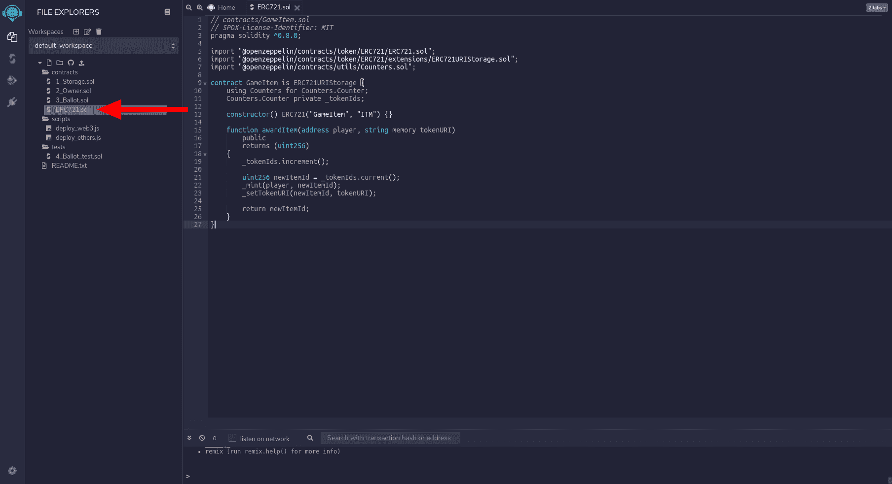
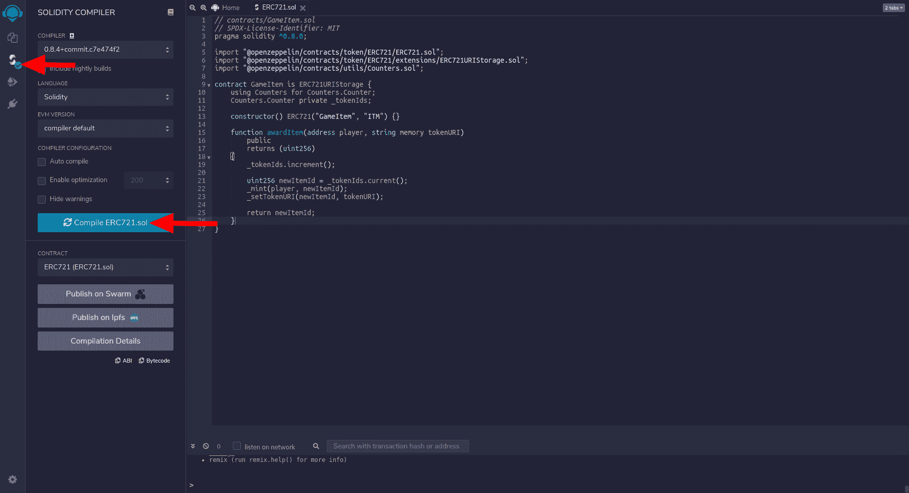
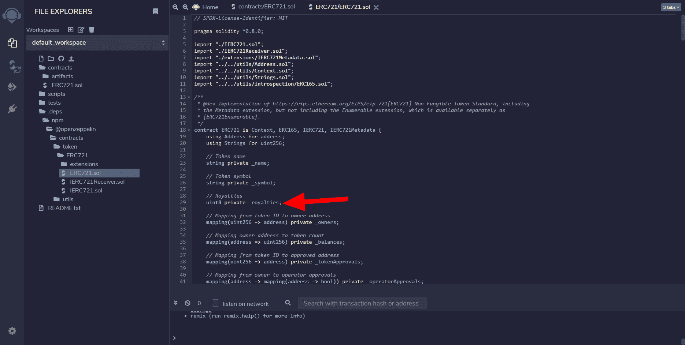
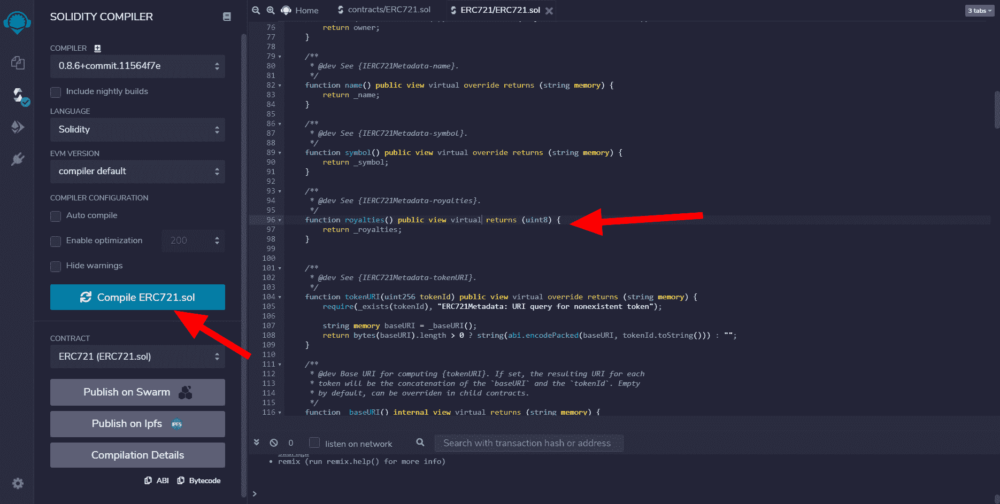
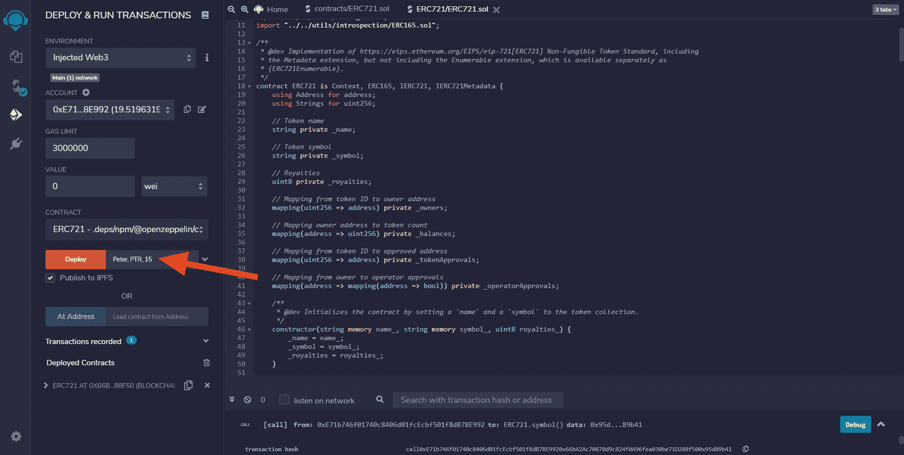
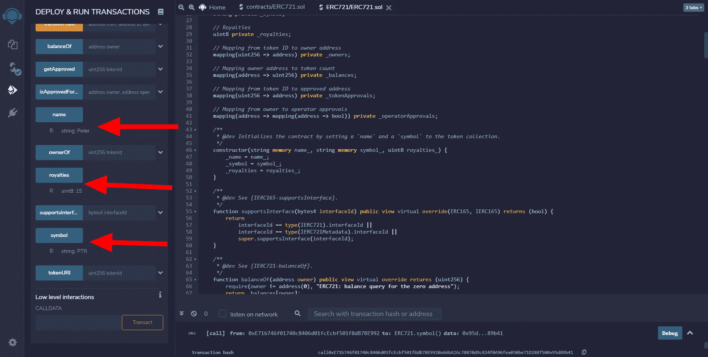
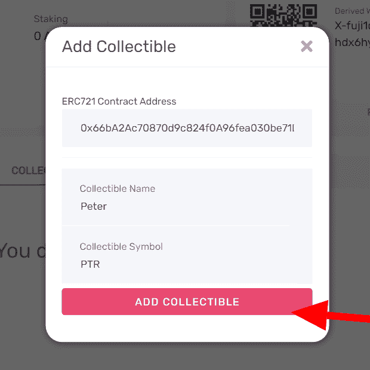

# avalanche/create-nft-with-royalties

> 原文：<https://github.com/figment-networks/learn-tutorials/blob/master/avalanche/create-nft-with-royalties.md>

ERC721 令牌是一种不可替换的令牌(NFT ),它可以包含或引用艺术或数字内容形式的元数据，如图片、音频、社交媒体帖子、网站，甚至是更广泛角度的生成性艺术项目，甚至是虚拟现实和增强现实！

NFT 由称为区块链的数字分类账上的离散数据单元表示，其中每个令牌表示一些独特的数字属性，这些属性不能互换。这些令牌支持许多用例，这些用例是可互换或“可替换”令牌所无法实现的，例如特定的效用、所有权证明和唯一的资产交易历史。

参考官方以太坊开发者文档，了解更多关于 [ERC-721 令牌](https://ethereum.org/en/developers/docs/standards/tokens/erc-721/)的信息。

# 先决条件

在准备本教程时，你需要对 [Remix IDE](https://remix.ethereum.org/) 和 Solidity [智能合约](https://solidity-by-example.org/)有一个基本的了解。关于雪崩钱包的更多信息，请参考雪崩[智能合约教程](https://learn.figment.io/tutorials/deploy-a-smart-contract-on-avalanche-using-remix-and-metamask)。

## 使用 Remix IDE 编写智能合同

在 Remix IDE 中，创建一个新文件并粘贴这个 ERC721 智能契约，它从 OpenZeppelin 导入令牌标准。`import`行将由 Remix IDE 运行的 Solidity 编译器处理，所有的依赖项(必需的文件)将被带入 Remix 工作区。

```js
// contracts/GameItem.sol
// SPDX-License-Identifier: MIT
pragma solidity ^0.8.0;

import "@openzeppelin/contracts/token/ERC721/ERC721.sol";
import "@openzeppelin/contracts/token/ERC721/extensions/ERC721URIStorage.sol";
import "@openzeppelin/contracts/utils/Counters.sol";

contract GameItem is ERC721URIStorage {
    using Counters for Counters.Counter;
    Counters.Counter private _tokenIds;

    constructor() ERC721("GameItem", "ITM") {}

    function awardItem(address player, string memory tokenURI)
        public
        returns (uint256)
    {
        _tokenIds.increment();

        uint256 newItemId = _tokenIds.current();
        _mint(player, newItemId);
        _setTokenURI(newItemId, tokenURI);

        return newItemId;
    }
}
```

这张截屏显示了 Remix IDE 的主界面，上面的 Solidity 代码被粘贴到一个名为`ERC721.sol`的新文件中



转到侧边栏中的第二个选项卡来编译 Solidity 代码，这也将获取并安装由`import`语句指定的 ERC721 智能合约的 OpenZeppelin 样板文件。



打开`.deps/npm/openzeppelin/contracts/token/ERC721/`目录下的 ERC721.sol 文件，在合同中声明一个`uint8`类型的版税变量。这使我们能够将版税指定为一个数字。变量名前的下划线是为了防止[变量遮蔽](https://en.wikipedia.org/wiki/Variable_shadowing)。

```js
// .deps/npm/openzeppelin/contracts/token/ERC721/ERC721.sol
contract ERC721 is Context, ERC165, IERC721, IERC721Metadata {
    using Address for address;
    using Strings for uint256;

    // Token name
    string private _name;

    // Token symbol
    string private _symbol;

    // Royalties
    uint8 private _royalties;

    ...
```



在 ERC721 契约中声明了版税变量之后，我们还必须在构造函数中初始化它。

```js
    constructor(string memory name_, string memory symbol_, uint8 royalties_) {
        _name = name_;
        _symbol = symbol_;
        _royalties = royalties_;
    }
```


为了从智能契约中获取 royalties 变量的当前值，创建一个公共函数`royalties()`，可以将其设置为`view`类型。我们还想让它成为`virtual`，这样它就可以被继承该函数的任何契约覆盖。它将返回一个`uint8`值，该值与`_royalties`存储在区块链上的值相匹配。

```js
    function royalties() public view virtual returns (uint8) {
        return _royalties;
    }
```

我们现在可以编译修改后的 ERC721 智能合约并检查警告，确保声明的 solidity 版本和编译器版本相似。Solidity 编译器使用[语义版本](http://semver.org/)，所以要注意，例如版本字符串`0.8.0`和`^0.8.0`不相等。



接下来，为您的浏览器下载并安装 Metamask wallet。在 Metamask 中创建一个新钱包，然后[按照我们的快速指南](https://learn.figment.io/tutorials/deploy-a-smart-contract-on-avalanche-using-remix-and-metamask#step-1-setting-up-metamask)连接到 Avalanche Fuji C 链。Avalanche 需要一个有效的 DataHub API 密钥。

从测试水龙头为部署请求 AVAX，从[https://水龙头. avax-test.network/](https://faucet.avax-test.network/) 。

将所需的参数传递给 Remix 中的构造函数:令牌名称、符号和版税。然后点击部署按钮！



仍然在 Remix 中的 Deploy & Run Transactions 选项卡上，调用各自的函数；部署的 ERC721 智能合约中的*名称*、*版税*和*符号*。



复制已部署合同的地址以导入到 Avalanche wallet 中。它现在应该出现在你的 [Avalanche 钱包](https://wallet.avax.network/)的投资组合部分的收藏品选项卡上。



恭喜你！您已成功将 NFT 作为收藏品添加到雪崩钱包中。

# 结论

感谢您完成本教程，您现在应该知道如何使用简单的 Solidity smart 合同在 Avalanche 上创建带有版税的 NFT。好好享受吧！如果你想知道 NFT 如何在雪崩网络上工作的技术背景，或者想使用 NFT 构建产品，请查看这个[雪崩 NFT 教程](https://learn.figment.io/tutorials/create-mint-transfer-nft)！。

如果你在阅读本教程时有任何困难，或者只是想与我们讨论雪崩技术，你可以 [**加入我们的不和谐频道**](https://discord.gg/fszyM7K) ！

# 关于作者

德文德拉·亚达夫

# 参考

本教程基于官方[雪崩文档](https://docs.avax.network/build/tutorials/smart-contracts/deploy-a-smart-contract-on-avalanche-using-remix-and-metamask)。