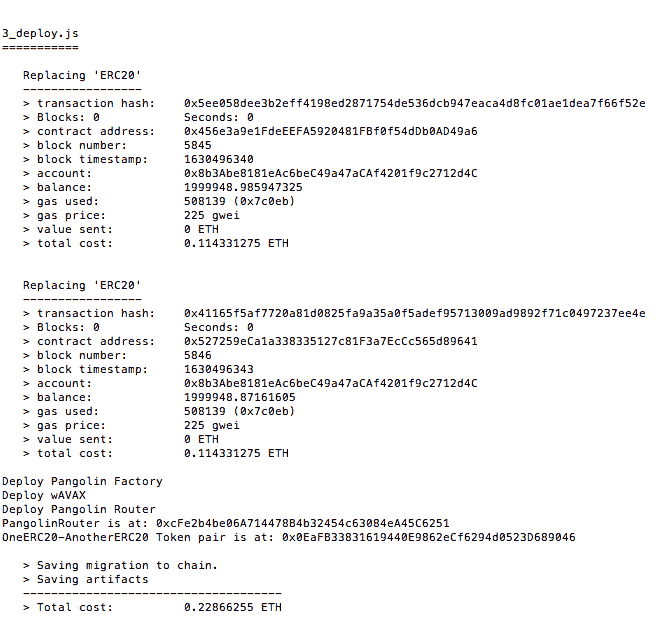

# 介绍

> 原文：<https://github.com/figment-networks/learn-tutorials/blob/master/avalanche/deploy-pangolin-to-local-testnet-with-token-pair.md>

无论您希望创建自己的令牌，为现有令牌提供流动性，还是在部署在 Avalanche 的 c 链上的穿山甲上进行交易，您都需要在穿山甲上创建一个令牌对。

然而，在此之前，我们必须熟悉令牌对的功能，以便我们可以模拟令牌对和钱包的世界，甚至在 DEX 上测试我们关于契约和令牌组学的假设。我们希望部署一个本地测试网，这样我们就可以检查我们的代码是否有错误和意外的交互！

在本教程中，我们将演示如何在本地创建自己的穿山甲交易所，以及如何从任意 ERC20 令牌创建交易对。

# 先决条件

如果你已经完成了关于使用带有雪崩 C 链的松露[的雪崩教程，你就已经完成了大部分的先决条件。](https://docs.avax.network/build/tutorials/smart-contracts/using-truffle-with-the-avalanche-c-chain)

你必须注意到`avalanchego`在不断改进，从本教程发布之时起，事情可能会发生变化(例如，上面的库中使用的 x/p/c 链的地址可能与当前版本的 avalanchejs 不同，私有密钥可能会改变，等等)。这意味着在启动和运行本地测试网络时，您可能需要修改代码)。

此外，您还需要:

*   安装穿山甲索引交换合同

```js
npm install --dev @pangolindex/exchange-contracts 
```

*   安装 openzepplin 合同

```js
npm install --dev @openzeppelin/contracts 
```

# 关于穿山甲

穿山甲是 Uniswap V2 的一个分支，也是 Avalanche C-chain 上的第一个分散交易所(DEX ),用户可以在那里交换他们的 [ERC20](https://eips.ethereum.org/EIPS/eip-20) 令牌。

# 复制 OpenZeppelin ERC20 契约以构建目录

我们现在需要确保我们能够访问 ERC20 令牌契约，当我们将它部署到 pangolin 时，我们将使用这些契约来帮助创建令牌对。

这些合同将在`node_modules`目录中找到

```js
cp node_modules/\@openzeppelin/contracts/build/contracts/ERC20.json build/contracts/ 
```

类似地，我们需要将 IPangolinFactory 和 IPangolinPair 接口契约复制到我们的构建目录中。

```js
cp node_modules/\@pangolindex/exchange-contracts/artifacts/contracts/pangolin-core/interfaces/IPangolinPair.sol/IPangolinPair.json build/contracts/
cp node_modules/\@pangolindex/exchange-contracts/artifacts/contracts/pangolin-core/interfaces/IPangolinFactory.sol/IPangolinFactory.json build/contracts/ 
```

# 创建新的迁移文件

我们现在需要创建一个名为`3_deploy.js`的新迁移文件，其内容如下；我们将逐步了解下面发生的事情:

```js
const MockERC20 = artifacts.require("ERC20");
const PangolinFactoryBytecode =
  require("@pangolindex/exchange-contracts/artifacts/contracts/pangolin-core/PangolinFactory.sol/PangolinFactory.json").bytecode;
const PangolinRouter02Bytecode =
  require("@pangolindex/exchange-contracts/artifacts/contracts/pangolin-periphery/PangolinRouter.sol/PangolinRouter.json").bytecode;
const WAVAXBytecode =
  require("@pangolindex/exchange-contracts/artifacts/contracts/WAVAX.sol/WAVAX.json").bytecode;
const IPangolinFactory = artifacts.require("IPangolinFactory");
const IPangolinPair = artifacts.require("IPangolinPair");

module.exports = function (deployer, network, accounts) {
  deployer.then(async () => {
    const OneERC20 = await deployer.deploy(MockERC20);
    const AnotherERC20 = await deployer.deploy(MockERC20);

    console.log("Deploy Pangolin Factory");
    // We need an address arg to the contract
    let pangolinArg = "";
    for (let i = 0; i < 32; i++) {
      pangolinArg += "00";
    }

    const pangolinFactoryAddress = (
      await web3.eth.sendTransaction({
        from: accounts[0],
        gas: 8000000,
        data: PangolinFactoryBytecode + pangolinArg,
      })
    ).contractAddress;

    console.log("Deploy wAVAX");
    const wAVAXAddress = (
      await web3.eth.sendTransaction({
        from: accounts[0],
        gas: 8000000,
        data: WAVAXBytecode,
      })
    ).contractAddress;

    console.log("Deploy Pangolin Router");
    const PangolinRouterAddress = (
      await web3.eth.sendTransaction({
        from: accounts[0],
        gas: 8000000,
        data:
          PangolinRouter02Bytecode +
          web3.eth.abi
            .encodeParameters(
              ["address", "address"],
              [pangolinFactoryAddress, wAVAXAddress]
            )
            .slice(2),
      })
    ).contractAddress;

    console.log("PangolinRouter is at: " + PangolinRouterAddress);

    const PangoFactoryInstance = await IPangolinFactory.at(
      pangolinFactoryAddress
    );
    const PangoPairTx = await PangoFactoryInstance.createPair(
      OneERC20.address,
      AnotherERC20.address
    );
    const PangoPairAddress = PangoPairTx["logs"][0]["args"]["pair"];
    const PangoPair = await IPangolinPair.at(PangoPairAddress);

    console.log("OneERC20-AnotherERC20 Token pair is at: " + PangoPairAddress);
  });
};
```

# 导入所需的合同和字节码

我们需要做的第一件事是导入 ERC20 契约以及 Pangolin 工厂、路由器、Pair 接口和工厂接口以及包装的 AVAX (wAVAX)的字节码。

```js
const MockERC20 = artifacts.require("ERC20");
const PangolinFactoryBytecode =
  require("@pangolindex/exchange-contracts/artifacts/contracts/pangolin-core/PangolinFactory.sol/PangolinFactory.json").bytecode;
const PangolinRouter02Bytecode =
  require("@pangolindex/exchange-contracts/artifacts/contracts/pangolin-periphery/PangolinRouter.sol/PangolinRouter.json").bytecode;
const WAVAXBytecode =
  require("@pangolindex/exchange-contracts/artifacts/contracts/WAVAX.sol/WAVAX.json").bytecode;
const IPangolinFactory = artifacts.require("IPangolinFactory");
const IPangolinPair = artifacts.require("IPangolinPair");
```

# 部署模拟令牌

接下来，我们需要部署模拟 ERC20 令牌。

这些可以是任何其他类型的 ERC20 令牌，但是为了简单起见，我们简单地将相同的契约部署到不同的地址。

```js
const OneERC20 = await deployer.deploy(MockERC20);
const AnotherERC20 = await deployer.deploy(MockERC20);
```

# 构造零地址参数并部署工厂

为了在 Pangolin 上构建任何令牌对，您将需要与工厂契约进行交互，这意味着我们需要首先将它部署到我们的本地 testnet。

通过将一个零地址附加到契约的字节码上，我们用数据进行一个事务，将它存储在 chain 上。

```js
let pangolinArg = "";
for (let i = 0; i < 32; i++) {
  pangolinArg += "00";
}
const pangolinFactoryAddress = (
  await web3.eth.sendTransaction({
    from: accounts[0],
    gas: 8000000,
    data: PangolinFactoryBytecode + pangolinArg,
  })
).contractAddress;
```

# 瓦克斯

与 ETH 一样，AVAX 不符合 ERC20，因为它是 avalanche 上的本机令牌，所以必须进行包装。

还需要部署路由器(Uniswap V1 体系结构的遗留问题，要求 ERC20 令牌在交换为另一个 ERC20 令牌之前先交换为 ETH)。

我们需要创建一个发送 WAVAX 字节码并取回地址的事务。

```js
const wAVAXAddress = (await web3.eth.sendTransaction({from: accounts[0], gas: 8000000, data: WAVAXBytecode})).contractAddress;
```

# 路由器

在我们为工厂和 WAVAX 部署了字节码之后，我们将获取地址并将它们作为参数添加到路由器字节码中。

这样，我们就能够在下游应用程序中与交换机的所有路由器功能进行交互。

与我们为路由器和 WAVAX 所做的没有太大的不同，我们将创建一个事务并获得部署字节码的地址。

```js
const PangolinRouterAddress = (
  await web3.eth.sendTransaction({
    from: accounts[0],
    gas: 8000000,
    data:
      PangolinRouter02Bytecode +
      web3.eth.abi
        .encodeParameters(
          ["address", "address"],
          [pangolinFactoryAddress, wAVAXAddress]
        )
        .slice(2),
  })
).contractAddress;
```

# 接口:IPangolinFactory 和 IPangolinPair

这里不一定需要工厂和配对令牌合约的接口，因为我们正在部署这两个合约本身，并且我们可以直接使用合约 ABI。

但是，如果我们要通过另一个契约来访问它们，它们将允许我们仍然能够调用在 PangolinFactory 和 PangolinPair 上定义的方法，即使这些基础契约在将来发生了变化，如果只需要更改地址的话。

例如，如果您想修改 PangolinPair 和 PangolinRouter，而不改变您可能已经部署的契约(假设它们有办法引入新地址)，那么如果您使用接口部署您的契约，您将很容易做到这一点。

# 使用路由器和配对接口创建配对

最后一步，我们需要通过接口访问工厂地址的实例。

一旦完成，我们将使用 ERC20 令牌地址作为参数调用实例上的`createPair`。

这将生成一个事务，我们需要解析日志并从中获取地址对。

然后，如果您想稍后在 pair 地址上调用函数，您需要通过 pair 接口访问该地址。

```js
const PangoFactoryInstance = await IPangolinFactory.at(pangolinFactoryAddress);
const PangoPairTx = await PangoFactoryInstance.createPair(
  OneERC20.address,
  AnotherERC20.address
);
const PangoPairAddress = PangoPairTx["logs"][0]["args"]["pair"];
const PangoPair = await IPangolinPair.at(PangoPairAddress);
```

# 部署

运行`truffle deploy`

如果成功，您的部署应该是这样的:



# 结论

在本教程中，我们介绍了:

*   收集所需的合同文件
*   创建新的迁移文件
*   导入合同文件和字节码
*   部署模拟 ERC20 令牌
*   部署穿山甲工厂
*   部署 WAVAX
*   部署穿山甲路由器
*   用我们的模拟 ERC20 令牌创建一个令牌对

现在，您已经使用两个 ERC20 令牌将穿山甲部署到了本地 testnet，从 ERC20 令牌创建了一对令牌，并且现在已经准备好通过路由器与穿山甲进行交互，就像在 uniswap v2 上一样。