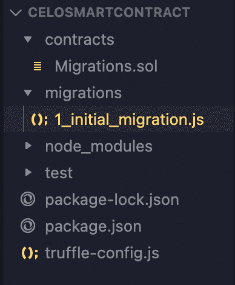
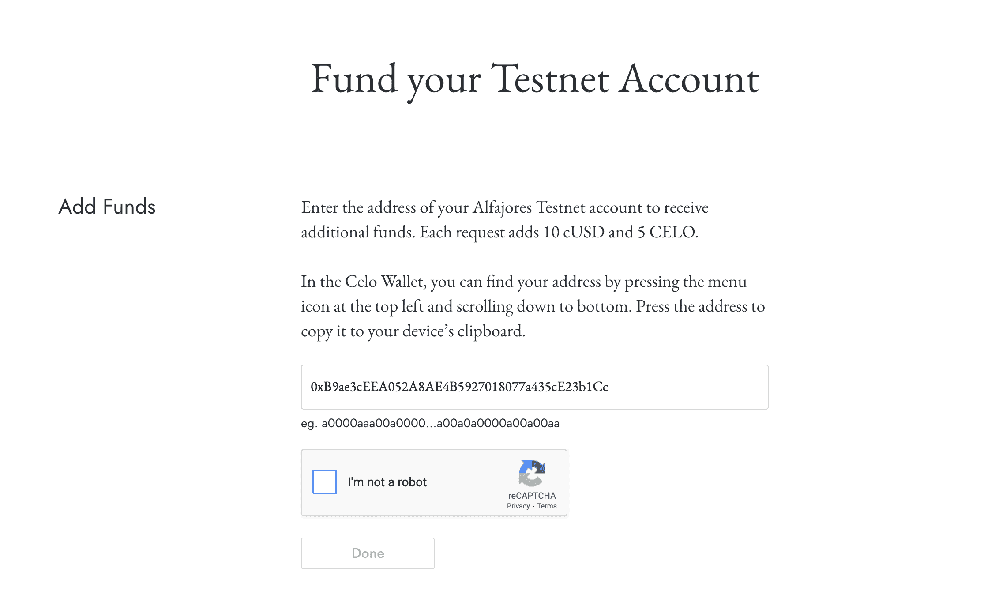
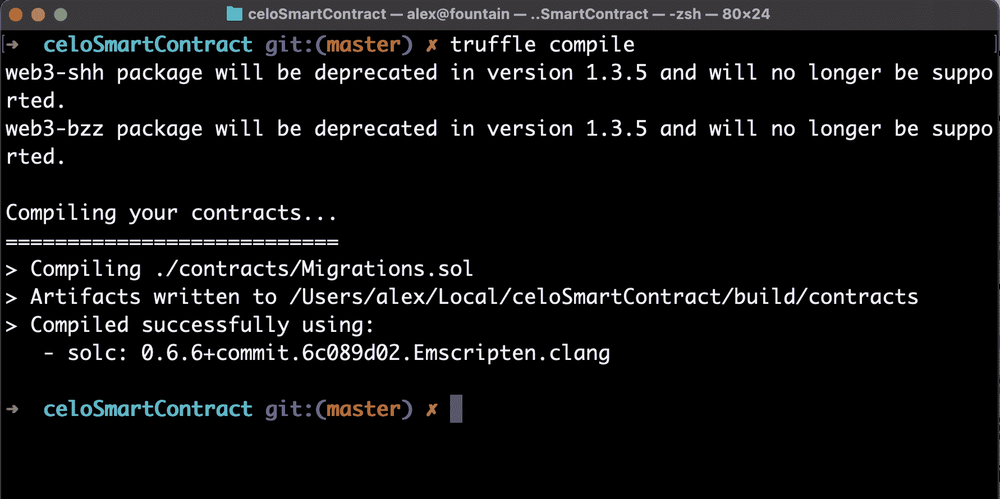
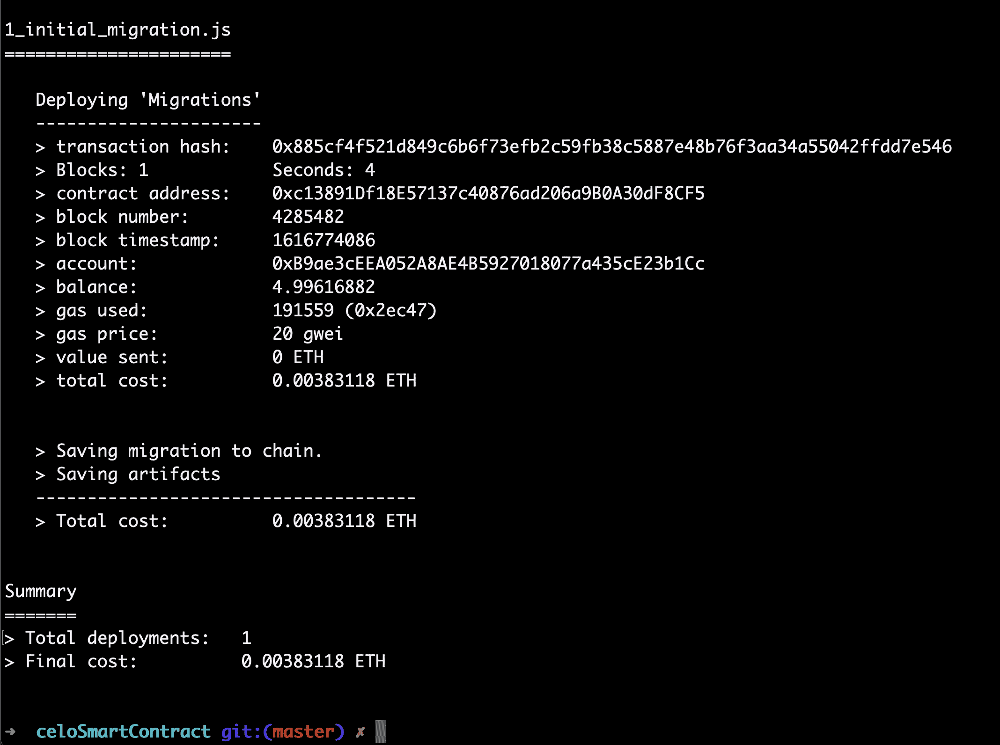
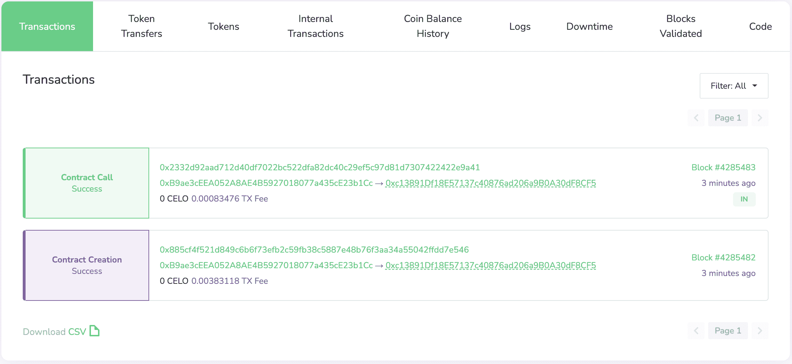
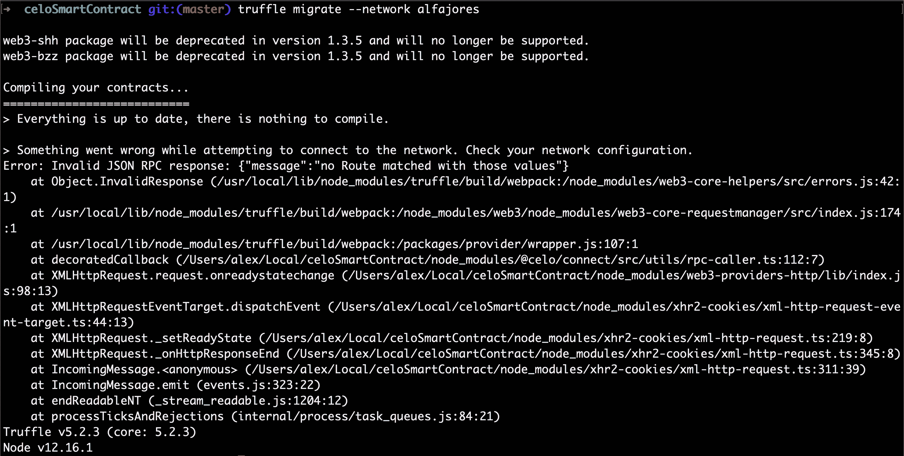
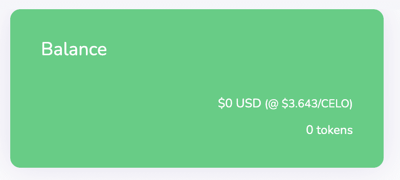

# 介绍

> 原文：<https://github.com/figment-networks/learn-tutorials/blob/master/celo/celo-truffle-deploy.md>

假设你写了一份聪明的合同。您将如何在 Celo 网络上部署它？

答案是你可以在 Truffle 的帮助下做到这一点——这是一个开发环境，它使得部署智能合约更加容易。

继续阅读，了解如何使用 Truffle 在 Celo 上部署智能合约！

# 先决条件

如果您已经编写了一个想要部署到 Celo 上的智能契约，那么本教程将会非常有用。如果没有，也没关系，因为我们将部署默认的 Truffle 迁移合同。

在你继续之前，确保你已经安装了松露。如果没有，请在您的终端中运行以下代码行:

`npm install -g truffle`

# 项目设置

首先，打开终端并创建一个新的项目文件夹。我们称之为 celoSmartContract:

`mkdir celoSmartContract && cd celoSmartContract`

接下来，让我们用 NPM、[节点包管理器](https://npmjs.com)初始化项目目录，使用-y 标志接受默认参数:

`npm init -y`

在 NPM 初始化了项目目录之后，我们需要安装一些额外的包。以下是我们需要安装的内容的概述:

*   contract kit——这是一个由 Celo 团队创建的包，用于帮助 Celo 开发
*   这是一个用来读取我们代码中的环境变量的包
*   最后，Web3 库方便了我们与区块链的互动

使用以下软件安装上述所有软件:

`npm install --save @celo/contractkit dotenv web3`

安装完 NPM 包后，我们需要初始化项目中的 Truffle:

`truffle init`

下面是成功运行的 truffle init 的样子:

[](https://camo.githubusercontent.com/96639b87ce3a287a678cff74b466d840f84b83a42403fae9b23287163e275cee/68747470733a2f2f692e696d6775722e636f6d2f4a46367a646f542e706e67)

# 简单的智能合同

现在我们已经初始化了 Truffle，我们将继续我们将要部署的智能契约。

作为参考，您的项目结构现在应该如下所示:

[](https://camo.githubusercontent.com/089cdaddf4682328e54509cbe1b127fb6c2a9e8f4df9ed7ac82d6ed3cefaede1/68747470733a2f2f692e696d6775722e636f6d2f4a705471574c4a2e706e67)

在本教程中，我们将部署由 Truffle 初始化的 **Migrations.sol** 契约。

**注意**:如果你想部署你写的智能合同，用你自己的 Solidity 文件替换 **contracts/** 文件夹中的 **Migrations.sol** 文件。

无论如何，下面是默认的 **Migrations.sol** 文件的样子:

```
// SPDX-License-Identifier: MIT
pragma  solidity >=0.4.22 <0.9.0;

contract Migrations {

  address public owner =  msg.sender;
  uint  public last_completed_migration;

  modifier restricted() {
    require(
	  msg.sender == owner,"This function is restricted to the contract's owner");
	  _;
  }

  function setCompleted(uint completed) public restricted {
	last_completed_migration = completed;
  }
} 
```

我们不会在本教程中讨论这个智能契约，但是如果你想学习 Solidity，请随意浏览 Figment Learn 上的其他教程！

## 迁移/文件夹

migrations/文件夹中的文件用作部署脚本。在 Truffle 中，这些部署脚本被称为迁移。对于您想要部署的每个 Solidity 文件，您将需要一个相应的迁移。

最简单的情况是，迁移看起来像下面的`1_initial_migration.js`文件:

```
const  Migrations = artifacts.require("Migrations");

module.exports = function (deployer)  {
  deployer.deploy(Migrations);
}; 
```

让我们把它分解一下。

在文件的顶部，artifacts.require()行获取我们将要部署的契约。该名称应始终与 Solidity 合同定义相匹配。在我们的迁移合同中，合同定义如下:

`contract Migrations {`

接下来，脚本通过接受一个`deployer`对象的`module.exports()`语法导出一个函数。deployer 对象用于管理 Truffle 的一些部署任务，并且将用于从 Truffle 方面部署契约。

就是这样！最简单地说，迁移时间很短。

**注意:**如果您想要部署您的自定义 Solidity 合同，请使用编号迁移约定创建一个新文件，并用您的合同定义替换您的 _CONTRACT_NAME:

```
const YOUR_CONTRACT_NAME = artifacts.require("YOUR_CONTRACT_NAME"); 

module.exports  =  function  (deployer)  {
  deployer.deploy(YOUR_CONTRACT_NAME);
}; 
```

# 连接到测试网络节点

现在，我们需要连接到一个 Celo testnet 节点，这将是我们与 Celo 区块链通信的方式。

首先，在`celoSmartContract`文件夹的**根目录**中创建一个. env 文件。为此，导航到项目文件夹的顶部，并在终端中键入以下命令:

`touch .env`

太好了！您已经创建了一个包含环境秘密的. env 文件。确保不要将这个文件提交给 GitHub！将`.env`添加到`.gitignore`文件中的一行，以防止它在您提交时被发送到 GitHub。

我们将使用 [DataHub](https://figment.io/datahub/) 连接到 Celo 测试网络。如果你没有账户，在[数据中心](https://datahub.figment.io/)网站上注册，然后继续本教程。

接下来，打开。env 文件，并添加以下变量，其中 **< YOUR_API_KEY >** 是来自 DataHub 的 API 键:

`REST_URL=https://celo-alfajores--rpc.datahub.figment.io/apikey/<YOUR API KEY>/`

**注意:**行尾需要有一个/才能工作！

现在我们已经保存了用于连接到 Celo testnet 的 URL。

# 获得 Celo 帐户

接下来，我们需要一个 Celo 帐户进行部署。部署时我们需要三样东西:

*   Celo 帐户地址
*   Celo 帐户私钥
*   装有测试网资金的 Celo 账户

首先，让我们获得一个帐户和一个私钥。在根目录下创建一个名为`getAccount.js`的文件。在该文件中，编写以下内容:

```
const ContractKit =  require('@celo/contractkit');

const Web3 =  require('web3');

require('dotenv').config();

const main =  async  ()  =>  {
    const web3 =  new  Web3(process.env.REST_URL);
	const client = ContractKit.newKitFromWeb3(web3);

	const account = web3.eth.accounts.create();

	console.log('address: ', account.address);
    console.log('privateKey: ', account.privateKey);
};

main().catch((err)  =>  {
	console.error(err);
}); 
```

我们来分析一下。

首先，脚本导入 ContractKit、Web3 和 dotenv。接下来，它使用以下代码通过您的`.env`文件中的 REST_URL 连接到 Celo 网络:

`const web3 = new Web3(process.env.REST_URL);`

然后，它在同一个 testnet 连接上创建一个帐户，代码如下:

`const account = web3.eth.accounts.create();`

之后，我们只需打印出地址和私钥以备将来使用。

**注:**以上代码来自 [#2。创建您的第一个 Celo 账户](https://learn.figment.io/network-documentation/celo/tutorial/intro-pathway-celo-basics/2.account)，因此如果您需要评论，请随意回放。

接下来，在您的终端中运行脚本:

`node getAccount.js`

您的输出应该打印出您的新 Celo 帐户的地址和私钥。它看起来会像这样:

[](https://camo.githubusercontent.com/85e62204e4c406103e375245afef4c7ee1fb83998bf2b08e168044c4863fd42b/68747470733a2f2f692e696d6775722e636f6d2f7571314c5854662e706e67)

**注意:**隐藏您的私钥很重要！谁拥有它，谁就可以动用你所有的资金。

将私钥复制到您的。env 文件，方法是添加包含以下内容的一行:

`PRIVATE_KEY=YOUR-PRIVATE-KEY`

其中 **YOUR-PRIVATE-KEY** 是您从脚本输出中获得的私钥。

现在您已经有了一个 Celo 帐户，获取地址并将其粘贴到 [Celo developer 水龙头](https://celo.org/developers/faucet)中。这将为您提供 testnet 资金，您可以使用这些资金来部署您的智能合同。填好表格，等几秒钟，你的账户就应该加载完毕了。

[](https://camo.githubusercontent.com/0c74bcb5251da3397bae2c6901c25218a6ff73befb825a53c546181e95e0db06/68747470733a2f2f692e696d6775722e636f6d2f7a5074575748572e706e67)

# 块菌配置

使用 **truffle-config.js** 是为了告诉 truffle 您想要如何部署您的合同。

出于我们的目的，我们需要将以下代码添加到 truffle-config 项目文件中:

```
const ContractKit = require('@celo/contractkit');
const Web3 = require('web3');

require('dotenv').config({path: '.env'});

// Create connection to DataHub Celo Network node
const web3 = new Web3(process.env.REST_URL);

const client = ContractKit.newKitFromWeb3(web3);

// Initialize account from our private key
const account = web3.eth.accounts.privateKeyToAccount(process.env.PRIVATE_KEY);

// We need to add private key to ContractKit in order to sign transactions
client.addAccount(account.privateKey);

module.exports = {
  compilers: {
    solc: {
      version: "0.6.6",    // Fetch exact version from solc-bin (default: truffle's version)
    }
  },
  networks: {
    test: {
      host: "127.0.0.1",
      port: 7545,
      network_id: "*"
    },
    alfajores: {
      provider: client.connection.web3.currentProvider, // CeloProvider
      network_id: 44787  // latest Alfajores network id
    }
  }
}; 
```

首先，配置文件像`getAccounts.js`文件一样导入 ContractKit、Web3 和 dotenv。

它通过从获取 REST_URL 来连接到我们的 Celo 节点。环境:

`const web3 = new Web3(process.env.REST_URL);`

然后，它从`.env`文件中的私钥获取您的帐户，以便从您的帐户进行部署:

`const account = web3.eth.accounts.privateKeyToAccount(process.env.PRIVATE_KEY);`

我们还将私钥添加到 ContractKit，以便使用以下内容签署交易:

`client.addAccount(account.privateKey);`

最后，在`module.exports`函数中，我们在`compilers: {`下设置我们想要使用的 Solidity 版本，在 `networks: {`下设置我们想要部署的网络。

下面的代码块告诉 truffle 部署到 alfajores (Celo 的测试网络):

```
alfajores: {
    provider: client.connection.web3.currentProvider, // CeloProvider
    network_id: 44787  // latest Alfajores network id
} 
```

# 部署

我们快到了！运行以下命令，检查您所做的一切是否正确:

`truffle compile`

如果一切正常，您应该会看到以下输出:

[](https://camo.githubusercontent.com/c132bce955dd7c13ee2b89d5b9ac1164f99da53830b11a64096b752278735ad9/68747470733a2f2f692e696d6775722e636f6d2f6835593672636f2e706e67)

既然我们已经编译了智能合约，最后一步就是部署它。运行以下命令以部署到 Alfajores testnet:

`truffle migrate --network alfajores`

您应该会看到以下部署输出:

[](https://camo.githubusercontent.com/c0fd0be76786e0c102b0ee445dbd77113f3f626853b3bad4827575250ed61788/68747470733a2f2f692e696d6775722e636f6d2f683757777161442e706e67)

如果你看到类似上面的东西，你就做对了！要在 Celo 网络上查看您的智能合同，请打开 [Alfajores 块浏览器](https://alfajores-blockscout.celo-testnet.org/)，并在您的 truffle 输出的合同地址行中粘贴地址:

`> contract address: 0xc13891Df18E57137c40876ad206a9B0A30dF8CF5`

您应该会在该地址看到一个成功的合同部署！

[](https://camo.githubusercontent.com/2d23c68351d5f73727daf04dad01cc6efd9a82e5678789d61436c608865036eb/68747470733a2f2f692e696d6775722e636f6d2f6e6c32383869612e706e67)

# 结论

恭喜你！您刚刚使用 Truffle 在 Celo 网络上部署了智能合约！

现在您已经完成了教程，您应该对在 Celo 网络上部署智能合约有了基本的了解。你可以创造无限的可能性！现在还早。你可以将本教程作为部署你梦想中的智能合约的起点 <g-emoji class="g-emoji" alias="partying_face" fallback-src="https://github.githubassets.cimg/icons/emoji/unicode/1f973.png">🥳</g-emoji>

本教程的完整源代码可以在 Github 上找到。

# 后续步骤

既然您已经了解了如何在 Celo 上部署智能合约，那么您可以在 Celo 上为加密经济构建新的用例。随意学习更多的可靠性，或者继续学习 [Figment Learn](https://learn.figment.io/tutorials/) 上的教程。

# 常见错误

如果你在任何时候遇到错误，请随时询问 Figment Learn discord 服务器上的 Celo 频道。无论如何，这里有一些你可能会遇到的常见错误。

* * *

如果出现以下错误:

`Error: Invalid JSON RPC response: {"message":"no Route matched with those values"}`

[](https://camo.githubusercontent.com/b10c13fb11358a60891ccd1e3191e40ffe54d19ffef9b3f0b127e3e567eed1b6/68747470733a2f2f692e696d6775722e636f6d2f42384c657272552e706e67)

那么你的**里的 **REST_URL** 就有问题了。env** 文件。

确保 URL 末尾有一个结尾 **/** ！它应该是这样的:

`REST_URL = https://celo-alfajores--rpc.datahub.figment.io/apikey/YOUR-API-KEY/`

* * *

如果您的合同没有部署到测试网络，您的输出可能如下所示:

[](https://camo.githubusercontent.com/a59c20e99081c85f182da44f68a167aec86a58da7c690367b4dbe35f57673943/68747470733a2f2f692e696d6775722e636f6d2f703637645a444d2e706e67)

合同编译的地方，但是它没有给你它被部署到哪里的地址。

要解决这个问题，请确保您的帐户中已经加载了 [testnet 资金](https://celo.org/developers/faucet)。

如果你想再次检查你的账户是否收到资金，请进入 [Alfajores 块浏览器](https://alfajores-blockscout.celo-testnet.org/)并粘贴你的账户地址。

确保你的账户不是像这个一样空的！

[](https://camo.githubusercontent.com/60a2da1b381d2d9f9c21ade38e54f3793ead7bf2162d4eb7ccb8297733494cbc/68747470733a2f2f692e696d6775722e636f6d2f795055594353442e706e67)