# 介绍

> 原文：<https://github.com/figment-networks/learn-tutorials/blob/master/celo/celo-ubeswap-tutorial.md>

这篇文章旨在作为 Ubeswap 新用户或刚刚发现 DeFi 好处的人的指南。Ubeswap 是用于 Celo 资产的 DEX(分散式交易所)和 AMM(自动做市商)协议。Ubeswap 基于 Sushiswap，它是流行的以太坊 Uniswap 的分支。这是为了确保 Ubeswap 生态系统能够支持尽可能多的来自以太坊生态系统的现有工具和项目。

## 人们为什么用 DEX？

**分散式交易所** (DEX)是一种加密货币交易所，允许直接点对点加密货币交易安全地在线进行，无需中介。

与传统交易所相比，在买卖加密货币时，DEXes 可以更简单、更快速地使用。最重要的是，我们可以在分散式交易所(DEXes)上找到很多你在其他地方找不到的代币！DEXes 提供了一个发现独特机会的好方法。任何人都可以创造一个可以在 DEXes 上交易的代币。

在任何中央交易所，用户可以轻松地维护一个订单簿，但这一概念在区块链行不通，因为汽油费、滑点和市场价格发现的延迟。为了解决这些问题，自动做市商 (AMM)应运而生。在总部位于 AMM 的分散式交易所，传统的订单簿被流动性池所取代，这些流动性池是为交易对手的两种资产在链上预先融资的。流动性是由其他用户提供的，他们也通过交易费从存款中获得被动收入，交易费基于他们提供的流动性池的百分比。基于 AMM 的交易所基于恒定功能(恒定功能做市商)，其中交易对的组合资产储备必须保持不变。

所有这些信息一开始可能有点让人不知所措，但随着时间的推移，我们都能学会。

更多关于 AMMs 的信息可以在这里找到。如果你想了解 DeFi，你可以访问[这个](https://academy.ivanontech.com/blog/defi-encyclopedia-the-ultimate-list-of-decentralized-finance-terms)网站。

# 先决条件

1.  Celo 兼容钱包(例如:Celo 扩展钱包、Valora 或分类帐设备)
2.  与 UBESWAP 互动的资金。

# 如何使用 Ubeswap

## 1.移动定义

Celo 专注于移动优先方法，因此它为移动 defi 用户创建了一种使用 Ubeswap 的方法。用户可以设置他们的 Valora 应用程序，这是 Celo 区块链上的托管钱包。设置 Valora 后，用户可以前往 [UBESWAP](https://app.ubeswap.org/) 。

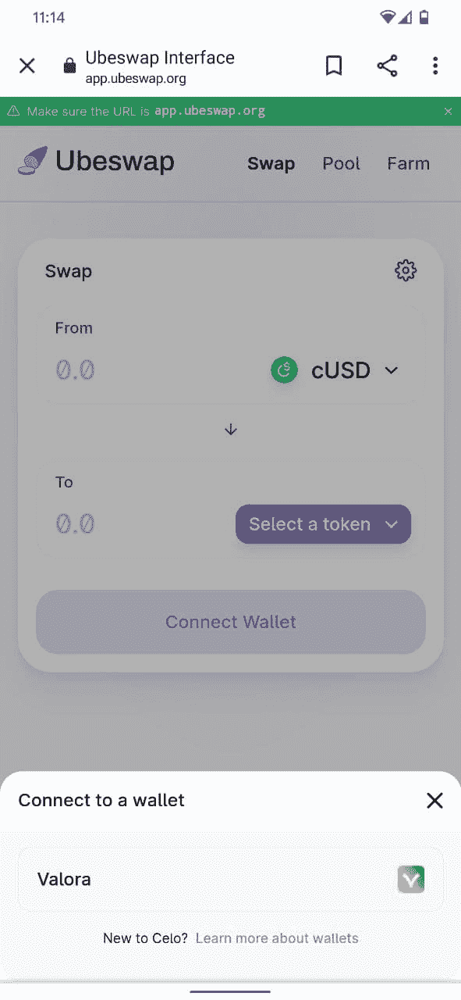

并选择`Valora`。这将与 Valora 帐户建立联系，我们将能够使用 Valora 应用程序中的资金与 Ubeswap 进行交互。

## 2.桌面版

我们可以通过使用扩展钱包的传统方式连接 Ubeswap。在 Celo 区块链上，可以从[这里](https://chrome.google.com/webstore/detail/celoextensionwallet/kkilomkmpmkbdnfelcpgckmpcaemjcdh?hl=en)下载的是 Celo 扩展钱包。在本教程中，我们将使用这种方式连接 Ubeswap。

# 与 Ubeswap 连接

使用测试网学习任何新的区块链技术总是更好的，这样我们就不必花费真正的加密资产。Ubeswap 已经将其所有合同部署在`Alfajores` testnet 上，因此用户可以首先在 testnet 上学习使用它的平台。我们也会这样做。

让我们前往 https://app-alfajores.ubeswap.org/。

我们将需要连接我们的 Celo 扩展钱包与 Ubeswap 的前端。在连接之前，确保我们有 testnet 基金来与 DEX 互动。前往 [testnet 水龙头](https://celo.org/developers/faucet)获得一些 testnet 基金。

点击屏幕右上角的`Connect a wallet`按钮。

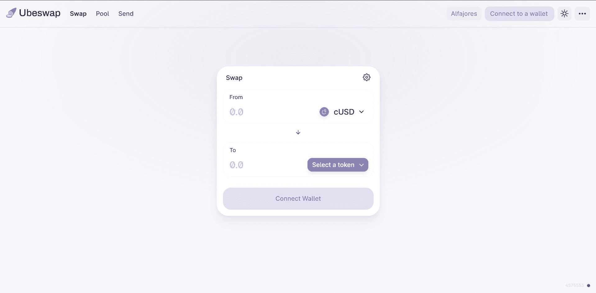

并选择`Celo Extension Wallet`

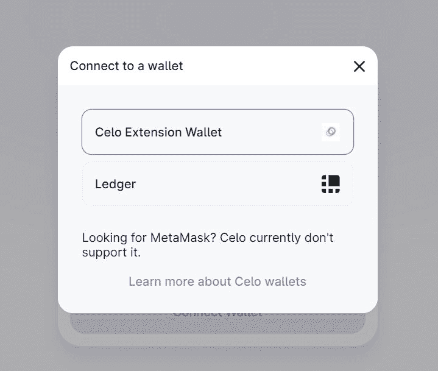

然后用扩展钱包签署交易。如果一切顺利，我们的屏幕应该是这样的。

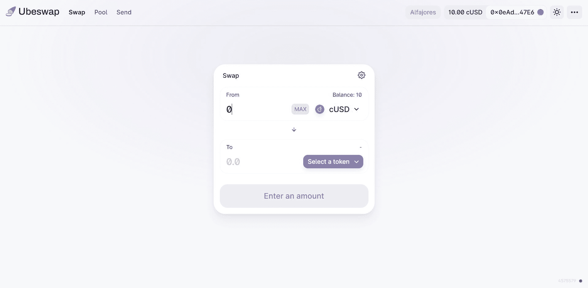

现在我们已经连接了我们的钱包，让我们学习如何在 Ubeswap 上交换令牌。

# 互换

我们将学习如何将一个代币换成另一个代币。在本教程中，我们将交换 cUSD 到 CELO。

从选项卡的**中选择代币，并输入金额。我们将向 CELO 兑换 5 美分。我们的屏幕应该看起来像这样。**

在交换之前，我们需要批准 Ubeswap 使用我们的 cUSD。这样做是为了防止用户将其加密发送到未知地址。点击`Approve cUSD`进行批准。

如果一切顺利，我们的屏幕应该是这样的。

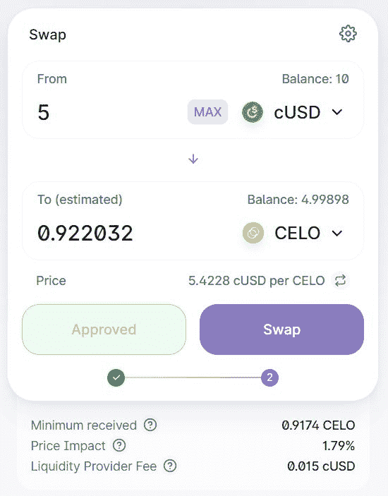

点击`Confirm Swap`并签署交易。

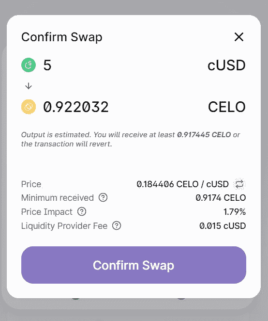

如果交易成功，我们应该会看到这样的确认。

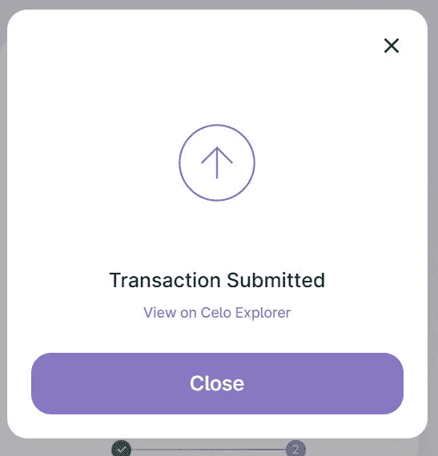 新的代币将出现在我们的钱包里。# # ubes WAP 上的流动性池流动性池是锁定在智能合约中的资金集合。用户将一对资产添加到流动性池，这允许其他用户对配对令牌中的任何一个进行互换。这允许大范围的资产在 DEX(去中心化交易所)上被表现出来，同时，当用户交换资产时，它允许较小的滑点幅度。当其他用户与他们提供资产的流动性池互动时，流动性提供者(也称为有限合伙人)会收到一定比例的费用。在参与流动性池之前，用户需要自我教育，并了解与 DeFi 相关的风险。我们可以使用 Ubeswap 在 Celo 上创建自己的 ERC20 兼容令牌池。我们将增加 cUSD-CELO 基金的流动性。点击“添加流动性”按钮开始流程。 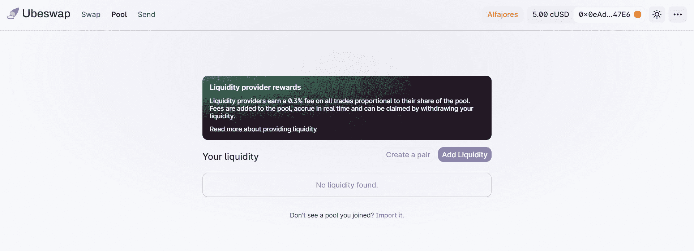 现在选择令牌。请记住，我们需要将 cUSD 术语中相同值的两个令牌相加。如前所述，我们必须给予正在交互的合同使用令牌的许可。我们已经批准 Ubeswap 使用我们的 cUSD，我们也需要为 CELO 做同样的事情。点击“批准 CELO”

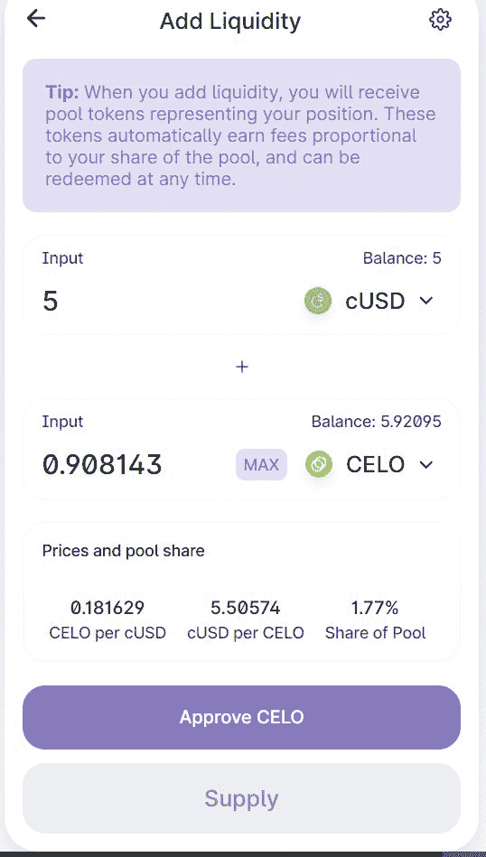

现在点击`Supply`

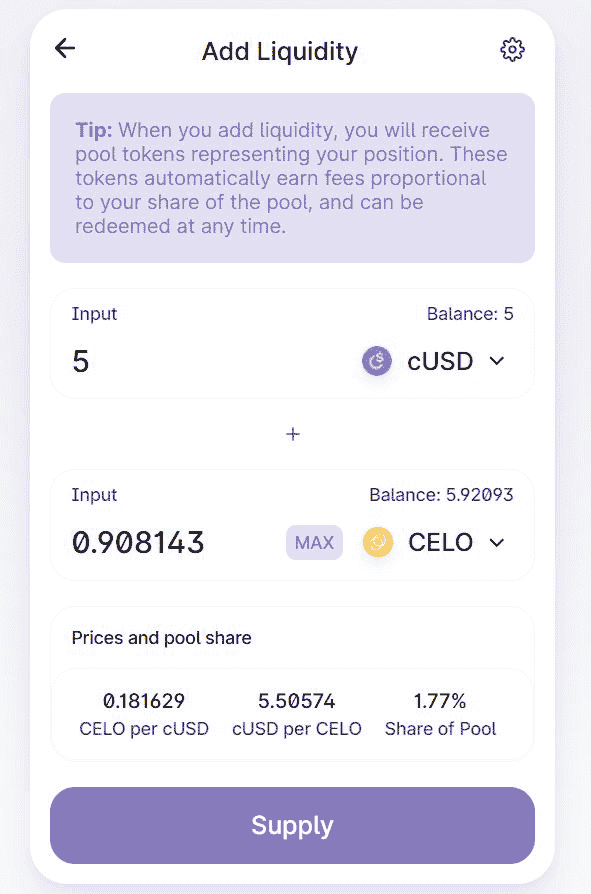

检查所有细节，如果正确，点击`Confirm Supply`。

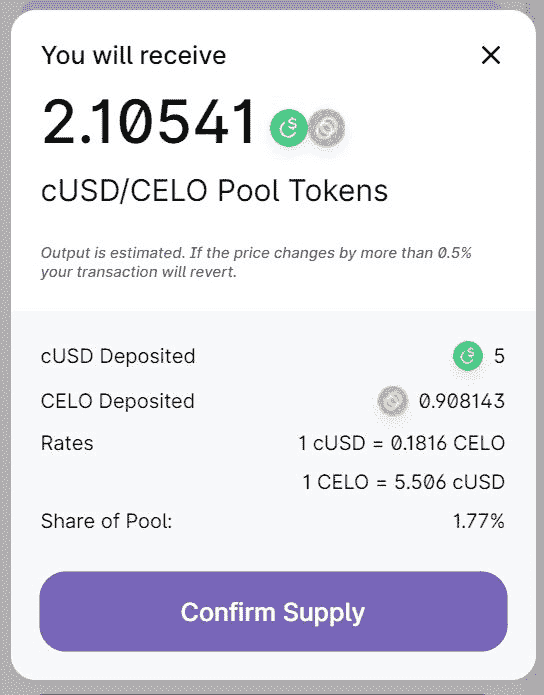

就是这样，我们已经为 Ubeswap 上的一个资金池提供了流动性。我们可以在屏幕底部看到我们的位置。

# 结论

Ubeswap 最近宣布，DeFi 用户在 Ubeswap 上参加 DeFi 将获得奖励，这是参与的最佳时机！

Ubeswap 的目标是增加 Celo 上数字资产的流动性。从长远来看，任何人都可以通过手机或浏览器交易任何资产，而不必依赖几十年前的清算所技术或其他集中式系统的世界会更有效。只有当人们能够投资于优质资产时，这才有可能。Ubeswap 试图通过利用 Celo 的快速交易时间、高阻塞气体限制和稳定的 coin 系统，从所有 DeFi 中引入流动性。

# 关于作者

本教程由 Deepanshu Hooda 创建，他是一名计算机科学专业的大三学生，也是一名对金融有浓厚兴趣的区块链开发者。他大部分时间都在研究新的 DeFi 协议，并且喜欢旅行。