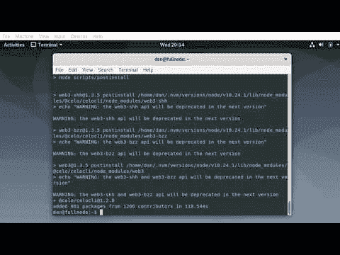
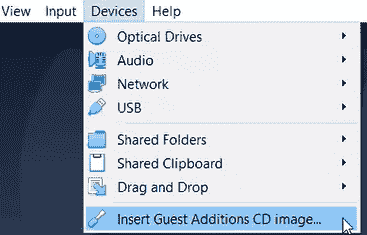

# 介绍

> 原文:[https://github . com/fig ment-networks/learn-tutorials/blob/master/celo/how-to-run-a-celo-full-node-in-a-a-virtual-machine . MD](https://github.com/figment-networks/learn-tutorials/blob/master/celo/how-to-run-a-celo-full-node-in-a-virtual-machine.md)

在本教程中，我们将设置一个虚拟机并安装必要的软件来创建一个完整的节点，然后运行一个轻型客户端来监控网络。完整节点是塞洛区块链的主要部分。完整节点是一个持续运行的程序，它将帮助编写和验证网络中的新变化。多个完整节点协同工作，以分散的方式验证区块链。

请观看下面链接的视频，并跟随书面教程！

# 先决条件

*   对虚拟机(VM)和 Linux 终端有基本的了解。
*   在 iOS 或 Android 上安装 Valora 应用:[https://valoraapp.com/](https://valoraapp.com/)
*   下载最新的 Debian 10.x 64 位 ISO:[https://www.debian.org/](https://www.debian.org/)
*   下载 VirtualBox，甲骨文虚拟机主机:[https://www.virtualbox.org/](https://www.virtualbox.org/)
*   iOS 或 Android 下载信号:[https://www.signal.org/](https://www.signal.org/)

# 创建虚拟机

**视频 1 -** 在 VirtualBox 中创建虚拟机

**点击图片进入视频:**

[](http://www.youtube.com/watch?v=Cdqwzf-zfug)

*   点击 VirtualBox 中的“新建”
*   选择动态分配的虚拟硬盘
*   启动虚拟机
*   创建新用户
*   选择“使用整个磁盘”，然后将更改写入磁盘
*   选择复选框:Debian 桌面环境、SSH 服务器、标准系统实用程序
*   将 Grub 引导程序安装到虚拟硬盘上

Debian 的安装已经完成，VM 已经准备好了。

**视频 2，构建完整节点**

[](http://www.youtube.com/watch?v=l8qAISLJZq8)

### 在虚拟机上获得 sudo

在 Linux 上，命令`sudo`代表“替代用户 do”。
一旦用户帐户被添加到`sudo`组，它将能够在虚拟机上以管理员或“root”权限进行操作。

在虚拟机终端中输入以下命令:

`su -`

*   您需要输入虚拟机的 root 密码。

`usermod -aG sudo YOURUSERNAME`

*   您的用户名需要替换为当前登录用户的帐户名。默认情况下，这应该显示在终端提示符中，但是您可以使用命令`who`来确定您当前使用哪个帐户登录。
*   重新启动虚拟机

`id`

*   在组列表中查找(sudo):

[](https://user-images.githubusercontent.com/80616939/120870817-2f38a480-c557-11eb-9fd0-5be9e710af8d.png)

## 安装 Docker 和工具

Curl 将用于在终端中插入 GitHub 脚本。

Docker 是一个将运行轻客户端的服务。

Vim 是一个用于在终端中编辑文件的工具。[点击这里](https://www.linux.com/training-tutorials/vim-101-beginners-guide-vim/)阅读 Vim 初学者指南。

`sudo apt update && sudo apt upgrade`

`sudo apt install docker.io`

`sudo apt install curl`

`sudo apt install vim`

## 支持双向复制/粘贴，并提高显示分辨率

运行名为 VBoxLinuxAdditions 的外部程序，该程序支持在虚拟机和主机之间进行复制/粘贴。

将光标放在左上角的设备上，然后选择:插入来宾附件 CD 映像

[](https://user-images.githubusercontent.com/80616939/118760448-0ebadb80-b830-11eb-88fa-51e672a41d83.png)

`cd /media/cdrom`

`sudo sh VBoxLinuxAdditions.run`

*   重新启动虚拟机
*   选择设备>共享剪贴板下的双向复制/粘贴

Linux 头文件提供了许多重要的功能，无需安装不必要的文件，而 VBoxLinuxAdditions 提供了动态的屏幕分辨率。

“sudo apt install build-essential Linux-headers-` uname-r'”

*   重新启动虚拟机
*   在菜单栏上选择“视图”下的“调整窗口大小”。

## 安装 nvm 和 Celo CLI

这是节点版本管理器 [nvm](https://github.com/nvm-sh/nvm) 的安装脚本。添加文件后，记得对其进行源文件处理。

`curl -o- https://raw.githubusercontent.com/nvm-sh/nvm/v0.37.2/install.sh | bash`

`source ~/.bashrc`

安装/使用节点版本 10，然后在此客户端上安装 Celo CLI。

`nvm install 10`

`nvm use 10`

`npm install -g @celo/celocli`:这里的`-g`标志表示我们将[全球安装包](https://docs.npmjs.com/downloading-and-installing-packages-globally)。

## 加入码头工人小组

将您的用户帐户添加到 Docker 组。

`sudo usermod -aG docker $YOURUSERNAME`

*   重新启动虚拟机

`id`

*   在列表中查找(docker ),因为

运行轻型客户端需要 Docker。

*   关闭这个终端

## 使用 curl 获取脚本

要了解`.env`文件，请查看本[指南](https://docs.figment.io/network-documentation/extra-guides/dotenv-and-.env)。

我们使用`curl`来获取存储在 [Gist](https://docs.github.com/en/github/writing-on-github/editing-and-sharing-content-with-gists/creating-gists) 上的信息，GitHub 为共享代码和其他文档提供了一个免费网站。

这个`.env`文件用于存储和访问环境变量。它将保存公钥。

```
curl -o celo.env https://gist.githubusercontent.com/alchemydc/ce712f6f3caa7ec79f15f930ed5904ed/raw/385c65b1d3f760854258bfd6dd8cbd135710b78f/celo.env 

source celo.env 
```

如果您想自己创建`celo.env`,下面是这个文件的内容:

```
export CELO_IMAGE=us.gcr.io/celo-org/geth:mainnet
export CELO_ACCOUNT_ADDRESS="YOUR_ACCOUNT_ADDRESS" 
```

该文件运行轻型客户端，并以运行时参数的形式包含有关节点的信息。这个 shell 脚本需要安装 Docker 才能成功工作，因为它包含命令`docker pull`和`docker run`。要将脚本放在虚拟机的文件系统上，请运行以下命令

```
curl -o start_celo.sh https://gist.githubusercontent.com/alchemydc/e28945f5059acd70969b39a50fd0f80a/raw/0d15cceb89ea86ca46df94441c06ecd88a4e6635/start_celo.sh 
```

[](https://user-images.githubusercontent.com/80616939/120844824-33e86300-c52d-11eb-8b1f-db5e66ec76bb.png)

通过在终端中运行以下命令，将这些文件移动到名为`celo-data-dir`的新目录中:

```
mkdir celo-data-dir && cd celo-data-dir

mv ../celo.env . 
mv ../start_celo.sh .

source celo.env && source start_celo.sh 
```

命令`mkdir`是新建一个目录，`cd`是改变当前目录，`mv`是移动文件。`source`将读取并执行文件的内容。

docker 容器现在应该正在运行。

## 启动节点

**从 celo-data-dir 内部运行该命令:**

`docker run -v $PWD:/root/.celo --rm -it $CELO_IMAGE account new`

复制新节点帐户提供的公共地址:

[](https://user-images.githubusercontent.com/80616939/122334208-96ab0880-cef6-11eb-9204-d1279da300a8.png)

接下来，运行`vim celo.env`

[](https://user-images.githubusercontent.com/80616939/118758843-044b1280-b82d-11eb-88df-e83e5fb813f4.png)

*   在 vim 中，按“I”进入插入模式。
*   使用退格键或 delete 键删除您的帐户地址。
*   通过按“shift+insert”粘贴公共地址。
*   按“:”退出 vim，然后键入“wq”，然后按回车键(有时称为 enter)。
*   因为我们已经改变了内容，记得运行`source celo.env`

## 运行轻型客户端

`chmod u+x ./start_celo.sh`，给予用户执行脚本的权限。

`./start_celo.sh`，启动轻客户端。

`cat ./start_celo.sh`，显示节点信息。

`docker stop geth`，停止轻客户端。

*   使用 2 个端子凸耳。一个用于启动轻型客户端，另一个用于所有其他命令。

`./start_celo.sh`

`celocli node:synced`

*   如果为真，则节点已连接。

`celocli account:balance NODE_ADDRESS`

`docker stop geth`

[](https://user-images.githubusercontent.com/80616939/118338503-8eb11080-b4d3-11eb-99a3-11417cf79b32.png)

## 向节点发送 Celo 和从节点发送 Celo

*   向您的节点地址发送 CUSD 和 CELO 本地令牌。
*   打开两个终端窗口。一个用于运行轻型客户端，另一个用于输入命令。
*   确保两个端子都在`celo-data-dir`位置。

`cat ./start_celo.sh`

`docker exec -it geth geth attach`

`exit`

`celocli account:unlock $PUBLIC_ADDRESS`

*   输入口令

`source celo.env`

`celocli transfer:dollars --from $NODE_ADDRESS --to $PHONE_ADDRESS --value=1e16`

理解这个计量单位:1e16 = 0.01 CUSD，1e15 = 0.1 CUSD，1e14 = 1.0 CUSD。

[](https://user-images.githubusercontent.com/80616939/118338915-9c1aca80-b4d4-11eb-87b6-7970949923aa.png)

# 结论

恭喜，完整节点和轻型客户端现在应该可以运行了！
请记住这不是建立完整节点的唯一方法。这个节点现在在你的控制之下，是 Celo 区块链的一部分，所以记得安全地存储所有相关的密钥和密码，以避免损失任何金钱。请尝试此设置并进行个性化设置。可以修改`start_celo.sh`和`celo.env`文件来满足您的需求。

# 关于作者

这个教程是由 Learn 社区的一个聪明的年轻成员 Aidan Dedecker 组织的。