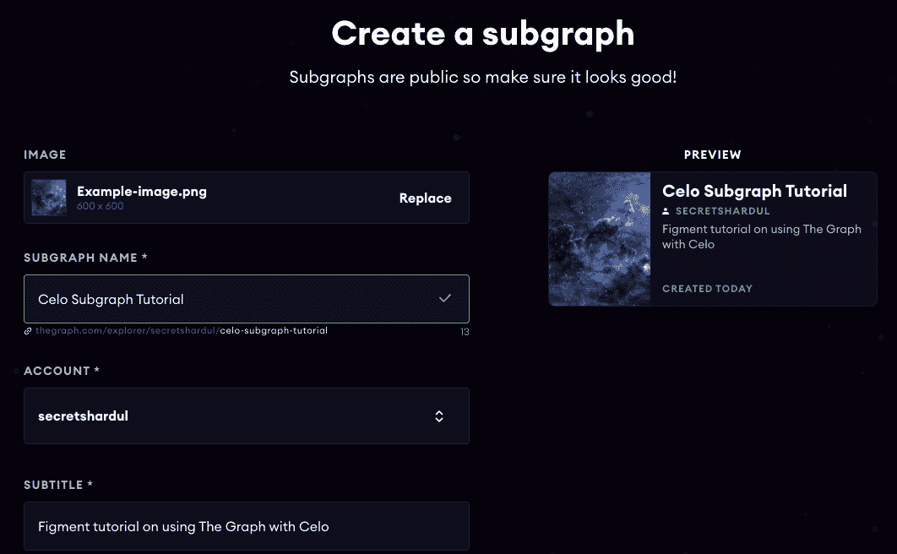
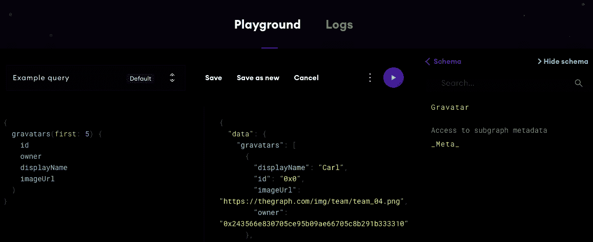
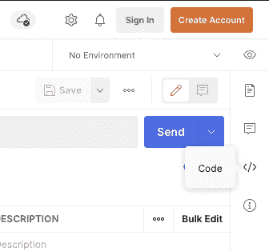
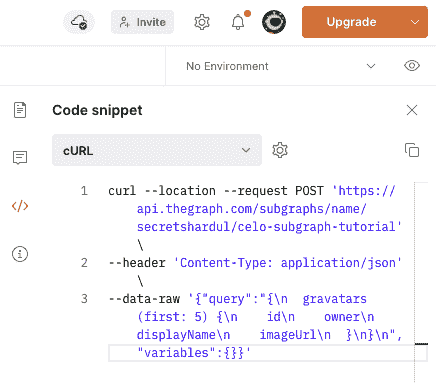

# 什么是图形协议？

> 原文：<https://github.com/figment-networks/learn-tutorials/blob/master/celo/subgraphs-on-celo.md>

[https://www.youtube.com/watch?v=OgIiySTRGQE](https://www.youtube.com/watch?v=OgIiySTRGQE)

Graph 协议允许您为智能合约创建称为子图的 GraphQL APIs。听起来很多？我们会分解它。

## GraphQL 是什么？

GraphQL 是一种用于 web APIs 的查询语言。我们可以拥有一个智能 GraphQL 端点，而不是多个哑端点，该端点:

*   允许您查看 API 模式。模式是自动生成的，所以告别编写 swagger 文件吧！
*   让您在单个查询中获取您想要的内容。

[http://www.youtube.com/watch?v=eIQh02xuVw4](http://www.youtube.com/watch?v=eIQh02xuVw4)

## 我可以阅读我的合同数据。为什么使用另一个协议？

直接查询区块链需要额外的设置。为此，您需要访问一个 Celo 节点，外加一个前端库，如`web3.js`。

相比之下，您可以从您的应用程序或命令行直接查询 GraphQL。

## 它是如何工作的？

1.  区块链商店有永久的交易历史。Graph protocol 为我们的合同索引交易，类似于 Google 索引互联网的方式。我们可以通过 GraphQL 模式查询这些事务。
2.  智能合约让我们定义和触发事件。例如，当我们向某人转移 ERC20 令牌时，会触发一个`transfer`事件。Graph protocol 实时监听这些事件并更新其数据。这样，我们总能得到最新的数据。
3.  图形协议是分散的。我们不需要担心 API 服务器宕机。

# 给我看看代码！

**资源:**

1.  [源代码](https://github.com/secretshardul/the-graph-celo)
2.  [展开的子图](https://thegraph.com/explorer/subgraph/secretshardul/celo-subgraph-tutorial)
3.  [部署 Celo 合同](https://explorer.celo.org/address/0x56d04968f959ae609a32c8eadb8cd3db90490a7f/transactions)

我们将为部署在 Celo mainnet 上的 gravatar 合同创建一个子图。这是官方图形教程的一个分支，对 Celo 进行了修改。

*   访问 Graph Protocol 网站并使用 Github 登录。

*   转到您的仪表板，点击**添加子图**。填写所需的详细信息并点击**创建子图**。

    [](https://github.com/figment-networks/learn-tutorials/raw/master/assets/celo-subgraph-01-dashboard-create-new.png)

*   遵循仪表板上显示的步骤，略有不同。

[](https://github.com/figment-networks/learn-tutorials/raw/master/assets/celo-subgraph-02-dashboard-instructions.png)

1.  使用 NPM 或纱线安装图形 CLI。

```js
npm install -g @graphprotocol/graph-cli
```

**或**

```js
yarn global add @graphprotocol/graph-cli
```

2.  初始化 Celo starter 项目。我们偏离了指令，因为我们是在 Celo 的基础上构建的。

```js
git clone https://github.com/secretshardul/the-graph-celo.git
```

**使用**安装节点依赖关系

```js
yarn
```

**或**

```js
npm install
```

3.  部署

```js
# Authenticate Graph CLI. The access token is displayed on your subgraph dashboard.
graph auth https://api.thegraph.com/deploy/ <ACCESS_TOKEN>

# Deploy to The Graph
graph deploy \
    --debug \
    --node https://api.thegraph.com/deploy/ \
    --ipfs https://api.thegraph.com/ipfs/ \
    <SUBGRAPH_NAME>
```

您应该会得到类似如下的输出

```js
✔ Apply migrations
✔ Load subgraph from subgraph.yaml
Compile data source: Gravity => build/Gravity/Gravity.wasm
✔ Compile subgraph
Copy schema file build/schema.graphql
Write subgraph file build/Gravity/abis/Gravity.json
Write subgraph manifest build/subgraph.yaml
✔ Write compiled subgraph to build/
Add file to IPFS build/schema.graphql
                .. QmbSFRGGvHM7Cn8YSjDL41diDMxN4LQUDEMqaa5VVc5sC4
Add file to IPFS build/Gravity/abis/Gravity.json
                .. QmajZTadknSpgsCWRz9fG6bXFHdpVXPMWpx9yMipz3VtMQ
Add file to IPFS build/Gravity/Gravity.wasm
                .. QmbK8bwncci52cstF3P8Q8i4oGjrMt1pUqdv5Uf1VXqXdb
✔ Upload subgraph to IPFS

Build completed: QmXWN5HVtKsRdCKc7HUthjvuyPiwkCNeYJQknsAa5AqQ8K

Deployed to https://thegraph.com/explorer/subgraph/secretshardul/celo-subgraph-tutorial

Subgraph endpoints:
Queries (HTTP):     https://api.thegraph.com/subgraphs/name/secretshardul/celo-subgraph-tutorial
Subscriptions (WS): wss://api.thegraph.com/subgraphs/name/secretshardul/celo-subgraph-tutorial
```

4.  刷新页面以查看您部署的子图。同步数据可能需要几个小时，之后我们的查询将返回所需的结果。

[](https://github.com/figment-networks/learn-tutorials/raw/master/assets/celo-subgraph-03-query-explorer.png)

5.  是时候运行 GraphQL 查询了！给出了一个默认查询，它获取前五个 gravatars 的数据。按下运行按钮。下面的查询再次供参考:

```js
# Get details of first five gravatars
{
    gravatars(first: 5) {
        id
        owner
        displayName
        imageUrl
    }
}
```

您将得到类似于

```js
{
    "data": {
        "gravatars": [
            {
                "displayName": "Carl",
                "id": "0x0",
                "imageUrl": "https://thegraph.com/img/team/team_04.png",
                "owner": "0x243566e830705ce95b09ae66705c8b291b333310"
            }
        ]
    }
}
```

**注意**:等待同步完成，否则你会看到一个空的结果。

6.  如何在我们的应用程序中使用子图？我已经为演示创建了一个邮递员公共工作区。[访问 Celo 子图工作区](https://www.postman.com/cloudy-firefly-3880/workspace/the-graph-celo/request/9305744-4a75a867-c2b3-446b-be18-864c7e6550eb)。您可以通过按下 run 按钮来尝试预定义的查询。

按下右侧的代码按钮。选择您选择的语言来获取生成的代码。例如我们得到了这个关于 cURL 的片段。将它粘贴到您的终端中以查看结果。

**邮递员生成代码按钮**

[](https://github.com/figment-networks/learn-tutorials/raw/master/assets/celo-subgraph-04-postman-code-button.png)

**邮递员生成代码结果**

[](https://github.com/figment-networks/learn-tutorials/raw/master/assets/celo-subgraph-05-postman-generated-code.png)

```js
curl --location --request POST 'https://api.thegraph.com/subgraphs/name/secretshardul/the-graph-celo' \
    --header 'Content-Type: application/json' \
    --data-raw '{"query":"{\n  gravatars(first: 5) {\n    id\n    owner\n    displayName\n    imageUrl\n  }\n}\n","variables":{}}'
```

# 说明

我们有一份预先部署的合同`GravatarRegistry`。

*   Gravatar 代表“全球公认的阿凡达”。它们是保证独一无二的个人资料图片。你知道 GitHub 和 StackOverflow 上的默认头像其实是 gravatars 吗？

这份智能合同为 Gravatars 建立了一个注册表。它具有以下特点:

*   创建新的 gravatar
*   查看其他用户的 gravatars
*   更新您的 gravatar 的名称和图像

```js
pragma solidity ^0.4.0;

contract GravatarRegistry {
    event NewGravatar(uint id, address owner, string displayName, string imageUrl);
    event UpdatedGravatar(uint id, address owner, string displayName, string imageUrl);

    struct Gravatar {
        address owner;
        string displayName;
        string imageUrl;
    }

    Gravatar[] public gravatars;

    mapping (uint => address) public gravatarToOwner;
    mapping (address => uint) public ownerToGravatar;

    function createGravatar(string _displayName, string _imageUrl) public {
        require(ownerToGravatar[msg.sender] == 0);
        uint id = gravatars.push(Gravatar(msg.sender, _displayName, _imageUrl)) - 1;

        gravatarToOwner[id] = msg.sender;
        ownerToGravatar[msg.sender] = id;

        emit NewGravatar(id, msg.sender, _displayName, _imageUrl);
    }

    function getGravatar(address owner) public view returns (string, string) {
        uint id = ownerToGravatar[owner];
        return (gravatars[id].displayName, gravatars[id].imageUrl);
    }

    function updateGravatarName(string _displayName) public {
        require(ownerToGravatar[msg.sender] != 0);
        require(msg.sender == gravatars[ownerToGravatar[msg.sender]].owner);

        uint id = ownerToGravatar[msg.sender];

        gravatars[id].displayName = _displayName;
        emit UpdatedGravatar(id, msg.sender, _displayName, gravatars[id].imageUrl);
    }

    function updateGravatarImage(string _imageUrl) public {
        require(ownerToGravatar[msg.sender] != 0);
        require(msg.sender == gravatars[ownerToGravatar[msg.sender]].owner);

        uint id = ownerToGravatar[msg.sender];

        gravatars[id].imageUrl =  _imageUrl;
        emit UpdatedGravatar(id, msg.sender, gravatars[id].displayName, _imageUrl);
    }

}
```

注意上面代码中的事件`NewGravatar`和`UpdatedGravatar`。每当触发事件时，图形协议就用新数据更新其索引。看看[子图. yaml](https://github.com/secretshardul/the-graph-celo/blob/master/subgraph.yaml) ，这是创建子图的起点。它包含以下信息:

*   子图描述和源代码库
*   GraphQL 模式文件位置
*   合同相关数据:合同名称、网络、地址和 ABIs
*   要听的事件。我们正在收听`NewGravatar(uint256,address,string,string)`和`UpdatedGravatar(uint256,address,string,string)`事件。
*   **事件处理程序**:每当一个注册的事件被触发时，图形协议读取事务数据。这些原始交易数据必须经过处理才能使用。事件处理程序指定必须读取哪些数据点，并负责将这些数据填充到 GraphQL 模式中。注意事件处理程序`handleNewGravatar`和`handleUpdatedGravatar`。

```js
specVersion: 0.0.2
description: Gravatar contract subgraph for Celo
repository: https://github.com/secretshardul/the-graph-celo
schema:
file: ./schema.graphql
dataSources:
- kind: ethereum/contract
    name: Gravity
    network: celo
    source:
    address: '0x56d04968f959ae609a32c8eadb8cd3db90490a7f' # Deployed contract address
    abi: Gravity
    mapping:
    kind: ethereum/events
    apiVersion: 0.0.4
    language: wasm/assemblyscript
    entities:
        - Gravatar
    abis:
        - name: Gravity
        file: ./abis/Gravity.json
    eventHandlers:
        - event: NewGravatar(uint256,address,string,string)
        handler: handleNewGravatar
        - event: UpdatedGravatar(uint256,address,string,string)
        handler: handleUpdatedGravatar
    file: ./src/mapping.ts
```

查看 [src/mapping.ts](https://github.com/secretshardul/the-graph-celo/blob/master/src/mapping.ts) 中的事件处理程序代码。注意`owner`、`displayName`和`imageUrl`字段是如何更新和保存的。

```js
import { NewGravatar, UpdatedGravatar } from '../generated/Gravity/Gravity'
import { Gravatar } from '../generated/schema'

// Save details whenever a new gravatar is created
export function handleNewGravatar(event: NewGravatar): void {
    let gravatar = new Gravatar(event.params.id.toHex())
    gravatar.owner = event.params.owner
    gravatar.displayName = event.params.displayName
    gravatar.imageUrl = event.params.imageUrl
    gravatar.save()
}

// Update index data whenever gravatar data is updated on the smart contract
export function handleUpdatedGravatar(event: UpdatedGravatar): void {
    let id = event.params.id.toHex()
    let gravatar = Gravatar.load(id)
    if (gravatar == null) {
        gravatar = new Gravatar(id)
    }
    gravatar.owner = event.params.owner
    gravatar.displayName = event.params.displayName
    gravatar.imageUrl = event.params.imageUrl
    gravatar.save()
}
```

看看 [schema.graphql](https://github.com/secretshardul/the-graph-celo/blob/master/schema.graphql) 。注意，我们已经在[子图. yaml](https://github.com/secretshardul/the-graph-celo/blob/master/subgraph.yaml) 中将`Gravatar`声明为一个实体。我们在这里使用`@entity`注释来定义我们的实体`Gravatar`。

```js
type Gravatar @entity {
    id: ID!
    owner: Bytes!
    displayName: String!
    imageUrl: String!
}
```

看看[migrations/3 _ create _ gravatars . js](https://github.com/secretshardul/the-graph-celo/blob/master/migrations/3_create_gravatars.js)。创建此合同时，我们为 Carl 创建了一个 gravatar 用于演示。

```js
const GravatarRegistry = artifacts.require('./GravatarRegistry.sol')

module.exports = async function(deployer) {
    const registry = await GravatarRegistry.deployed()

    console.log('Account address:', registry.address)

    let accounts = await web3.eth.getAccounts()
    console.log('Accounts', accounts)
    await registry.createGravatar('Carl', 'https://thegraph.com/img/team/team_04.png', {
        from: accounts[0],
    })
}
```

# 为您自己的合同创建子图

对合同进行更改。你可能想用你的自定义合同来编辑或替换 [Gravity.sol](https://github.com/secretshardul/the-graph-celo/blob/master/contracts/Gravity.sol) 。创建一个包含环境变量的文件`.env`。看[。env-template](https://github.com/secretshardul/the-graph-celo/blob/master/.env-template) 所需的格式。我们需要两个变量:

*   注册 Datahub 并从可用的协议中选择 Celo。复制 API 密钥并粘贴到此处。DataHub 为流行的区块链提供私有 RPC 端点，让我们创建高性能的应用程序。我们每天有 10 万个免费请求。
*   `PRIVATE_KEY`:Celo 账户的私钥。这和你的记忆法不一样。你将需要这个帐户上的真正的 CELO 代币，因为我们正在部署到 mainnet。

你可以选择查看 [truffle.js](https://github.com/secretshardul/the-graph-celo/blob/master/truffle.js) 来了解这些参数是如何在代码中使用的。这个脚本负责编译我们的代码并将其部署到 Celo。

```js
    require('babel-register')
    require('babel-polyfill')
    require('dotenv').config()

    const HDWalletProvider = require('truffle-hdwallet-provider')
    const ContractKit = require('@celo/contractkit')
    const Web3 = require('web3')

    // We need a Celo provider so that contract can be deployed to Celo
    function getCeloProvider(network) {
    const web3 = new Web3(`https://celo-${network}--rpc.datahub.figment.io/apikey/${process.env.DATAHUB_API_KEY}/`)
    const account = web3.eth.accounts.privateKeyToAccount(process.env.PRIVATE_KEY)

    const client = ContractKit.newKitFromWeb3(web3)
    client.addAccount(account.privateKey)
    return client.web3.currentProvider
    }

    const alfajoresProvider = getCeloProvider('alfajores')
    const celoMainnetProvider = getCeloProvider('mainnet')

    module.exports = {
    networks: {
        development: { // Local development
            host: '127.0.0.1',
            port: 9545,
            network_id: '*',
        },
        // Change network to celo-alfajores in subgraph.yaml for testnet support
        celo-alfajores: {
            provider: alfajoresProvider,
            network_id: '44787',
            skipDryRun: true,
        },
        celo: {
            provider: celoMainnetProvider,
            network_id: '42220'
        },
    },
    compilers: {
        solc: {
        version: '0.4.25'
        }
    }
    }
```

运行部署脚本。这将构建您的合同，并将其部署在 Celo mainnet 上。确保您的地址上有 Celo 令牌。

```js
truffle migrate --network celo 
```

您应该会得到类似于

```js
✔ Apply migrations
✔ Load subgraph from subgraph.yaml
Compile data source: Gravity => build/Gravity/Gravity.wasm
✔ Compile subgraph
Copy schema file build/schema.graphql
Write subgraph file build/Gravity/abis/Gravity.json
Write subgraph manifest build/subgraph.yaml
✔ Write compiled subgraph to build/
Add file to IPFS build/schema.graphql
                .. QmbSFRGGvHM7Cn8YSjDL41diDMxN4LQUDEMqaa5VVc5sC4
Add file to IPFS build/Gravity/abis/Gravity.json
                .. QmajZTadknSpgsCWRz9fG6bXFHdpVXPMWpx9yMipz3VtMQ
Add file to IPFS build/Gravity/Gravity.wasm
                .. QmbK8bwncci52cstF3P8Q8i4oGjrMt1pUqdv5Uf1VXqXdb
✔ Upload subgraph to IPFS

Build completed: QmXWN5HVtKsRdCKc7HUthjvuyPiwkCNeYJQknsAa5AqQ8K

Deployed to https://thegraph.com/explorer/subgraph/secretshardul/celo-subgraph-tutorial

Subgraph endpoints:
Queries (HTTP):     https://api.thegraph.com/subgraphs/name/secretshardul/celo-subgraph-tutorial
Subscriptions (WS): wss://api.thegraph.com/subgraphs/name/secretshardul/celo-subgraph-tutorial 
```

请注意已部署契约的地址。用该字段替换[子图. yaml](https://github.com/secretshardul/the-graph-celo/blob/master/subgraph.yaml) 中的地址字段。根据您的合同，您可能需要编辑[处理程序代码](https://github.com/secretshardul/the-graph-celo/blob/master/src/mapping.ts)和 [GraphQL 模式](https://github.com/secretshardul/the-graph-celo/blob/master/schema.graphql)。这里有一些子图模板可以帮助你:

*   [ERC 20 可互换代币](https://github.com/secretshardul/the-graph-celo/blob/master/schema.graphql)
*   [ERC 721 不可替代代币](https://github.com/wighawag/eip721-subgraph)

使用生成图形构建文件

```js
yarn codegen
# or
npm run codegen
```

您将得到类似如下的输出

```js
yarn run v1.22.10
$ graph codegen
Skip migration: Bump mapping apiVersion from 0.0.1 to 0.0.2
Skip migration: Bump mapping apiVersion from 0.0.2 to 0.0.3
Skip migration: Bump mapping apiVersion from 0.0.3 to 0.0.4
Skip migration: Bump mapping specVersion from 0.0.1 to 0.0.2
✔ Apply migrations
✔ Load subgraph from subgraph.yaml
Load contract ABI from abis/Gravity.json
✔ Load contract ABIs
Generate types for contract ABI: Gravity (abis/Gravity.json)
Write types to generated/Gravity/Gravity.ts
✔ Generate types for contract ABIs
✔ Generate types for data source templates
✔ Load data source template ABIs
✔ Generate types for data source template ABIs
✔ Load GraphQL schema from schema.graphql
Write types to generated/schema.ts
✔ Generate types for GraphQL schema

Types generated successfully

✨  Done in 16.31s. 
```

运行前面提到的图形协议[部署脚本](/figment-networks/learn-tutorials/blob/master/celo/subgraphs-on-celo.md#3-show-me-the-code)。

## 警告和注意事项

1.  部署的子图不能被重命名或删除，尽管它们可以被更新。
2.  子图仅支持读取/查询。您不能发送事务来更新区块链州！

## 进一步阅读

*   [图形文档](https://thegraph.com/docs/)
*   [graphql.org](https://graphql.org/)

# 结论

我们已经了解了图协议是如何有用的，以及我们如何构建和部署我们自己的子图。

# 关于作者

本教程由 Shardul Aeer 创建，他是一名全栈开发人员，正在探索 Web3 和区块链的美丽新世界。跟随他的旅程:

*   [GitHub](https://github.com/secretshardul)
*   [LinkedIn](https://www.linkedin.com/in/shardul-aeer-96084a172)
*   [推特](https://twitter.com/AeerShardul)