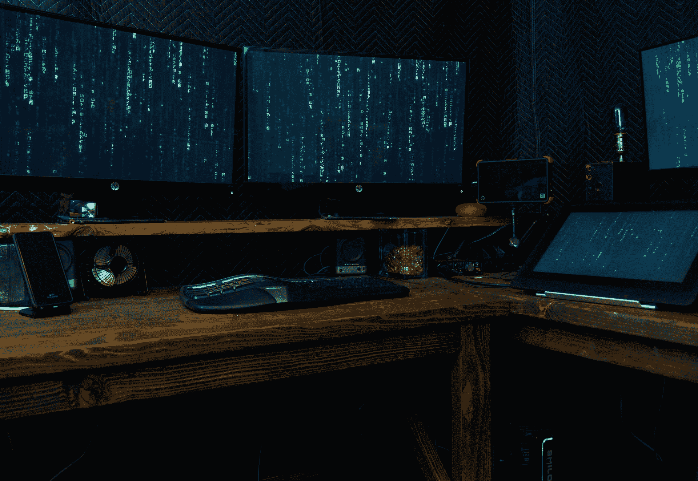
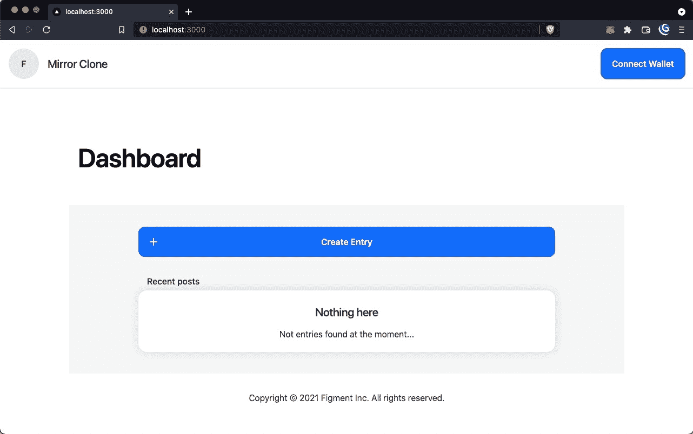

# mirror/00-mirror-intro

> 原文：<https://github.com/figment-networks/learn-tutorials/blob/master/mirror/00-mirror-intro.md>

欢迎来到镜像克隆教程！本教程的目标是在全栈分散应用程序的环境中介绍 Web 3 开发过程。具体来说，我们将通过使用 Web 3 堆栈构建一个类似于 [Mirror](https://mirror.xyz/) 的博客，为你从 Web 2 过渡到 Web 3 搭建桥梁。

Mirror 是一个强大的发布内容的 Web 3 平台。它允许作者以分散的、抵制审查的方式发表文章，同时保留对其内容的完全所有权。它还实现了给作家小费、与合作作家和贡献者分享收益以及众筹项目等功能。

我们将只实现发布条目和创建它们的 NFT 的基本功能，但是您最终会得到一个可以随意扩展的 dApp。在你构建的过程中，我们将引入一些关键概念来帮助你构建你的心智模型，并开始将 Web 3 技能添加到你的工具箱中。

# 先决条件 <g-emoji class="g-emoji" alias="ladder" fallback-src="https://github.githubassets.cimg/icons/emoji/unicode/1fa9c.png">🪜</g-emoji>

如果你知道如何编程并且有 JavaScript 的经验，你将能够完成这个教程。说了这么多，如果你对[打字稿](https://www.typescriptlang.org/)、[反应](https://reactjs.org/)、 [Next.js](https://nextjs.org/) 有点经验的话，你会更舒服。此外，虽然您以前可能没有构建过全栈 Web 3 应用程序，但希望您使用过像 [MetaMask](https://metamask.io/) 这样的加密钱包，并且熟悉基本的区块链概念，如公共地址、私钥和签名事务。

如果这些听起来不熟悉，或者在你学习的这个阶段，这些概念听起来令人生畏，我们建议在完成本教程之前先从 [Solana Wallet](https://learn.figment.io/tutorials/solana-wallet-intro) 教程开始。

选择一个你觉得舒服的代码编辑器取决于你，尽管我们推荐 [Visual Studio Code](https://code.visualstudio.com/) 因为它是免费的，打包了有用的特性，并且有很好的跨平台支持。

一如既往，我们认为自己是你们的向导——在短暂的时间里——在你们建设一个更好的互联网的征途上。我们希望你能更好地理解开发全栈 Web 3 分散式应用程序(dApps)需要什么，甚至更有信心处理重大项目。

我们试着向你展示门(或者门的一部分)。你的工作是发现你的道路并勇敢地走下去。

“我不认为这是一个希望的问题，这只是一个时间问题。”

# 教程结构 <g-emoji class="g-emoji" alias="bricks" fallback-src="https://github.githubassets.cimg/icons/emoji/unicode/1f9f1.png">🧱</g-emoji>

本教程由一系列步骤组成，这些步骤将开发过程分解为栈中每个部分的特定工作块。每一步都讨论了关键概念和心智模型，为您更好地理解我们正在构建的内容和原因创造了必要的背景。把这个当做**热身**。

预热后，我们将提供功能的分步实施，包括完整解决方案的代码片段。虽然热身是为了构建上下文，但这一部分是为了引导你通过**实现**的逻辑，并帮助你为特性搭建心智模型。

最后，我们**要求**您通过提供足够的说明来独立实现该功能。这可以让你锻炼[主动回忆](https://en.wikipedia.org/wiki/Active_recall)，增加你建立联系的能力。

# 博客预览 <g-emoji class="g-emoji" alias="desktop_computer" fallback-src="https://github.githubassets.cimg/icons/emoji/unicode/1f5a5.png">🖥</g-emoji>

当你完成时，你将拥有一个类似于[镜像](https://mirror.xyz/)的博客。用户将能够编写条目，发布它们，为每个条目创建 NFT，并将这些 NFT 传输到其他公共地址。

这些条目将被保存在 [Arweave](https://www.arweave.org/) 上，这是一种用于不可变数据存储的分散存储解决方案，而 NFT 将是 [Polygon](https://polygon.technology/) 上的 [ERC-721](https://eips.ethereum.org/EIPS/eip-721) 令牌，这是一种用于可扩展以太坊 dApps 的协议。

**步骤 1** 将带您完成一些基本的设置和配置。这将包括克隆一个模板 repo，因此您不必编写您已经熟悉的代码(即 NextJS)。它还包括设置一些您在后面的步骤中需要的环境变量。

在**步骤 2** 中，我们将介绍 [ethers.js](https://docs.ethers.io/) 库，并学习如何将用户的 MetaMask 钱包连接到 dApp。

然后我们将在**第三步**中介绍[ar weave](https://www.arweave.org/)——一种分散的、抗审查的存储解决方案。我们将编写一个端点来创建博客条目，并完成一个表单来提交它们。在**步骤 4** 中，我们将学习如何获取它们，在**步骤 5** 中，我们将编写代码来显示最新条目的列表。

**步骤 6** 将简要介绍智能合约，包括从标准库继承、编写函数、测试它们以及将智能合约部署到 Polygon testnet。我们将为每个条目铸造一个 NFT，这样作者就可以拥有他们的条目。

最后，**步骤 7** 将实现允许作者传输 NFT 的功能。这将应用程序扩展到博客条目所有权的市场中。

像这样的 dApp 有无数种扩展方式。您可以本地实现 NFT 市场，或者您可以选择为想要奖励作者的读者实现一个提示按钮。

您甚至可以利用相同的智能合约和 Arweave 数据来重新构建 dApp，并创建一个全新的客户端应用程序。Web 3 如此强大的部分原因是其堆栈的可组合性。当数据花园没有围墙，用户拥有他们的数据时，就有无限的机会去创造和建设。

在本教程的最后，如果您想更深入地了解这些主题或在您的学习之旅中迈出下一步，我们将包括一些额外的资源。

我们开始吧！

所有的大事都是从小处开始的