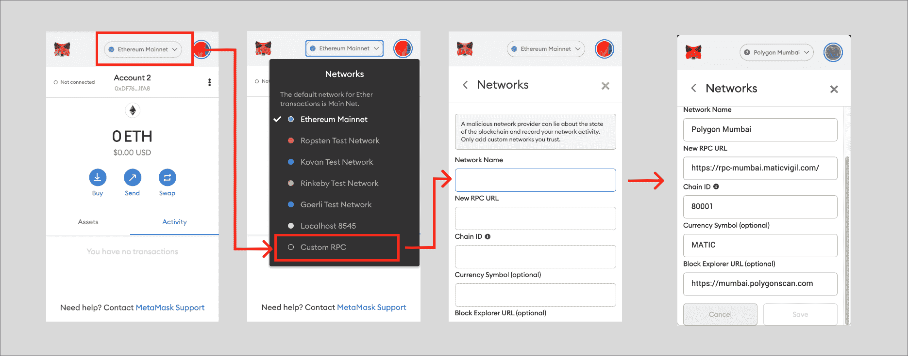

# mirror/01-mirror-setup

> 原文：<https://github.com/figment-networks/learn-tutorials/blob/master/mirror/01-mirror-setup.md>

您将在我们预先构建的 [Next.js](https://nextjs.org/) 模板的基础上构建博客应用程序。这样，你就可以用最少的配置快速开发 Web 3 dApp。

对于这些教程，您需要连接到 Polygon Mumbai testnet，因此将其添加到 MetaMask 中的 RPC 端点列表中。单击 web 浏览器中的狐狸头图标打开弹出窗口，然后按照以下工作流程完成流程:

*   点击当前网络上方的 MetaMask 弹出窗口(默认情况下是表示"以太坊 Mainnet ")
*   向下滚动并单击“自定义 RPC”
*   填写表格:
    *   网络名称:`Polygon Mumbai`
    *   新的 RPC URL: `https://rpc-mumbai.maticvigil.com/`
    *   链 ID: `80001`
    *   货币符号:`MATIC`
    *   阻止浏览器 URL : `https://mumbai.polygonscan.com`
*   仔细检查信息，然后点击**保存**按钮。



我们强烈建议在进入主网络或“mainnet”上的生产之前使用 testnet 进行开发。

# 用 MATIC 向您的帐户存款<g-emoji class="g-emoji" alias="money_mouth_face" fallback-src="https://github.githubassets.cimg/icons/emoji/unicode/1f911.png">🤑</g-emoji>

您将需要一些 MATIC 令牌，以便能够在以下教程之一中为智能合约的部署提供资金！把这想象成长途旅行前在加油站加油。

访问位于[https://水龙头. polygon.technology](https://faucet.polygon.technology) 的 Polygon 水龙头，并将您在 MetaMask 中选择的帐户的地址粘贴到 textinput 中。可以保留选择的**孟买**网络和 **MATIC** 令牌的默认选项。点击**提交**按钮，然后再次点击弹出窗口确认交易。你每次这样做都会得到 0.5 MATIC 的奖励，但是有一个速率限制，所以不要太贪心。半个 MATIC 足以部署多个契约并运行测试事务。

# 开始使用<g-emoji class="g-emoji" alias="clapper" fallback-src="https://github.githubassets.cimg/icons/emoji/unicode/1f3ac.png">🎬</g-emoji>

确保你已经安装了 [git](https://git-scm.com/book/en/v2/Getting-Started-Installing-Git) 、 [Node](https://nodejs.org/en/) 和 [yarn](https://yarnpkg.com/getting-started/install) 。确保已经为 Github 设置了 [SSH 或基于令牌的认证](https://github.blog/2020-12-15-token-authentication-requirements-for-git-operations/)。

使用`git`克隆项目模板代码库，然后切换到项目的根目录。

```js
$ git clone git@github.com:figment-networks/web3-evm-template.git
$ cd web3-evm-template 
```

当您看到代码块中有以`$`开头的行时，这表明这些命令应该在您的终端中运行。美元符号是一个*命令提示符*，不应该包含在命令中。

现在您已经有了模板，您需要导航到包含本教程代码的分支，然后使用 yarn package manager 安装应用程序依赖项:

```js
$ git checkout mirror-clone
$ yarn 
```

如果您遇到任何 Node.js 问题，请确保您运行的是 14.17.0 或更高版本。如果需要本地管理多个节点版本，可以使用[节点版本管理器](https://github.com/nvm-sh/nvm)。

接下来，您需要复制示例环境文件`.env.local.example`来设置使用 Hardhat 部署智能契约所需的环境变量。

```js
$ cp .env.local.example .env.local 
```

现在打开文件`.env.local`，根据下面的说明设置四个环境变量。如果你不熟悉它们，多读读 [dotenv 包和`.env`文件](https://docs.figment.io/network-documentation/extra-guides/dotenv-and-.env)。

```js
POLYGONSCAN_API_KEY=Polygonscan API Key. Go to https://polygonscan.com/login and login or create an account. Then click on API-KEYs on the left navigation panel to create an api key. Name the app MirrorClone. Copy-paste the API key here.
MAINNET_NODE_URL=https://matic-mainnet.chainstacklabs.com
TESTNET_NODE_URL=https://matic-mumbai.chainstacklabs.com
PRIVATE_KEY=The private key of an account funded with MATIC that you've exported from MetaMask. Go to https://metamask.zendesk.com/hc/en-us/articles/360015289632-How-to-Export-an-Account-Private-Key to learn how to export your private key. 
```

如果您还没有将 MetaMask 作为浏览器扩展安装，您应该在继续之前安装。你可以在这里进入它的下载页面[。](https://metamask.io/download.html)

 [MetaMask](https://metamask.io/) 是一个作为浏览器扩展构建的加密钱包，允许您与以太坊和以太坊兼容的区块链以及基于它们构建的 dApps 进行交互。

在步骤 6 中部署智能合约需要使用 **PRIVATE_KEY** 环境变量。尽管`.env.local`文件已经放在了`.gitignore`中，这样你就不会暴露你的私钥，我们仍然建议你创建一个钱包，专门用于教程和本地开发。这样，如果您的钱包中包含任何具有货币价值的 mainnet 令牌，您就可以降低暴露其私钥的风险。

最后，我们希望添加某些库，它们将为我们在步骤 6 中的智能契约开发做好准备，但是如果没有它们，我们将会得到一些编译错误。

```js
$ yarn web3:compile 
```

有了这些，我们的 dApp 模板就可以构建成一个功能性的博客了。您可以运行本地服务器来开始——一旦它启动并运行，就可以通过访问 [http://localhost:3000](http://localhost:3000) 在您的 web 浏览器中查看。

```js
$ yarn dev 
```

# 查看模板 <g-emoji class="g-emoji" alias="monocle_face" fallback-src="https://github.githubassets.cimg/icons/emoji/unicode/1f9d0.png">🧐</g-emoji>

在深入研究代码之前，我们应该了解模板附带了什么。除了大多数 NextJS 应用程序中的标准文件夹结构和依赖关系，我们还添加了两个特定于 Web 3 的库，我们将在整个教程中使用它们- [ethers.js](https://docs.ethers.io/) 和 [Hardhat](https://hardhat.org/) 。

Ethers 是一个 JavaScript 库，用于与以太坊和兼容以太坊的区块链交互。我们将在步骤 2 中首先遇到 ethers，与 MetaMask 接口并连接我们的钱包。

Hardhat 是以太坊和兼容以太坊的区块链的开发环境。它允许你在本地编写和编译 Solidity，运行测试和部署智能契约，同时完全支持 Typescript。我们将在步骤 6 中利用 Hardhat 来管理智能合约的开发，该合约用于创建和传输与博客条目相关的 NFT。

您可以自行探索模板的其余部分。它包括标准的挂钩和组件，我们将使用它们来为我们的博客添加功能。但是现在已经足够了。

我们来建吧！

[](https://raw.githubusercontent.com/figment-networks/learn-tutorials/master/mirror/assets/lego.jpeg)

“我能感受到期待。”