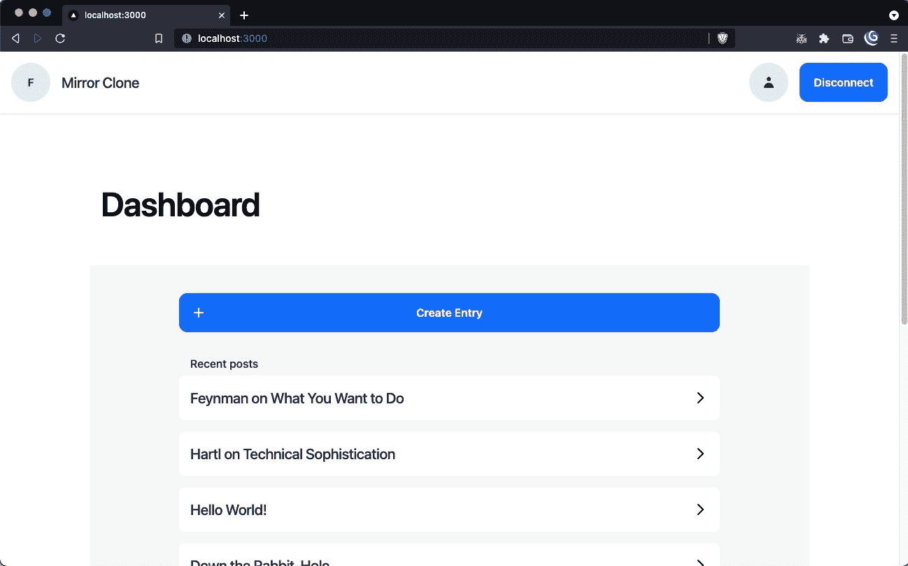

# 实施🧩

> 原文：<https://github.com/figment-networks/learn-tutorials/blob/master/mirror/05-display-entries.md>

如果您已经在 Web 2 上开发了全栈应用程序，您可能对查询构建器的概念很熟悉。这些库通过为数据库交互创建一个语言原生 API 来简化与数据库的交互，该 API 抽象了编写直接 SQL 的复杂性。

我们将在 Web 3 中使用类似的工具。这一步将需要我们利用[ArDB](https://www.npmjs.com/package/ardb)——一种使用 Typescript 与 Arweave 交互的方式，因此我们不需要直接编写 GraphQL。

我们将从打开条目查询端点文件`pages/api/arweave/search/[[query]].ts`开始。在这个文件中，我们启动了一个接收查询并返回条目列表的函数。目标是让客户端接收列表并显示它，这样用户就可以选择一个条目来阅读。

这个端点应该足够灵活，能够处理对应用程序上发布的最新条目以及特定用户发布的最新条目的请求。

首先，我们应该实例化一个 ArDB 实例，这可以通过确认我们已经安装了相关的包并将 ArDB 导入到这个文件中来完成。我们还应该用应用程序名创建一个`tags`变量。

```
const ardb = new ArDB(arweave);
const tags = [{ name: "App-Name", values: [process.env.APP_NAME as string] }];
```

接下来，我们应该从`query`参数中检索作者的地址(如果有的话),并在标签列表中创建另一个标签:

```
const searchAddress = query && query[0];

if (searchAddress) {
  tags.push({ name: "Address", values: [searchAddress] });
}
```

有了我们需要的一切，我们可以利用`ardb`发出一个搜索查询，查找与我们的`tags`匹配的交易。与其他查询构建器类似，我们可以链接方法来增加查询的特异性。在这种情况下，我们希望找到最近的 10 个条目。

```
const txs = await ardb.search("transactions").tags(tags).limit(10).find();
```

现在一切就绪。如果您刷新 dApp，您将看到您在前面的步骤中创建的条目。神奇！

[](https://raw.githubusercontent.com/figment-networks/learn-tutorials/master/mirror/assets/magic.jpeg)

和所有条目...出现！

此时，您可能会创建一个条目来测试功能。你绝对应该这么做！但是，当您点击刚刚创建的条目时，如果您没有获得条目，而是得到一条消息，告诉您它尚未得到确认，请不要惊慌。

回想一下**方框 4.1** 中的内容，分布式系统需要几分钟来达成共识并确认交易。不断进步，在你完成第 6 步之前，你的条目就已经准备好了。

您还会注意到，如果您单击一个条目，在 NFT 框中会出现一条带有错误消息的警告。这是因为我们目前有一个零地址作为默认智能合约地址。我们将在第 6 步中解决这个问题。

##### *清单 5.1:获取条目列表的代码*

```
try {
  const {query} = _req.query;

  const ardb = new ArDB(arweave);

  const searchAddress = query && query[0];

  const tags = [{name: 'App-Name', values: [process.env.APP_NAME as string]}];
  if (searchAddress) {
    tags.push({name: 'Address', values: [searchAddress]});
  }

  const txs = await ardb.search('transactions').tags(tags).limit(10).find();

  const promises = txs.map((tx: any) => getData(tx._id));
  const data = await Promise.all(promises);

  res.status(200).json(data);
}
```

# 挑战<g-emoji class="g-emoji" alias="weight_lifting" fallback-src="https://github.githubassets.cimg/icons/emoji/unicode/1f3cb.png">🏋️</g-emoji>

在代码编辑器中导航到`api/arweave/search/[[query]].ts`,按照注释中包含的步骤完成查询端点的编写。我们提供了一个描述，以及一个链接，链接到您为了实现每一行而需要查看的文档。相关的代码块也包含在下面的清单 5.2 中。

##### *清单 5.2:获取条目列表的指令*

```
try {
  const {query} = _req.query;

  // Initialize ArDB
  // More information about ArDB can be found here: https://www.npmjs.com/package/ardb

  // Retrieve searchAddress

  // Build tags

  // Search for transaction withs App-Name and Address (optional) tags
  // More information can be found here: https://www.npmjs.com/package/ardb

  const promises = txs.map((tx: any) => getData(tx._id));
  const data = await Promise.all(promises);

  res.status(200).json(data);
}
```

代码完成后，您将能够在仪表板上以及您的用户资料下看到帖子列表:

[](https://raw.githubusercontent.com/figment-networks/learn-tutorials/master/mirror/assets/entries.jpg)