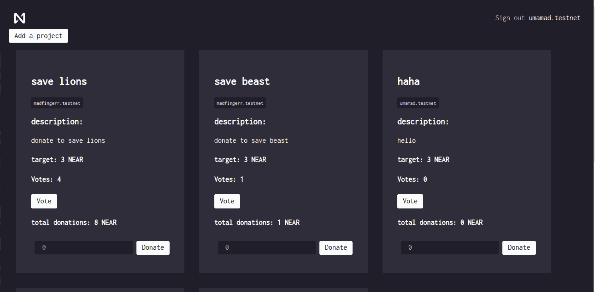
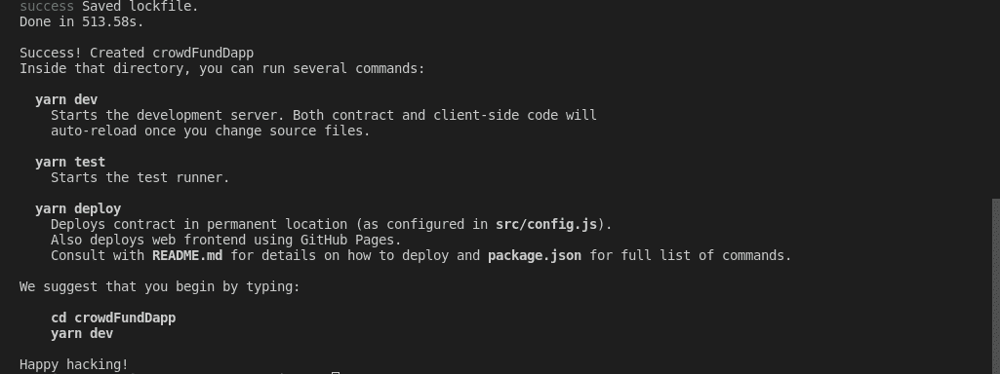
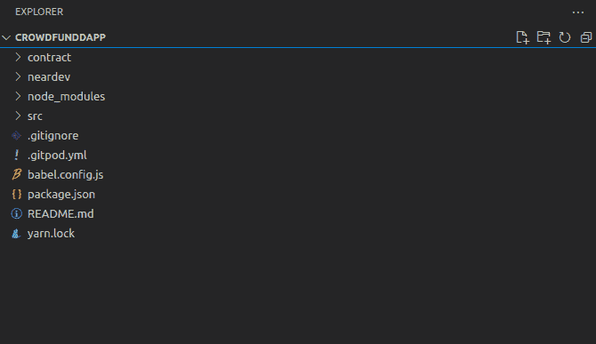
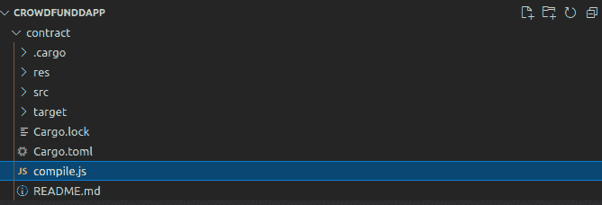
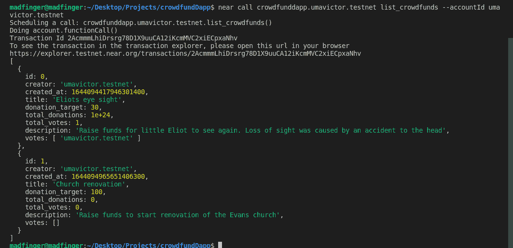

# 介绍

> 原文：<https://github.com/figment-networks/learn-tutorials/blob/master/near/Build_a_Crowdfunding_dApp_on_NEAR.md>

在本教程中，我们将在区块链附近建立一个众筹 dApp。我们的智能合同将使用 Rust 编写，我们的前端将使用 React 编写。

dApp 将具有以下功能:

*   登录的用户可以发布/创建自己的众筹项目
*   查看众筹项目列表
*   用户可以向众筹项目捐款
*   为一个众筹项目投票

在我们实现了智能合约中的所有特性之后，我们将智能合约连接到我们的 react 前端，如下所示

[](https://raw.githubusercontent.com/figment-networks/learn-tutorials/master/assets/projectimg.png?raw=true)

# 先决条件<g-emoji class="g-emoji" alias="clipboard" fallback-src="https://github.githubassets.cimg/icons/emoji/unicode/1f4cb.png">📋</g-emoji>

为了跟随并完成本教程，你将需要[反应](https://reactjs.org/)和[生锈](https://www.youtube.com/watch?v=KDn_j48yoAo&t=581s)的基本知识。

# 要求

*   安装[防锈工具链](https://www.rust-lang.org/tools/install)。
*   [npx 二元](https://www.npmjs.com/package/npx)。
*   安装了 [Git](https://git-scm.com/downloads) 和 Node.js(v14+)
*   [近 cli](https://docs.near.org/docs/tools/near-cli#installation)
*   [一个近帐](https://docs.near.org/docs/develop/basics/create-account#creating-a-testnet-account)

> 正如我在前面的介绍中提到的，这个 dApp 的智能契约是用 Rust 编写的。如果不熟悉 Rust，可以上这个 [30 分钟速成班](https://www.youtube.com/watch?v=KDn_j48yoAo&t=581s)。

> 确保您已经安装了包括 near-cli 在内的所有要求，并且拥有一个 near 帐户

# 概观

我们已经了解了在本教程中需要安装的东西，现在让我们来看看随着教程的进展我们将要做的事情。我们将使用 [npx](https://www.npmjs.com/package/npx) 二进制来搭建我们的项目，其中 [create-near-app](https://github.com/near/create-near-app) 为我们提供了前端和后端使用的选项。搭建项目后，我们将查看文件结构，编写我们的智能合同，部署并测试所有功能是否正常工作，并连接到我们的 React 前端。

# 设置我们的项目

我们通过运行以下命令，用 [create-near-app](https://github.com/near/create-near-app) 设置我们的项目:

```
 npx create-near-app --frontend=react --contract=rust crowdfundDapp
 cd crowdfundDapp
```

使用`--frontend=react`和`--contract=rust`选项，我们创建我们的项目来拥有一个反应前端和一个 rust 契约。在等待安装所有东西的命令一段时间后，我们在我们的终端中看到:

[](https://raw.githubusercontent.com/figment-networks/learn-tutorials/master/assets/createcrowdfund.png?raw=true)

现在一切都已成功安装，万事俱备，让我们看看我们的文件结构是什么样子。

## 文件结构

[](https://raw.githubusercontent.com/figment-networks/learn-tutorials/master/assets/filestructure.png?raw=true)

在我们的文件结构中，我们有一个`contract`文件夹，在这里我们将专门在`src`目录中编写我们的合同。然后是我们的`near-dev`文件夹，其中包含在开发模式下部署我们的合同的配置，还有我们的`src`文件夹，用于我们的前端。仔细查看我们的合同文件夹:

[](https://raw.githubusercontent.com/figment-networks/learn-tutorials/master/assets/contract.png?raw=true)

在合同文件夹中，我们有一个`src`文件夹，我们将在其中创建一个`model.rs`、`lib.rs`和`utils.rs`文件。我们已经有了`lib.rs`文件，所以不需要再创建一个。`cargo.toml`文件包含关于我们合同的信息，包括我们需要的所有依赖项。

# 构建我们的合同

在上一节中，我们已经看到了如何设置我们的项目以及我们的项目是如何构造的。现在让我们开始构建我们的合同。

## 我们的合同如何运作

在构建我们的契约之前，让我们讨论一下我们的契约是如何工作的，以及我们将调用的函数/端点。在我们的合同中，我们希望能够:

1.  创建一个众筹项目——为此，我们需要一个`add_crowdfund`函数，当被调用时，它将创建一个新的众筹项目，并将其添加到我们的众筹项目中。
2.  列出我们所有的众筹项目——为此，我们需要一个函数`list_crowdfunds`来列出我们所有的众筹项目
3.  为一个众筹项目投票——为此，我们需要一个`add_vote`函数来为我们的众筹项目添加投票。
4.  向众筹项目捐赠——为此，我们需要一个`add_donation`函数，向众筹项目捐赠一定数量的 NEAR token

在`src`文件夹中创建一个`model.rs`、`lib.rs`和`utils.rs`文件。在我们的`utils`文件中，我们复制并粘贴以下代码。

> `utils.rs`文件包含了一些有用的函数和类型，我们将在构建契约时使用它们，还有一些注释解释它们的作用。不要害怕，因为你只需要复制并粘贴到你的`utils.rs`文件中

```
 // utils.rs
    use near_sdk::{
        env,
        PromiseResult,
    };
    /// == TYPES ====================================================================
    /// Account Ids in Near are just strings.
    pub type AccountId = String;
    /// Gas is u64
    pub type Gas = u64;
    /// Amounts, Balances, and Money in NEAR are u128.
    pub type Amount = u128;
    pub type Balance = Amount;
    pub type Money = Amount;
    /// Timestamp in NEAR is a number.
    pub type Timestamp = u64;
    ///
    /// == CONSTANTS ================================================================
    ///
    /// TODO: revist MIN_ACCOUNT_BALANCE after some real data is included b/c this
    /// could end up being much higher
    /// ONE_NEAR = unit of NEAR token in yocto Ⓝ (1e24)
    pub const ONE_NEAR: u128 = 1_000_000_000_000_000_000_000_000 as u128;
    /// XCC_GAS = gas for cross-contract calls, ~5 Tgas (teragas = 1e12) per "hop"
    pub const XCC_GAS: Gas = 20_000_000_000_000;
    /// MIN_ACCOUNT_BALANCE = 3 NEAR min to keep account alive via storage staking
    pub const MIN_ACCOUNT_BALANCE: u128 = ONE_NEAR * 3;
    /// == FUNCTIONS ================================================================
    /// Converts Yocto Ⓝ token quantity into NEAR, as a String
    pub fn asNEAR(amount: u128) -> String {
        format!("{}", amount / ONE_NEAR)
    }
    /// Converts a quantity in NEAR into Yocto Ⓝ tokens
    pub fn toYocto<D: Into<u128>>(amount: D) -> u128 {
        ONE_NEAR * amount.into()
    }
    /// Asserts that the contract has called itself
    pub fn assert_self() {
        let caller = env::predecessor_account_id();
        let current = env::current_account_id();
        assert_eq!(caller, current, "Only this contract may call itself");
    }
    /// Asserts that only a single promise was received, and successful
    pub fn assert_single_promise_success(){
        assert_eq!(
            env::promise_results_count(),
            1,
            "Expected exactly one promise result",
        );
        match env::promise_result(0) {
            PromiseResult::Successful(_) => return,
            _ => panic!("Expected PromiseStatus to be successful"),
        };
    }
```

## 创建我们的模型

我们可以在合同中将模型描述为用于定义新类型的自定义数据容器。就像我们拥有原始类型一样，我们可以在模型中创建我们自己的定制类型，来描述我们正在构建的东西，或者按照我们正在构建的东西的模式来构建。我们的`model.rs`文件的代码可以在下面找到，我们将一步一步解释它的作用

```
// model.rs 
    use near_sdk::borsh::{self, BorshDeserialize, BorshSerialize};
    #[allow(unused_imports)]
    use near_sdk::{env, near_bindgen};
    use near_sdk::serde::{Deserialize, Serialize};

    use crate::utils::{
        AccountId,
        Money,
        Timestamp
    };
    #[derive(Clone, Serialize, Deserialize, BorshDeserialize, BorshSerialize)]
    #[serde(crate = "near_sdk::serde")]
    pub struct Crowdfund{
        id: i32,
      pub creator: AccountId,
        created_at: Timestamp,
        title: String,
        donation_target: u128,
        pub total_donations: u128,
       pub total_votes: i64,
        description: String,
       pub votes: Vec<String>
    }

    impl Crowdfund{
        pub fn new(id:i32, title: String, donation_target:u128, description: String) -> Self {

            Crowdfund{
                id,
                creator: env::signer_account_id(),
                created_at: env::block_timestamp(),
                title,
                donation_target,
                total_donations: 0,
                total_votes : 0,
                description,
                votes: vec![],
            }
        }
    }
    #[derive(Clone, Serialize, Deserialize, BorshDeserialize, BorshSerialize)]
    #[serde(crate = "near_sdk::serde")]
    pub struct Donation {
        amount: Money,
        donor: AccountId,
    }
    impl Donation {
        pub fn new() -> Self {        
          Donation{
            amount: env::attached_deposit(),
            donor: env::predecessor_account_id(),
            }
        }  
    }
```

让我们来分析一下上面的代码在做什么:

```
    use near_sdk::borsh::{self, BorshDeserialize, BorshSerialize};
    #[allow(unused_imports)]
    use near_sdk::{env, near_bindgen};
    use near_sdk::serde::{Deserialize, Serialize};
```

上面我们有 rust contract 标准导入，可以看到在`Cargo.toml`文件中使用的依赖关系。与序列化相关的依赖项`BorshDeserialize`和`BorshSerialize`用于捆绑我们的合同代码和存储，以便为区块链附近做好准备。依赖项前的`use`语句仅仅显示了我们在这个文件中使用了哪些依赖项。

> `env`用于登录您的控制台或返回一些有用的信息，如签名者的帐户

```
   // model.rs
    use crate::utils::{
        AccountId,
        Money,
        Timestamp
    };
```

这里，我们只是从我们的`utils.rs`文件中导入一些我们将要使用的自定义类型。在这段代码之后，我们有了对我们的合同至关重要的众筹资金`struct`。

## 众筹结构

rust 中的 A `struct`类似于其他语言中的类。结构在某种程度上保存了契约的状态。在构建我们的契约时，我们的`struct`后面会跟着一个`impl`，在这里我们编写契约的核心逻辑函数。

```
//model.rs
    #[derive(Clone, Serialize, Deserialize, BorshDeserialize, BorshSerialize)]
    #[serde(crate = "near_sdk::serde")]
    pub struct Crowdfund{
        id: i32,
      pub creator: AccountId,
        created_at: Timestamp,
        title: String,
        donation_target: u128,
        pub total_donations: u128,
       pub total_votes: i64,
        description: String,
       pub votes: Vec<String>
    }
```

我们希望能够添加一个新的众筹项目，因此上面的 crowdfund `struct`包含特定众筹项目将拥有的信息字段。我们可以看到每个字段都有一个类型。最后一个字段是一种向量，但是我们可以把它看作一个数组。

> 关键字`pub`意味着我们在它前面加上的任何东西都是公共的，可以在外部使用

```
  //model.rs
    impl Crowdfund{
        pub fn new(id:i32, title: String, donation_target:u128, description: String) -> Self {

            Crowdfund{
                id,
                creator: env::signer_account_id(),
                created_at: env::block_timestamp(),
                title,
                donation_target,
                total_donations: 0,
                total_votes : 0,
                description,
                votes: vec![],
            }
        }
    }
```

上面的代码块是我们初始化`Crowdund`模型的地方。契约是用一些参数初始化的，还包含一些默认数据，比如`creator`字段，它的默认值是签名者帐户的 id。默认情况下，`total_donations`和`total_votes`也被设置为零。契约也用一些参数初始化，我们将在调用函数添加众筹资金时提供这些参数。这些论点是:

*   `id`:每个众筹资金的唯一 ID
*   `title`:我们众筹项目的标题
*   `donation_target`:众筹项目的目标金额。
*   `description`:稍微描述一下我们的众筹项目。

我们在`model.rs`文件中的模型如下:

```
//model.rs
    #[derive(Clone, Serialize, Deserialize, BorshDeserialize, BorshSerialize)]
    #[serde(crate = "near_sdk::serde")]
    pub struct Donation {
        donor: AccountId,
    }
    impl Donation {
        pub fn new() -> Self {        
          Donation{
            donor: env::predecessor_account_id(),
            }
        }  
    }
```

对于我们的捐赠`struct`,我们有一个`donor`字段，我们希望存储在区块链上。然后我们用`donor`初始化捐款`struct`，默认值为`predecessor_account_id()`，表示向众筹活动捐款的人。现在让我们转到我们的`lib.rs`文件，在这里我们调用不同的函数，这些函数将使我们的众筹 dApp 的所有功能成为可能。

# 添加众筹项目

我们已经在 model.rs 文件中创建了我们的模型，现在我们将转移到我们的`lib.rs`文件，在这里我们将编写不同的函数，我们需要调用这些函数来执行 dApp 中的某些操作。在我们进入事情的本质之前，让我们看看我们需要在我们的`lib.rs`文件顶部可用的一些代码。

```
  mod models;
  mod utils;
  use crate::{
      utils::{
          AccountId,
          ONE_NEAR,
          assert_self,
          assert_single_promise_success,
      },
      models::{
          Crowdfund,
          Donation
      }
  };
  // To conserve gas, efficient serialization is achieved through Borsh (http://borsh.io/)
  use near_sdk::{borsh::{self, BorshDeserialize, BorshSerialize}, Promise};
  #[allow(unused_imports)]
  use near_sdk::{env, PromiseIndex, near_bindgen};
  near_sdk::setup_alloc!();   
```

我们在`lib.rs`文件中做的第一件事是导入`utils.rs`和`models.rs`模块，它们也在同一个`src`文件夹中。在那之后，我们用`use`关键字表示我们将在那些模块中特别使用的东西，然后最后引入 rust 标准。现在继续，我们需要创建一个契约结构

```
 #[near_bindgen]
    #[derive(Clone, Default, BorshDeserialize, BorshSerialize)]
    pub struct Contract {
        owner: AccountId,
        crowdfunds: Vec<Crowdfund>,
        donations: Vec<Donation>,
    }
```

> 在我们的契约`struct`之前的`#[near_bindgen]`是为了让我们的契约代码能够容易地编译到 WebAssembly 中，所以它对于附近的区块链是兼容的和可优化的

在我们的契约`struct`中，我们有`owner`字段，然后我们有`crowdfund`和`donation`字段，它们只是它们的模型`Crowdfund`和`Donation`的向量。接下来，我们将有`impl`

```
  #[near_bindgen]
    impl Contract{
        #[init]
        pub fn init(
            owner: AccountId,
        ) -> Self{
            let crowdfunds: Vec<Crowdfund> = Vec::new();
            let donations: Vec<Donation> = Vec::new();

            Contract{
                owner,
                crowdfunds,
                donations
            }
        }
    }
```

在我们的契约`impl`中，`#init`允许我们用一个接受参数`owner`的函数来创建契约的自定义初始化。我们用`Vec::new()`构造了一个新的空向量，并将其分别分配给`crowdfund`和`donations`。

> 在元素被推送到向量上之前，向量不会被分配。

## add_crowdfund 函数

初始化之后，我们开始编写函数。我们的第一个函数是`add_crowdfund`函数。

```
       pub fn add_crowdfund(&mut self, title: String, donate:u128,description: String) {

            let id = self.crowdfunds.len() as i32;

            self.crowdfunds.push(Crowdfund::new(
                id,
                title,
                donate,
                description
            ));
            env::log("Added a new crowdfund".as_bytes());
        }
```

`add_crowdfund`函数接受三个参数，`title`、`donate`和`description`，我们将在函数被调用时传入。我们希望每个众筹项目都有一个唯一的`id`，所以我们为向量中的所有众筹项目的长度创建了一个`id`变量。我们的众筹项目列表中增加了一个新的众筹项目。因此，每次我们调用`add_crowdfund`函数时，我们都会更新区块链状态，一个新的众筹项目会添加到列表中，其中包含我们作为参数提供的信息。最后，我们给区块链日志“增加了一个新的众筹”。

> 注意我们是如何在函数中传递`&mut self`的？。这仅仅意味着我们正在传递一个指向我们的`Contract`的可变引用`self`

# 列出所有众筹项目

我们需要归还所有的众筹项目，所以我们创建了一个函数`list_crowdfunds`。

```
 pub fn list_crowdfunds(&self) -> Vec<Crowdfund> {
            assert_self();
           let crowdfunds = &self.crowdfunds;
           return crowdfunds.to_vec();
        }
```

当我们调用该函数时，我们利用来自我们的`utils.rs`文件的`assert_self`函数，以确保合同调用自身，然后我们将众筹资金作为一个向量返回，该向量显示我们所有众筹项目的数组。

# 投票表决一个项目

假设有一个项目确实需要一些支持，用户可以对该项目进行投票。所以在我们的契约中，我们增加了一个`add_vote`函数。

```
        pub fn add_vote(&mut self, id:usize){
            let crowdfund: &mut Crowdfund = self.crowdfunds.get_mut(id).unwrap();
            let voter = env::predecessor_account_id();
            crowdfund.total_votes = crowdfund.total_votes + 1;
            env::log("vote submitted succesfully".as_bytes());
            crowdfund.votes.push(voter);

        }
```

我们将一个`id`参数传递给`add_vote`函数，以确定我们想要投票的特定项目。然后我们可以通过调用`.get_mut(id)`并传入项目的 id 来访问项目。我们将我们的投票者设置为`predecessor_account_id()`，然后用下面这条线改变我们的状态。

```
    crowdfund.total_votes = crowdfund.total_votes + 1;
```

每当我们调用这个函数时，这个字段就增加 1，然后我们将投票者添加到投票向量中，我们可以看到谁在这个项目上投了票。

# 向一个项目捐款

为了捐赠给一个特定的项目，我们创建一个`add_donation`函数，并传入我们想要捐赠的项目的`id`，以及我们想要捐赠的 NEAR token 的数量。

```
     pub fn add_donation(&mut self, id:usize, amount:u128) {
            let transfer_amount: u128 = ONE_NEAR * amount;
            let crowdfund: &mut Crowdfund = self.crowdfunds.get_mut(id).unwrap();
            crowdfund.total_donations = crowdfund.total_donations + transfer_amount;
            self.donations.push(Donation::new());

           Promise::new(env::predecessor_account_id()).transfer(transfer_amount);
          env::log("You have donated succesfully".as_bytes());
        }
```

这里我们作为参数传递，众筹项目的`id`和我们要捐的`amount`。然后，我们将捐赠的金额添加到当前的`total_donations`余额中，并在每次调用该函数时推送一笔新的捐赠，金额将被转移到众筹项目所有者。

# 获得总众筹资金和捐赠计数

让我们在我们的合同中再添加两个函数，以确定我们拥有的众筹项目总数以及某个特定众筹项目收到的捐款总额。

```
    pub fn crowdfund_count(&mut self) -> usize {
            return self.crowdfunds.len();
        }

        pub fn get_total_donations(&mut self, id:usize) -> u128 {
            let crowdfund: &mut Crowdfund = self.crowdfunds.get_mut(id).unwrap();
            return crowdfund.total_donations;
        }
```

我们创建了两个函数`crowdfund_count`来返回我们的众筹向量的长度，以及`get_total_donations`来返回一个特定的众筹项目收到的捐款总额。

现在我们已经完成了这个契约的所有功能，是时候部署和调用我们契约中的功能了，以确保一切都正常工作，这也是我们将在下一节中要做的事情

# 部署智能合同<g-emoji class="g-emoji" alias="rocket" fallback-src="https://github.githubassets.cimg/icons/emoji/unicode/1f680.png">🚀</g-emoji>

在我们部署智能合约之前，让我们首先使用`near-cli`登录我们创建的 NEAR 帐户。

**用`near-cli`登录**

确保您已经安装了`near-cli`，您可以从先决条件中的链接看到安装步骤。然后运行以下命令:

```
   near login
```

登录到我们创建的帐户后，我们在终端中看到一条成功的消息。

## 部署合同

为了部署我们的众筹合同，我们需要为它创建一个帐户。因为我们已经创建了一个 testnet 帐户，在我的例子`umavictor.testnet`中，我们可以在`umavictor.testnet`下创建一个子帐户来部署契约。

```
  near create-account crowdfunddapp.umavictor.testnet --masterAccount umavictor.testnet
```

[](https://raw.githubusercontent.com/figment-networks/learn-tutorials/master/assets/createsubaccount.png?raw=true)

> 在您的情况下，`umavictor`将被您自己创建的 NEAR testnet 帐户名替换

创建子账户后，导航至`src/config.js`并修改设置合同账户名称的行。将其设置为您在上面创建的子帐户`id`。

```
  const CONTRACT_NAME = process.env.CONTRACT_NAME || 'crowdfunddapp.umavictor.testnet'
```

我们终于可以部署我们的合同了。因为我们使用了 [create-near-app](https://github.com/near/create-near-app) ，所以部署我们的契约很容易，并且可以通过命令来完成

```
near deploy 
```

[](https://raw.githubusercontent.com/figment-networks/learn-tutorials/master/assets/crowdfunddeploy.png?raw=true)

我们可以看到，在运行命令之后，我们的契约部署成功了。耶！。

> 如果您对合同进行了更改，您可以使用命令`near delete crowdfunddapp.umavictor.testnet umavictor.testnet`删除子账户，然后重新创建。

# 通过调用契约方法与我们的契约进行交互

现在，我们可以与我们的合同进行交互，并确保我们的所有功能都在做它们应该做的事情。让我们测试一下每个功能！。

## 添加众筹项目

用`near-cli`呼叫`add_crowdfund`:

```
    near call crowdfunddapp.umavictor.testnet add_crowdfund '{"title": "Eliots eye sight", "donate": 30, "description":"Raise funds for little Eliot to see again. Loss of sight was caused by an accident to the head"}' --accountId umavictor.testnet
```

上面的命令所做的是调用部署在`crowdfunddapp.umavictor.testnet`的契约。契约上有一个名为`add_crowdfund`的方法，提供了三个参数，并由`umavictor.testnet`签名。在您的终端中，您将看到如下输出:

[](https://raw.githubusercontent.com/figment-networks/learn-tutorials/master/assets/addcrowdfund.png?raw=true)

## 为一个众筹项目投票

用`near-cli`呼叫`add_vote`:

```
   near call crowdfunddapp.umavictor.testnet add_vote '{"id":0}' --accountId umavictor.testnet
```

该命令将第一个众筹项目的投票数增加 1。

[](https://raw.githubusercontent.com/figment-networks/learn-tutorials/master/assets/addvote.png?raw=true)

# 向众筹项目捐款

用`near-cli`调用`add_donate`方法

```
 near call crowdfunddapp.umavictor.testnet add_donation '{"id":0, "amount":1}' --accountId umavictor.testnet
```

这个命令调用`add_donation`方法，1 NEAR 被发送到 crowdfund 项目。

# 列出所有众筹项目

调用`list_crowdfunds`方法。

```
 near call crowdfunddapp.umavictor.testnet list_crowdfunds --accountId umavictor.testnet
```

这个命令列出了所有到终端的众筹项目。

[](https://raw.githubusercontent.com/figment-networks/learn-tutorials/master/assets/listcrowdfunds.png?raw=true)

你可以从图片和我们设置的所有信息中看到这两个众筹项目。我们已经调用了这些方法来查看它们是如何工作的，现在让我们构建 react 前端

# 构建我们的前端

我们终于完成了智能合约的构建。为了连接和构建我们的 React 前端，我们将在`src`文件夹上工作。这不是一个 React 教程，所以我们将只触及重要的事情。首先，导航到`utils.js`并更新您的变更和查看方法

```
//utils.js
  window.contract = await new Contract(window.walletConnection.account(), nearConfig.contractName, {
        // View methods are read only. They don't modify the state, but usually return some value.
        viewMethods: ['get_donation_count',"crowdfund_count"],
        // Change methods can modify the state. But you don't receive the returned value when called.
        changeMethods: ['add_crowdfund', 'add_vote','add_donation',"list_crowdfunds"],
      })
    }
```

看看我们的`App.js`中的代码:

```
   // App.js
    import 'regenerator-runtime/runtime'
    import { useEffect, useState } from 'react'
    import ListCrowdfunds from './components/ListCrowdfunds'
    import CreateCrowdfund from './components/CreateCrowdfunds'
    import React from 'react'
    import { login, logout } from './utils'
    import './global.css'
    import getConfig from './config'
    const { networkId } = getConfig(process.env.NODE_ENV || 'development')

    export default function App() {
      const [crowdfunds, setCrowdfunds] = useState([])
      const [toggleModal, setToggleModal] = useState(false)
      function addProject() {
        setToggleModal(!toggleModal)
      }

      useEffect(
        () => {
          // in this case, we only care to query the contract when signed in
          if (window.walletConnection.isSignedIn()) {
            // window.contract is set by initContract in index.js
            window.contract.list_crowdfunds().then((crowdfundprojects) => {
              const crowdfundList = [...crowdfundprojects]
              setCrowdfunds(crowdfundList)
            })
          }
        },
        [],
      )

      // if not signed in, return early with sign-in prompt
      if (!window.walletConnection.isSignedIn()) {
        return (
          <main>
            <h1>Welcome to Paradis</h1>
            <p style={{ textAlign: 'center' }}>
              Click the button below to sign in:
            </p>
            <p style={{ textAlign: 'center', marginTop: '2.5em' }}>
              <button onClick={login}>Sign in</button>
            </p>
          </main>
        )
      }
      return (
        // use React Fragment, <>, to avoid wrapping elements in unnecessary divs
        <>
          <header>
            <div className="logo"></div>
            <button className="link" style={{ float: 'right' }} onClick={logout}>
              Sign out <span className="id">{window.accountId}</span>
            </button>
          </header>
          <button onClick={addProject}>Add a project</button>
          <main>
            <CreateCrowdfund toggleModal={toggleModal} />
            <section>
              {crowdfunds.map((project, id) => {
                return (
                  <div key={id}>
                    <ListCrowdfunds project={project} />
                  </div>
                )
              })}
            </section>
          </main>
        </>
      )
    }
```

在上面的`App.js`文件中，我们导入了将要使用的配置、实用程序和组件。我们创建了我们的`crowdfunds`状态，这是一个包含我们所有众筹项目的对象数组。在`useEffect`钩子中，我们从已经由`index.js`文件中的`initContract`设置的`window.contract`中调用`list_crowdfund`方法。然后，我们使用 React 的`setState`设置众筹状态。

接下来，我们检查用户是否登录，如果没有用户登录，我们会提示他们登录。

[](https://raw.githubusercontent.com/figment-networks/learn-tutorials/master/assets/welcome.png?raw=true)

登录后，我们将看到可供捐赠的项目。

## 上市众筹成分

对于我们的`App.js`组件，我们遍历了所有的众筹项目，并将 object prop 传递给我们的`ListCrowdfunds`组件。这就是我们的`ListCrowdfunds`组件的样子。

```
  // components/ListCrowdfunds.js
    import React, { useState } from 'react'
    const ONE_NEAR = 1_000_000_000_000_000_000_000_000
    function ListCrowdfunds({ project }) {
      const [donationAmount, setDonationAmount] = useState(0)
      const [showDonateNotification, setShowDonateNotification] = useState(false)
      function donate(e) {
        e.preventDefault()
        console.log(donationAmount)
        window.contract.add_donation({ id: project.id, amount: donationAmount * 1 })
        setShowDonateNotification(!showDonateNotification)
      }
      return (
        <div className="project">
          <h2>{project.title}</h2>{' '}
          <span className="creator">{project.creator}</span>
          <h3>description:</h3>
          <p>{project.description}</p>
          <h4>target: {project.donation_target} NEAR</h4>
          <h4>Votes: {project.total_votes}</h4>
          <button
            onClick={() => {
              window.contract.add_vote({ id: project.id })
            }}
          >
            Vote
          </button>
          <h4>total donations: {project.total_donations / ONE_NEAR} NEAR</h4>
          <form onSubmit={donate}>
            <input
              type="number"
              value={donationAmount}
              onChange={(e) => setDonationAmount(e.target.value)}
            ></input>
            <button onClick={donate}>Donate</button>
          </form>
          {showDonateNotification && <DonateNotification />}
        </div>
      )
    }
    function DonateNotification() {
      return (
        <aside>
          <footer>
            <div>✔ Succeeded </div>
            <div>Donation was successful</div>
          </footer>
        </aside>
      )
    }
    export default ListCrowdfunds
```

在`ListCrowdfunds`组件中，我们设置捐赠金额状态，当我们想要捐赠时，通过点击`Donate`按钮，调用`donate`函数，该函数使用我们从表单中提供的参数调用我们的契约中的`add_donation`方法。我们还有一个通知组件，当我们的捐赠成功时，它会通知用户。

## 创建众筹组件

我们的`CreateCrowdfund`组件是一个包含表单的模态，用于添加一个新的众筹项目。

```
   import React, { useState } from 'react'
    function CreateCrowdfund({toggleModal}) {
      const [title, setTitle] = useState('')
      const [description, setDescription] = useState('')
      const [target, setTarget] = useState(0)
      const [showNotification, setShowNotification] = useState(false)
      const handleSubmit = (event) => {
        event.preventDefault()
        window.contract.add_crowdfund({title:title, donate:target * 1, description:description})
        setShowNotification(!showNotification)
        alert(`crowdfund info: ${title} ${target} ${description}`)
      }
    console.log(`its ${toggleModal}`);
      return (
        <div>
          {toggleModal == true && (
            <div className='addcrowdfund'>
              <form onSubmit={handleSubmit}>
                <label>
                  Enter project title:
                  <input
                    type="text"
                    value={title}
                    onChange={(e) => setTitle(e.target.value)}
                  />
                </label>
                <label>
                  Enter donation target:
                  <input
                    type="number"
                    value={target}
                    onChange={(e) => setTarget(e.target.value)}
                  />
                </label>
                <label>
                  Enter project description:
                  <input
                    type="text"
                    value={description}
                    onChange={(e) => setDescription(e.target.value)}
                  />
                </label>
                <input type="submit" className='submit' />
              </form>
            </div>
          )}

          {showNotification && <Notification />}
        </div>

      )
    }
    function Notification() {
      return (
        <aside>
          <footer>
            <div>✔ Succeeded </div> 
            <div>Added new project Just now</div>
          </footer>
        </aside>
      )
    }
    export default CreateCrowdfund
```

当`toggleModal`状态为`true`时，该组件有条件地呈现。我们为众筹`title`、`description`和`target donation amount`设置了一个状态，每次我们的输入改变时，我们将状态设置为输入值。在提交表单时，`handleSubmit`函数运行，从`window.contract`调用我们的`add_crowdfund`方法，参数来自输入值。

您可以查看最终 dApp 的这个[视频](https://www.loom.com/share/f65f0c04298e434f88e0696d9bf3ad6b)演示。

耶！。我们已经结束了教程，你可以在这里找到源代码。

# 结论

终于！，本教程到此结束。我们学习了如何在区块链附近建立一个众筹 dApp，后端使用 Rust，前端使用 React，测试我们的方法，并在现场部署我们的智能合同。

# 接下来呢？

您可以摆弄代码，并添加一些更多的功能，如添加分页，以便用户可以在页面之间来回切换。你还可以添加一个排序功能，这样用户就可以对投票最高的众筹项目进行排序。

# 关于作者

这个教程是由软件开发者和 web3 爱好者 Uma Victor 创建的。

# 参考

*   靠近[文档](https://docs.near.org/docs/develop/basics/getting-started)。