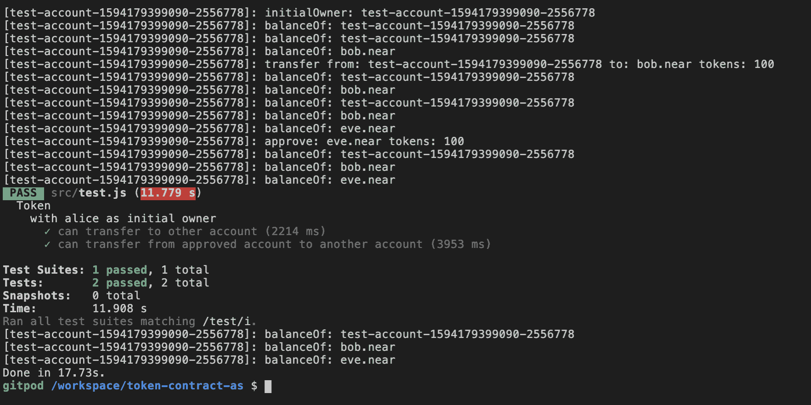
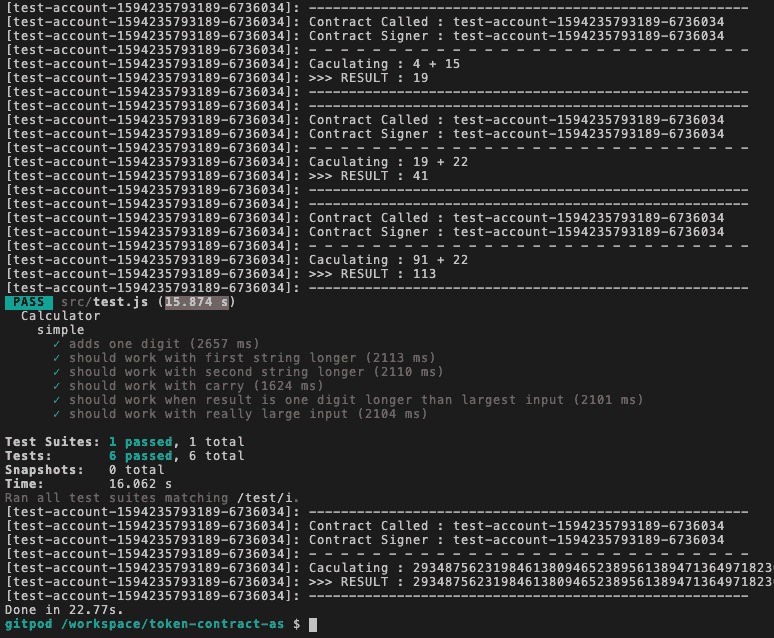

# 介绍

> 原文:[https://github . com/fig ment-networks/learn-tutorials/blob/master/near/cross-contract-calls . MD](https://github.com/figment-networks/learn-tutorials/blob/master/near/cross-contract-calls.md)

[原教程可以在官方 NEAR 文档这里找到](https://docs.near.org/docs/tutorials/contracts/cross-contract-calls)。

在某些时候，您可能希望调用现有契约上的函数。这被称为*交叉合约调用*。这样做有很多原因:

*   您希望利用他人编写并发布的代码库
*   您希望您的应用程序与其他具有可转移状态的合同集成在一起(例如，具有可转移库存的游戏)
*   您希望构建一个以某种方式与现有契约交互的机器人

跨契约调用实际上类似于在 web 2.0 环境中调用外部 API。

在本教程中，我们将构建一个非常简单的示例来帮助您启动和运行跨合同呼叫。

# 描述

我们将创建两个简单的契约:

*   这个合同将有我们想要写给任何人调用的计算
*   这个合同(毫无疑问)将调用其他合同中可用的计算

对于这个例子，我们将只实现`add`功能，但是我们已经有一个问题了！超级邪恶超级公司的会计部门把所有这些数字都作为字符串发送。更糟糕的是，我们不知道这些弦会有多长。为什么这是一个问题:JavaScript 能处理的最大整数是 [9007199254740991](https://developer.mozilla.org/en-US/docs/Web/JavaScript/Reference/Global_Objects/Number/MAX_SAFE_INTEGER) 。为了帮助每个想把长数字加在一起的人，我们将部署一个契约，人们可以把它集成到自己的计算器中。

# 步骤 1 -在 Gitpod 中创建新的令牌合同项目

在新的浏览器标签或窗口中:

*   在 [Gitpod](https://gitpod.io/#https://github.com/near-examples/token-contract-as) 中打开一个新的令牌合同项目

当它在 GitPod 中打开时，代码将为这个项目生成一个唯一的 NEAR 帐户，然后构建并部署模板文件。您可以通过单击“Open Browser”来查看令牌示例的运行情况，从而了解我们的开始。

这个示例项目有一个令牌智能契约，还有一些调用智能契约函数的 JavaScript 测试。您可以尝试立即运行这些测试来查看代码与区块链的交互。

在 Gitpod 中:

*   点击**终端** > > **新建终端**

在 Gitpod 底部打开的新标签页中

*   在命令提示符下键入`yarn jest`

一旦完成，终端中运行的测试将如下所示:

[](https://camo.githubusercontent.com/7f0df064e6503573cf8b14e0f781e796a51fd247546abe4a5b75bd40eb4d3e10/68747470733a2f2f646f63732e6e6561722e6f72672f646f63732f6173736574732f64656661756c742d746f6b656e2d636f6e74726163742d746573742e706e67)

请注意，这里的`test-account-XXXXXXXXX_tTIMESTAMP-XXXXXXX`是为这个特定项目自动生成的 NEAR 帐户。不要被这些细节分散注意力，只需将开发人员日志输出与文件`src/test.js`中的语句进行比较。

> 我们不会保留这个模板中的任何代码。它只是一个起点。

# 步骤 2 -撰写计算器合同

对于这个例子，我们只对编写一个函数感兴趣。一个函数接受两个字符串`a`和`b`，并将它们相加的结果作为一个字符串返回。

在文件`assembly/main.ts`中:

*   将文件的**全部内容替换为下面的代码*(注意:这段代码实现了两个大数的相加，就像我们在纸上做的一样)***

```
import { context, storage, logging } from "near-sdk-as";

export function addLongNumbers(a: string, b: string): string {
  // sends logs to the terminal of the contract placing call and the Near Explorer
  logging.log("-------------------------------------------------------")
  logging.log('Contract Called : ' + context.contractName)
  logging.log('Contract Signer : ' + context.predecessor)
  logging.log("- - - - - - - - - - - - - - - - - - - - - - - - - - - -")
  logging.log("Caculating : " + a + " + " + b)
  // Similar to long addition by hand, we start with the least significant digits first
  const aReversed = a.split("").reverse();
  const bReversed = b.split("").reverse();

  // We initialize our resultant variable to be one more than the largest number's length
  const maxLength = max(a.length, b.length);
  let resultArray = new Array<String | null>(maxLength + 1);
  let result = "";
  let carry = 0;

  // Loop through each digit adding the value to the other number, if it exists
  for (let i = 0; i < maxLength; ++i) {
    let aDigit = (i < a.length) ? U32.parseInt(aReversed[i]) : 0;
    let bDigit = (i < b.length) ? U32.parseInt(bReversed[i]) : 0;
    let digitSum = aDigit + bDigit + carry;

    // Keep track of the carry amount
    if (digitSum >= 10) {
      carry = 1;
      digitSum -= 10;
    } else {
      carry = 0;
    }

    resultArray[i] = digitSum.toString();
  }

  // If the final addition has a carry, add it to the extra slot we initialized for it
  if (carry > 0) {
    resultArray[maxLength] = carry.toString();
  }

  // Reverse again and combine the values for the final result
  let reversedResultArray = resultArray.reverse();

  // More terminal / Near Explorer logs
  logging.log(">>> RESULT : " + reversedResultArray.join(""))
  logging.log("-------------------------------------------------------")
  return reversedResultArray.join("");
}
```

既然我们已经修改了程序集文件夹中的文件，我们将需要重新部署该协定。

在您的终端窗口中:

*   选择左侧运行本地主机服务器的第一个终端选项卡
*   按住`CTRL + C`停止服务器并显示命令提示符
*   键入`yarn dev`以重建和重新部署您修改的合同

我们的`Calculator`暂时就到这里。

# 步骤 3 -为合同编写一些测试

一写完代码就测试它是一个好习惯，所以这正是我们要做的。

在文件`src/test.js`中:

*   用下面的代码替换文件中的所有内容

完成后:

*   点击**文件** > > **全部保存**保存您的修改

```
describe("Calculator", function() {
  let near;
  let contract;
  let alice;
  let bob = "bob.near";
  let eve = "eve.near";
  jasmine.DEFAULT_TIMEOUT_INTERVAL = 10000;

  // Common setup below
  beforeAll(async function () {
    near = await nearAPI.connect(nearConfig);
    accountId = nearConfig.contractName;
    contract = await near.loadContract(accountId, {
      // View methods are read only. They don't modify the state, but usually return some value.
      viewMethods: [],
      // Change methods can modify the state. But you don't receive the returned value when called.
      changeMethods: ["addLongNumbers"],
      sender: nearConfig.contractName
    });
    window.near = near;
  });

  // Multiple tests can be described below. Search Jasmine JS for documentation.
  describe("simple", function() {
    beforeAll(async function() {
    // There can be some common setup for each test.
    });

    it("adds one digit", async function() {
      const params = {
        a: "1",
        b: "3"
      };
      const result = await contract.addLongNumbers(params);
      expect(result).toBe("4");
    });

    it("should work with first string longer", async function() {
      const params = {
        a: "10",
        b: "3"
      };
      const result = await contract.addLongNumbers(params);
      expect(result).toBe("13");
    });

    it("should work with second string longer", async function() {
      const params = {
        a: "4",
        b: "15"
      };
      const result = await contract.addLongNumbers(params);
      expect(result).toBe("19");
    });

    it("should work with carry", async function() {
      const params = {
        a: "19",
        b: "22"
      };
      const result = await contract.addLongNumbers(params);
      expect(result).toBe("41");
    });

    it("should work when result is one digit longer than largest input", async function() {
      const params = {
        a: "91",
        b: "22"
      };
      const result = await contract.addLongNumbers(params);
      expect(result).toBe("113");
    });

    it("should work with really large input", async function() {
      const params = {
        a: "29348756231984613809465238956138947136497182364018246710289467102946710289467198046",
        b: "1"
      };
      const result = await contract.addLongNumbers(params);
      expect(result).toBe("29348756231984613809465238956138947136497182364018246710289467102946710289467198047");
    });
  });
});
```

现在让我们运行您的新测试！

*   在命令提示符下键入`yarn jest`

完成后，终端中完成的测试将如下所示:

[](https://camo.githubusercontent.com/a8edbb036ae92de194f784e5f883ca8e4f4cc53402f047ac834c6cbe29a860ff/68747470733a2f2f646f63732e6e6561722e6f72672f646f63732f6173736574732f6a6573742d74657374732d666f722d63616c63756c61746f722d636f6e74726163742e706e67)

> 请记住，日志中的“合同签订人”和“合同签署人”是相同的。这一点以后会很重要。

通常，我们会在这一点上创建一个 UI，但是因为我们是从别处调用的，所以让我们继续第二个契约。

# 步骤 4 -为计算器呼叫者创建新合同

让您正在处理的选项卡保持打开，您稍后将需要刚刚创建的合同的 ID。

ID 的其余部分是前缀“dev-”，类似于`dev-159372XXXX-XXXXXXX`。事实上，合同的 ID 只是 Gitpod 自动为合同创建的 NEAR 帐户。

你可以在这里阅读更多关于近平台[账号的内容。](https://docs.near.org/docs/concepts/account)

所以让我们再做一个聪明的契约。在*新*标签或窗口中遵循与之前相同的步骤...

*   在 [Gitpod](https://gitpod.io/#https://github.com/near-examples/token-contract-as) 中打开另一个新的令牌合同项目
*   您应该会在窗口顶部看到一个**创建新工作区**框
*   点击右上角的**创建**

[](https://camo.githubusercontent.com/9235c3916eacbc843b77d79698acb16b05c6ff10106bae15d68f758aada6d200/68747470733a2f2f646f63732e6e6561722e6f72672f646f63732f6173736574732f676974706f642d6372656174652d66726573682d776f726b73706163652e706e67)

我们这样做是因为我们需要创建一个部署在不同地址的完全独立的契约，以展示跨契约调用的能力。

# 步骤 5 -编写计算器调用者代码

我们希望实现这样的代码，它实际上将数字传递给我们正在调用的契约。在这里，我们将通过创建一个单独的`callAddNumbers`函数并添加管道来实现这个函数。

要实现这一点，我们需要几样东西:

*   为了从一个契约向另一个契约发送两条数据(我们想要添加的两个数字)，我们将创建一个新的*模型*供我们的契约使用。将会是一个我们用来编码我们要发送的参数的类。
*   跨契约调用总是异步的，因此，为了从另一个契约获取返回值，我们将利用来自`near-sdk-as`的本机`ContractPromise`类。
*   到`CalculatorAPI`，我们将创建一个类，它将通过一个`add`方法发送我们想要添加到另一个契约中的数字
*   `callAddNumbers`，这个函数将调用我们创建的`CalculatorAPI`方法来添加数字

让我们首先从创建模型开始。

创建一个新文件`assembly/model.ts`:

*   点击浏览器左侧的`assembly`文件夹
*   然后点击**文件**>T5**新建文件**
*   输入`model.ts`然后点击**确定**
*   将下面的代码复制/粘贴到这个新文件中
*   点击**文件**>T5**保存**

```
@nearBindgen
export class AddArgs {
  a: string;
  b: string;
}
```

这将允许我们将参数编码为单个值在契约之间发送。

接下来，我们将创建 API，我们可以用它来调用我们之前部署的契约。

在文件`assembly/main.ts`中，用以下代码替换文件的全部内容:

```
import { context, storage, logging, ContractPromise } from "near-sdk-as";
import { AddArgs } from "./model";
```

注意，我们使用语法`"./model"`从刚刚创建的模型中导入`AddArgs`，并且从`near-sdk-as`中导入`ContractPromise`。

这里，我们创建了一个方法`add`，它接受我们想要添加的字符串并返回一个`ContractPromise`。

我们还使用我们创建的`AddArgs`模型来打包我们想要发送给另一个合同的字符串。当我们调用`args.encode()`时，它很像类似于`JSON.stringify(args)`的东西，允许我们发送这些数据。

*为了创造这个`ContractPromise`，我们需要知道:*

*   我们之前创建的合同的 ID。你需要把这个换成你自己的。
*   无论我们试图在`Calculator`契约上调用什么函数。

> 在文件`assembly/main.ts`中，将以下代码添加到文件中:

```
const OTHER_CONTRACT = "dev-REPLACE_THIS_IDENTIFIER";

export class CalculatorApi {
  add(a: string, b: string): ContractPromise {
    let args: AddArgs = { a, b };
    let promise = ContractPromise.create(OTHER_CONTRACT, "addLongNumbers", args.encode(), 100000000000000);
    logging.log("OTHER_CONTRACT: " + "(" + OTHER_CONTRACT + ")")
    return promise;
  }
}
```

*(有关使用`ContractPromise`进行跨合同调用的更多信息，请查看*[*contract promise*](https://near.github.io/near-sdk-as/classes/_sdk_core_assembly_contract_.contractpromise.html)*和*[*contract promise result*](https://near.github.io/near-sdk-as/classes/_sdk_core_assembly_contract_.contractpromiseresult.html)

提醒一下，使用之前的合同(您之前打开的选项卡)，找到合同的 ID。你将用这个来代替`dev-REPLACE_THIS_IDENTIFIER`。

您可以在`neardev/dev-account.env`中找到您的合同 ID。此外，您将在运行服务器的第一个终端窗口中看到您的合同 ID。在底部会有一行写着:“完成部署到 dev-1594333XXXXXX-XXXXXXX”。

接下来，我们将使用我们刚刚创建的`CalculatorApi`。

在文件`assembly/main.ts`中，将以下代码添加到文件中:

```
export function calculate(a: string , b: string): void {
  let calculator = new CalculatorApi();
  let promise = calculator.add(a, b);
  promise.returnAsResult();
}
```

您可能会注意到这个函数返回`void`，这有点令人困惑，因为契约返回的是一个承诺。这是因为它在别处调用了一个函数，编译器认为它是无效的。

(在未来的版本中，这种情况会有所改变。)

现在保存您的更改并重新部署合同

*   点击**文件**>T5**保存**

然后导航到您的终端窗口

*   选择左侧运行本地主机服务器的第一个终端选项卡
*   按住`CTRL + C`停止服务器并显示命令提示符
*   键入`yarn dev`以重建和重新部署您修改的合同

# 第 6 步-更多的测试！

让我们确保事情按预期进行。

在文件`src/test.js`中:

*   用下面的代码替换文件的全部内容

```
const getConfig = require('./config');
let nearConfig = getConfig("development");
require('dotenv').config({ path: '/workspace/token-contract-as/neardev/dev-account.env' })

describe("CalculatorAPI", function() {
  let near;
  let contract;
  jasmine.DEFAULT_TIMEOUT_INTERVAL = 10000;

  // Common setup below
  beforeAll(async function () {
    near = await nearAPI.connect({
    deps: {
     keyStore: new nearAPI.keyStores.UnencryptedFileSystemKeyStore('../../../home/gitpod/.near-credentials')
    },
    ...nearConfig
  })
    accountId = process.env.CONTRACT_NAME;
    contract = await near.loadContract(accountId, {
    // NOTE: This configuration only needed while NEAR is still in development
    // View methods are read only. They don't modify the state, but usually return some value.
    viewMethods: [],
    // Change methods can modify the state. But you don't receive the returned value when called.
    changeMethods: ["calculate", "addLongNumbers"],
    sender: process.env.CONTRACT_NAME
    });
  });

  // Multiple tests can be described below. Search Jasmine JS for documentation.
  describe("simple", function() {
    beforeAll(async function() {
    // There can be some common setup for each test.
    });

    it("add one digit", async function() {
      const params = {
        a: "1",
        b: "99"
      };

      const result = await contract.calculate(params);
      expect(result).toBe("100");
    });
  });
});
```

完成后:

*   点击**文件** > > **全部保存**保存您的修改

现在让我们来测试一下！

在 Gitpod 中:

*   点击**终端** > > **新建终端**

在 Gitpod 底部打开的新选项卡中，在命令提示符下键入`yarn jest`。

您应该会看到一个类似这样的成功测试:

[](https://camo.githubusercontent.com/ebf9e9252c6ad178589dfaf64c51fbda3dfa4431202404a1d2577a984e720ee5/68747470733a2f2f646f63732e6e6561722e6f72672f646f63732f6173736574732f63726f73732d636f6e74726163742d63616c6c2d6a6573742d746573742e706e67)

还记得我们注意到在测试环境中“被调用的合同”和“合同签署者”是相同的吗？请注意，它们现在不同了！你能理解这意味着什么吗？

# 结论

我们完事了。

您还可以使用浏览器附近的[查看您的账户和交易的详细信息。](https://explorer.testnet.near.org/)

这是一个简单的契约调用另一个契约的例子，但是这带来了很多机会。现在，看看你能否通过查看我们的[其他教程](https://docs.near.org/docs/roles/developer/tutorials/introduction)和修改`src/main.js`和`src/index.html`来弄清楚如何构建前端。

你已经准备好跨越你想要的那么多合同了！编码快乐！<g-emoji class="g-emoji" alias="rocket" fallback-src="https://github.githubassets.cimg/icons/emoji/unicode/1f680.png">🚀</g-emoji>

如果您在学习本教程时有任何困难，或者只是想与我们讨论 NEAR tech，您可以今天就 [**加入我们的社区**](https://figment.io/devchat) ！