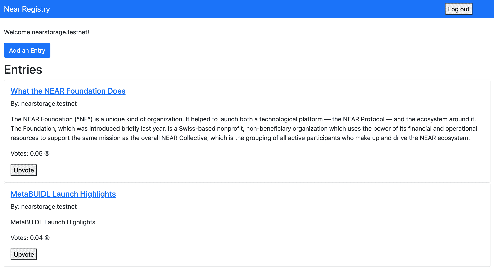
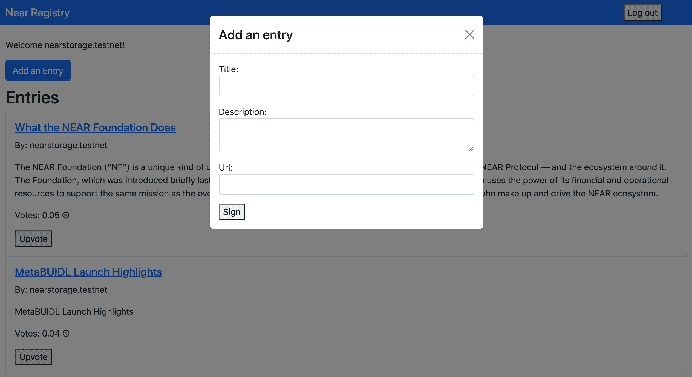
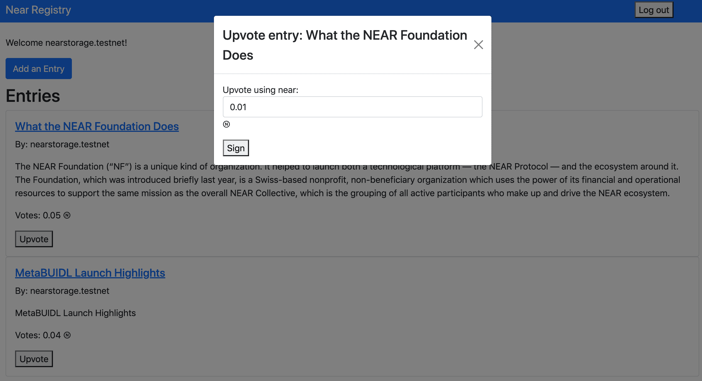

# 介绍

> 原文：<https://github.com/figment-networks/learn-tutorials/blob/master/near/near-registry-dapp.md>

在本教程中，我们将为 NEAR 注册表构建一个完整的 dApp。近注册表将允许您跟踪热门内容，就像黑客新闻。任何人都可以在注册表中发布条目。上传内容需要您使用您的 NEAR wallet 进行连接，并将 NEAR 附加到条目。注册表根据附加到条目的 NEAR 进行排序。相同的逻辑可以扩展到任何其他类型的注册表。

# 要求

*   一个近测试网账号:[https://wallet.testnet.near.org/](https://wallet.testnet.near.org/)
*   [Nodejs](https://nodejs.org/en/download/) v14 LTS 或更高安装
*   [纱线](https://yarnpkg.com/)安装完毕

# 设置

```js
git clone https://github.com/viraja1/near-registry.git
cd near-registry
yarn install
yarn test 
```

# 探索代码

1.  后端代码存在于`/assembly`文件夹中，并在您运行`yarn deploy`时被部署到附近的区块链。这种在区块链上运行的代码被称为“智能合约”。[了解更多关于近智能合约的信息](https://docs.nearprotocol.com/docs/roles/developer/contracts/assemblyscript)。
2.  后端测试代码存在于`/assembly/__tests__/`文件夹中。我们可以使用命令`yarn test`测试后端代码。
3.  前端代码存在于`/src`文件夹中。它使用 near-api-js，这是一个 JavaScript/TypeScript 库，用于在 near 平台上开发分散式应用程序。它与近端 RPC 端点协同工作，帮助您将应用程序连接到近端区块链。[了解更多关于近前端](https://docs.near.org/docs/api/naj-quick-reference)的信息。

准智能契约可以用 Rust 或 AssemblyScript 编写。对于 NEAR Registry，我们将使用 AssemblyScript，它是编译为 WebAssembly (WASM)的 TypeScript 的一种方言。

契约是导出函数的命名集合，这些函数可以访问(通过 **near-sdk-as** )它们的执行上下文(发送方、接收方、块高度等)。)以及存储服务(键值对和方便的集合，如 Map、Vector 和 Dequeue)、日志服务和一些实用函数。

为了保持组织有序，契约可以使用一个或多个通常添加到 model.ts 文件中的数据对象。所有的契约和模型都必须明确地导入它们打算使用的 NEAR SDK 的特性。

**装配/型号 ts**

```js
import {context, u128, PersistentVector} from "near-sdk-as";

/**
 * Exporting a new class Entry so it can be used outside of this file.
 */
@nearBindgen
export class Entry {
  sender: string;

  constructor(public title: string, public description: string, public url: string, public id: i32, public votes: u128) {
    this.sender = context.sender;
  }
}

/**
 * collections.vector is a persistent collection. Any changes to it will
 * be automatically saved in the storage.
 * The parameter to the constructor needs to be unique across a single contract.
 * It will be used as a prefix to all keys required to store data in the storage.
 */
export const entries = new PersistentVector<Entry>("entries");
```

在上面的`models.ts`文件中，我们定义了一个名为 Entry 的新自定义类型(默认情况下，整数、字符串和 bool 等基本类型总是可用的)。因为模型只是 AssemblyScript 类，所以它们支持自定义构造函数。每个条目都有发送者、标题、描述、url、id 和投票。其中的每一个都与特定的类型相关联，并被声明为 public。在构造函数中，我们将发送者定义为 **context.sender** 。上下文对象为合同执行提供上下文，包括关于交易发送者、区块链高度和在合同执行期间可用的附加存款的信息。

最后，我们定义 entries 是 Entry 类型的 PersistentVector(集合)。PersistentVector 从存储中写入和读取，抽象出许多您可能想要添加到存储对象中的内容。它用方便的方法包装了存储类，因此您必须始终为不同的集合使用唯一的存储前缀，以避免数据冲突。PersistentVector 的作用类似于数组。为了创建条目，我们使用语法`new PersistentVector<Entry>("entries")`。vector 支持 push、pop 和 length 等方法。

**装配/主要测试**

```js
import {Entry, entries} from './model';
import {context, u128} from "near-sdk-as";

// --- contract code goes below

/**
 * Adds a new entry under the name of the sender's account id.
 * NOTE: This is a change method, which means it will modify the state.
 * But right now we don't distinguish them with annotations yet.
 */
export function addEntry(title: string, description: string, url: string): void {
  // Creating a new entry and populating fields with our data
  const entry = new Entry(title, description, url, entries.length, u128.fromU64(0));
  // Adding the entry to end of the the persistent collection
  entries.push(entry);
}

/**
 * Up vote an entry using attachedDeposit
 * NOTE: This is a change method, which means it will modify the state.
 * But right now we don't distinguish them with annotations yet.
 */
export function upVoteEntry(index: i32): void {
  const entry = entries[i32(index)];
  entry.votes = u128.add(entry.votes, context.attachedDeposit);
  entries[i32(index)] = entry;
}

/**
 * Returns an array of entries.
 * NOTE: This is a view method, which means it does not modify the state.
 */
export function getEntries(): Entry[] {
  const result = new Array<Entry>(entries.length);
  for (let i = 0; i < entries.length; i++) {
    result[i] = entries[i];
  }
  return result;
}
```

契约函数调用是无状态的。任何想要保存到区块链的状态都需要通过与存储对象交互来显式保存(比如**条目**)。在`main.ts`文件中，定义了`addEntry`、`upVoteEntry`、`getEntries`等合同功能。函数声明遵循标准的 AssemblyScript 约定，包括它们采用的参数、可选参数和返回值。

有两种类型的功能可以与区块链交互-“查看”功能和“更改”功能。然而，这种差异并不存在于合同层面。像`getEntries`这样的视图函数不会修改区块链的状态。像`addEntry`和`upVoteEntry`这样的改变函数确实可以改变状态。

在`addEntry`函数中，我们创建了一个新条目，并使用 push 方法将其添加到条目 PersistentVector 中。在`upVoteEntry`函数中，我们首先使用索引从 entries PersistentVector 中获取条目。然后我们使用 context.attachedDeposit 增加条目投票数，然后使用索引更新条目 PersistentVector。

# 单元测试

**assembly/_ _ tests _ _/registry . spec . ts**

为了确保我们的智能契约按预期工作，我们编写了以下单元测试。他们测试各种情况，如添加一个条目、对一个条目进行投票表决、检索条目以及将押金附加到合同调用。使用命令`yarn test`运行测试套件，然后它会在控制台上显示结果。

```js
import {addEntry, getEntries, upVoteEntry} from '../main';
import {Entry, entries} from '../model';
import {VMContext, Context, u128} from 'near-sdk-as';

function createEntry(title: string, description: string, url: string): Entry {
  return new Entry(title, description, url, 0, u128.fromU64(0));
}

const entry = createEntry('Near Protocol - Infrastructure for Innovation',
  'NEAR is an open source platform that accelerates the development of decentralized applications.',
  'https://near.org/');

describe('entries tests', () => {
  afterEach(() => {
    while (entries.length > 0) {
      entries.pop();
    }
  });

  it('adds a entry', () => {
    addEntry('Near Protocol - Infrastructure for Innovation',
      'NEAR is an open source platform that accelerates the development of decentralized applications.',
      'https://near.org/');
    expect(entries.length).toBe(
      1,
      'should only contain one entry'
    );
    expect(entries[0].url).toStrictEqual(
      'https://near.org/',
      'url matches'
    );
  });

  it('check up vote', () => {
    addEntry('Near Protocol - Infrastructure for Innovation',
      'NEAR is an open source platform that accelerates the development of decentralized applications.',
      'https://near.org/');
    expect(entries[0].votes.toString()).toStrictEqual(u128.fromU32(0).toString(),
      'entry should have 0 vote'
    );
    VMContext.setAttached_deposit(u128.from('10000000000000000000000'));
    upVoteEntry(i32(0));
    expect(entries[0].votes.toString()).toStrictEqual(u128.from('10000000000000000000000').toString(),
      'entry should have a vote'
    );
  });

  it('retrieves entries', () => {
    addEntry('Near Protocol - Infrastructure for Innovation',
      'NEAR is an open source platform that accelerates the development of decentralized applications.',
      'https://near.org/');
    const entriesList = getEntries();
    expect(entriesList.length).toBe(
      1,
      'should be one entry'
    );
    expect(entriesList).toIncludeEqual(
      entry,
      'entries should include:\n' + entry.toJSON()
    );
  });
});

describe('attached deposit tests', () => {
  beforeEach(() => {
    VMContext.setAttached_deposit(u128.fromString('0'));
    VMContext.setAccount_balance(u128.fromString('0'));
  });

  it('attaches a deposit to a contract call', () => {
    log('Initial account balance: ' + Context.accountBalance.toString());

    addEntry('Near Protocol - Infrastructure for Innovation',
      'NEAR is an open source platform that accelerates the development of decentralized applications.',
      'https://near.org/');
    VMContext.setAttached_deposit(u128.from('10'));

    log('Attached deposit: 10');
    log('Account balance after deposit: ' + Context.accountBalance.toString());

    expect(Context.accountBalance.toString()).toStrictEqual(
      '10',
      'balance should be 10'
    );
  });
});
```

# 部署智能合同

NEAR 上的每个智能合约都有自己的关联账户。当运行`yarn dev`进行部署时，智能合约被部署到带有一次性帐户的 live NEAR testnet。要使部署永久化，请使用以下步骤:

## 安装 NEAR CLI

此命令将全局安装 NEAR CLI:

```js
npm install --global near-cli 
```

然后使用以下命令确保它安装正确

```js
near --version 
```

## 为合同创建帐户

访问钱包附近的[并创建新账户。您将把这些智能合同部署到这个新客户。](https://wallet.testnet.near.org/)

现在，通过 NEAR CLI 为这个新帐户授权，然后按照说明完成该过程:

```js
near login 
```

## 用纱线展开

```js
yarn deploy 
```

正如您在`package.json`中看到的，这个构建&将智能合约部署到 testnet 附近。

```js
{
    "build": "yarn build:contract",
    "build:contract": "asb",
    "build:contract:debug": "asb --target debug",
    "deploy": "yarn build && near deploy",
    "dev": "yarn build:contract:debug && near dev-deploy",
    "test": "yarn build:contract:debug && asp"
}
```

从控制台记下智能合同账户 id，并在`src/config.js`中更新。

# 在本地运行前端

要查看部署后的前端，我们需要使用本地开发服务器。从`near-registry`目录运行以下命令:

```js
cd src
yarn install
yarn start 
```

现在，您可以在浏览器中访问 [http://localhost:1234](http://localhost:1234) 来测试部署在 NEAR testnet 上的 NEAR 注册表前端和智能合约。

# 使用 netlify 部署前端

当您对 dApp 的外观和功能感到满意时，您可以部署到远程服务器。从`near-registry`目录运行以下命令:

```js
cd src
yarn build
yarn global add netlify-cli
netlify login
netlify deploy --prod 
```

您必须遵循 netlify CLI 给出的说明，并将`./dist`指定为发布目录。

# 截屏








# 应用程序链接(靠近测试网)

[https://near-registry.netlify.app/](https://near-registry.netlify.app/)

# 结论

恭喜你！我们已经成功地在 NEAR testnet 上部署了 NEAR Registry 智能合约。我们还通过编写测试用例测试了智能合约。然后，我们使用 React 前端与智能合约进行了交互。

# 参考

*   近客书-[https://github.com/near-examples/guest-book/](https://github.com/near-examples/guest-book/)
*   近智能合同文档-[https://Docs . NEAR protocol . com/Docs/roles/developer/contracts/assembly script](https://docs.nearprotocol.com/docs/roles/developer/contracts/assemblyscript)
*   近前端文档-[https://docs.near.org/docs/api/naj-quick-reference](https://docs.near.org/docs/api/naj-quick-reference)

# 关于作者

本教程由 [Viraj Anchan](https://github.com/viraja1/) 创作。