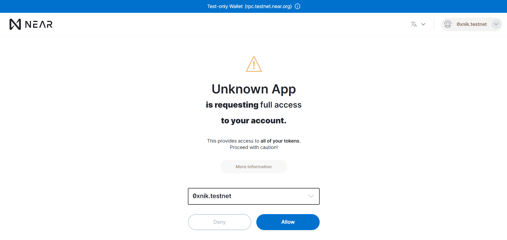
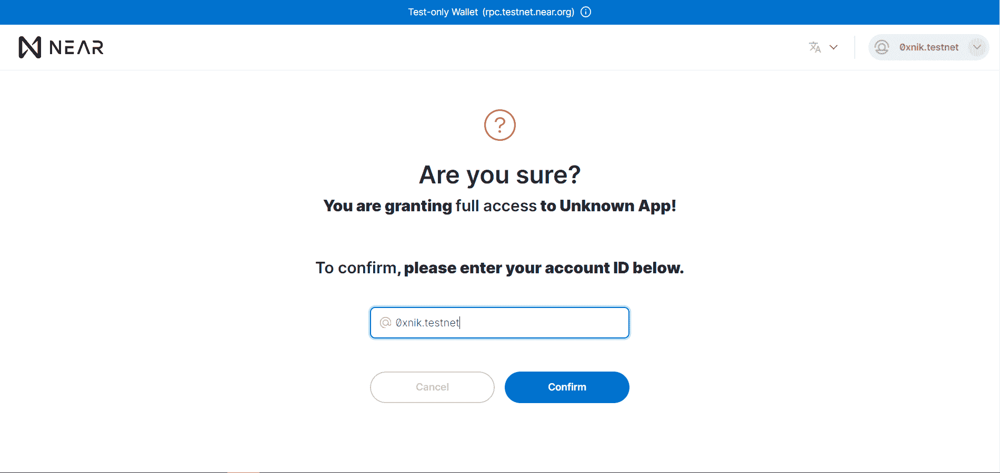

# 介绍

> 原文:[https://github . com/fig ment-networks/learn-tutorials/blob/master/near/write-and-deploy-a-smart-contract-on-near . MD](https://github.com/figment-networks/learn-tutorials/blob/master/near/write-and-deploy-a-smart-contract-on-near.md)

在本教程中，我们将使用 Rust 编写并测试一个智能合约。然后我们将它部署到 Testnet 附近。

为什么生锈？Rust 是在 NEAR 上编写智能合同的首选编程语言。Rust 提供了许多特性，如内存安全、运行时间短等。这允许我们编写一个智能契约，它没有内存错误，并且在区块链上消耗更少的存储。

# 先决条件

请确保您已完成路径附近的[。该途径涵盖了近期发展的基础。](https://learn.figment.io/pathways/near-pathway)

# 要求

您应该安装以下要求:

*   生锈(安装[指南](https://www.rust-lang.org/tools/install)如果你想了解更多关于生锈的知识，查看本指南[这里](https://doc.rust-lang.org/book/)
*   CLI 附近(安装[指南](https://www.npmjs.com/package/near-cli)
*   靠近 testnet 帐户(如果您没有 Testnet 帐户，请查看本指南[此处](https://nearhelp.zendesk.com/hc/en-us/articles/1500002248242-Creating-a-NEAR-Wallet-account)

# 设置

要设置我们的项目，我们需要将 WASM (WebAssembly)目标添加到工具链中。要添加，我们需要在终端中运行以下命令:

```
rustup target add wasm32-unknown-unknown 
```

终端中的输出将是:

```
info: downloading component 'rust-std' for 'wasm32-unknown-unknown'
info: installing component 'rust-std' for 'wasm32-unknown-unknown'
info: using up to 500.0 MiB of RAM to unpack components 13.9 MiB /  13.9 MiB (100 %)  10.0 MiB/s in  1s ETA:  0s 
```

如果已经添加了目标，那么终端中的输出将是:

```
info: component 'rust-std' for target 'wasm32-unknown-unknown' is up to date 
```

什么是 Rust toolchain？工具链是编译 Rust 应用程序所需的程序集合的特定版本。

为什么我们需要增加 WASM 目标？为了在 NEAR 上部署我们的智能契约，我们需要将它编译成 WebAssembly ( `.wasm`文件)。上面的`rustup`命令为 WebAssembly 目标三元组(wasm32-unknown-unknown)安装标准库。在`rustup`文档上阅读更多关于交叉编译的信息[。](https://rust-lang.github.io/rustup/cross-compilation.html)

现在，让我们创建一个名为`key_value_storage`的目录，然后切换到该目录并在终端中运行以下命令:

```
cargo init --lib 
```

终端中的输出将是:

```
Created library package 
```

打开生成的默认`Cargo.toml`文件，删除现有内容并粘贴以下内容:

```
[package]
name = "key_value_storage"
version = "0.1.0"
authors = ["Your Name <Your Email>"]
edition = "2018"

[lib]
crate-type = ["cdylib", "rlib"]

[dependencies]
near-sdk = "3.1.0"

[profile.release]
codegen-units = 1
opt-level = "z"
lto = true
debug = false
panic = "abort"
overflow-checks = true
```

在 https://doc.rust-lang.org/cargo/reference/manifest.html
的[查看更多货物清单键及其定义使用`overflow-checks = true`选择加入对算术运算的额外安全检查:](https://doc.rust-lang.org/cargo/reference/manifest.html)[https://stackoverflow.com/a/64136471/249801](https://stackoverflow.com/a/64136471/249801)
使用`opt-level = "z"`告诉 Rust 编译器针对小代码进行优化。

我们现在都准备好了！这可以用作模板和任何未来项目的起点。

# 写合同

我们将在 Rust 中创建一个简单的创建、读取、更新、删除( [CRUD](https://en.wikipedia.org/wiki/Create,_read,_update_and_delete) )后端，它利用了 NEAR 提供的链上存储。关于近储的更多信息可以在的近文档[中找到。](https://docs.near.org/docs/concepts/storage-staking)

我们可以从移除`lib.rs`中的所有现有代码并粘贴以下代码片段开始:

```
use near_sdk::borsh::{self, BorshDeserialize, BorshSerialize};
use near_sdk::{env, near_bindgen};
use near_sdk::collections::UnorderedMap;

near_sdk::setup_alloc!();

// 1\. Main Struct

// 2\. Default Implementation

// 3\. Core Logic

// 4\. Tests
```

在契约的顶部，我们需要用`use` [声明](https://doc.rust-lang.org/reference/items/use-declarations.html#use-declarations)导入一些代码模块。我们将在下面展开`near_sdk`的这些部分。

接下来，我们使用`setup_alloc!()`宏从`wee_alloc`机箱中设置全局分配器。分配器是 Rust 中的程序在运行时从系统获取内存的方式。`wee_alloc`是一个为 WebAssembly 设计的内存分配器。它生成不到一千字节的未压缩 WebAssembly 代码。这个宏是样板代码的简写:

```
#[cfg(target_arch = "wasm32")]
#[global_allocator]
static ALLOC: near_sdk::wee_alloc::WeeAlloc<'_> = near_sdk::wee_alloc::WeeAlloc::INIT;
```

你可以阅读更多关于[全局分配器](https://doc.rust-lang.org/edition-guide/rust-2018/platform-and-target-support/global-allocators.html)和 [wee_alloc](https://github.com/rustwasm/wee_alloc) 的内容。

## 主要结构

在编写我们的智能契约时，我们将遵循一种模式，使用一个结构(`struct`)和一个与之关联的实现(`impl`)。这是 NEAR 上大多数铁锈合同中使用的模式。在`lib.rs`中的评论`// 1\. Main Struct`下面添加以下代码片段:

```
#[near_bindgen]
#[derive(BorshDeserialize, BorshSerialize)]
pub struct KeyValue {
    pairs: UnorderedMap<String, String>,
}
```

我们有主结构`KeyValue`，它有一个字段`pairs`。`pairs`是我们从`near_sdk::collections`进口的`UnorderedMap`型。 [`UnorderedMap`](https://github.com/figment-networks/datahub-learn/tree/ea1bfad2b6006f7e2413fddbcedb2d689a5a18fd/network-documentation/near/tutorials/docs.rs/near-sdk/3.1.0/near_sdk/collections/struct.UnorderedMap.html) 是一种更有效地利用底层区块链 trie 存储的数据结构。`near_sdk::collections`几乎没有提供其他方式来存储数据。要更好地了解存储的所有可用使用方式，请查看`collections`模块的[文档](https://docs.rs/near-sdk/3.1.0/near_sdk/collections/index.html)。

`#[near_bindgen]`和`#[derive(BorshDeserialize, BorshSerialize)]`是属性。

什么是属性？一个声明性标记，用于向运行时传递有关各种元素(如类、方法、结构、枚举器、程序集等)行为的信息。

通过添加宏`#[near_bindgen]`,我们为结构`KeyValue`提供了生成的样板代码，使其与区块链兼容。第二个宏`#[derive(BorshDeserialize, BorshSerialize)]`协助数据的序列化和反序列化，以便将数据发送到 NEAR 或从 NEAR 获取数据。

## 默认实现

Rust 中的每个类型都有一个`Default`实现，但是这里我们想为`keyValue` struct 提供我们自己的默认实现。在`lib.rs`中的评论`// 2\. Default Implementation`下面添加以下代码片段:

```
impl Default for KeyValue {
    fn default() -> Self {
        Self {
            pairs: UnorderedMap::new(b"r".to_vec())
        }
    }
}
```

现在，让我们一步一步来:首先，我们正在为`KeyValue`创建一个`Default`实现。之后，我们在返回`Self`的实现中添加了`default`方法。`Self`指当前类型，即`KeyValue`。最后，我们将返回一个新的无序地图`Self`。在创建一个新的无序映射时，我们必须将 ID 作为`Vec<u8>`类型传递，所以我们使用`to_vec()`函数将作为字节字符串的`b"r"`转换为`Vec<u8>`。前缀`b`用于指定我们想要的字符串的字节数组。你可以在 Rust 文档中阅读字节字符串文字[。](https://doc.rust-lang.org/reference/tokens.html#byte-string-literals)

## 核心逻辑

现在我们要给`KeyValue`结构添加方法。这些方法是我们智能合约的核心逻辑。在注释`// 3\. Core Logic`下添加以下代码片段:

```
#[near_bindgen]
impl KeyValue {
    pub fn create_update(&mut self, k: String, v: String) {
        env::log(b"created or updated");
        self.pairs.insert(&k, &v);
    }

    pub fn read(&self, k: String) -> Option<String> {
        env::log(b"read");
        return self.pairs.get(&k);
    }

    pub fn delete(&mut self, k: String) {
        env::log(b"delete");
        self.pairs.remove(&k);
    }
}
```

当创建方法时，我们必须有一个由关键字`impl`定义的实现块，后跟要实现的`struct`的名称。`pub`关键字使得这些方法可以公开使用，这意味着它们可以被任何能够访问协议和签署交易的人调用。

第一种方法`create_update`用于创建或更新特定对。它需要三个参数`self`、`k`和`v`。

我们正在使用`&mut self`可变地借用 self。你可以在这里了解更多关于借款的信息。

`k`和`v`是我们将要存储的键值。

`env::log(b"created or updated")`用于记录日志。日志可用于向用户显示信息性消息或警告。此外，这些日志在开发过程中帮助开发人员。当我们在教程的后面部分与智能合同交互时，您将在终端中看到这些日志。为智能合同创建 web 应用程序时，您还可以在浏览器的开发人员控制台中查看日志。

之后，我们在`self.pairs`上调用方法`insert`。这将创建一个键-值对(如果还没有),否则它将更新与给定键关联的值。

接下来的两个方法非常相似，但是我们没有调用`insert`方法，而是调用 self.pairs 上的`get`和`remove`方法来读取或移除键-值对。

# 测试合同

我们的 CRUD 智能契约的代码现在已经完成。Rust 的一个很好的特性是它允许内嵌的单元测试。这意味着我们可以在与合同相同的源文件中编写单元测试，`lib.rs`！。

为什么我们应该为智能契约编写单元测试？单元测试是软件开发中的常见实践。在编写智能合约时，单元测试非常重要，因为智能合约通常是不可变的，有时还负责管理资金。编写好的单元测试是安全可靠的智能合约开发的关键组成部分。

将以下代码复制并粘贴到`lib.rs`中的注释`// 4\. Tests`下:

```
#[cfg(not(target_arch = "wasm32"))]
#[cfg(test)]
mod tests {
    use super::*;
    use near_sdk::MockedBlockchain;
    use near_sdk::{testing_env, VMContext};

    fn get_context(input: Vec<u8>, is_view: bool) -> VMContext {
        VMContext {
            current_account_id: "alice_near".to_string(),
            signer_account_id: "bob_near".to_string(),
            signer_account_pk: vec![0, 1, 2],
            predecessor_account_id: "carol_near".to_string(),
            input,
            block_index: 0,
            block_timestamp: 0,
            account_balance: 0,
            account_locked_balance: 0,
            storage_usage: 0,
            attached_deposit: 0,
            prepaid_gas: 10u64.pow(18),
            random_seed: vec![0, 1, 2],
            is_view,
            output_data_receivers: vec![],
            epoch_height: 0,
        }
    }

    // Test 1

    // Test 2

}
```

这是我们用各种参数和一个模拟区块链建立测试环境的地方。在近 SDK 文档中阅读有关虚拟机环境和测试环境[的更多信息。](https://docs.rs/near-sdk/3.1.0/near_sdk/struct.VMContext.html)

让我们为`create_update`和`read`方法编写第一个测试。将下面的片段粘贴到`lib.rs`中的评论`// Test 1`下面:

```
    #[test]
    fn create_read_pair() {
        let context = get_context(vec![], false);
        testing_env!(context);
        let mut contract = KeyValue::default();
        contract.create_update("first_key".to_string(), "hello".to_string());
        assert_eq!(
            "hello".to_string(),
            contract.read("first_key".to_string()).unwrap()
        );
    }
```

首先，我们通过调用`get_context`函数并将其传递给`testing_env!()`宏来创建一个`context`变量，该宏使用给定的参数创建一个测试环境。接下来，我们必须创建一个可变的`contract`变量，它将使用我们刚刚编写的契约。然后我们可以使用这个`contract`变量来调用我们的测试方法。

现在，让我们调用`create_update`方法来设置键值对。键将是`first_key`，值将是`hello`。创建 pair 后，我们要检查存储器中是否存储了正确的值。为了检查，我们将使用`assert_eq!()`宏。它需要两个参数；期望值和实际值。

我们将传递期望值为`"hello".to_string()`，对于实际值，我们将调用 read 方法，并将`first_key`作为参数。read 方法返回类型为`Option<String>`的值，但预期值的类型为`String`。这就是为什么我们用`unwrap`从`Option<String>`类型中得到`String`类型的值。

对于我们的第二个测试，我们将假设密钥不在存储中。在这种情况下，当我们试图读取密钥时，应该返回`None`。在注释`// Test 2`下面添加以下代码:

```
    #[test]
    fn read_nonexistent_pair() {
        let context = get_context(vec![], true);
        testing_env!(context);
        let contract = KeyValue::default();
        assert_eq!(None, contract.read("first_key".to_string()));
    }
```

就像在第一个测试中一样，我们将创建我们的测试环境和`contract`变量。然而，在这个测试中，契约变量是不可变的，因为我们不打算改变`contract`变量。为了检查在使用`contract.read("first_key".to_string())`访问一个不存在的键后没有返回任何值，我们将使用`assert_eq!()`。

现在，是时候测试我们的代码了。在终端中运行以下命令:

```
cargo test -- --nocapture 
```

只有当合同正常工作时，测试才会通过。当我们的智能合约正常工作时，我们将看到以下输出:

```
Finished test [unoptimized + debuginfo] target(s) in 1m 05s
     Running target/debug/deps/key_value_storage-958f616e81cf3269

running 2 tests
test tests::read_nonexistent_pair ... ok
test tests::create_read_pair ... ok

test result: ok. 2 passed; 0 failed; 0 ignored; 0 measured; 0 filtered out; finished in 0.00s

   Doc-tests key_value_storage

running 0 tests

test result: ok. 0 passed; 0 failed; 0 ignored; 0 measured; 0 filtered out; finished in 0.00s 
```

# 编制合同

既然我们已经编写并测试了 Rust smart 契约，我们将把它编译到 WebAssembly 中，以便在 NEAR 上部署。在终端中运行以下命令(注意:Windows 用户必须分别执行这两个命令，`set`用于环境变量，然后是`cargo build`命令):

```
// Linux and macOS users can use these commands:
env 'RUSTFLAGS=-C link-arg=-s' 
cargo build --target wasm32-unknown-unknown --release

// Windows users can use these commands:
set RUSTFLAGS=-C link-arg=-s
cargo build --target wasm32-unknown-unknown --release 
```

来自`cargo build`的输出将是类似的:

```
Compiling near-sdk v3.1.0
Compiling key_value_storage v0.1.0 (/home/xqc/key_value_storage)
Finished release [optimized] target(s) in 1m 00s 
```

我们现在已经生成了一个优化的 WebAssembly 文件，可以部署在 NEAR 上，在本教程中，我们将把它部署到 NEAR testnet 上。

# 部署合同

首先，您必须使用`near-cli`登录您的帐户。奔跑

```
near login 
```

这将把您重定向到 NEAR wallet，请求完全访问您的帐户。从这里，选择您想要访问密钥的帐户

[](https://camo.githubusercontent.com/f5a2362188dbdac03b7bdee9432cf4c25d61aa055437fe2a9572bafaf235fa3a/68747470733a2f2f692e696d6775722e636f6d2f6377654c5030632e706e67)

点击`allow`后，系统会要求您输入账户名称以确认授权。

[](https://camo.githubusercontent.com/ece66565e8ef6482298642bd67a82610d53fe0c99bcab283cfbe5f53fd104a8f/68747470733a2f2f692e696d6775722e636f6d2f443743347255682e706e67)

一旦完成，您现在将把您的访问密钥本地存储在一个名为`.near-credentials`的隐藏目录中。该目录位于您的主目录的根目录下:

*   `~/.near-credentials` (MAC / Linux)
*   `C:\Users\YOUR_ACCOUNT\.near-credentials` (Windows)

接下来，给我们的合同命名听起来是个好主意。为此，我们将使用`near-cli`创建一个属于我们主帐户的新帐户。

```
near create-account CONTRACT_NAME.ACCOUNT_ID --masterAcount ACCOUNT_ID --initialBalance 10 
```

输出将是:

```
Saving key to '/home/xxx/.near-credentials/testnet/CONTRACT_NAME.ACCOUNT_ID.json'
Account CONTRACT_NAME.ACCOUNT_ID.testnet for network "testnet" was created. 
```

> 例如，假设您在 near testnet 上的当前 *account_id* 是 **fido.testnet** ，并且您想要将合同命名为 **dodo** ，那么您将最终创建以下新的 account _ id**dodo . fido . testnet**，它将代表 *contract_id* 。
> 
> `--initialBalance`如果省略将默认为附近的 **100。在本教程的后面，`CONTRACT_ID`将参考`CONTRACT_NAME.ACCOUNT_ID`阅读更多关于附近账户的信息[在这里](https://nomicon.io/DataStructures/Account.html)**

现在，我们可以将 Rust smart 合同部署到 NEAR。在终端中运行以下命令(注意:将`YOUR_ACCOUNT_HERE`替换为您的帐户名，例如。`example.near`):

```
near deploy --wasmFile target/wasm32-unknown-unknown/release/key_value_storage.wasm --accountId CONTRACT_ID 
```

部署完成后，您将在终端中看到类似的输出:

```
Starting deployment. Account id: CONTRACT_ID, node: https://rpc.testnet.near.org, helper: https://helper.testnet.near.org, file: target/wasm32-unknown-unknown/release/key_value_storage.wasm
Transaction Id E4uT8wV5uXSgsJpB73Uox27iPgXztWfL3b5gzxfA3fHo
To see the transaction in the transaction explorer, please open this url in your browser
https://explorer.testnet.near.org/transactions/E4uT8wV5uXSgsJpB73Uox27iPgXztWfL3b5gzxfA3fHo
Done deploying to CONTRACT_ID 
```

<g-emoji class="g-emoji" alias="tada" fallback-src="https://github.githubassets.cimg/icons/emoji/unicode/1f389.png">🎉</g-emoji> <g-emoji class="g-emoji" alias="tada" fallback-src="https://github.githubassets.cimg/icons/emoji/unicode/1f389.png">🎉</g-emoji>我们已经成功部署了首个 Rust smart 合同。

# 与合同互动

现在我们已经部署了我们的契约，我们可以使用 NEAR CLI 与它进行交互。

我们将创建一个键值对，然后读取它。

该命令将创建一个键值对:

```
near call CONTRACT_ID create_update '{"k": "first_key", "v" : "1"}' --accountId ACCOUNT_ID 
```

输出将是:

```
Scheduling a call: CONTRACT_ID.create_update({"k": "first_key", "v" : "1"})
Receipt: 6bCmuWuAbdiXWvPaTvidbJP4f3mSG4UVcE52g18ZWMq5
        Log [CONTRACT_ID]: created or updated
Transaction Id AQWwThAtXWhU7HJsuD5bvi2FXHpnw5xbj5SEe94Q3MTp
To see the transaction in the transaction explorer, please open this URL in your browser
https://explorer.testnet.near.org/transactions/AQWwThAtXWhU7HJsuD5bvi2FXHpnw5xbj5SEe94Q3MTp
'' 
```

函数参数必须作为 JSON 字符串在方法名之后提供。

现在，我们将读取第一个键的值:

```
near view CONTRACT_ID read '{"k": "first_key"}' --accountId ACCOUNT_ID 
```

输出将是:

```
View call: CONTRACT_ID.read({"k": "first_key"})
Log [CONTRACT_ID]: read
'1' 
```

> 由于`read`方法不会改变我们契约的状态，我们应该用`view`代替`call`。这样做有以下优点:
> 
> *   我们不需要支付任何费用
> *   对我们查询的响应几乎是立即出现的

最后，我们将删除密钥:

```
near call CONTRACT_ID delete '{"k": "first_key"}' --accountId ACCOUNT_ID 
```

输出将是:

```
Scheduling a call: CONTRACT_ID.delete({"k": "first_key"})
Receipt: wp8YoFZC7CKUNty66VoYuaHMVej7UqcbLcK2FjpMZzk
        Log [CONTRACT_ID]: delete
Transaction Id A4aDmpkfbEP8JwM5KspUiWe1zYnKgUnA5wosCiQBwour
To see the transaction in the transaction explorer, please open this url in your browser
https://explorer.testnet.near.org/transactions/A4aDmpkfbEP8JwM5KspUiWe1zYnKgUnA5wosCiQBwour
'' 
```

# 结论

在本教程中，我们已经介绍了使用 Rust 进行接近智能合约编程的基础知识——包括 Rust 智能合约的结构；NEAR SDK 提供的函数和宏的使用；如何使用链上存储；生锈契约的单元测试；编译和部署 WebAssembly，最后使用 NEAR CLI 与区块链附近部署的 Rust 契约进行交互。

感谢您跟随本教程，现在带着这些知识，在 NEAR 上创造惊人的东西吧！

# 关于作者

本教程由 [Nikhil Bhintade](https://www.linkedin.com/in/nikbhintade) 创作。一个想要记录他所学到的东西的密码爱好者。你可以在 [Github](https://github.com/nikbhintade) 上与作者取得联系。