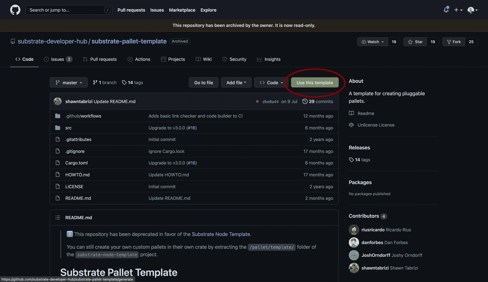
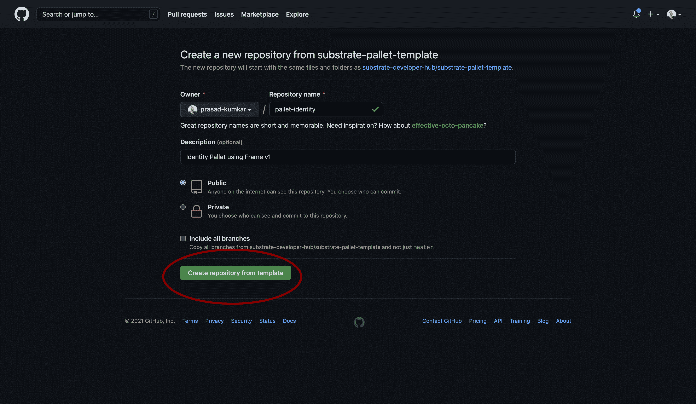
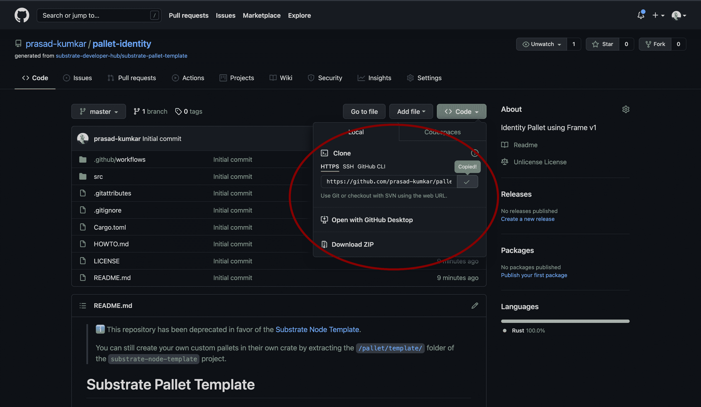

# 介绍

> 原文：<https://github.com/figment-networks/learn-tutorials/blob/master/polkadot/custom-pallet.md>

在本教程中，我们将使用 Substrate development framework 和 FRAME v1 构建一个定制托盘。我们将从了解托盘和框架框架的概述开始。然后，我们将看看基板托盘模板，使用它来构建我们的定制托盘，编写测试用例，使用 g it 发布，最后将发布的托盘添加到我们的运行时。

# 先决条件

本教程假设读者对 Rust 编程语言有些熟悉，并且对 Substrate 框架有基本的了解。

# 踏板

托盘是特定于领域的运行时模块，它允许我们进行模块化设计。我们可以在运行时添加多个托盘。

作为参考，一些最受欢迎的预制托盘可以在基板开发者网站上找到[。](https://substrate.dev/docs/en/knowledgebase/runtime/frame#prebuilt-pallets)

## 框架 v1

FRAME 是用于开发托盘的框架，它附带了一组库和模块来帮助我们入门。以下是框架式托盘的框架:

1.  导入和依赖关系

托盘支持使用任何用`no_std`标志编译的锈库。

```js
use support::{decl_module, decl_event, decl_storage, ...}
```

2.  运行时配置特征

所有的运行时类型和常量都在这里。如果托盘依赖于其他托盘，那么它们的配置特征应该被添加到继承特征列表中。

```js
pub trait Config: frame_system::Config { ... }
```

3.  运行时事件

事件是一种报告已发生的特定事件的简单方法，用户、dApps 和/或块探索者会对此感兴趣，否则很难检测到。

阅读关于[运行时事件](https://substrate.dev/docs/en/knowledgebase/runtime/events)的更多信息

```js
decl_event! { ... }
```

4.  运行时存储

这允许类型安全地使用基底存储数据库，因此您可以在块之间保存东西。

阅读关于[运行时存储](https://substrate.dev/docs/en/knowledgebase/runtime/storage)的更多信息

```js
decl_storage! { ... }
```

5.  运行时错误

这是一个枚举，允许我们定义可以从运行时模块调用的自定义错误类型。

```js
decl_error! { ... }
```

6.  运行时模块

这定义了最终从这个托盘中导出的`Module`结构。它定义了这个托盘公开的可调用函数，并编排了这个托盘在整个块执行过程中采取的动作。

```js
decl_module! { ... }
```

我们现在来看看如何在这个框架内建造我们的货盘。

关于框架的更多细节

# 使用模板托盘

我们可以从使用基板托盘模板开始，该模板使用框架 v1 提供起始代码

检查[基板托盘模板](https://github.com/substrate-developer-hub/substrate-pallet-template)





现在，您可以通过在终端中运行以下命令，将生成的存储库克隆到本地机器上:

```js
git clone https://github.com/<YOUR_GITHUB_USERNAME>/pallet-identity.git 
```



## 了解模板代码

首先，我们从 frame_support 库中导入 rust 宏，这是构建我们的运行时模块所必需的:DispatchResult 的`decl_module`、storage: `decl_storage`、events: `decl_event`、errors: `decl_error`、`dispatch`以及 storage 用来转换类型的`Get`特征。我们还必须从 frame_system 导入 ensure _ signed，以检查事务是否已签名。

我们也一直在从`frame_system`导入`ensure_signed`来检查交易是否被签署。

```js
#![cfg_attr(not(feature = "std"), no_std)]

use frame_support::{decl_module, decl_storage, decl_event, decl_error, dispatch, traits::Get};
use frame_system::ensure_signed;

#[cfg(test)]
mod mock;

#[cfg(test)]
mod tests;
```

## 配置

```js
pub trait Config: frame_system::Config {
	/// Because this pallet emits events, it depends on the runtime's definition of an event.
	type Event: From<Event<Self>> + Into<<Self as frame_system::Config>::Event>;
}
```

## 申报存储

这里托盘的存放名称`TemplateModule`应该不同于其他托盘的存放名称。

`Something`是存储项，可以存储可选的无符号 32 位整数。可以使用`something()`函数从运行时模块访问该存储项目。如果需要，我们可以定义更多的存储项目。

阅读有关声明[存储项目](https://substrate.dev/docs/en/knowledgebase/runtime/storage#declaring-storage-items)的更多信息

```js
decl_storage! {
	trait Store for Module<T: Config> as TemplateModule {
		Something get(fn something): Option<u32>;
	}
}
```

运行时支持在方法调用时发出指定的事件。我们可以为每个事件传入参数，这里`SomethingStored`发出一个无符号的 32 位整数和一个 AccountId

事件的声明将在这里完成:

```js
decl_event!(
	pub enum Event<T> where AccountId = <T as frame_system::Config>::AccountId {
		SomethingStored(u32, AccountId),
	}
);
```

我们可以用 Error enum 声明事件，可以从模块调用中调用它。这通知用户出现了错误。

```js
decl_error! {
	pub enum Error for Module<T: Config> {
		NoneValue,
		StorageOverflow,
	}
}
```

## 运行时模块

这是我们声明方法调用(事务)的地方，这些方法调用可以用来修改/查询链状态，它们也可以发出事件和错误。对于每个可调度的函数，权重必须被提及，并且它必须返回一个`DispatchResult`

```js
decl_module! {
	pub struct Module<T: Config> for enum Call where origin: T::Origin {
		// Errors must be initialized if they are used by the pallet.
		type Error = Error<T>;

		// Events must be initialized if they are used by the pallet.
		fn deposit_event() = default;

		/// An example dispatchable that takes a singles value as a parameter, writes the value to
		/// storage and emits an event. This function must be dispatched by a signed extrinsic.
		#[weight = 10_000 + T::DbWeight::get().writes(1)]
		pub fn do_something(origin, something: u32) -> dispatch::DispatchResult {
			// Check that the extrinsic was signed and get the signer.
			// This function will return an error if the extrinsic is not signed.
			// https://substrate.dev/docs/en/knowledgebase/runtime/origin
			let who = ensure_signed(origin)?;

			// Update storage.
			Something::put(something);

			// Emit an event.
			Self::deposit_event(RawEvent::SomethingStored(something, who));
			// Return a successful DispatchResult
			Ok(())
		}

		/// An example dispatchable that may throw a custom error.
		#[weight = 10_000 + T::DbWeight::get().reads_writes(1,1)]
		pub fn cause_error(origin) -> dispatch::DispatchResult {
			let _who = ensure_signed(origin)?;

			// Read a value from storage.
			match Something::get() {
				// Return an error if the value has not been set.
				None => Err(Error::<T>::NoneValue)?,
				Some(old) => {
					// Increment the value read from storage; will error in the event of overflow.
					let new = old.checked_add(1).ok_or(Error::<T>::StorageOverflow)?;
					// Update the value in storage with the incremented result.
					Something::put(new);
					Ok(())
				},
			}
		}
	}
}
```

# 设计定制托盘

在我们的示例中，我们正在设计一个身份托盘，其中:

*   用户可以生成一个新的身份
*   向该身份添加/删除属性
*   删除身份

**存储项目**

*   身份映射:身份= >帐户 Id
*   属性映射:(Identity，Attribute_Key) = >属性值

**事件**

*   IdentityCreated(身份，帐户 Id)
*   AttributeAdded(标识，属性关键字，属性值)
*   AttributeRemoved(身份，属性关键字)，

**错误**

*   IdentityAlreadyClaimed
*   找不到标识
*   未授权
*   未找到属性

**函数调用**

*   create_identity(身份)
*   添加属性(身份，属性关键字，属性值)
*   remove_attribute(标识，属性 _ 关键字)

# 实现托盘

看看这个[示例代码](https://github.com/prasad-kumkar/pallet-identity/blob/master/src/lib.rs)

## 储存；储备

对于存储，我们创建了从 Identity 到 AccountId 的`Identity`映射。这里有一个字符串被转换成大小为 u8 的向量。

另一个存储项是`Attribute`，它是从`identity vector`和`attribute key vector`的元组到`attribute value vector`的映射。

```js
decl_storage! {
	trait Store for Module<T: Config> as IdentityModule {
		pub Identity get(fn get_identity): map hasher(blake2_128_concat) Vec<u8> => Option<T::AccountId>;

		// ( identity, attribute_key ) => attribute_value
		pub Attribute get(fn get_attribute): map hasher(blake2_128_concat) (Vec<u8>, Vec<u8>) => Vec<u8>;
	}
}
```

## 事件

```js
decl_event!(
	pub enum Event<T> where AccountId = <T as frame_system::Config>::AccountId {
		// Identity, AccountId
		IdentityCreated(Vec<u8>, AccountId),

		// Identity, Attribute Key, Attribute Value
		AttributeAdded(Vec<u8>, Vec<u8>, Vec<u8>),

		// Identity, Attribute Key
		AttributeRemoved(Vec<u8>, Vec<u8>),
	}
);
```

## 错误

```js
// Errors inform users that something went wrong.
decl_error! {
	pub enum Error for Module<T: Config> {
		IdentityAlreadyClaimed,
		IdentityNotFound,
		NotAuthorized,
		AttributeNotFound,
	}
}
```

## 函数调用

1.  创建身份

允许用户选择唯一的身份。当标识已经被声明时应该抛出错误。

```js
#[weight = 10_000 + T::DbWeight::get().reads_writes(1, 1)]
pub fn create_identity(
	origin, 
	identity: Vec<u8>
) -> dispatch::DispatchResult {

	let who = ensure_signed(origin)?;

	match <Identity<T>>::get(&identity) {
		// Return an error if signer is not identity owner
		None => {
			// Update storage.
			<Identity<T>>::insert(&identity, &who);
			// Emit an event.
			Self::deposit_event(RawEvent::IdentityCreated(identity, who));
			// Return a successful DispatchResult
			Ok(())
		},
		Some(_) => Err(Error::<T>::IdentityAlreadyClaimed)?
	}

}
```

2.  添加属性

允许身份所有者向自己的身份添加属性键值。当试图向其他人的身份添加属性时，或者如果找不到身份，应该会抛出一个错误。

```js
// Allows identity owners to add attribute to their identity (key, value)
#[weight = 10_000 + T::DbWeight::get().reads_writes(1,1)]
pub fn add_attribute(
	origin,
	identity: Vec<u8>,
	attribute_key: Vec<u8>,
	attribute_value: Vec<u8>
) -> dispatch::DispatchResult {
	let who = ensure_signed(origin)?;

	// Read a value from storage.
	match <Identity<T>>::get(&identity) {
		// Return an error if signer is not identity owner
		None => Err(Error::<T>::IdentityNotFound)?,
		Some(address) => {
			if address != who {
				return Err(Error::<T>::NotAuthorized)?
			} else{
				Attribute::insert((&identity, &attribute_key), &attribute_value);
				Self::deposit_event(RawEvent::AttributeAdded(identity, attribute_key, attribute_value));
				Ok(())
			}
		},
	}
}
```

3.  移除属性

```js
// Allows identity owners to remove identity
#[weight = 10_000 + T::DbWeight::get().reads_writes(1,1)]
pub fn remove_attribute(
	origin,
	identity: Vec<u8>,
	attribute_key: Vec<u8>,
) -> dispatch::DispatchResult {
	let who = ensure_signed(origin)?;

	// Read a value from storage.
	match <Identity<T>>::get(&identity) {
		// Return an error if signer is not identity owner
		None => Err(Error::<T>::IdentityNotFound)?,
		Some(address) => {
			if address != who {
				return Err(Error::<T>::NotAuthorized)?
			} else{
				Attribute::remove((&identity, &attribute_key));
				Self::deposit_event(RawEvent::AttributeRemoved(identity, attribute_key));
				Ok(())
			}
		},
	}
}
```

# 编写测试用例

查看[示例测试](https://github.com/prasad-kumkar/pallet-identity/blob/master/src/tests.rs)。

我们已经实现了两个测试用例:

*   创造身份，
*   添加属性和
*   移除属性

```js
#[test]
fn should_not_throw_errors() {
	new_test_ext().execute_with(|| {
		// Dispatch a signed extrinsic
		// create identity "prasad" for accountId 1
		let identity = "prasad".as_bytes().to_vec();
		assert_ok!(IdentityModule::create_identity(Origin::signed(1), "prasad".as_bytes().to_vec() ));
		// Read pallet storage and assert an expected result.
		assert_eq!(IdentityModule::get_identity(&identity), Some(1));

		let attribute_key = "name".as_bytes().to_vec();
		let attribute_value = "prasad kumkar".as_bytes().to_vec();

		// add attribute name => prasad kumkar
		assert_ok!(IdentityModule::add_attribute(Origin::signed(1), "prasad".as_bytes().to_vec(), "name".as_bytes().to_vec(), "prasad kumkar".as_bytes().to_vec()));
		// check attribute value
		assert_eq!(IdentityModule::get_attribute((&identity, &attribute_key)), attribute_value);

		// Remmove attribute
		assert_ok!(IdentityModule::remove_attribute(Origin::signed(1), "prasad".as_bytes().to_vec(), "name".as_bytes().to_vec()));
		// after removing, attribute value should be blank
		assert_eq!(IdentityModule::get_attribute((identity, attribute_key)), "".as_bytes().to_vec());

	});
}
```

*   `Account 1`创建身份' prasad '，
*   当`Account 2`产生相同的身份时抛出`IdentityAlreadyClaimed`
*   从`Account 2`向`Account 1`的身份添加属性时抛出`Not Authorized Error`错误

```js
#[test]
fn check_for_errors() {
	new_test_ext().execute_with(|| {
		// Dispatch a signed extrinsic.
		let identity = "prasad".as_bytes().to_vec();
		assert_ok!(IdentityModule::create_identity(Origin::signed(1), "prasad".as_bytes().to_vec() ));
		// Read pallet storage and assert an expected result.
		assert_eq!(IdentityModule::get_identity(&identity), Some(1));

		// Should throw error as identity "prasad" is already claimed
		let identity = "prasad".as_bytes().to_vec();
		assert_noop!(
			IdentityModule::create_identity(
				Origin::signed(2), 
				"prasad".as_bytes().to_vec()
			),
			Error::<Test>::IdentityAlreadyClaimed
		);

		// add_attribute signed by different identity (2)
		// should throw NotAuthorized error
		assert_noop!(
			IdentityModule::add_attribute(
				Origin::signed(2), 
				"prasad".as_bytes().to_vec(), 
				"name".as_bytes().to_vec(), 
				"prasad kumkar".as_bytes().to_vec()
			), 
			Error::<Test>::NotAuthorized
		);

		// Attribute value should be blank
		assert_eq!(IdentityModule::get_attribute((identity, "name".as_bytes().to_vec())), "".as_bytes().to_vec());
	});
}
```

# 构建和测试

要用货物建造完整的货盘，运行`cargo build --release`。

要对编译后的代码运行测试，运行`cargo test`。


# 释放托盘

在释放我们的货盘之前，我们需要更新货盘详细信息。在这里，您需要将货盘名称更新为`pallet-identity`，并更改存储库链接。

```js
[package]
authors = ['Prasad-Kumkar <https://github.com/prasad-kumkar>']
description = 'Basic FRAME pallet for managing identities.'
edition = '2018'
homepage = 'https://substrate.dev'
license = 'Unlicense'
name = 'pallet-identity'
repository = 'https://github.com/prasad-kumkar/pallet-identity'
version = '3.0.0'
```

之后，您可以使用 git 发布代码:

```js
git add .
git commit -am "commit message"
git push origin master 
```

## 添加到运行时

要将这个托盘添加到您的运行时，只需在您的运行时的`Cargo.toml`文件中包含以下部分(记得更新 git 链接):

```js
[dependencies.pallet-identity]
default_features = false
git = 'https://github.com/prasad-kumkar/pallet-identity.git'
```

还要更新您的运行时的标准特性，以包括此货盘:

```js
std = [
    # --snip--
    'pallet-identity/std',
]
```

## 运行时间`lib.rs`

你应该这样实现它的特性:

```js
/// Used for test_module
impl pallet_identity::Config for Runtime {
	type Event = Event;
}
```

也将它包含在您的`construct_runtime!`宏中:

```js
IdentityPallet: pallet_identity::{Module, Call, Storage, Event<T>},
```

# 结论

为了回顾在本教程中学到的知识，我们已经通过复习基板托盘模板理解了框架。然后，我们继续构建我们的定制托盘(身份托盘),并了解如何设计、实施和测试托盘。然后，我们查看了发布托盘并在我们的衬底运行时实现它。我希望这将有助于建立任何定制托盘。

# 作者

Prasad Kumkar 是区块链的一名工程师，拥有两年多的工作经验，是总部位于区块链的公司治理解决方案 [Chainvote](https://chainvote.co) 的联合创始人。他的工作涉及各种区块链架构，如 Substrate、Hyperledger Fabric、基于 EVM 的 chains、Solana 和 Near Protocol。他的团队是 WyoHackathon 2020 和 ETH Denver 2021 的冠军。

联系人-[prasad@chainvote.co](mailto:prasad@chainvote.co)

# 参考

[基板知识库](https://substrate.dev/docs/en/knowledgebase)

[托盘做了](https://github.com/substrate-developer-hub/pallet-did)

[模板托盘](https://github.com/substrate-developer-hub/substrate-pallet-template)

[基材锈蚀文件](https://substrate.dev/rustdocs)