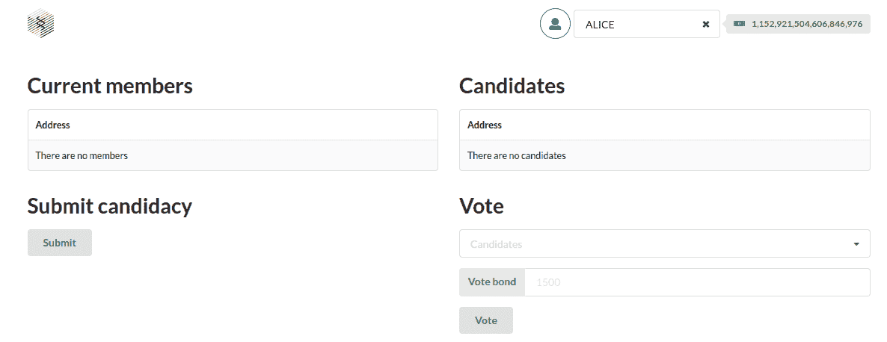
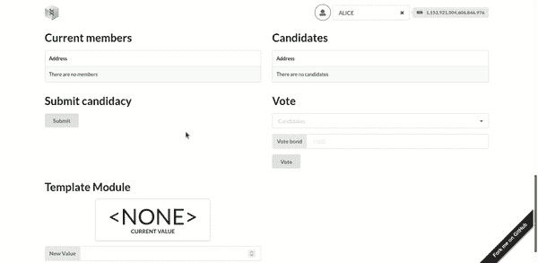

# 介绍

> 原文：<https://github.com/figment-networks/learn-tutorials/blob/master/polkadot/how-to-experiment-with-election-phragmen-pallet.md>

在您学习 Polkadot 协议的过程中，您将会遇到几个托盘，它们在不同的类别中起作用，例如共识、运行时、身份等。但是托盘到底是什么？我们可以将托盘定义为区块链模块，负责区块链的一个方面。例如，如果我们想在我们的区块链进行选举，我们需要安装一个选举托盘！

在本教程中，**您将学习如何使用 Polkadot 本身使用的治理托盘，称为选举 Phragmen** 。我们将建设一个网络中包含选举的区块链。学完本教程后，你将拥有一个可以提交申请和投票的网络。

在我们开始之前，我们需要澄清一件事:什么是治理托盘？治理托盘是解决与区块链的治理相关的问题的托盘。例如，Polkadot 的元素，如选举、民主和议会，都是基于治理托盘实现的。

# 先决条件

虽然**本教程没有正式的先决条件**，我们建议您了解[的基础知识，什么是](https://docs.substrate.io/v3/runtime/frame/#pallets)托盘以及区块链如何工作。这会让你更好的理解教程。

即使没有列出先决条件，也要试一试本教程。我们将尽最大努力确保您不会被说明所迷惑，并理解正在发生的事情。

# 要求

确保安装了 Node v14+和 yarn。你还需要[设置你的电脑进行基板开发](https://docs.substrate.io/v3/getting-started/installation/)。

# 入门指南

在本教程中，我们将使用基板节点模板来建立我们的区块链。这个模板包含了使用货盘的所有必要结构，所以我们将把 Phragmen 选举货盘添加到这个模板中。

第一个必要的步骤是准备衬底节点模板。为此，克隆节点模板存储库:

```js
git clone https://github.com/substrate-developer-hub/substrate-node-template 
```

之后，进入节点模板文件夹并检查最新的`branch`:

```js
cd substrate-node-template
git checkout latest 
```

最后，编译节点模板(第一次编译可能需要一段时间，所以喝杯咖啡):

```js
cargo build --release 
```

除了节点模板，我们还将使用前端模板，它将成为我们与区块链交互的接口。要安装前端模板:

1 -克隆前端模板库。注意:不要克隆到节点模板目录中，在执行此操作之前退出该目录。

```js
git clone https://github.com/substrate-developer-hub/substrate-front-end-template 
```

2 -进入前端模板目录，检查最新的`branch`:

```js
cd substrate-front-end-template
git checkout latest 
```

3 -使用以下命令安装前端模板依赖项:

```js
yarn install 
```

现在，安装了两个模板，让我们安装必要的托盘。安装完成后，我们将返回前端模板，对界面进行一些更改。

## 将选举短语添加到节点模板中

由于我们要安装选举 Phragmen 货盘，我们还需要安装其依赖项，即选举 Phragmen 货盘使用的货盘:

*   pallet-collective:我们将使用这个 pallet 在我们的区块链上实例化一个议会。每当选举结束时，当选的帐目都会加入本局。每当我们使用托盘选举短语时，我们都必须使用它，因为它是该托盘的依赖项。
*   托盘-平衡:这种托盘对于几乎任何其他托盘都是必不可少的，并且是我们 phragmén election 托盘的依赖项，它负责处理帐户和平衡。(**已经安装在节点模板**中)

要添加选举 Phragmen 和集体货盘，请遵循以下步骤:

1 -输入节点模板的根目录

2 -在文本编辑器中打开`runtime/Cargo.toml`配置文件

3 -将`pallet-elections-phragmen`和`pallet-collective`板条箱添加到依赖列表，这样它们将可用于节点模板运行时。

```js
[dependencies.pallet-collective]
default-features = false
git = 'https://github.com/paritytech/substrate.git'
tag = 'devhub/latest'
version = '4.0.0-dev'

[dependencies.pallet-elections-phragmen]
default-features = false
git = 'https://github.com/paritytech/substrate.git'
tag = 'devhub/latest'
version = '5.0.0-dev' 
```

4 -现在，通过在`features`部分添加以下行，在标准特征集中添加托盘-选举-phragmen 和托盘-集合板条箱:

```js
[features]
default = ['std']
std = [
    ...
    'pallet-aura/std',
    'pallet-balances/std',
    'pallet-elections-phragmen/std',
    'pallet-collective/std',
    ...
] 
```

如果您忘记在标准功能集中添加新托盘，您可能会看到如下错误:

```js
error: cannot find macro `vec` in this scope
  --> /home/kelvin/.cargo/git/checkouts/substrate-7e08433d4c370a21/e6fbbd5/primitives/npos-elections/src/phragmms.rs:52:20
   |
52 |     let mut winners = vec![];
   |                       ^^^
   |
   = note: consider importing one of these items:
           codec::alloc::vec
           crate::sp_std::vec
           scale_info::prelude::vec
           sp_std::vec

    Checking sp-api v4.0.0-dev (https://github.com/paritytech/substrate.git?tag=devhub/latest#e6fbbd5c)
error: could not compile `sp-npos-elections` due to previous error 
```

要修复此错误，只需返回步骤 4，并在标准功能集中正确添加新托盘。

5 -最后，我们需要检查依赖项是否正确解析，为此，请使用以下命令:

```js
cargo check -p node-template-runtime 
```

## 实现选举短语和集体配置特征

现在我们需要实现已经添加的托盘的`Config`特征。所有的货盘都有一个名为`Config`的特征，从这个特征出发，我们可以按照我们想要的方式定制货盘。这里提到的添加其他托盘的步骤非常相似，所改变的是您将添加的托盘类型。

配置特征的实现基于两个模块:`parameter_types!`和`impl`。`parameter_types!`块用于定义常量值，而`impl`块是设置由`Config`特征定义的类型和值的地方。

让我们从实现集合托盘的配置特征开始:

1 -在文本编辑器中打开运行时/src/lib.rs 文件。

2 -在文件中查找实现平衡托盘配置特征的部分。您正在寻找的代码片段应该如下所示:

```js
parameter_types! {
	pub const ExistentialDeposit: u128 = 500;
	pub const MaxLocks: u32 = 50;
}

impl pallet_balances::Config for Runtime {
	type MaxLocks = MaxLocks;
	type MaxReserves = ();
	type ReserveIdentifier = [u8; 8];
	/// The type for recording an account's balance.
	type Balance = Balance;
	/// The ubiquitous event type.
	type Event = Event;
	type DustRemoval = ();
	type ExistentialDeposit = ExistentialDeposit;
	type AccountStore = System;
	type WeightInfo = pallet_balances::weights::SubstrateWeight<Runtime>;
}
```

3–找到该部分后，在天平托盘代码块的最后一行后添加以下代码块:

```js
parameter_types! { 
	pub const MaxProposals: u32 = 100;
	pub const MotionDuration: BlockNumber = 28_800;
	pub const CouncilMaxMembers: u32 = 100;
}

impl pallet_collective::Config for Runtime { 
	type Event = Event;
	type WeightInfo = ();
	type Origin = Origin;
	type Proposal = Call;
	type MaxProposals = MaxProposals;
	type MotionDuration = MotionDuration;
	type MaxMembers = CouncilMaxMembers;
	type DefaultVote = pallet_collective::PrimeDefaultVote;
}
```

您刚刚放入的代码块负责设置集体货盘。区块链将由这样的配置构建，现在让我们设置选举 Phragmen 托盘:

1 -从同一文件中的`frame_support`导入`LockIdentifier`(运行时/src/lib.rs):

```js
// A few exports that help ease life for downstream crates.
pub use frame_support::{
    ...
	construct_runtime, parameter_types,
	traits::{KeyOwnerProofSystem, Randomness, StorageInfo, LockIdentifier},
	...
};
```

2 -在我们之前插入的集合托盘代码块的最后一行之后添加以下代码块:

```js
parameter_types! {
	pub const PhragmenElectionPalletId: LockIdentifier = *b"phrelect";
	pub const ElectionsPhragmenCandidacyBond: Balance = 1000;
	pub const ElectionsPhragmenVotingBondBase: Balance = 100;
	pub const ElectionsPhragmenVotingBondFactor: Balance = 50;
	pub const ElectionsPhragmenDesiredMembers: u32 = 1;
	pub const ElectionsPhragmenDesiredRunnersUp: u32 = 2;
	pub const ElectionsPhragmenTermDuration: BlockNumber = 2 * MINUTES;
}

impl pallet_elections_phragmen::Config for Runtime {
	type Event = Event;
	type Currency = Balances;
	type PalletId = PhragmenElectionPalletId;
	type ChangeMembers = Collective;
	type InitializeMembers = Collective;
	type CurrencyToVote = frame_support::traits::U128CurrencyToVote;
	type CandidacyBond = ElectionsPhragmenCandidacyBond;
	type VotingBondBase = ElectionsPhragmenVotingBondBase;
	type VotingBondFactor = ElectionsPhragmenVotingBondFactor;
	type LoserCandidate = ();
	type KickedMember = ();
	type DesiredMembers = ElectionsPhragmenDesiredMembers;
	type DesiredRunnersUp = ElectionsPhragmenDesiredRunnersUp;
	type TermDuration = ElectionsPhragmenTermDuration;
	type WeightInfo = ();
}
```

有了这个模块，我们就有了第二个托盘。注意这个托盘对`impl`块中的天平和集合托盘的依赖性:`Currency`类型基于天平托盘，`ChangeMembers`和`InitializeMembers`类型依赖于集合托盘。

设置好托盘后，我们需要将它们添加到`construct_runtime!`宏中:

```js
construct_runtime!(
    pub enum Runtime where
        Block = Block,
        NodeBlock = opaque::Block,
        UncheckedExtrinsic = UncheckedExtrinsic
    {
        // ...
        // Add these lines
        ElectionsPhragmen: pallet_elections_phragmen,
		    Collective: pallet_collective,
        // ...
    }
);
```

在所有这些之后，我们需要做的最后一步是更新`GenesisConfig`，这样当我们运行区块链时，我们的新托盘将初始化它们的存储状态。

1 -要访问`GenesisConfig`，在文本编辑器中打开 node/src/chain_spec.rs 文件。

2 -从节点模板运行时导入新托盘的配置(您必须在文件的初始部分添加这些行):

```js
use node_template_runtime::{ElectionsPhragmenConfig};
use node_template_runtime::{CollectiveConfig};
```

3 -搜索函数`testnet_genesis`并添加以下几行:

```js
/// Configure initial storage state for FRAME modules.
fn testnet_genesis(
	wasm_binary: &[u8],
	initial_authorities: Vec<(AuraId, GrandpaId)>,
	root_key: AccountId,
	endowed_accounts: Vec<AccountId>,
	_enable_println: bool,
) -> GenesisConfig {
	GenesisConfig {
        // ...
        // Add these lines
		collective: CollectiveConfig {
			members: vec![],
			phantom: Default::default(),
		},
		elections_phragmen: ElectionsPhragmenConfig {
			members: vec![],
		},
        // ...
	}
}
```

最后，我们可以验证一切都按计划进行。为此，请使用以下命令检查依赖关系是否正确解析:

```js
cargo check -p node-template-runtime 
```

在此步骤中，您可能会看到如下错误:

```js
error[E0412]: cannot find type `LockIdentifier` in this scope
     --> /home/kelvin/www/substrate-node-template/runtime/src/lib.rs:277:38
      |
  277 |     pub const PhragmenElectionPalletId: LockIdentifier = *b"phrelect";
      |                                         ^^^^^^^^^^^^^^ not found in this scope
      |
  help: consider importing this type alias
      |
  9   | use frame_support::traits::LockIdentifier;
      | 
```

上述错误意味着您最终忘记了在 Elections Phragmén pallet 配置的步骤 1 中导入 LockIdentifier。

```js
error[E0412]: cannot find type `Collective` in this scope
     --> /home/kelvin/www/substrate-node-template/runtime/src/lib.rs:291:27
      |
  291 |     type InitializeMembers = Collective;
      |                              ^^^^^^^^^^ not found in this scope

  error[E0277]: the trait bound `Event: From<pallet_collective::Event<Runtime>>` is not satisfied
     --> /home/kelvin/www/substrate-node-template/runtime/src/lib.rs:266:2
      |
  266 |     type Event = Event;
      |     ^^^^^^^^^^^^^^^^^^^ the trait `From<pallet_collective::Event<Runtime>>` is not implemented for `Event`
      | 
```

上述错误意味着你最终忘记将新托盘添加到`construct_runtime!`宏中。

如果没有错误，我们准备编译我们的区块链！要执行编译，请使用以下命令:

```js
cargo build --release 
```

## 启动区块链

如果编译正确，我们就可以使用以下命令启动我们的区块链了:

```js
./target/release/node-template --dev 
```

该命令将在开发模式下运行我们的区块链，这意味着我们的区块链将在停止时删除所有保存的数据。使用这种模式可以保证每次使用时都有一个干净的区块链。

## 启动前端模板

随着区块链的运行，我们现在也可以运行前端模板。为此，只需访问前端模板的根文件夹并运行以下命令:

```js
yarn start 
```

该命令将编译并运行前端模板，该模板可以从位于 [http://localhost:8000](http://localhost:8000) 的浏览器中访问

## 将选举组件添加到前端模板

虽然我们可以使用 Pallet Interactor 前端模板与选举 Phragmen pallet 进行交互，但用户体验并不是最好的。因此**我们将通过专门为这个托盘**创建一个组件来改善选举 Phragmen 托盘的用户体验。

1 -转到前端模板的根文件夹，在/src 目录下创建一个新的`Election.js`文件。

2 -在该文件中，复制并粘贴以下代码块:

```js
import React, { useEffect, useState } from 'react';
import { Grid, Table, Button, Message, Form, Input, Dropdown } from 'semantic-ui-react';
import { web3FromSource } from '@polkadot/extension-dapp';

import { useSubstrate } from './substrate-lib';

function Main (props) {
  const { api } = useSubstrate();
  const { accountPair } = props;

  const [members, setMembers] = useState(null);
  const [candidates, setCandidates] = useState(null);
  const [candidacyError, setCandidacyError] = useState(null);
  const [candidatesOptions, setCandidatesOptions] = useState([]);
  const [voteError, setVoteError] = useState(null);

  const initFormState = {
    selectedCandidate: '',
    voteBond: ''
  };

  const [formState, setFormState] = useState(initFormState);
  const { selectedCandidate, voteBond } = formState;

  const getFromAcct = async () => {
    const {
      address,
      meta: { source, isInjected }
    } = accountPair;
    let fromAcct;

    // signer is from Polkadot-js browser extension
    if (isInjected) {
      const injected = await web3FromSource(source);
      fromAcct = address;
      api.setSigner(injected.signer);
    } else {
      fromAcct = accountPair;
    }

    return fromAcct;
  };

  const submitCandidacy = async () => {
    const fromAcct = await getFromAcct();

    await api.tx.electionsPhragmen
      .submitCandidacy(...[candidates.length])
      .signAndSend(fromAcct, () => setCandidacyError(false))
      .catch(() => setCandidacyError(true));
  };

  const submitVote = async () => {
    const fromAcct = await getFromAcct();

    await api.tx.electionsPhragmen
      .vote(...[[selectedCandidate], Number(voteBond)])
      .signAndSend(fromAcct, () => setVoteError(false))
      .catch(() => setVoteError(true));
  };

  useEffect(() => {
    async function subscribeToCandidatesQuery () {
      const subscriptionFunction = (result) => {
        setCandidates([...result]);

        const candidatesList = result.map(candidate => {
          return {
            key: candidate[0].toString(),
            text: candidate[0].toString(),
            value: candidate[0].toString()
          };
        });
        setCandidatesOptions(candidatesList);
      };

      const candidatesQuery = await api.query.electionsPhragmen.candidates(...[], subscriptionFunction);
      return candidatesQuery;
    }

    async function subscribeToMembersQuery () {
      const subscriptionFunction = (result) => {
        setMembers([...result]);
      };

      const membersQuery = await api.query.electionsPhragmen.members(...[], subscriptionFunction);
      return membersQuery;
    }

    subscribeToCandidatesQuery();
    subscribeToMembersQuery();
  }, [api.query.electionsPhragmen]);

  return (
    <>
    <Grid.Row>
      <Grid.Column>
        <h1>Current members</h1>
        <Table celled striped size='small'>
          <Table.Body>
            <Table.Row>
              <Table.Cell>
                <strong>Address</strong>
              </Table.Cell>
            </Table.Row>
            {members != null && members.length !== 0
              ? members.map(member =>
              <Table.Row key={member.who.toString()}>
                <Table.Cell>
                  {member.who.toString()}
                </Table.Cell>
              </Table.Row>
              )
              : <Table.Row><Table.Cell>There are no members</Table.Cell></Table.Row>}
          </Table.Body>
        </Table>
      </Grid.Column>
      <Grid.Column>
        <h1>Candidates</h1>
        <Table celled striped size='small'>
          <Table.Body>
            <Table.Row>
              <Table.Cell>
                <strong>Address</strong>
              </Table.Cell>
            </Table.Row>
            {candidates != null && candidates.length !== 0
              ? candidates.map(candidate =>
              <Table.Row key={candidate[0].toString()}>
                <Table.Cell>
                  {candidate[0].toString()}
                </Table.Cell>
              </Table.Row>
              )
              : <Table.Row><Table.Cell>There are no candidates</Table.Cell></Table.Row>}
          </Table.Body>
        </Table>
      </Grid.Column>
      </Grid.Row>
      <Grid.Row>

      <Grid.Column>
        <h1>Submit candidacy</h1>
        <Button onClick={submitCandidacy}>
          Submit
        </Button>
        {candidacyError !== null && (
          candidacyError === false
            ? <Message info>
                <Message.Header>
                  Candidacy submitted
                </Message.Header>
                Check the event history to see if the candidacy has been accepted
              </Message>
            : <Message negative>
                <Message.Header>
                  Unable to submit application
                </Message.Header>
              </Message>
        )}
      </Grid.Column>
      <Grid.Column>
        <h1>Vote</h1>
        {candidates !== null &&
          <Form>
            <Form.Field>
              <Dropdown
                placeholder='Candidates'
                fluid
                label='Candidate'
                onChange={(e, data) => setFormState({ selectedCandidate: data.value, voteBond: voteBond })}
                selection
                state='selectedCandidate'
                value={selectedCandidate}
                options={candidatesOptions}
              />
            </Form.Field>
            <Form.Field>
              <Input
                placeholder="1500"
                fluid
                type='text'
                label="Vote bond"
                state='voteBond'
                value={voteBond}
                onChange={(e, data) => setFormState({ selectedCandidate: selectedCandidate, voteBond: data.value })}
              />
            </Form.Field>
            <Form.Field>
              <Button onClick={submitVote}>
                Vote
              </Button>
            </Form.Field>
          </Form>}
          {voteError !== null && (
            voteError
              ? <Message negative>
                <Message.Header>
                  Unable to submit application
                </Message.Header>
              </Message>
              : <Message info>
                <Message.Header>
                  Vote submitted
                </Message.Header>
                Check the event history to see if your vote has been accepted
              </Message>
          )}
      </Grid.Column>
      </Grid.Row>
    </>
  );
}

export default function Election (props) {
  const { api } = useSubstrate();
  return api.tx ? <Main {...props} /> : null;
}
```

哇哦！代码太多了！虽然代码很多，但大部分是由 React.js 框架的冗长组成的。因此，让我们将这段代码分成几个部分，以试图理解发生了什么。我们的组件将呈现 4 个元素。要在代码中找到它们，只需查看返回值中的代码，看看选举组件呈现的是哪 4 个元素。

```js
// src/Election.js

return (
    <>
    <Grid.Row>
// ...
```

在您刚刚找到的代码片段中，您可以找到由我们的组件呈现的 4 个元素:

*   当前成员的表，这些成员是上次选举中获胜的帐户。
*   当前候选人的表格，这些是当前选举中运行的帐户。
*   提交候选资格的部分。
*   提交投票的部分。

那么，所有这些元素是如何工作的呢？**它们都依赖于前端模板**中的 API，该模板自动检测区块链的托盘，并提供每个托盘的所有功能和变量。你可以在`Main`函数的开头找到这个 API，你会注意到它被用于所有与区块链的交互。

为了获取候选表和成员表中使用的数据，我们使用 API 执行查询，自动返回该数据的订阅函数。这是什么意思？这意味着每当成员和候选人数据发生变化时，比如在选举结束时，订阅将收到这些更新，我们的数据表也将得到更新。您可以在 useEffect 块中看到与这些函数的交互。

好了，已经解释了数据消费，但是与选举 Phragmen pallet 的交互如何呢？交互有点不同，对他们来说，我们需要将必要的数据(在候选人和投票表单中收集的)放在一起，然后在签名事务中发送。看一看`submitCandidacy`和`submitVote`函数，以便更好地理解与选举短语托盘的交互是如何工作的。

好了，在对一个大得吓人的文件进行了长时间的解释之后，我们需要执行最后一步:将选举组件添加到前端模板中。

1 -在文本编辑器中打开 src/App.js 文件

2 -在文件的开头，在最后一次导入之后添加`Election`组件的导入:

```js
import Upgrade from './Upgrade';

// Add this line
import Election from './Election';
```

3 -将`Election`组件添加到应用网格:

```js
<Grid.Row>
    <Interactor accountPair={accountPair} />
    <Events />
</Grid.Row>

// Add this line
<Election accountPair={accountPair} />

<Grid.Row>
    <TemplateModule accountPair={accountPair} />
</Grid.Row>
```

最后，**你已经准备好尝试选举 Phragmen 托盘！**继续运行测试，创建投票，选举成员，竞选，等等。

[](https://raw.githubusercontent.com/figment-networks/learn-tutorials/master/assets/electionComponentPreview.png?raw=true)

下面的 gif 展示了我们在本教程中开发的应用程序的一些特性。请注意，我们使用 Alice 的帐户申请选举，然后切换到 Bob 的帐户为 Alice 投票。

[](https://raw.githubusercontent.com/figment-networks/learn-tutorials/master/assets/electionsPreview.gif?raw=true)

# 结论

恭喜你！我们成功地建立了一个举行选举的区块链。我们向区块链添加并配置了治理托盘，并创建了一个独特的组件来与选举短语托盘进行交互。您可以对选举组件进行改进，也可以对托盘的配置特性进行更改(比如成员数量)。

# 关于作者

本教程由[开尔文·韦尔特](https://github.com/kelvinwelter)创作。

# 参考

[波尔卡多特顺序法文件](https://wiki.polkadot.network/docs/learn-phragmen) [选举法文件](https://docs.substrate.io/rustdocs/latest/pallet_elections_phragmen/index.html)