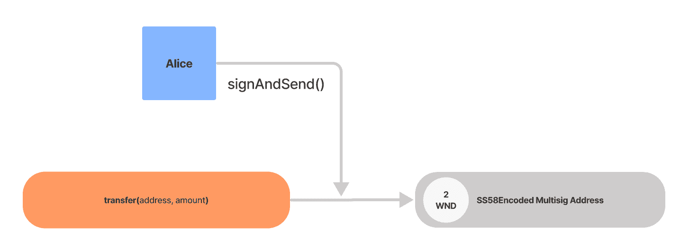
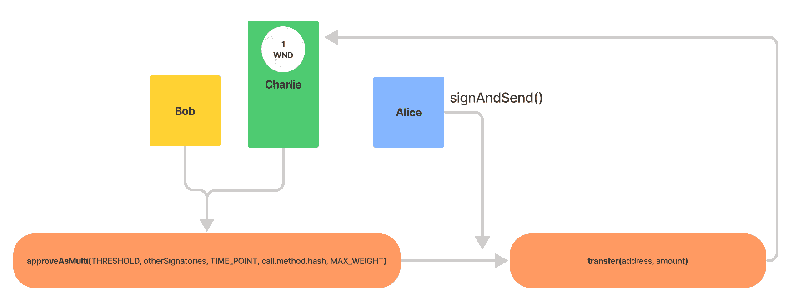

# 介绍

> 原文:[https://github . com/fig ment-networks/learn-tutorials/blob/master/polkadot/implement-multisig-accounts-on-polkadot . MD](https://github.com/figment-networks/learn-tutorials/blob/master/polkadot/implement-multisig-accounts-on-polkadot.md)

在本教程中，我们将介绍创建 multisig 的过程，multisig 是一个在多个地址之间共享交易权限的帐户。单词“multisig”代表“多重签名”。出于本教程的目的，我们将生成两个额外的帐户，并确保它们都有足够的 WND 来支付现有存款并发送一些交易。这些将用于模拟 multisig 钱包的其他签名方。

我们将在 JavaScript 中构建一个新的命令行应用程序来处理在 Westend 上创建和使用这个 multisig 帐户的操作，尽管相同的概念和大部分代码仍然适用于 Polkadot 或其他基于区块链的 Substrate。

这个概念有许多潜在的应用，但是对于本教程，我们主要关注的是帐户安全的附加层。这个功能是许多 Dao 和类似治理结构的核心。多签名账户本身就是一种链上治理形式，多签名通常需要积极参与。

查看 [Polkadot API 文档](https://polkadot.js.org/docs/substrate)，获取所有相关 API 元数据的摘要。


> 来自 Polkadot JS API 文档:

> *可以在基于基底的链中创建多签名账户。多签名帐户由一个或多个地址和一个阈值组成。该阈值定义了为了呼叫成功，需要多少签名者(参与地址)同意外部的提交。*
> 
> 例如，爱丽丝、鲍勃和查理设置了一个阈值为 2 的多重签名。这意味着 Alice 和 Bob 可以执行任何调用，即使 Charlie 不同意。同样，Charlie 和 Bob 可以在没有 Alice 的情况下执行任何调用。阈值通常小于成员总数，但也可以等于成员总数，这意味着它们必须一致。

另外:

> *多签名账户**创建后不能修改**。改变成员的集合或改变阈值是不可能的，而是需要解散当前的多重签名并创建一个新的多重签名。因此，多签名帐户地址是**确定性的**，也就是说，您总是可以通过知道成员和阈值来计算多签名的地址，而无需帐户存在。这意味着可以向尚不存在的地址发送令牌，并且如果被指定为接收者的实体在匹配阈值下聚集在新的多重签名中，则它们将立即能够访问这些令牌。*

*也:*

> 虽然 Westend 旨在尽可能地复制 Polkadot mainnet，但还是有一些显著的不同:
> 
> *   存在保证金等于 0.01 WND(衣装；Westend 的原生币)而不是 1 点。
> *   多签名交易存款相当于 1 WND，而不是 20.2 点。

# 设置

这不是一个要求，但是完成波尔卡多特[路径](/figment-networks/learn-tutorials/blob/master/polkadot-pathway.md)和[社会康复](/figment-networks/learn-tutorials/blob/master/polkadot/implement-social-recovery-on-polkadot.md)教程形成了一个强大的理解基础，这将增强本教程。

作为 Windows 10 用户，满足这些要求并保持灵活性的最简单方法是安装 [WSL2](https://docs.microsoft.com/en-us/windows/wsl/install-win10) 和[vs code](https://code.visualstudio.com/download)——vs code 内部的终端窗口可以利用任何 shell，从 bash 到 PowerShell。Linux 和 macOS 用户将不再需要 WSL2，可以使用他们选择的任何终端应用程序和文本编辑器。

*   安装 Node.js，最好带有版本管理工具- [nvm](https://github.com/nvm-sh/nvm) 或 [fnm](https://github.com/Schniz/fnm) 是流行的选择
*   像 [npm](https://npmjs.org) 或 [yarn](https://yarnpkg.com/) 这样的包管理器——安装会因操作系统而异

本教程有以下两个依赖项，必须通过软件包管理器安装:

*   [dotenv](https://www.npmjs.com/package/dotenv)
*   [@polkadot/api](https://www.npmjs.com/package/@polkadot/api)

## 初始化项目目录

```
mkdir polkadot_ms
cd polkadot_ms
npm init -y
npm install --save dotenv @polkadot/api 
```

当我们将所有这四个命令复制并粘贴到终端中时，前三个命令将按顺序执行，因为它们在行尾有一个不可见的回车(enter)字符。`mkdir polkadot_ms`将创建一个名为`polkadot_ms`的新子目录，然后`cd`命令改变工作目录。`npm init -y`将默认`package.json`的内容输出到终端。此时，`npm install`部分将在命令行上，但是我们仍然必须**按 enter** 来开始安装过程。

安装过程完成后，在项目目录中创建一个`.env`文件。为了方便起见，复制并粘贴下面的模板。在我们方便的[快速参考指南](/figment-networks/learn-tutorials/blob/extra-guides/dotenv-and-.env.md)中阅读更多关于`dotenv`的信息。另外，记得用来自 [Polkadot 服务仪表板](https://datahub.figment.io/services/polkadot)的有效数据中心 API 键替换`API_KEY`。

将以下内容粘贴到您的`.env`文件中:

```
DATAHUB_URL=https://polkadot-westend--rpc.datahub.figment.io/apikey/API_KEY

MULTISIG_ADDRESS=

ALICE_ADDRESS=
ALICE_MNEMONIC= 

BOB_ADDRESS=
BOB_MNEMONIC=

CHARLIE_ADDRESS= 
CHARLIE_MNEMONIC= 
```

## 创建 3 个帐户

创建一个名为`create_account.js`的文件，并粘贴以下代码:

```
// create_account.js
const { ApiPromise, Keyring } = require('@polkadot/api');
const { HttpProvider } = require('@polkadot/rpc-provider');
const { mnemonicGenerate } = require('@polkadot/util-crypto');
require("dotenv").config();

const main = async () => {
  const httpProvider = new HttpProvider(process.env.DATAHUB_URL);
  const api = await ApiPromise.create({ provider: httpProvider });
  const keyring = new Keyring({type: 'sr25519'});

  const mnemonic = mnemonicGenerate();
  const newAccount = await keyring.addFromUri(mnemonic);
  console.log(`address: ${newAccount.address}`);
  console.log(`mnemonic: ${mnemonic}`);
};

main().catch((err) => {console.error(err)}).finally(() => process.exit());
```

在终端窗口中，运行`node create_account.js` 3 ( *三次*，以生成我们需要的数据。将每个新账户的助记符&地址复制/粘贴到提供的`.env`模板中。

*   `Alice`:我们将在 multisig 钱包中使用的账户。
*   `Bob` & `Charlie`:这些账户代表 multisig 中的其他参与者。

通过访问[https://水龙头. figment.io](https://faucet.figment.io) 并输入我们为爱丽丝生成的地址，为爱丽丝帐户注入资金。这将为该帐户提供足够的 WND 代币，以便我们完成教程，并留下许多测试。由于我们将需要支付教程期间的交易费用，因此也有必要将一些代币转移到其他帐户。

多签名帐户有三种操作类型。执行通话、批准通话或取消通话。

# 创建多签名账户

[](https://github.com/figment-networks/learn-tutorials/raw/master/assets/encode_flow-fix.png)

创建一个名为`create_multisig.js`的文件，并粘贴以下代码:

```
const { ApiPromise, Keyring } = require('@polkadot/api');
const { sortAddresses, encodeMultiAddress } = require('@polkadot/util-crypto');
const { HttpProvider } = require('@polkadot/rpc-provider');
require("dotenv").config();

const main = async () => {
  const httpProvider = new HttpProvider(process.env.DATAHUB_URL);
  const api = await ApiPromise.create({ provider: httpProvider });
  const keyring = new Keyring({type: 'sr25519'});

  // 1\. Define relevant constants
  const INDEX = 0;
  const THRESHOLD = 2;
  const SS58PREFIX = 0;
  const AMOUNT_TO_SEND = 1000000000000;

  // 2\. Initialize accounts
  const Alice = keyring.addFromUri(process.env.ALICE_MNEMONIC);
  const Bob = keyring.addFromUri(process.env.BOB_MNEMONIC);
  const Charlie = keyring.addFromUri(process.env.CHARLIE_MNEMONIC);
  const addresses = [
    Alice.address,   // addresses[0]
    Bob.address,     // addresses[1]
    Charlie.address, // addresses[2]
  ];

  // 3\. Create Multisig (with optional SS58PREFIX)
  const multisig = encodeMultiAddress(addresses, THRESHOLD);
  console.log(`Multisig Address: ${multisig}\n`);

  // 4\. Filter out the sender
  const otherSignatories = addresses.filter((who) => who !== addresses[INDEX]);
  const otherSignatoriesSorted = sortAddresses(otherSignatories);
  console.log(`Other Signatories: ${JSON.stringify(otherSignatoriesSorted, null, 2)}\n`);  

  // 4\. Define an array of transactions
  const transactions = [
     api.tx.balances.transfer(Bob.address, AMOUNT_TO_SEND),
     api.tx.balances.transfer(Charlie.address, AMOUNT_TO_SEND),
  ];

  // 5\. Batch sending 1 WND to the other addresses
  // This is necessary to be able to sign and send transactions
  // with those accounts.
  const txHash = await api.tx.utility
    .batch(transactions)
    .signAndSend(Alice);
  console.log(`Sending 1 WND from ${Alice.address} to ${otherSignatories}`); 
  console.log(`transfer tx: https://westend.subscan.io/extrinsic/${txHash}`);
};

main().catch((err) => { console.error(err) }).finally(() => process.exit());
```

*   `SS58PREFIX`用于对我们的地址进行编码，以便在不同的链上使用。`0`值将对 Polkadot 中继链的 multisig 地址进行编码，因此编码后的地址将以数字`1`开始。奇偶校验团队维护着一个 SS58 类型的[注册表，这在处理各种 para-chain 时可能会派上用场。](https://github.com/paritytech/substrate/blob/master/ss58-registry.json)

*   `INDEX`将用于引用我们的地址在一个地址数组中的索引。更多关于零索引数组的信息，出于好奇。

*   `THRESHOLD`指定批准 Multisig 交易所需的账户数量。可以将阈值设置为相同的总地址数，这意味着在没有完全批准的情况下，不能从该 multisig 发送任何交易，但是在本例中，我们将设置为要求 3 个签名中的 2 个。

*   `otherSignatories`说明了使用`filter()`删除指定索引处的地址。在我们显示过滤后的地址列表之前，`sortAddresses()`函数将按照公钥对其进行排序。通过`JSON.stringify()`记录将会在终端中以更易读的格式显示。

*   `encodeMultiAddress()`是获取地址数组的一部分，`THRESHOLD`&`SS58PREFIX`可选，并返回 multisig 的确定性地址。如果包含 SS58 前缀，将为指定的链对地址进行编码。

用`node create_multisig.js`运行代码:

```
Multisig Address: 5CPnQhU8TCvtbaJQEYEPuYhgbwpeGqhx6uErZJ7QDcaD7aX9

Other Signatories: [
  "5GL63QD2HhXvBMcP9skdjq8H5Znhe7Fke83aWENHPGRMvJSA",
  "5GpDZiUMpdX2GcGJzAZVX36kSGoScraCLEjTTgvhufEokRCX"
]

Sending 1 WND from 5Ekc5BsbkAgSbSYwi4W1CnpYLFzwUDJ4WGvohSzNcau2ZDLp 
to 5GL63QD2HhXvBMcP9skdjq8H5Znhe7Fke83aWENHPGRMvJSA, 5GpDZiUMpdX2GcGJzAZVX36kSGoScraCLEjTTgvhufEokRCX
transfer tx: https://westend.subscan.io/extrinsic/... 
```

> 记住将 Multisig 地址的结果值作为`MULTISIG_ADDRESS`复制并粘贴到`.env`中，为下一步做准备！

# 为多西格账户提供资金

[](https://github.com/figment-networks/learn-tutorials/raw/master/assets/transfer_flow-fix.png)

为 multisig wallet 提供资金是本教程流程中的重要一步，这样它将有足够的可用余额来支付现有存款，并有可用余额来发送进一步的交易。

创建一个名为`fund_multisig.js`的文件，并粘贴以下代码:

```
const { ApiPromise, Keyring } = require('@polkadot/api');
const { HttpProvider } = require('@polkadot/rpc-provider');
const { formatBalance } = require('@polkadot/util/format');
require("dotenv").config();

const main = async () => {
  const httpProvider = new HttpProvider(process.env.DATAHUB_URL);
  const api = await ApiPromise.create({ provider: httpProvider });
  const keyring = new Keyring({type: 'sr25519'});

  // 1\. Define relevant constants
   formatBalance.setDefaults({
    unit: 'WND',
    decimals: 12,
  });

  // 2\. Define relevant constants
  const MULTISIG = process.env.MULTISIG_ADDRESS;
  const AMOUNT_TO_SEND = 2000000000000;
  const displayAmount = formatBalance(AMOUNT_TO_SEND); // 2.0000 WND

  // 3\. Initialize account
  const Alice = keyring.addFromUri(process.env.ALICE_MNEMONIC);

  // 4\. Send 2 WND to multisig account
  const txHash = await api.tx.balances
    .transfer(MULTISIG, AMOUNT_TO_SEND)
    .signAndSend(Alice);
  console.log(`Sending ${displayAmount} from ${Alice.address} to ${MULTISIG}`); 
  console.log(`transfer tx: https://westend.subscan.io/extrinsic/${txHash}`);
};

main().catch((err) => { console.error(err) }).finally(() => process.exit());
```

功能`formatBalance.setDefaults()`使我们能够指定单位名称和小数位数。因为我们在西部试验网上操作，WND 是合适的。正如我们所见，`AMOUNT_TO_SEND`将被指定为一个大数字——2 万亿 pWND ****( **p** 代表 **pico** ，在这种情况下表示一个因子)——尽管我们可以使用`formatBalance()`以可读和预格式化的方式显示它。像这样将`amountToSend`显示在小数点后 12 位会很有用:

```
// 2,000,000,000,000 = 2.0 WND
```

为了完成为指定的 multisig 账户提供资金的操作，从可用余额`Alice`中支付，我们使用`api.tx.balances`访问`transfer()`方法，然后使用`signAndSend()`。这将完成 multisig 账户(提供存在存款)的创建，同时向其转移 2 个 WND。

用`node fund_multisig.js`运行代码:

```
Sending 2.0000 WND 
from 5Ekc5BsbkAgSbSYwi4W1CnpYLFzwUDJ4WGvohSzNcau2ZDLp 
to 5CPnQhU8TCvtbaJQEYEPuYhgbwpeGqhx6uErZJ7QDcaD7aX9
transfer tx: https://westend.subscan.io/extrinsic/... 
```

[订阅扫描](https://westend.subscan.io/)页面将包括这 4 个事件。参考以下成功事件的例子。


# 执行多信令传输

[](https://github.com/figment-networks/learn-tutorials/raw/master/assets/approveasmulti_flow-fix.png)

创建一个名为`transfer_multisig.js`的文件，并粘贴以下代码:

```
const { ApiPromise, Keyring } = require('@polkadot/api');
const { HttpProvider } = require('@polkadot/rpc-provider');
const { formatBalance } = require('@polkadot/util/format')
require("dotenv").config();

const main = async () => {
  const httpProvider = new HttpProvider(process.env.DATAHUB_URL);
  const api = await ApiPromise.create({ provider: httpProvider });
  const keyring = new Keyring({type: 'sr25519'});

  // 1\. Use formatBalance to display amounts
  formatBalance.setDefaults({
    unit: 'WND',
    decimals: 12,
  });

  // 2\. Define relevant constants
  const THRESHOLD = 2;
  const MAX_WEIGHT = 640000000;
  const AMOUNT_TO_SEND = 1000000000000;
  const MULTISIG = process.env.MULTISIG_ADDRESS;
  const displayAmount = formatBalance(AMOUNT_TO_SEND);
  const depositBase = api.consts.multisig.depositBase;
  const depositFactor = api.consts.multisig.depositFactor;

  // 3\. Initialize accounts
  const Alice = keyring.addFromUri(process.env.ALICE_MNEMONIC);
  const Bob = keyring.addFromUri(process.env.BOB_MNEMONIC);
  const Charlie = keyring.addFromUri(process.env.CHARLIE_MNEMONIC);
  const otherSignatories = [
    Bob.address,
    Charlie.address,
  ].sort();

  // 4\. API calls - info is necessary for the timepoint
  const call = api.tx.balances.transfer(Charlie.address, AMOUNT_TO_SEND);
  const info = await api.query.multisig.multisigs(MULTISIG, call.method.hash); 

  // 5\. Set the timepoint
  // If this IS the first approval, then this must be None (null)
  const TIME_POINT = null;
  // If this is NOT the first approval, then it must be Some,
  // with the timepoint (block number and transaction index)
  // of the first approval transaction : 
  // const TIME_POINT = info.unwrap().when;

  // 6\. approveAsMulti 
  const txHash = await api.tx.multisig
    .approveAsMulti(THRESHOLD, otherSignatories, TIME_POINT, call.method.hash, MAX_WEIGHT)
    .signAndSend(Alice);
  console.log(`depositBase   : ${depositBase}`);
  console.log(`depositFactor : ${depositFactor}`);
  console.log(`Sending ${displayAmount} from ${Alice.address} to ${MULTISIG}`); 
  console.log(`Required values  : approveAsMulti(THRESHOLD, otherSignatories, TIME_POINT, call.method.hash, MAX_WEIGHT)`);
  console.log(`Submitted values : approveAsMulti(${THRESHOLD}, otherSignatories: ${JSON.stringify(otherSignatories, null, 2)}, ${TIME_POINT}, ${call.method.hash}, ${MAX_WEIGHT})\n`); 
  console.log(`approveAsMulti tx: https://westend.subscan.io/extrinsic/${txHash}`);  
};

main().catch((err) => { console.error(err) }).finally(() => process.exit());
```

*   `THRESHOLD`和`otherSignatories`应该很熟悉，如果这是 multisig 的首次批准，`TIME_POINT`必须是`null`。`call.method.hash`按照它所说的做，返回一个被传递的方法数据的散列表示。

*   `MAX_WEIGHT`是指调用的最大权重，虽然在 API 文档中没有明确说明，但它与费用计算有关。权重是一个固定的数字，用于管理块验证时间。可以用可选的提示来补充。点击阅读更多关于波尔卡多特交易费的信息。

用`node transfer_multisig.js`运行代码:

```
depositBase   : 1.0044 WND
depositFactor : 1.6000 mWND
Sending 1.0000 WND
 from 5Ekc5BsbkAgSbSYwi4W1CnpYLFzwUDJ4WGvohSzNcau2ZDLp
 to 5CPnQhU8TCvtbaJQEYEPuYhgbwpeGqhx6uErZJ7QDcaD7aX9
Required values  : approveAsMulti(THRESHOLD, otherSignatories, TIME_POINT, call.method.hash, MAX_WEIGHT)
Submitted values : approveAsMulti(2, otherSignatories: [
  "5GL63QD2HhXvBMcP9skdjq8H5Znhe7Fke83aWENHPGRMvJSA",
  "5GpDZiUMpdX2GcGJzAZVX36kSGoScraCLEjTTgvhufEokRCX"
], null, 0xb9533f7199a78343facd0fa13e15a08b3620c75dfe49c37660e832a0cb1ff146, 640000000)

approveAsMulti tx: https://westend.subscan.io/extrinsic/... 
```


# 批准多信号传输

[](https://github.com/figment-networks/learn-tutorials/raw/master/assets/asmulti-flow.png)

创建一个名为`approve_multisig.js`的新文件，并粘贴以下代码:

```
const { ApiPromise, Keyring } = require('@polkadot/api');
const { HttpProvider } = require('@polkadot/rpc-provider');
const { formatBalance } = require('@polkadot/util/format')
require("dotenv").config();

const main = async () => {
  const httpProvider = new HttpProvider(process.env.DATAHUB_URL);
  const api = await ApiPromise.create({ provider: httpProvider });
  const keyring = new Keyring({type: 'sr25519'});

  // 1\. Use formatBalance to display amounts
   formatBalance.setDefaults({
    unit: 'WND',
    decimals: 12,
  });

  // 2\. Set relevant constants
  const THRESHOLD = 2;
  const STORE_CALL = false;
  const MAX_WEIGHT = 640000000;
  const AMOUNT_TO_SEND = 1000000000000;
  const MULTISIG = process.env.MULTISIG_ADDRESS;
  const displayAmount = formatBalance(AMOUNT_TO_SEND);

  // 3\. Initialize accounts
  const Alice = keyring.addFromUri(process.env.ALICE_MNEMONIC);
  const Bob = keyring.addFromUri(process.env.BOB_MNEMONIC);
  const Charlie = keyring.addFromUri(process.env.CHARLIE_MNEMONIC);
  const otherSignatories = [
    Alice.address,
    Charlie.address,
  ].sort();

  // 4\. Send 1 WND to Charlie account
  const call = api.tx.balances.transfer(Charlie.address, AMOUNT_TO_SEND);

  // 5\. Retrieve and unwrap the timepoint
  const info = await api.query.multisig.multisigs(MULTISIG, call.method.hash);
  const TIME_POINT= info.unwrap().when;
  console.log(`Time point is: ${TIME_POINT}`);

  // 6\. Send asMulti transaction
  // Now the multisig call that was initiated by the Alice account
  // to send 1 WND to Charlie can be approved by Bob.
  // Since threshold is set to 2, this approval should dispatch the call
  // (2 approvals received) 
  const txHash = await api.tx.multisig
    .asMulti(THRESHOLD, otherSignatories, TIME_POINT, call.method.toHex(), STORE_CALL, MAX_WEIGHT)
    .signAndSend(Bob);
  console.log(`Sending ${displayAmount} from ${MULTISIG} to ${Charlie.address}`); 
  console.log(`Required values  : asMulti(THRESHOLD, otherSignatories, TIME_POINT, call.method.hash, MAX_WEIGHT)`);
  console.log(`Submitted values : asMulti(${THRESHOLD}, otherSignatories: ${JSON.stringify(otherSignatories, null, 2)}, ${TIME_POINT}, ${call.method.hash}, ${MAX_WEIGHT})\n`); 
  console.log(`asMulti tx: https://westend.subscan.io/extrinsic/${txHash}`);
}

main().catch((err) => { console.error(err) }).finally(() => process.exit());
```

`call.method.toHex()`与`call.method.hash`的不同之处在于`toHex()`只传递方法的十六进制表示，而不是完整的方法散列。

如果我们遇到了`Error: Option: unwrapping a None value`,这意味着 API 查询上的`unwrap()`调用遇到了一个 None 值，而它需要的是某个值(一个有效的时间点)。这很可能是由于`api.query.multisig.multisigs()`没有相关的时间点——表示没有任何`approveAsMulti()`呼叫。本质上，在这种情况下没有数据可以依据——可能是因为试图在`transfer_multisig.js`之前运行`approve_multisig.js`。

用`node approve_multisig.js`运行代码:

```
Time point is: {"height":5556711,"index":2}
Sending 1.0000 WND 
from 5CPnQhU8TCvtbaJQEYEPuYhgbwpeGqhx6uErZJ7QDcaD7aX9 
to 5GpDZiUMpdX2GcGJzAZVX36kSGoScraCLEjTTgvhufEokRCX
asMulti tx: https://westend.subscan.io/extrinsic/... 
```

# 取消多信号传输

创建一个名为`cancel_multisig.js`的新文件，并粘贴以下代码:

```
const { ApiPromise, Keyring } = require('@polkadot/api');
const { HttpProvider } = require('@polkadot/rpc-provider');
const { formatBalance } = require('@polkadot/util/format')
require("dotenv").config();

const main = async () => {
  const httpProvider = new HttpProvider(process.env.DATAHUB_URL);
  const api = await ApiPromise.create({ provider: httpProvider });
  const keyring = new Keyring({type: 'sr25519'});

  // 1\. Use formatBalance to display amounts
   formatBalance.setDefaults({
    unit: 'WND',
    decimals: 12,
  });

  // 2\. Set relevant constants
  const THRESHOLD = 2;
  const STORE_CALL = false;
  const MAX_WEIGHT = 640000000;
  const AMOUNT_TO_SEND = 1000000000000;
  const MULTISIG = process.env.MULTISIG_ADDRESS;
  const displayAmount = formatBalance(AMOUNT_TO_SEND);

  // 3\. Initialize accounts
  const Alice = keyring.addFromUri(process.env.ALICE_MNEMONIC);
  const Bob = keyring.addFromUri(process.env.BOB_MNEMONIC);
  const Charlie = keyring.addFromUri(process.env.CHARLIE_MNEMONIC);
  const otherSignatories = [
    Alice.address,
    Charlie.address,
  ].sort();

  // 4\. Send 1 WND to Charlie account
  // This is the multisig transaction we want to cancel
  const call = api.tx.balances.transfer(Charlie.address, AMOUNT_TO_SEND);

  // 5\. Retrieve and unwrap the timepoint
  const info = await api.query.multisig.multisigs(MULTISIG, call.method.hash);
  const TIME_POINT= info.unwrap().when;
  console.log(`Time point is: ${TIME_POINT}`);

  // 6\. Cancel asMulti transaction
  const txHash = await api.tx.multisig
   .cancelAsMulti(THRESHOLD, otherSignatories, TIME_POINT, call.method.hash)
   .signAndSend(Bob);
  console.log(`Sending ${displayAmount} from ${MULTISIG} to ${Charlie.address}`); 
  console.log(`Required values  : cancelAsMulti(THRESHOLD, otherSignatories, TIME_POINT, call.method.hash)`);
  console.log(`Submitted values : cancelAsMulti(${THRESHOLD}, otherSignatories: ${JSON.stringify(otherSignatories, null, 2)}, ${TIME_POINT}, ${call.method.hash})\n`); 
  console.log(`cancelAsMulti tx: https://westend.subscan.io/extrinsic/${txHash}`);
}

main().catch((err) => { console.error(err) }).finally(() => process.exit());
```

在本教程的正常过程中，没有必要运行这段代码，为了完整起见，这里主要包括了这段代码。这在多签名批准交易停滞或因任何原因需要取消时非常有用。如果有必要，或者出于测试目的，用`node cancel_multisig.js`运行代码:

```
Time point is: {"height":5557129,"index":2}
Sending 1.0000 WND 
from 5CPnQhU8TCvtbaJQEYEPuYhgbwpeGqhx6uErZJ7QDcaD7aX9
to 5GpDZiUMpdX2GcGJzAZVX36kSGoScraCLEjTTgvhufEokRCX
Required values  : cancelAsMulti(THRESHOLD, otherSignatories, TIME_POINT, call.method.hash)
Submitted values : cancelAsMulti(2, otherSignatories: [
  "5GL63QD2HhXvBMcP9skdjq8H5Znhe7Fke83aWENHPGRMvJSA",
  "5GpDZiUMpdX2GcGJzAZVX36kSGoScraCLEjTTgvhufEokRCX"
], {"height":5557129,"index":2}, 0xb9533f7199a78343facd0fa13e15a08b3620c75dfe49c37660e832a0cb1ff146)

cancelAsMulti tx: https://westend.subscan.io/extrinsic/0x774822d10f1159f12491bf9351a7b043100ccac88f5ed2c34ab1eac07fe190fe 
```

# 结论

恭喜你！本教程介绍了使用 Polkadot JS API 创建和使用 multisig 帐户。我们现在能够使用需要多次授权的账户来发起、批准和取消交易。这一功能使得许多其他令人惊叹的东西可以在 Polkadot 上构建，我们都期待看到您使用 multisig 帐户构建的东西。