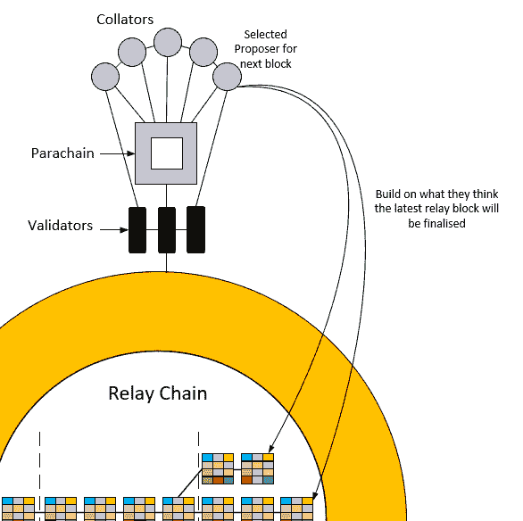
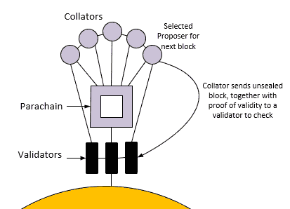

# polkadot/parachain-lifecycle

> 原文：<https://github.com/figment-networks/learn-tutorials/blob/master/polkadot/parachain-lifecycle.md>

本指南将重点关注波尔卡多特副链的生命周期，这是波尔卡多特生态系统不可或缺的一部分。最终用户或开发人员将了解副链将如何运行，以及他们可以参与副链生命周期的方式——从支持副链候选到开发副链的注意事项以及部署时的预期。

# 先决条件

建议您已经阅读过 [Polkadot 区块链术语](https://learn.figment.io/tutorials/polkadot-blockchain-terms)指南，并熟悉以下内容:

*   代码背后的 Polkadot，[第 1 集](https://www.youtube.com/watch?v=GcOKXAOh4Xw)
*   了解波尔卡多特的建筑:[波尔卡多特:你准备好开始建造了吗？](https://www.youtube.com/watch?v=_-k0xkooSlA)。
*   【Polkadot 入门。
*   熟悉区块链计算和网络术语。

# 副链生命周期

## 副链概述

副链本质上是中继链的客户端。中继链*像路由器一样中继*信息。中继链上的副链插槽类似于路由器端口。副链插槽也可以被认为是具有共享资源的服务器；只有有限数量的副链槽。

可能只有几个槽每几个月解锁一次。目前的目标是最终在 Polkadot 上提供 100 个 parachain 插槽。

插槽的这种限制需要不同的分配方法，例如:

*   [并行线程](https://wiki.polkadot.network/docs/en/learn-parathreads)
*   [普通好的副链](https://wiki.polkadot.network/docs/en/learn-parachains#common-good-parachains)
*   [拍卖授予的副链](https://wiki.polkadot.network/docs/en/learn-auction)

副链采取区块链的形式，但它们不必是真正的区块链。

副链由被称为 [*整理器*](https://wiki.polkadot.network/docs/en/learn-collator) 的网络维护者维护。

以一条副链为例:

*   将会有一个新的候选块的开始，具有一个块创建时间。
*   整理器将位于流程的末尾，汇总所有的事务。
*   然后，整理器将签署副链块候选，并产生状态转换证明，该证明是由候选块中的交易引起的最终账户余额的汇总。
*   然后，整理器将候选块和状态转换证明传递给验证器。
*   使用点标记的验证器验证 parachain 块候选内的事务。
*   如果一切正常，验证器将与中继链共享候选块。
*   将候选副链嵌段收集在一起，产生候选中继链嵌段。[3]

*   然后，网络上的验证者将试图就中继链块候选达成共识。达成共识后，现在已验证的中继链块候选与验证器和整理器共享，并对新的事务重复该过程。[3]

## 副链槽拍卖

副链槽 ***只出租，不出售*** 。

通过非许可的蜡烛拍卖来获得副链。蜡烛拍卖类似于公开拍卖，但没有已知的结束时间。在 17 世纪和 18 世纪，拍卖开始时点燃一支蜡烛，火焰一熄灭，拍卖就终止了[1]。

投标人仍然提交越来越高的出价，在拍卖结束时出价最高的投标人被认为是赢家[1]。通过区块链提供蜡烛拍卖有随机的参数。这些随机参数使得任何竞拍者都无法确定拍卖何时结束。因此，这可以防止投标人试图在最后一分钟出价和一般拍卖狙击。这样，所有试图出价的副链都知道正在进行的出价状态，但不知道拍卖何时结束，从而鼓励副链尽快出价。

Polkadot 使用基于维克瑞拍卖的随机信标来提供随机性。

每个插槽的生命周期为**两年**，分为**四个 6 个月的租赁期。** ***拍卖是为了在四个周期的每一个周期中占有副链位置的权利。***【4】

*   副链可以有自己的地方经济和自己的治理形式。链自治是 Polkadot 网络的一个焦点。
    *   治理方面的决策会影响一个链的成长和发展。
    *   当拥有一个副链槽时，链可以平行复制。
*   租赁副链槽的成本基于市场供求。
*   整个 Polkadot 社区将通过治理确定哪些附加功能和网络升级应该随着时间的推移添加到网络中[1]。

## 投标

个人(代表副链的个人或团队)或智能合约(源于副链本身)可以投标。投标人也可以是现有的副链，希望更新或延长其租约。如果赢得了投币拍卖，获胜者不需要任何人的许可来部署他们的副链。通过指定他们想要租赁的位置范围以及他们愿意保留的令牌数量，可以在拍卖中进行副链出价。代币预订是定期存放点代币的行为。押金在副链租赁结束时返还。

投标人可以是普通帐户，也可以使用 crowdloan 功能从社区中获取令牌。众筹贷款允许团队众筹点令牌来启动其副链拍卖。

个人和团队需要为他们的副链准备一个策略，在拍卖前说明他们的副链生态系统的各个方面:

*   经济学
*   管理
*   筹款

直到一条副链在拍卖中成功，它们才被认为是候选者。

## 在时隙到期后

*   Parachains 最终可能会在网络上被弃用，或者一旦其插槽生命周期结束，就决定不再重新拍卖。
*   parachain 团队可以主办另一次众筹贷款。
*   parachain 团队可能希望转向现收现付的模式: [Parathreads](https://wiki.polkadot.network/docs/en/learn-parathreads) 。

# 分散的大众贷款

任何人都可以为 parachain slot 创建一个新的 crowdloan 活动。T3】

活动被配置为具有上限和持续时间的时段范围，可以持续多个拍卖。每个活动都有一个索引。任何人都可以通过特殊交易引用活动的索引来参与。

parachain 团队对捐赠的资金没有任何控制权:parachain 支持者捐赠的所有代币将在 parachain 插槽的整个持续时间内锁定在中继链中。许多 parachain 团队将从他们的社区众包令牌。

## 拍卖失败

*   无法通过拍卖获得副链位置的项目也应该考虑在 Polkadot 的金丝雀网络上部署他们的副链。事实上，草间弥生将首先推出 parachain 拍卖进行测试和优化。

草间弥生是一个早期的，未经审核的 Polkadot 的源代码版本，在 Polkadot 首次发布之前就已经发布了。Kusama 允许开发者在发布到网络上之前尝试新的应用程序。该网络旨在成为新功能和激进发展的试验台。未来，草间弥生还将成为波尔卡多特网络的副链。草间弥生网络的规格与其表亲波尔卡多特相对相同。

*   候选副链可以考虑将其副链转换为副线程，并使用现收现付模式。parathread 模型有固定的注册费。这个注册费*只将 parathread 的源代码*注册到中继链上。parathread 需要支付费用来参与每个块的拍卖，以包含在下一个中继链块的验证中[2]。

***副链注册不授予副线程权限，因为副线程是基于每个块进行竞争的。**T3】*

**为什么考虑成为副线程**

*   测试一个想法。
*   没有足够的资源用于功能齐全的应用程序或区块链。
*   社区需要成长。
*   如果候选 parachain 专注于特定的用例，如身份管理。
*   您要部署的网络流量有限，不需要全部吞吐量。

*   Parachain 候选人还可以尝试通过智能合约在现有的 parachain 上部署他们的应用程序。
*   副链候选人可以通过[桥接](https://wiki.polkadot.network/docs/en/learn-bridges)作为单链连接到 Polkadot。

# 结论

恭喜你！本指南友好地概述了副链的生命周期。阅读完本指南后，最终用户或开发人员应该熟悉 parachain 如何在 Polkadot 上运行，以及他们参与 para chain 生命周期的不同方式。

有关 Polkadot 副链插槽和副链生命周期的详细信息，请访问:

*   [波尔卡多副链槽介质条](https://medium.com/polkadot-network/polkadot-parachain-slots-f3f051d41699)
*   [链槽拍卖维基页面](https://wiki.polkadot.network/docs/en/learn-auction)

考虑使用衬底来创建自己的副链！

# 关于作者

本指南由丹尼·萨尔曼创作。你可以在 GitHub 上联系 Danny 寻求帮助，或者如果你有关于 Polkadot 和本指南的问题。

# 参考

[1] [地壳网|解释波尔卡多副链拍卖机制](https://medium.com/crustnetwork/crust-network-explaining-the-polkadot-parachain-slot-auction-mechanism-533381d42607#:~:text=Rules%20of%20the%20Polkadot%20Parachain%20Slot%20Auction&text=Each%20slot%20is%20divided%20into,periods%20according%20to%20their%20needs.)
【2】[副线程:现收现付副链](https://polkadot.network/parathreads-parathreads-pay-as-you-go-parachains/)
【3】[波尔卡多—早期深度分析—第二部分—共识如何运作](https://cryptoseq.medium.com/polkadot-an-early-in-depth-analysis-part-two-how-consensus-works-1b2b2f3a2245)
【4】[波尔卡多&草间弥生众筹贷款和副链拍卖—简化](https://danreecer.medium.com/polkadot-kusama-crowdloans-and-parachain-auctions-simplified-da89a05cd566)