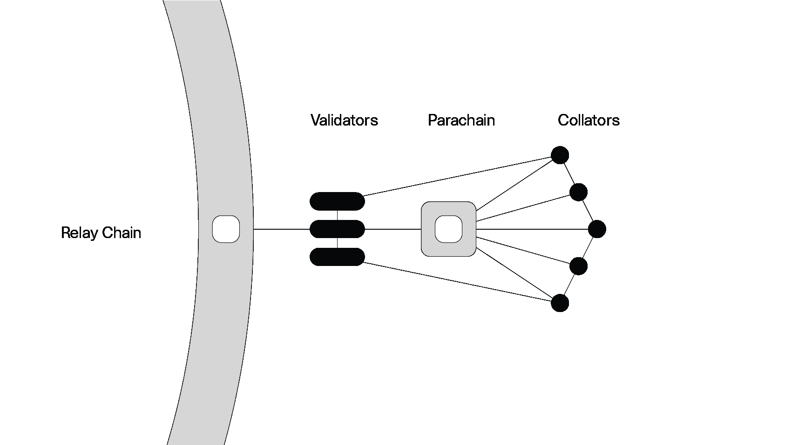
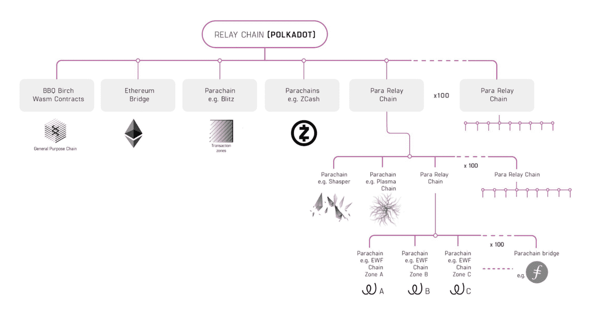
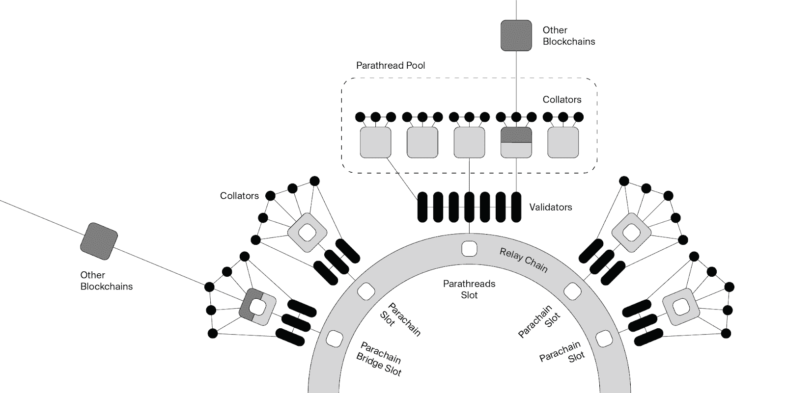
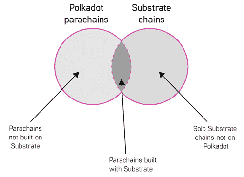

# 介绍

> 原文：<https://github.com/figment-networks/learn-tutorials/blob/master/polkadot/polkadot-blockchain-terms.md>

Polkadot 允许区块链和应用程序一起并行工作。要拥有一个分散的网络，一个可互操作的区块链互联网是关键。一份支离破碎的区块链协议。 Polkadot 认为自己是下一代区块链，或者更好，是一个基础网络层，它将真正推动“web 3.0 愿景”，创建一个由专业化、自治的最佳区块链组成的统一网络，通过互操作性协同工作。Polkadot 通过其共享模型提供了可伸缩性，过去孤立运行的区块链可以利用 Polkadot 架构来消除瓶颈和网络流量。

比特币给了我们第一个真正的货币协议概念；现在被普遍认为是价值储存手段的区块链。以太坊将这一理念扩展到了几乎所有领域——创造了下一波新金融，并允许我们通过智能合约开发真实世界的在线应用。Polkadot 的目标是将这些区块链和许多其他的结合在一起，同时支持 web 3.0 协议和其他关键的区块链特性——作为基础设施的基础设施。

本指南将通过对每个概念进行区分和总结，从波尔卡多特的角度概述区块链的主要概念。也就是说，重点将放在智能合同、副链、副线程和分散式应用程序上。Polkadot 生态系统中常见的区块链概念之间的差异可以通过理解 Polkadot 的愿景得到最好的理解，即充当 web 3.0 协议的基础层，允许任意数据(不仅仅是令牌)在区块链传输。

这是通过*真正的互操作性*、*集合安全性*、*异构链*和*深思熟虑的治理*来完成的。

# 先决条件

本教程旨在对初学者友好。尽管如此，建议您熟悉以下内容:

*   代码背后的波尔卡多，第一集
*   了解波尔卡多特的建筑:[波尔卡多特:你准备好开始建造了吗？](https://www.youtube.com/watch?v=_-k0xkooSlA)。
*   【Polkadot 入门。

# 波尔卡多特高级概念介绍

## 波尔卡多和智能合约

`smart contract`是一组部署在链上的指令(以代码的形式)。这些指令代表作为可执行计算机程序呈现的各方之间的协议。该计算机程序由基于区块链的平台执行，该平台能够部署智能合同。换句话说，智能契约允许在链上部署应用程序级源代码。仅当满足预定条件时，执行才会发生。只有在链上执行智能契约之后，外部参与者才能调用它。从指令集创建的智能合约将与特定的链地址相关联。

Polkadot 本身并不支持智能合约的部署。Polkadot mainnet 将连接其他链，作为智能合同平台。连接在 Polkadot 上的外部链通常被称为**副链**，这将在下面解释。

[Parity Technologies](https://www.parity.io/) 是 Polkadot 网络的核心开发者。他们的主要产品， [Substrate](https://substrate.dev/en/) 是一个健壮的框架，可以用来无缝地开发区块链。Parachains 正在使用 Substrate 开发将连接到 Polkadot 网络的现代区块链。

> 注意:Polkadot 有不同的实现。奇偶 Polkadot 是 Rust 客户端。C++、Go 和 JavaScript 中也存在其他实现，并且正在开发中。Polkadot 协议的多种实现对于以有意义的方式促进去中心化和协议的进步是很重要的。

如果这些外部链想要为智能合约提供支持，他们可以使用 [EVM 托盘](https://substrate.dev/docs/en/knowledgebase/smart-contracts/evm-pallet)来实现，这允许一个 parachain 实现以太坊虚拟机( [EVM](https://ethereum.org/en/developers/docs/evm/) )。

此外，Substrate 还提供了副链可以适应的内置[合同托盘](https://substrate.dev/rustdocs/v3.0.0/pallet_contracts/index.html)。这为部署和执行 *WebAssembly* 智能合约提供了必要的规范。

## 背景

顾名思义，`Ethereum Virtual Machine`是以太坊的虚拟机。EVM 将必要的计算资源抽象到一个虚拟堆栈中，并充当智能合约的运行时环境。 [Solidity](https://docs.soliditylang.org/en/v0.8.4/#) 是一种用于开发在 EVM 上运行的智能合约的编程语言。

[WebAssembly](https://webassembly.org/) 是一种指令格式，适用于整个网络并运行在现代网络浏览器上。

**趣闻[4]:** 以太坊的联合创始人和前 CTO Gavin James Wood 博士，同时也是 [Web 3 基金会](https://web3.foundation/)和[奇偶技术](https://www.parity.io/)的创始人，是 Solidity 语言的发明者，也是 2014 年的最初提议者[4]。

## 智能合同的优势

***可信、透明、可靠、准确&自动**T3】*

*   智能契约是不可变的:确保没有人能够篡改或破坏契约。该合同还

    在执行时保持完整性和可信度。

*   智能契约允许集中的用例被分散:一些例子包括分散的财务

    (DeFi)、治理和数字身份管理。

## 智能合同的缺点

**可扩展性、局限性、依赖性**

 ***   传统的智能合同只能存在于单链上:希望在不同的链上执行相同的合同

    chain 要求在该链上部署自己的智能协定。

*   智能契约对于大多数用例来说过于笼统。

*   智能合约受到其主机链属性的约束。

*   智能合同依赖于它们自己的升级能力，并且必须限制它们自己的执行。

    *   因为智能契约依赖于资源，所以执行的代码需要使用链的生态系统的资源。如果智能合约的某些方面需要大量的计算资源，这可能会产生问题，导致停机问题。使用强大的语言，不可能提前知道程序是否会停止执行。一些平台通过非常受限的脚本语言(例如比特币)来解决这个问题。其他 web 3.0 生态系统收取一笔费用，通常被称为“汽油费”，用于获得在链上执行代码和使用这些计算资源的权利(例如以太坊)。然而，如果智能合约无限期执行，它将通过“耗尽汽油”来停止其自身的执行。限制智能合约的执行对于防止 DOS 攻击也是必要的。
    *   智能合约是不可变的:如果智能合约中的代码有更新，这意味着需要部署一个全新的智能合约，它将绑定到一个新的链地址；引用先前链地址的任何内容也需要移到新的链地址。

# 什么是副链？

波尔卡多特网络有一个名为[中继链](https://wiki.polkadot.network/docs/en/learn-architecture#relay-chain)的中央链。Polkadot 的提名利害关系证明(NPoS)模型用于选择验证者，允许他们参与共识协议。这些验证器被标在中继链上。副链由被称为 [*整理器*](https://wiki.polkadot.network/docs/en/learn-collator) 的网络维护者维护。

外部链可以连接到中继链，如`Parachains`。副链是在波尔卡多特网络上并行运行的单个区块链。因此，副链也可以被认为是“可平行化的链”[5]。

Polkadot 被认为是一个*第 0 层多链网络*，副链作为单独的*第 1 层区块链*并行运行。作为参考，*比特币*和*以太坊*被认为是第一层区块链。副链模型允许单个区块链在第 1 层实现可伸缩性[3]。

> 以太坊生态系统中的一个突出问题是扩展能力，这种能力依赖于可能的第二层扩展解决方案。

## 比较副链和智能合约

开发智能合约后，接下来要做的是部署它。这意味着需要一个目标链，目标链有自己的环境。使用 parachain，开发者可以声明他们自己的链的环境。副链还可以通过根命令或治理托盘来升级自己，允许开发人员更新代码。这是防止分叉的一个重要的 parachain 特性——不像智能合约，智能合约有详尽的升级问题。

Polkadot 不使用*气体计量模型*，而是使用*重量-费用模型*，这意味着副链在其逻辑中没有气体计量模型。副链可以实现强大的编程语言。更好地说，parachains 试图主动出击，而智能合约平台是事件驱动的。

使用以太坊作为智能合约平台的示例:

以太坊

*   智能契约可以在同一个碎片中同步调用彼此。
*   智能契约可以在碎片之间异步调用对方。

Polkadot

*   智能契约可以在同一个 parachain 中同步调用彼此。
*   智能契约可以跨副链异步调用彼此。

## 成为副链的好处

 ***   底层开发是基于组件的，它抽象了区块链开发的本质，因此

    开发人员可以专注于重要事情。

*   连接到中继链的任何链共享网络上所有活动链的安全性。

*   块验证和终结由中继链上的验证器执行。

*   能够通过 [XCMP](https://wiki.polkadot.network/docs/en/learn-crosschain#docsNav) 向其他链发送消息。

*   链上治理与其他具有链外治理的平台相比。

Parachain 对 polkadot 的参与是基于拍卖的，需要 parachain 在中继链上获得一个可用的 parachain 插槽。

## Parathreads 呢？

`Parathreads`是不与中继链保持连接的副链。Parathreads 本质上是一种现收现付的 parachains，它是在每个块的基础上临时加入网络的[2]。

副链和副线程的主要区别是**经济**。为了获得网络上的一个位置，每六个月会举行一次 parachain 拍卖。对于副线程，每个区块都会进行费用拍卖。

# 波尔卡多特和达普斯

`dApp`代表分散应用；没有一个实体拥有完全的控制权。dApps 运行在对等的分布式网络上。智能合约被称为 dApps 的核心支柱，因为应用程序级源代码在合约本身的逻辑内。由于应用程序是基于一个分散的区块链，所以通过某种形式的数字资产(通常是一个令牌)对验证者有一个激励系统。dApp 需要一种共识机制来传达系统中的价值证明。

**WASM vs EVM:为什么 Substrate 鼓励网络组装**

每个区块链生态系统本质上都需要一个虚拟机来处理链上事件。EVM 被认为是一个轻量级的虚拟机，允许你在以太网上运行智能合约。EVM 目前面临的一些问题最终限制了网络的吞吐量并产生了瓶颈。

*   EVM 没有应有的速度，直接影响了网络效率。
*   EVM 使用的操作码没有针对不同的硬件平台进行优化。
*   对开发智能合同的支持和影响是有限的。

`Wasm`，或 WebAssembly，由万维网联盟(W3C)开发；它本质上是一种可以直接在浏览器上执行的新型代码。

*   Wasm 扩展了开发人员可以用来编写智能合同的支持语言，如 Rust、C/C++、C#和 Typescript。
*   Wasm 是高性能的。
*   Wasm 针对不同的硬件平台进行了优化。

这篇[文章](https://www.parity.io/wasm-smart-contract-development/#:~:text=While%20Wasm%20itself%20benefits%20from,and%20interact%20with%20the%20blockchain)从奇偶校验技术的角度提供了一个关于 WebAssembly 是 EVM 的替代品的观点。

***运行时开发不同于 dApp 开发***

*   使用智能契约平台来开发 dApp 允许开发人员专注于契约本身的逻辑。在副链上部署 dApp 不同于创建副链，因为这需要运行时开发。每个 parachain 都可以有一个独特的实现，并有自己的运行时逻辑。通常，在 Polkadot 上开发 dApp 有两种方法:
    1.  在 Wasm 中开发 dApp，它将在本地副链上运行。
    2.  通过 Solidity 在 EVM 的连锁店部署 dApp。

***在 Polkadot 上构建 dApp 可以看作是在基于衬底的链上构建 dApp***

> 注意:记住，Polkadot 支持不是建立在基底上的仿链。链也可以建立在基底上，不需要部署在 Polkadot 上[1]。

# 结论

恭喜你！本教程从波尔卡多特的角度提供了波尔卡多特友好的建筑视图。该教程通过讨论智能合约、副链、副线程和 DApps 之间的差异，从“区块链空间拥有什么”转移到“它将走向哪里”。

# 下一步是什么？

要深入了解这些概念，请参阅官方 Polkadot Wiki 的以下页面。

*   [架构](https://wiki.polkadot.network/docs/en/learn-architecture)
*   [智能合约](https://wiki.polkadot.network/docs/en/build-smart-contracts)
*   [副链](https://wiki.polkadot.network/docs/en/learn-parachains)
*   [并行线程](https://wiki.polkadot.network/docs/en/learn-parathreads)
*   [词汇表](https://wiki.polkadot.network/docs/en/glossary)

为什么不试着建立你的第一个基质链！

# 关于作者

本指南由丹尼·萨尔曼创作。你可以在 GitHub 上联系 Danny 寻求帮助，或者如果你有关于 Polkadot 和本指南的问题。

# 参考

[1] [对一切的简要总结基质和 Polkadot](https://www.parity.io/a-brief-summary-of-everything-substrate-polkadot/)
【2】[Parathreads:现收现付 para chains](https://polkadot.network/parathreads-parathreads-pay-as-you-go-parachains/)
【3】[Polkadot:新互联网的基础](https://medium.com/polkadot-network/polkadot-the-foundation-of-a-new-internet-e8800ec81c7)
【4】[Polkadot，基质和以太坊](https://medium.com/polkadot-network/polkadot-substrate-and-ethereum-f0bf1ccbfd13)
【5】[研究于 Web3 基金会](https://research.web3.foundation/en/latest/polkadot/overview/1-polkadot-introduction.html?highlight=parachains)****