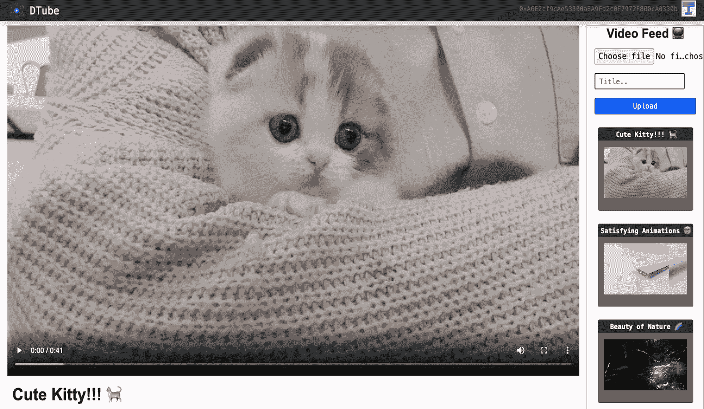
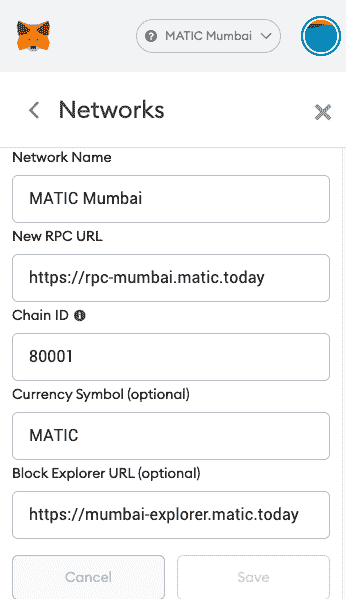
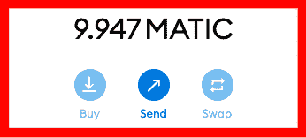
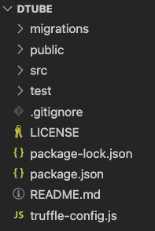
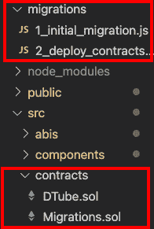
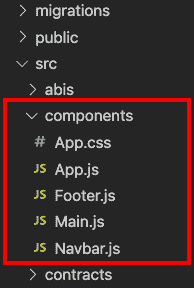
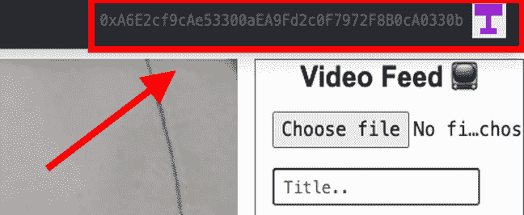
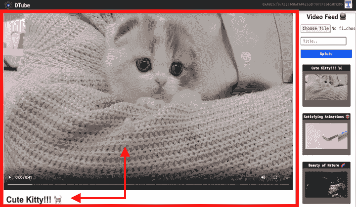
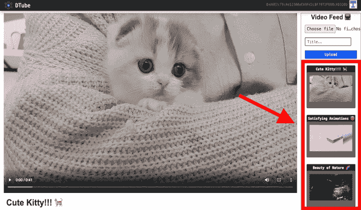
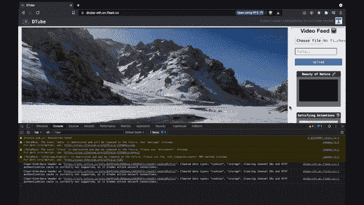

# 介绍

> 原文：<https://github.com/figment-networks/learn-tutorials/blob/master/polygon/Build-a-Social-Media-DApp-and-Deploy-it-on-Polygon.md>



在本教程中，您将学习如何构建一个像 YouTube 一样的社交媒体 DApp(分散式应用程序)，以及如何将其部署在 Polygon (Matic)孟买测试网络上。所以，拿起一杯咖啡 <g-emoji class="g-emoji" alias="coffee" fallback-src="https://github.githubassets.cimg/icons/emoji/unicode/2615.png">☕️</g-emoji> 让我们开始吧！

DTube 项目是 Akhilesh Thite 在 2021 年 7 月至 8 月的 ETHOdyssey 虚拟黑客马拉松期间创建的。所有用于创建这个 DApp 的资源都可以在本教程末尾的“参考资料”一节中找到。

# 先决条件

本教程假设你有一些编程的初级经验和区块链理解。

学完本教程后，您将能够:

*   在以太坊区块链之上构建全栈去中心化应用。
*   在 Polygon (Matic)孟买测试网络上部署智能合约。
*   使用松露和 MetaMask。
*   理解 Web3 概念。
*   使用 [Fleek](https://docs.fleek.co/) 平台在 [IPFS](https://docs.ipfs.io/concepts/) 举办 DApp。

# 要求

我们需要您的计算机上的以下内容来构建我们的 DApp。

### 节点和 npm

Node 是一个 JavaScript 运行时环境，它在 web 浏览器之外执行 JavaScript 代码，npm 是一个 JavaScript 包安装程序。要在你的电脑上安装 Node.js & npm，点击这个[链接](https://nodejs.org/en/download/) - >根据你的电脑需求下载文件- >安装文件。要检查成功的安装类型`npm -v`在 cmd 提示符或终端，它会显示版本，这意味着你已经成功地安装在你的电脑上。

### 松露

Truffle 是开发区块链应用程序的最佳开发环境。Truffle 给了我们样板代码(模板代码)来开始构建我们的 DApp。

要安装 truffle，打开一个终端(windows cmd 提示符或 mac 终端)并运行以下命令:`npm install -g truffle`

### Ganache(本教程可选)

加纳切是 DApp 发展的个人区块链环境。它为一个本地区块链提供了 10 个默认账户，每个账户都有 100 个 ETH。这对于测试和开发非常有用，[如果你感兴趣，请查看](https://www.trufflesuite.com/ganache)。

### MetaMask Setup

元掩码用于与以太坊区块链交互。它允许用户通过浏览器扩展或移动应用程序访问他们的以太坊钱包，然后可以用来与分散的应用程序进行交互。

要安装 MetaMask 扩展，点击这个[链接](https://metamask.io/)。现在，`Create a MetaMask account -> save the mnemonics (12 secret words) because we need those mnemonics at the time of deployment`

要通过元掩码与多边形交互，我们首先必须添加一个新的 RPC 端点。点击浏览器工具栏中的 Fox 图标，打开 Metamask 扩展，然后选择`Settings -> Networks -> Add network -> Save`。填写下图中给出的信息。



现在你会注意到钱包里的余额为零(0 Matic)，以获取测试 MATIC 进行部署和测试，`go to Matic Faucet -> Select Mumbai -> Paste wallet address -> Submit`，MATIC 水龙头[链接](https://faucet.matic.network)。搞定了。检查你的钱包，你会在那里看见一些 Matic。*(我们只需要少量的 Matic (5-10 Matic)来部署和测试我们的 DApp。)*



### 技术堆栈

*   **语言:** `Solidity, JavaScript, HTML5, CSS3`
*   **库:** `React.js, Web3.js`
*   **工具:** `IPFS`
*   **网络:** `Polygon (Matic)`
*   **平台:** `Ethereum, Fleek`

### 路标

首先，我们将在 **Truffle** 的帮助下设置我们的编码环境，之后我们将在 **solidity** 中编写**智能合约**。在编写智能契约之后，为了构建我们的 DApp 的前端，我们将使用 [React.js](https://reactjs.org/docs/getting-started.html) Javascript 库加上一些 **HTML5、CSS3 & JavaScript** 。

我们将使用 **IPFS** (星际文件系统)将我们的视频散列存储到区块链，稍后我们将能够通过调用这些视频散列来播放这些视频。

为了将我们的智能合约与前端连接起来，我们将使用 [Web3.js](https://web3js.readthedocs.io/en/v1.4.0/) ，然后我们将在**孟买测试网**上部署我们的智能合约。最后一步，我们将使用 **Fleek** 平台在 IPFS 举办这个 DApp。

什么是**智能合约？**

智能合约是区块链上的点对点数字用户协议。为了在以太坊中编写智能合同，我们使用 solidity 编程语言。

什么是 [Web3.js](https://web3js.readthedocs.io/en/v3.0.0-rc.5/) ？

Web3.js 是一组 JavaScript 库，充当通往区块链世界的端口。Web3 是将我们的智能合约连接到 DApp 前端的媒介。

在本节中，我们介绍了将要使用的技术，并提供了构建 DApp 的路线图。现在到了有趣的部分——让我们做 DApp 吧！

# 项目设置

为了避免处理任何恼人的版本错误&我们不是一个接一个地安装支持代码库(依赖项)，而是通过克隆一个包含项目文件的 GitHub 库并安装所有必要的依赖项来开始构建我们的 DApp。

*   `Fork`[储存库](https://github.com/AkhileshThite/DTube)，这将在你的账户中复制这个项目。

*   用命令`git clone https://github.com/<YourGitHubUsername>/DTube.git`克隆 GitHub 库。这将把项目文件从 GitHub 复制到你的电脑上。

*   命令`cd DTube`将带您进入下载到您计算机上的存储库的本地副本。

现在，用你最喜欢的代码编辑器或者 IDE 打开这个文件夹，比如 [VS Code](https://code.visualstudio.com) 。



通过以下命令安装所有依赖项:

*   `npm install`

注意:-随着教程的深入，对于每个部分，您都可以从文件中清除代码并自己编写代码。您可以随时从本教程或项目的原始 GitHub 库中交叉检查您的代码。

教程的每一部分都有 path 和 GitHub repo 链接，所以你不需要滚动来寻找它们。

# 可靠的智能合同

路径:`/src/contracts/DTube.sol`

我们将设计智能合同上传视频(与 IPFS 视频哈希)，存储视频(与标题和 IPFS 视频哈希)，列表视频(按视频 id)到区块链。

让我们定义要使用的 Solidity 编译器的版本，并创建一个名为 DTube 的 Solidity 契约。最初，我们指定视频计数为零。`uint`表示无符号整数数据类型(只能是 0 以上的数字，不能是负值)。`string`表示字符串数据类型。在 ABI ( [应用程序二进制接口](https://docs.soliditylang.org/en/latest/abi-spec.html))的帮助下，我们稍后可以通过名称“DTube”来引用这个契约。`public`的状态变量 visibility 与安全性没有任何关系，它仅仅意味着变量不是隐藏的，也不是契约所独有的。`mapping(uint => Video) public videos`是一个`uint`号和一个视频之间的映射。因为会有多个视频，所以我们使用每个元素`Video`的数据类型来创建一个变量`Videos`，我们将在下一个代码片段中创建这个变量。

```js
pragma solidity ^0.5.0;

contract DTube {
  uint public videoCount = 0;
  string public name = "DTube";
  mapping(uint => Video) public videos;
```

现在，让我们创建`Video`数据类型和`VideoUploaded`事件。

```js
// Create data types
  struct Video {
    uint id;    // video count
    string hash; // IPFS video hash
    string title; // Title of the video
    address author; // User's wallet address
  }
// Create an event
  event VideoUploaded(
    uint id,
    string hash,
    string title,
    address author
  );
```

让我们在函数签名中创建一个带有两个参数`_videoHash`和`_title`的`uploadVideo`函数。我们通过使用一些条件(要求传递的参数长度大于零)来确保`video hash`、`video title`、`uploader address`存在。之后，为了区分视频，我们将增加 videoCount(每个视频将有一个唯一的编号来识别它)。

```js
  constructor() public {
  } 

  function uploadVideo(string memory _videoHash, string memory _title) public {
    // Make sure the video hash exists
    require(bytes(_videoHash).length > 0);
    // Make sure video title exists
    require(bytes(_title).length > 0);
    // Make sure uploader address exists
    require(msg.sender!=address(0));

    // Increment video id
    videoCount ++;
```

最后，我们将通过包含变量`videoCount`、`_videoHash`、`_title`、&最后`msg.sender`将视频添加到合同中，这是 Solidity 中的一个[全局变量](https://docs.soliditylang.org/en/latest/units-and-global-variables.html?highlight=msg.sender#special-variables-and-functions)，它简单地表示当前用户。然后我们将发出`VideoUploaded`事件，该事件会将该信息存储在发出该事件的事务的日志中。

```js
    // Add video to the contract
    videos[videoCount] = Video(videoCount, _videoHash, _title, msg.sender);
    // Trigger an event
    emit VideoUploaded(videoCount, _videoHash, _title, msg.sender);
  }
}
```

# 块菌迁徙

*   路径:`/src/contracts/`
*   路径:`/migrations/`

每当我们通过命令`truffle init`或`truffle unbox react`使用 truffle 创建 DApp 时，truffle 都会给我们样板代码来开始构建我们的 DApp。它包含以下主要文件:

*   `migrations/1_initial_migration.js`
*   `contracts/Migrations.sol (& DTube.sol)`
*   `test`
*   `truffle-config.js`

(在部署我们的智能合同之前，我们稍后将讨论`truffle-config.js`。)

Truffle 迁移是 JavaScript 文件，帮助您将合同部署到以太坊(或其他 EVM 兼容的)网络。这些文件负责准备您的部署任务，它们是在假设您的部署需求会随着时间的推移而改变的情况下编写的。

因此，为了将我们的智能合约部署到区块链，在迁移文件夹中创建一个名为`2_initial_migration.js`的新文件非常重要，该文件将与我们的`DTube.sol`合约对话。



代码类似于`1_initial_migration.js`，只是用 DTube 代替了迁移。

`2_initial_migration.js`会是这样的:

```js
const DTube = artifacts.require("DTube");

module.exports = function(deployer) {
  deployer.deploy(DTube);
};
```

# 使用 React.js 的前端

路径:`/src/components/`

React 应用程序由各种组件组成，例如导航栏、主页、网页页脚等。React 加载一个单独的 HTML 页面(`/public/index.html`)，然后用项目中定义的所有组件填充这个页面。



### app.js

现在让我们来处理我们的主`app.js`文件，它将包含所有的组件(导航栏、主页面、页脚)。

首先，我们必须导入我们需要的所有组件和库(包括 web3.js ),并实例化我们的 IPFS 客户端，以便我们可以从 IPFS 网络存储和检索文件。

```js
import React, { Component } from "react";
import DTube from "../abis/DTube.json";
import Navbar from "./Navbar";
import Main from "./Main";
import Footer from "./Footer";
import Web3 from "web3";
import "./App.css";

//Declare IPFS
const ipfsClient = require("ipfs-http-client");
const ipfs = ipfsClient({
  host: "ipfs.infura.io",
  port: 5001,
  protocol: "https",
});
```

关于 JavaScript 中的异步/等待函数:

**异步**

它只是允许我们编写基于承诺的代码，就像它是同步的一样，并且它检查我们没有中断执行线程。它通过事件循环异步运行。异步函数总是会返回值。它确保一个承诺被返回，如果没有被返回，那么 javascript 自动将它包装在一个承诺中，这个承诺用它的值来解析。

**等待**

Await 函数用于等待承诺。它只能在异步块中使用。它让代码一直等到承诺返回结果。它只会让异步块等待。

*你可以在这里找到异步/等待函数[的简单解释。](https://www.geeksforgeeks.org/async-await-function-in-javascript/)*

之后，我们将粘贴 MetaMask 指示我们加载 web3 的确切默认代码。它从元掩码中获取以太坊提供程序，并将其注入到您的 DApp 中，如果您的浏览器没有安装元掩码，则会显示一个弹出窗口“检测到非以太坊浏览器”。你应该考虑试试 MetaMask！”消息。

```js
class App extends Component {

  async componentWillMount() {
    await this.loadWeb3()
    await this.loadBlockchainData()
  }

  async loadWeb3() {
    if (window.ethereum) {
      window.web3 = new Web3(window.ethereum)
      await window.ethereum.request({ method: 'eth_requestAccounts' })
    }
    else if (window.web3) {
      window.web3 = new Web3(window.web3.currentProvider)
    }
    else {
      window.alert('Non-Ethereum browser detected. You should consider trying MetaMask!')
    }
  }
```

在`loadBlockchainData()`函数中，我们将加载 ETH 账户，连接网络 ID，按最新的视频列表。如果智能合约未部署到相应的网络，则会显示一个弹出窗口“DTube 合约未部署到检测到的网络”消息。

React 组件有一个内置的状态对象。状态对象是存储属于组件的属性值的地方。当状态对象改变时，组件重新呈现。我们将使用`this.state`获取区块链数据，并在稍后使用`this.props`在我们的前端 react 组件中显示它。

```js
  async loadBlockchainData() {
    const web3 = window.web3;
    // Load account
    const accounts = await web3.eth.getAccounts();
    this.setState({ account: accounts[0] });
    // Network ID
    const networkId = await web3.eth.net.getId();
    const networkData = DTube.networks[networkId];
    if (networkData) {
      const dtube = new web3.eth.Contract(DTube.abi, networkData.address);
      this.setState({ dtube });
      const videosCount = await dtube.methods.videoCount().call();
      this.setState({ videosCount });
      // Load videos, sort by newest
      for (var i = videosCount; i >= 1; i--) {
        const video = await dtube.methods.videos(i).call();
        this.setState({
          videos: [...this.state.videos, video],
        });
      }
      //Set latest video with title to view as default
      const latest = await dtube.methods.videos(videosCount).call();
      this.setState({
        currentHash: latest.hash,
        currentTitle: latest.title,
      });
      this.setState({ loading: false });
    } else {
      window.alert("DTube contract not deployed to detected network.");
    }
  }
```

现在我们准备通过`captureFile`函数将文件上传到 IPFS。

```js
  captureFile = (event) => {
    event.preventDefault();
    const file = event.target.files[0];
    const reader = new window.FileReader();
    reader.readAsArrayBuffer(file);

    reader.onloadend = () => {
      this.setState({ buffer: Buffer(reader.result) });
      console.log("buffer", this.state.buffer);
    };
  };
```

接下来，我们需要`uploadVideo`函数，这样我们就可以上传视频文件到 IPFS。上传视频文件到 IPFS 时，它会在控制台显示一条信息“提交文件到 IPFS……”。这里，我们添加了带有两个参数的文件`ipfs.add()`:上传的文件&一个回调函数。之后，我们将把视频文件的 [CID](https://docs.ipfs.io/concepts/content-addressing/) 哈希存储到区块链。

```js
  uploadVideo = (title) => {
    console.log("Submitting file to IPFS...");
    //adding file to the IPFS
    ipfs.add(this.state.buffer, (error, result) => {
      console.log("IPFS result", result);
      if (error) {
        console.error(error);
        return;
      }

      this.setState({ loading: true });
      this.state.dtube.methods
        .uploadVideo(result[0].hash, title)
        .send({ from: this.state.account })
        .on("transactionHash", (hash) => {
          this.setState({ loading: false });
        });
    });
  };
```

为了将视频哈希和视频标题更新为“当前”，我们将创建`changeVideo`函数。之后，让我们创建绑定函数，在我们的前端 react 组件中显示区块链数据。

是 React 中的一个内置方法，用于将数据作为参数传递给基于类的组件的函数。

```js
  changeVideo = (hash, title) => {
    this.setState({ currentHash: hash });
    this.setState({ currentTitle: title });
  };

  constructor(props) {
    super(props);
    this.state = {
      buffer: null,
      account: "",
      dtube: null,
      videos: [],
      loading: true,
      currentHash: null,
      currentTitle: null,
    };

    this.uploadVideo = this.uploadVideo.bind(this);
    this.captureFile = this.captureFile.bind(this);
    this.changeVideo = this.changeVideo.bind(this);
  }
```

最后，让我们在顶部添加我们导入的所有组件`<Navbar>`、`<Main>`、&、`<Footer>`。记住`this.state`正在获取所有区块链数据，以便我们可以使用这些数据在 react 前端组件中显示。

在`<Navbar>`中，我们想要显示用户的账户地址，因此`<Navbar account={this.state.account} />`将获取用户的当前账户地址，我们将在`this.props.account`之前在`Navbar.js`组件中显示该地址。同样，对于我们的 DApp 的主要内容，我们需要视频，上传视频，捕获文件，改变视频，当前哈希，当前标题数据显示在`Main.js`组件。

```js
  render() {
    return (
      <div>
        <Navbar account={this.state.account} />
        {this.state.loading ? (
          <div id="loader" className="text-center mt-5">
            <p>Loading...</p>
          </div>
        ) : (
          <Main
            videos={this.state.videos}
            uploadVideo={this.uploadVideo}
            captureFile={this.captureFile}
            changeVideo={this.changeVideo}
            currentHash={this.state.currentHash}
            currentTitle={this.state.currentTitle}
          />
        )}
        <Footer />
      </div>
    );
  }
}

export default App;
```

### Navbar.js



在 Navbar 组件中，我们将显示品牌徽标、品牌名称、用户帐户地址和用户个人资料(包括一个使用 JavaScript 库的唯一标识)。首先，我们来导入代码和品牌 logo。我们将使用 [Bootstrap](https://getbootstrap.com/) 来制作我们的导航栏。

```js
import React, { Component } from "react";
import Identicon from "identicon.js"; //user profile
import dtube from "../dtube.png"; //logo

class Navbar extends Component {
  render() {
    return (
      <nav className="navbar navbar-dark fixed-top bg-dark flex-md-nowrap p-0 shadow text-monospace">
        <a
          className="navbar-brand ml-1 col-sm-3 col-md-2 mr-0"
          href="/"
          rel="noopener noreferrer"
        >
          
          &nbsp;DTube
        </a>
        <ul className="navbar-nav px-3">
          <li className="nav-item text-nowrap h5 d-none d-sm-none d-sm-block">
            <small className="text-secondary">
              <small id="account">{this.props.account}</small>
            </small>
            {this.props.account ? (
              
            ) : (
              <span></span>
            )}
          </li>
        </ul>
      </nav>
    );
  }
}

export default Navbar;
```

我们用`this.props.account`属性在这个组件中显示用户地址。下面的代码片段使用了 [React 条件渲染](https://reactjs.org/docs/conditional-rendering.html)和 JavaScript [三元运算符](https://developer.mozilla.org/en-US/docs/Web/JavaScript/Reference/Operators/Conditional_Operator):如果用户账号地址存在，那么显示 identicon 用户配置文件。否则，显示空白`<span>`。

```js
            {this.props.account ? (
              
            ) : (
              <span></span>
```

### 主页. js



为了显示当前上传的视频和视频标题，我们将使用`this.props.currentHash` & `this.props.currentTitle`属性。现在，我们为什么在这里使用`https://ipfs.infura.io/ipfs/`？因为 [Infura](https://infura.io/) 将[锁定我们的 IPFS 文件](https://docs.ipfs.io/concepts/persistence/)以保持文件对网络可用。否则，如果我们连接的 IPFS 节点关闭，视频文件可能不可用。有几种可用的 IPFS 锁定服务，Infura 由于其弹性是最常用的服务之一。

```js
import React, { Component } from "react";
import "./App.css";

class Main extends Component {
  render() {
    return (
      <div className="container-fluid text-monospace main">
        <br></br>
        &nbsp;
        <br></br>
        <div className="row">
          <div className="col-md-10">
            <div
              className="embed-responsive embed-responsive-16by9"
              style={{ maxHeight: "720px" }}
            >
              <video
                src={`https://ipfs.infura.io/ipfs/${this.props.currentHash}`}
                controls
              ></video>
            </div>
            <h3 className="mt-3">
              <b>
                <i className="video-title">{this.props.currentTitle}</i>
              </b>
            </h3>
          </div>
```


接下来，我们将在视频提要中创建一个表单来选择视频文件、输入视频标题并上传视频。我们将选择视频文件，该文件将通过`this.props.captureFile`方法上传到 IPFS。然后我们要输入`video ref={(input) => { this.videoTitle = input }}`的标题。在`onSubmit`事件处理程序中，我们将通过`this.props.uploadVideo(title)`上传带有视频标题的视频文件。

```
          <div
            className="vide-feed col-md-2 border border-secondary overflow-auto text-center"
            style={{ maxHeight: "4000px", minWidth: "175px" }}
          >
            <h5 className="feed-title">
              <b>Video Feed 📺</b>
            </h5>
            <form
              onSubmit={(event) => {
                event.preventDefault();
                const title = this.videoTitle.value;
                this.props.uploadVideo(title);
              }}
            >
              &nbsp;
              <input
                type="file"
                accept=".mp4, .mov, .mkv .ogg .wmv"
                onChange={this.props.captureFile}
                style={{ width: "250px" }}
              />
              <div className="form-group mr-sm-2">
                <input
                  id="videoTitle"
                  type="text"
                  ref={(input) => {
                    this.videoTitle = input;
                  }}
                  className="form-control-sm mt-3 mr-3"
                  placeholder="Title.."
                  required
                />
              </div>
              <button
                type="submit"
                className="btn border border-dark btn-primary btn-block btn-sm"
              >
                Upload
              </button>
              &nbsp;
            </form>
```js



最后，为了在视频提要中列出所有之前上传的视频及其标题，我们将使用`video.hash`和`video.title`属性。每当我们点击任何列出的/先前的视频时，`changeVideo`功能会将`video.hash`和`video.title`转换为`currentHash` & `currentTitle`，这样所选的视频就会出现在屏幕上。

```
            {this.props.videos.map((video, key) => {
              return (
                <div
                  className="card mb-4 text-center hover-overlay bg-secondary mx-auto"
                  style={{ width: "195px" }}
                  key={key}
                >
                  <div className="card-title bg-dark">
                    <small className="text-white">
                      <b>{video.title}</b>
                    </small>
                  </div>
                  <div>
                    <p
                      onClick={() =>
                        this.props.changeVideo(video.hash, video.title)
                      }
                    >
                      <video
                        src={`https://ipfs.infura.io/ipfs/${video.hash}`}
                        style={{ width: "170px" }}
                      />
                    </p>
                  </div>
                </div>
              );
            })}
          </div>
        </div>
      </div>
    );
  }
}

export default Main;
```js

哇，代码真多！您可以使用命令`npm start`在本地运行 React 应用程序。当然，功能缺失，因为我们还没有将智能合约部署到区块链。接下来让我们在多边形(Matic)网络上部署我们的可靠性契约。

*`<Footer>`组件是出于黑客马拉松的目的在 bootstrap 中创建的。这和我们的 DApp 没有关系。您可以根据需要简单地修改该部分。*

# 在多边形上部署智能合同(Matic)

### 块菌配置

*   `truffle-config.js`对于 Mac 用户
*   `truffle.js`对于 Windows 用户

truffle-config 文件是一个需要理解的重要文件。在这个文件中，我们必须配置 DTube Solidity 文件(智能合约)、合约 ABI 的路径，并定义可用的**网络**。

```
const HDWalletProvider = require("@truffle/hdwallet-provider")
require('dotenv').config(); // Load .env file

module.exports = {
  networks: {
   // For Ganache, your personal blockchain
   development: {
      host: "127.0.0.1",     // Localhost (default: none)
      port: 8545,            // Standard Ethereum port 
      network_id: "*",       // Any network (default: none)
    },
  },
  contracts_directory: './src/contracts/', // path to Smart Contracts
  contracts_build_directory: './src/abis/', // Path to ABIs
  compilers: {
    solc: {
      optimizer: {
        enabled: true,
        runs: 200
      }
    }
  }
}
```js

确保您在项目根目录(`~/DTube/.env`)中创建一个`.env`文件，并将您最好新生成的、仅用于 testnet 的元掩码 wallet 的秘密恢复短语(12 个单词)粘贴到该文件中，并使用变量名助记符。这将由 truffle 在运行时加载，然后可以用`process.env.MNEMONIC`访问环境变量。

```
MNEMONIC= 12 secret words here.. 
```js

现在，让我们在 truffle-config 文件中添加`matic` network，它将包含我们的环境变量助记符和 RPC URL。

```
    matic: {
      provider: () => new HDWalletProvider(process.env.MNEMONIC, 
      `https://rpc-mumbai.matic.today`),
      network_id: 80001,
      confirmations: 2,
      timeoutBlocks: 200,
      skipDryRun: true,
      gas: 6000000,
      gasPrice: 10000000000,
    },
```js

如上面的代码块所示，您可以为更快的交易设置天然气价格和天然气限制。

### 部署智能合同

*   命令:`truffle migrate --network matic`

如果您是第二次部署它，那么使用这个命令进行部署，只是为了**重置**并避免 JSON 错误。

*   命令:`truffle migrate --network matic --reset`

如果一切正常，您将看到如下内容:

```
2_deploy_contracts.js
=====================

   Replacing 'MyContract'
   ------------------
   > transaction hash:    0x1c94d095a2f629521344885910e6a01076188fa815a310765679b05abc09a250
   > Blocks: 5            Seconds: 5
   > contract address:    0xbFa33D565Fcb81a9CE8e7a35B61b12B04220A8EB
   > block number:        2371252
   > block timestamp:     1578238698
   > account:             0x9fB29AAc15b9A4B7F17c3385939b007540f4d791
   > balance:             79.409358061899298312
   > gas used:            1896986
   > gas price:           0 gwei
   > value sent:          0 ETH
   > total cost:          0 ETH

   Pausing for 2 confirmations...
   ------------------------------
   > confirmation number: 5 (block: 2371262)
initialised!

   > Saving migration to chain.
   > Saving artifacts
   -------------------------------------
   > Total cost:                   0 ETH

Summary
=======
> Total deployments:   2
> Final cost:          0 ETH
```js

来自 matic truffle 文档的代码片段。

**重要提示:如果您在将 Solidity 契约部署到 Polygon (Matic)时遇到任何错误，请查看 Figment learn 上的[在 Polygon 上部署和调试智能契约](https://learn.figment.io/tutorials/deploying-and-debugging-smart-contracts-on-polygon)教程的“处理不同错误”部分。**

现在让我们用命令`npm start`在 [http://localhost:3000/](http://localhost:3000/) 上运行 React 应用程序。您应该会看到 MetaMask 弹出窗口，询问您是否愿意将 MetaMask wallet 连接到该站点。一旦连接，您可以上传和分享视频在您的 DApp，这是部署在多边形(Matic)网络！



# 使用 Fleek 在 IPFS 主持 DApp

如果您将这个项目托管在任何一个集中式服务器上，您就不能称之为“分散式应用程序”。为了使其分散化，我们将再次使用 IPFS。但是这里的问题是你不能用相同的 IPFS 散列来更新/修改项目。IPFS 使用基于内容的寻址，因此每个资产都有自己唯一的地址。这就是我们要使用“Fleek”IPFS 托管和 Filecoin 存储平台的地方，您可以**部署项目、获取链接、获取 SSL 证书、分配域，并通过简单地连接您的 GitHub 存储库**来更新项目。当你在回购上推任何变化，fleek 将自动更新与新的 IPFS 散列在同一个 Fleek 网址的变化。多酷啊。让我们看看它是怎么做的。

在 Fleek 上托管 DApp 之前，在项目的根目录下创建一个`.gitignore`文件，将`node_modules`和`.env`放在`.gitignore`文件中的不同行上，并记住将文件保存到磁盘。

切勿共享或提交您的`.env`文件。它包含您的凭证，如`mnemonics`和`API`密钥。因此，建议将`.env`添加到您的`.gitignore`文件中。

```
/node_modules
.env
```

在 GitHub 上创建一个新的存储库，并推送所有的更改。

*`Sign up on` [弗利克](https://fleek.co/) `-> Add new site -> Connect GitHub repo -> select framework (React in our case) -> Deploy Site`*

就是这样！部署网站后，您将获得 DApp 的 fleek 链接，您可以分配一个域，并与世界上的任何人共享您的 DApp 链接。恭喜你！您已经构建了一个真正去中心化的社交媒体应用程序。

# 结论

恭喜你！完成本教程后，您应该对如何为视频内容创建 dApp 以及如何在 Polygon 上部署它有了很好的理解。

# 关于作者

我是 Akhilesh Thite，一名印度的技术爱好者，对软件开发、开源和去中心化充满热情。请随时在[GitHub](https://github.com/AkhileshThite)&[Twitter](https://twitter.com/AkhileshThite_)上与我联系。

# 参考

*   *松露文件:[https://www.trufflesuite.com/docs/truffle/overview](https://www.trufflesuite.com/docs/truffle/overview)*
*   *多边形(Matic)文档:[https://docs . Matic . network/docs/develop/getting-started](https://docs.matic.network/docs/develop/getting-started)*
*   *meta mask docs:[https://docs.metamask.io/guide/#why-metamask](https://docs.metamask.io/guide/#why-metamask)*
*   *web 3 docs:[https://web3js.readthedocs.io/en/v1.4.0/](https://web3js.readthedocs.io/en/v1.4.0/)*
*   *反应文件:[https://reactjs.org/docs/getting-started.html](https://reactjs.org/docs/getting-started.html)*
*   *弗利克文件:[https://docs.fleek.co](https://docs.fleek.co)*
*   *IPFS 文档:[https://docs . ipfs . io/concepts/what-is-ipfs/#去中心化](https://docs.ipfs.io/concepts/what-is-ipfs/#decentralization)*
*   *Async/Await:[https://www . geeks forgeeks . org/Async-Await-function-in-JavaScript/](https://www.geeksforgeeks.org/async-await-function-in-javascript/)*
*   *Dapp 大学 YouTube:[https://www.youtube.com/watch?v=OLsteD3xkPQ](https://www.youtube.com/watch?v=OLsteD3xkPQ)*
*   *在 Polygon 上部署&调试智能合约:[https://learn . fig ment . io/tutorials/Deploying-and-debug-smart-contracts-on-Polygon](https://learn.figment.io/tutorials/deploying-and-debugging-smart-contracts-on-polygon)*