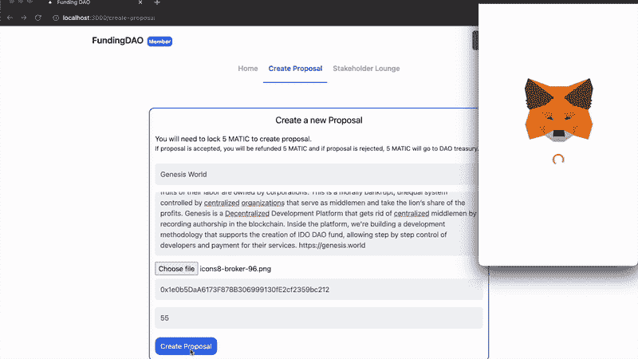
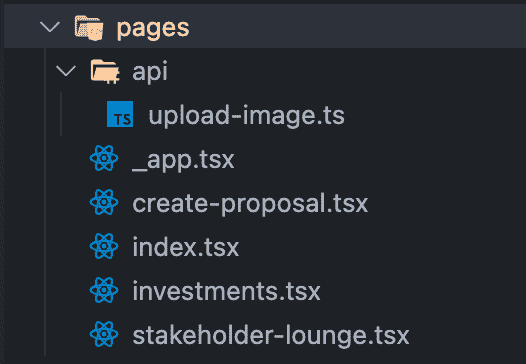
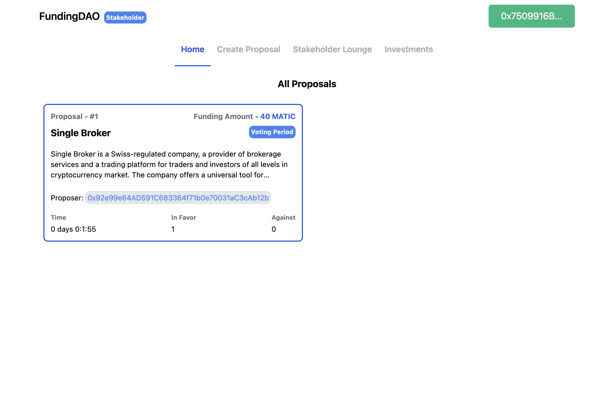
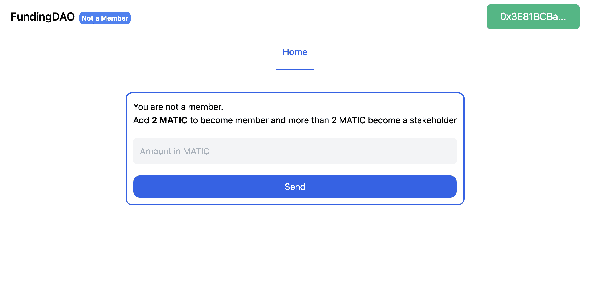
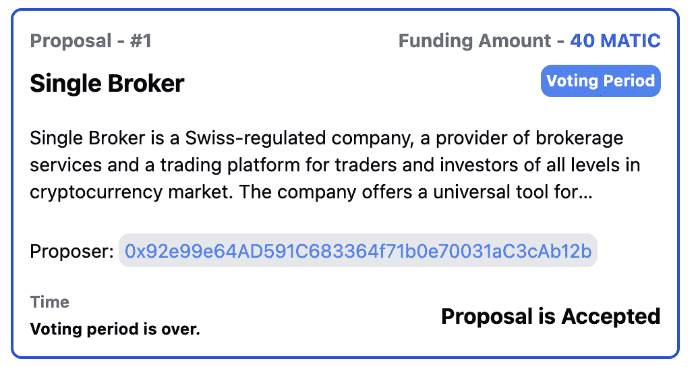
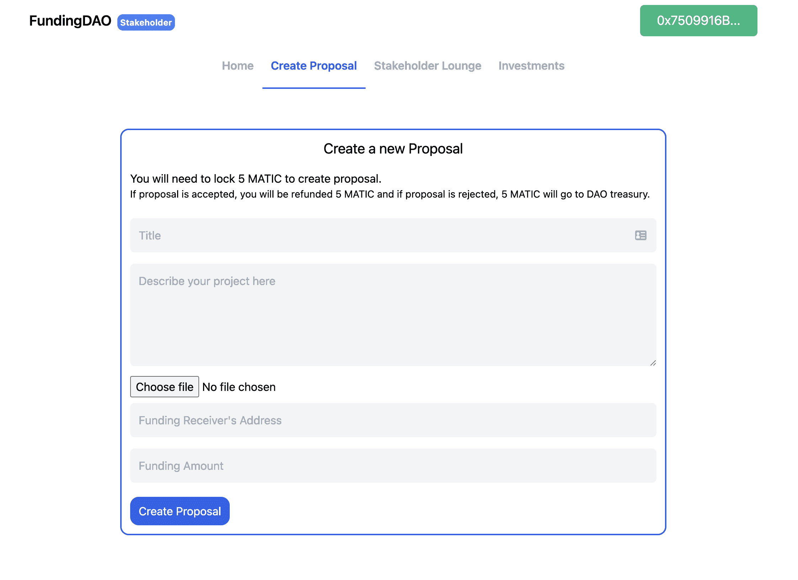
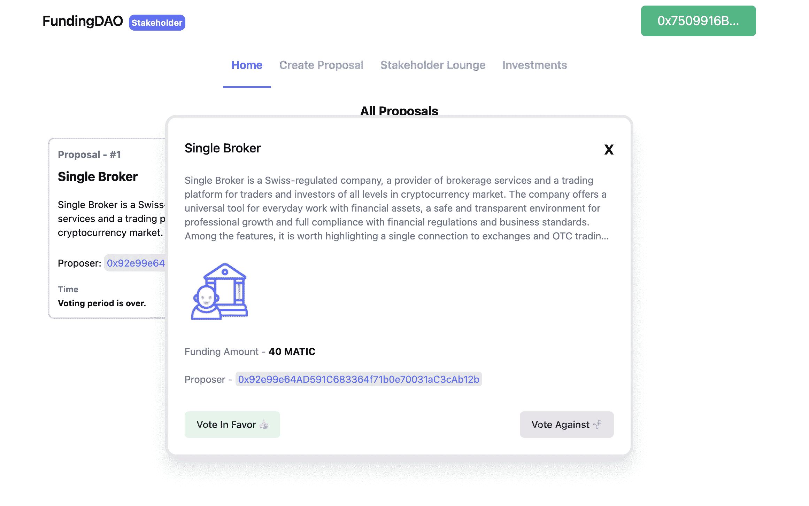
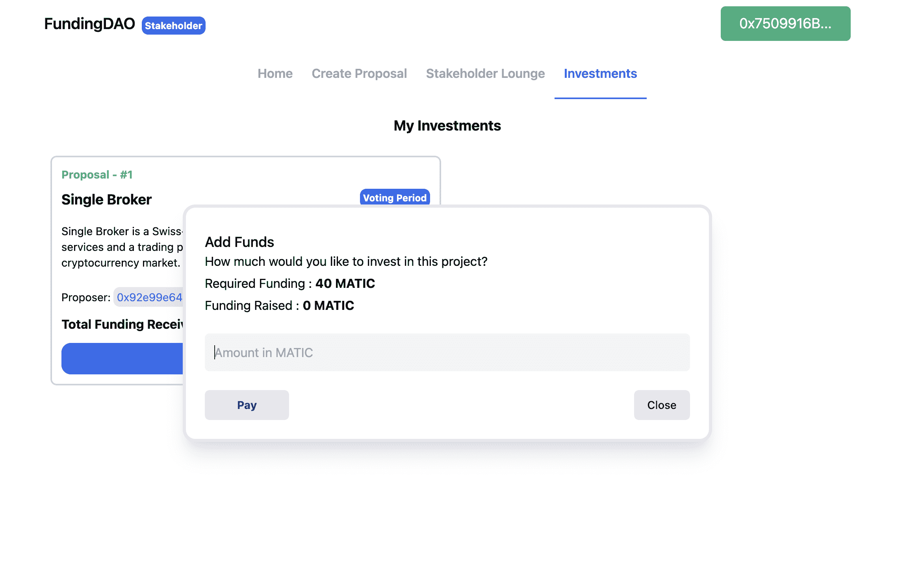

# 介绍

> 原文：<https://github.com/figment-networks/learn-tutorials/blob/master/polygon/build-a-funding-dao-on-polygon.md>

在本教程中，我们将学习如何使用部署在 Polygon 上的 Solidity smart contract 和与 DAO 交互的 NextJS 前端来创建一个分散的自治组织，或“DAO”。

我们将创建一个 Venture/Grant DAO，人们可以使用 MATIC 令牌成为 DAO 中的成员或利益相关者。成员可以为他们的项目申请资金，利益攸关方可以就项目进行投票，以便从 DAO 财政部获得资金。

这把刀有以下特点:

*   用户可以提供多达 5 个标记来成为 DAO 的成员，并且可以提供超过 5 个标记来成为 DAO 中的利益相关者。
*   成员可以创建新的提案并申请资金。每一个新的提议都要求成员向 DAO 金库添加 3 个 MATIC 令牌。
*   如果提案在投票期后被接受，最初的 3 个 MATIC 代币将被退还，否则代币将保留在 DAO 国库中。
*   当一个成员创建一个新的提案时，利益相关者有 3 天时间对该提案进行投票，可以是赞成也可以是反对。
*   在投票期结束时，如果提案被选中，利益相关方可以选择向提出提案的成员提供所需资金。

这就是我们将要创建的刀的样子:

[](https://raw.githubusercontent.com/figment-networks/learn-tutorials/master/assets/funding-dao-demo.gif?raw=true)

# 先决条件

为了成功地完成本教程，您需要很好地理解 Solidity 语言、Truffle 框架和 Next.js 框架。对什么是道及其功能有一个基本的了解也是有益的。

我们将使用 [web3.js](https://web3js.readthedocs.io/en/v1.5.2/) JavaScript 库与智能合约和 Next.js 进行交互，用于后端逻辑。

# 要求

*   块菌为创建和测试区块链应用程序提供了一个本地开发环境。
*   [元掩码](https://metamask.io/) -你需要在浏览器中安装一个元掩码钱包。
*   [NodeJs](https://nodejs.org/en/)——你必须安装 Node.js。我们建议使用 v16.13.0 LTS。
*   Arweave -我们将在 Arweave 上存储与提案相关的图片。
*   [Next.js](https://nextjs.org/) -创建用户界面的 web 框架。
*   一个 CSS 实用框架。

# 项目设置

在终端中运行以下命令，创建项目目录并安装所需的软件包:

```
npm install -g truffle
npx create-next-app --typescript funding-dao
cd funding-dao
truffle init
yarn add @openzeppelin/contracts web3 tailwindcss postcss autoprefixer  @tailwindcss/line-clamp react-toastify react-timer-hook @headlessui/react @types/formidable formidable arweave
npx tailwindcss init -p 
```

`npm install -g truffle`将安装 Truffle 实用程序，`npx create-next-app --typescript funding-dao`将创建一个支持 typescript 的 Next.js 应用，`truffle init`将搭建一个智能合约，yarn add 将安装 dApp 所需的所有依赖项，`npx tailwindcss init -p`将为项目设置 tailwindcss。

# 创建基金道智能合约

```
// SPDX-License-Identifier: MIT
// /contracts/FundingDao.sol
pragma solidity ^0.8.0;

import "@openzeppelin/contracts/access/AccessControl.sol";
import "@openzeppelin/contracts/security/ReentrancyGuard.sol";

contract FundingDAO is ReentrancyGuard, AccessControl {
    bytes32 public constant MEMBER = keccak256("MEMBER");
    bytes32 public constant STAKEHOLDER = keccak256("STAKEHOLDER");

    uint32 constant votingPeriod = 3 days;

    uint256 public proposalsCount = 0;

    struct Proposal {
        uint256 id;
        uint256 amount;
        uint256 livePeriod;
        uint256 voteInFavor;
        uint256 voteAgainst;
        string title;
        string desc;
        bool isCompleted;
        bool paid;
        bool isPaid;
        address payable receiverAddress;
        address proposer;
        uint256 totalFundRaised;
        Funding[] funders;
        string imageId;
    }

    struct Funding {
        address payer;
        uint256 amount;
        uint256 timestamp;
    }

    mapping(uint256 => Proposal) private proposals;
    mapping(address => uint256) private stakeholders;
    mapping(address => uint256) private members;
    mapping(address => uint256[]) private votes;

    event NewMember(address indexed fromAddress, uint256 amount);
    event NewProposal(address indexed proposer, uint256 amount);
    event Payment(
        address indexed stakeholder,
        address indexed projectAddress,
        uint256 amount
    );

    modifier onlyMember(string memory message) {
        require(hasRole(MEMBER, msg.sender), message);
        _;
    }

    modifier onlyStakeholder(string memory message) {
        require(hasRole(STAKEHOLDER, msg.sender), message);
        _;
    }

    function createProposal(
        string calldata title,
        string calldata desc,
        address receiverAddress,
        uint256 amount,
        string calldata imageId
    ) public payable onlyMember("Only members can create new proposal.") {
        require(
            msg.value == 5 * 10**18,
            "You need to add 5 MATIC to create a proposal"
        );
        uint256 proposalId = proposalsCount;
        Proposal storage proposal = proposals[proposalId];
        proposal.id = proposalId;
        proposal.desc = desc;
        proposal.title = title;
        proposal.receiverAddress = payable(receiverAddress);
        proposal.proposer = payable(msg.sender);
        proposal.amount = amount;
        proposal.livePeriod = block.timestamp + votingPeriod;
        proposal.isPaid = false;
        proposal.isCompleted = false;
        proposal.imageId = imageId;
        proposalsCount++;
        emit NewProposal(msg.sender, amount);
    }

    function getAllProposals() public view returns (Proposal[] memory) {
        Proposal[] memory tempProposals = new Proposal[](proposalsCount);
        for (uint256 index = 0; index < proposalsCount; index++) {
            tempProposals[index] = proposals[index];
        }
        return tempProposals;
    }

    function getProposal(uint256 proposalId)
        public
        view
        returns (Proposal memory)
    {
        return proposals[proposalId];
    }

    function getVotes()
        public
        view
        onlyStakeholder("Only Stakeholder can call this function.")
        returns (uint256[] memory)
    {
        return votes[msg.sender];
    }

    function getStakeholderBal()
        public
        view
        onlyStakeholder("Only Stakeholder can call this function.")
        returns (uint256)
    {
        return stakeholders[msg.sender];
    }

    function getMemberBal()
        public
        view
        onlyMember("Only Members can call this function.")
        returns (uint256)
    {
        return members[msg.sender];
    }

    function isStakeholder() public view returns (bool) {
        return stakeholders[msg.sender] > 0;
    }

    function isMember() public view returns (bool) {
        return members[msg.sender] > 0;
    }

    function vote(uint256 proposalId, bool inFavour)
        public
        onlyStakeholder("Only Stakeholders can vote on a proposal.")
    {
        Proposal storage proposal = proposals[proposalId];

        if (proposal.isCompleted || proposal.livePeriod <= block.timestamp) {
            proposal.isCompleted = true;
            revert("Time period of this proposal is ended.");
        }
        for (uint256 i = 0; i < votes[msg.sender].length; i++) {
            if (proposal.id == votes[msg.sender][i])
                revert("You can only vote once.");
        }

        if (inFavour) proposal.voteInFavor++;
        else proposal.voteAgainst++;

        votes[msg.sender].push(proposalId);
    }

    function provideFunds(uint256 proposalId, uint256 fundAmount)
        public
        payable
        onlyStakeholder("Only Stakeholders can make payments")
    {
        Proposal storage proposal = proposals[proposalId];

        if (proposal.isPaid) revert("Required funds are provided.");
        if (proposal.voteInFavor <= proposal.voteAgainst)
            revert("This proposal is not selected for funding.");
        if (proposal.totalFundRaised >= proposal.amount)
            revert("Required funds are provided.");
        proposal.totalFundRaised += fundAmount;
        proposal.funders.push(Funding(msg.sender, fundAmount, block.timestamp));
        if (proposal.totalFundRaised >= proposal.amount) {
            proposal.isCompleted = true;
        }
    }

    function releaseFunding(uint256 proposalId)
        public
        payable
        onlyStakeholder("Only Stakeholders are allowed to release funds")
    {
        Proposal storage proposal = proposals[proposalId];

        if (proposal.totalFundRaised <= proposal.amount) {
            revert("Required funds are not met. Please provider funds.");
        }
        proposal.receiverAddress.transfer(proposal.totalFundRaised);
        proposal.isPaid = true;
        proposal.isCompleted = true;
    }

    function createStakeholder() public payable {
        uint256 amount = msg.value;
        if (!hasRole(STAKEHOLDER, msg.sender)) {
            uint256 total = members[msg.sender] + amount;
            if (total >= 2 ether) {
                _setupRole(STAKEHOLDER, msg.sender);
                _setupRole(MEMBER, msg.sender);
                stakeholders[msg.sender] = total;
                members[msg.sender] += amount;
            } else {
                _setupRole(MEMBER, msg.sender);
                members[msg.sender] += amount;
            }
        } else {
            members[msg.sender] += amount;
            stakeholders[msg.sender] += amount;
        }
    }
}

```

让我们来看看智能合约中发生了什么。

```
// SPDX-License-Identifier: MIT
pragma solidity ^0.8.0;

import "@openzeppelin/contracts/access/AccessControl.sol";
import "@openzeppelin/contracts/security/ReentrancyGuard.sol";
```

我们将使用 OpenZepellin 的 [AccessControl](https://docs.openzeppelin.com/contracts/2.x/access-control) 来管理 DAO 中的成员和利益相关者角色。我们还需要 OpenZepellin 的 [ReentrancyGuard](https://docs.openzeppelin.com/contracts/4.x/api/security#ReentrancyGuard) 来确保不会有任何嵌套的可重入调用。这些都是重要的安全功能，在创建智能合约时不应被忽略。

```
    struct Proposal {
        uint256 id;
        uint256 amount;
        uint256 livePeriod;
        uint256 voteInFavor;
        uint256 voteAgainst;
        string title;
        string desc;
        bool isCompleted;
        bool paid;
        bool isPaid;
        address payable receiverAddress;
        address proposer;
        uint256 totalFundRaised;
        Funding[] funders;
    }

    struct Funding {
        address payer;
        uint256 amount;
        uint256 timestamp;
    }
```

结构保存成员创建的所有提议。`Funding`结构保存与支付到 DAO 国库相关的数据。

```
    mapping(uint256 => Proposal) private proposals;
    mapping(address => uint256) private stakeholders;
    mapping(address => uint256) private members;
    mapping(address => uint256[]) private votes;
```

*   `proposals`存储映射到唯一编号的`Proposal`结构的实例。
*   `stakeholders`将利益相关方的地址映射到他们提供给 DAO treasury 的令牌余额。
*   `members`将会员的地址映射到他们提供给 DAO 国库的代币余额。
*   包含每个利益相关者的提案 id 数组，以跟踪他们的投票。

```
    bytes32 public constant MEMBER = keccak256("MEMBER");
    bytes32 public constant STAKEHOLDER = keccak256("STAKEHOLDER");

    uint32 constant votingPeriod = 3 days;
    uint256 public proposalsCount = 0;
```

`MEMBER`和`STAKEHOLDER`是 DAO 中的两个角色，将用于定义访问控制特性。每个常量的值是 [keccak256](https://solidity-by-example.org/hashing/) 散列，它创建了一个确定性的唯一标识符。

`votingPeriod`是提供给利益相关者对提案进行投票的时间，`proposalsCount`记录所有提案的数量。

```
    modifier onlyMember(string memory message) {
        require(hasRole(MEMBER, msg.sender), message);
        _;
    }

    modifier onlyStakeholder(string memory message) {
        require(hasRole(STAKEHOLDER, msg.sender), message);
        _;
    }
```

`onlyMember`和`onlyStakeholder`是[函数修饰符](https://docs.soliditylang.org/en/latest/contracts.html#function-modifiers)，分别用于成员和涉众实现对契约中方法调用的访问控制。

```
    function createProposal(
        string calldata title,
        string calldata desc,
        address receiverAddress,
        uint256 amount
    ) public payable onlyMember("Only Members can create proposals.") {
        require(
            msg.value == 5 * 10**18,
            "You need to add 5 MATIC to create a proposal"
        );
        uint256 proposalId = proposalsCount;
        Proposal storage proposal = proposals[proposalId];
        proposal.id = proposalId;
        proposal.desc = desc;
        proposal.title = title;
        proposal.receiverAddress = payable(receiverAddress);
        proposal.proposer = payable(msg.sender);
        proposal.amount = amount;
        proposal.livePeriod = block.timestamp + votingPeriod;
        proposal.isPaid = false;
        proposal.isCompleted = false;
        proposalsCount++;
        emit NewProposal(msg.sender, amount);
    }
```

`createProposal`接受建议的相关数据，创建`Proposal`结构的实例，并将其存储在`proposals`映射中。

这里我们使用了`onlyMember`修饰符，因为只有 DAO 的成员才被允许创建一个提议。要创建提案，成员必须锁定 5 个自动令牌。如果提议被接受，代币将被退还给提议者，否则代币将被添加到 DAO 国库。

```
    function getAllProposals() public view returns (Proposal[] memory) {
        Proposal[] memory tempProposals = new Proposal[](proposalsCount);
        for (uint256 index = 0; index < proposalsCount; index++) {
            tempProposals[index] = proposals[index];
        }
        return tempProposals;
    }

    function getProposal(uint256 proposalId)
        public
        view
        returns (Proposal memory)
    {
        return proposals[proposalId];
    }

    function getVotes()
        public
        view
        onlyStakeholder("Only Stakeholder can call this function.")
        returns (uint256[] memory)
    {
        return votes[msg.sender];
    }

    function getStakeholderBal()
        public
        view
        onlyStakeholder("Only Stakeholder can call this function.")
        returns (uint256)
    {
        return stakeholders[msg.sender];
    }

    function getMemberBal()
        public
        view
        onlyMember("Only Members can call this function.")
        returns (uint256)
    {
        return members[msg.sender];
    }

    function isStakeholder() public view returns (bool) {
        return stakeholders[msg.sender] > 0;
    }

    function isMember() public view returns (bool) {
        return members[msg.sender] > 0;
    }
```

`getAllProposals`、`getProposal`、`getVotes`、`getStakeholderBal`、`getMemberBal`、`isStakeholder`、`isMember`都是用来验证合同状态的查看功能。

```
    function vote(uint256 proposalId, bool inFavour)
        public
        onlyStakeholder("Only Stakeholders can vote on a proposal.")
    {
        Proposal storage proposal = proposals[proposalId];

        if (proposal.isCompleted || proposal.livePeriod <= block.timestamp) {
            proposal.isCompleted = true;
            revert("Time period of this proposal is ended.");
        }
        for (uint256 i = 0; i < votes[msg.sender].length; i++) {
            if (proposal.id == votes[msg.sender][i])
                revert("You can only vote once.");
        }

        if (inFavour) proposal.voteInFavor++;
        else proposal.voteAgainst++;

        votes[msg.sender].push(proposalId);
    }
```

`vote`方法只能被涉众调用。首先，我们检查提议是否没有完成，调用该方法的涉众是否还没有投票赞成相应的提议。验证成功后，会计算提案的投票数，并为该利益相关者更新`votes`映射，因此该利益相关者不能再次对此提案投票。

```
    function provideFunds(uint256 proposalId, uint256 fundAmount)
        public
        payable
        onlyStakeholder("Only Stakeholders can make payments")
    {
        Proposal storage proposal = proposals[proposalId];

        if (proposal.isPaid) revert("Proposal already paid out.");
        if (proposal.voteInFavor <= proposal.voteAgainst)
            revert("This proposal is not selected for funding.");
        if (proposal.totalFundRaised >= proposal.amount)
            revert("Proposal funding goal already reached.");
        proposal.totalFundRaised += fundAmount;
        proposal.funders.push(Funding(msg.sender, fundAmount, block.timestamp));
        if (proposal.totalFundRaised >= proposal.amount) {
            proposal.isCompleted = true;
        }
    }
```

一旦投票完成并且提案被机构群体选中，利益相关方就可以调用`provideFunds`方法。在接受资金之前，我们需要确保:

*   该提案尚未支付。
*   该提案的赞成票多于反对票。
*   该提案尚未达到所要求的筹资目标。

验证之后，资金被临时添加到国库中，并且用调用该方法的涉众所资助的金额来更新`Proposal`中的`funders`数组。最后，我们检查`totalFundRaised`是否大于提议者请求的数量，如果是，我们将`isCompleted`设置为`true`。

```
    function releaseFunding(uint256 proposalId)
        public
        payable
        onlyStakeholder("Only Stakeholders are allowed to release funds")
    {
        Proposal storage proposal = proposals[proposalId];

        if (proposal.totalFundRaised <= proposal.amount) {
            revert("Requested funding goal is not met. Please provide funds.");
        }
        proposal.receiverAddress.transfer(proposal.totalFundRaised);
        proposal.isPaid = true;
        proposal.isCompleted = true;
    }
```

`releaseFunding`只有在为提案提供资金后，利益相关方才能打电话，并且可以发送到接收方的地址。在`releaseFunding`中，我们确保`totalFundRaised`大于或等于提议者请求的金额。

现在，我们可以将`totalFundRaised`从 DAO treasury 转移到接收者的地址，并将`isPaid`设置为`true`以用于相应的提议。

```
    function createStakeholder() public payable {
        uint256 amount = msg.value;
        if (!hasRole(STAKEHOLDER, msg.sender)) {
            uint256 total = members[msg.sender] + amount;
            if (total >= 2 ether) {
                _setupRole(STAKEHOLDER, msg.sender);
                _setupRole(MEMBER, msg.sender);
                stakeholders[msg.sender] = total;
                members[msg.sender] += amount;
            } else {
                _setupRole(MEMBER, msg.sender);
                members[msg.sender] += amount;
            }
        } else {
            members[msg.sender] += amount;
            stakeholders[msg.sender] += amount;
        }
    }
```

任何人、成员、利益相关者或希望加入 DAO 的用户都可以调用`createStakeholder`。我们正在检查一些东西-

*   如果调用该方法的帐户是一个新用户，并且在方法调用期间发送的 MATIC 令牌的数量超过 2 MATIC，那么我们向该帐户提供涉众和成员角色。如果发送的金额少于 2 MATIC，我们只给该帐户成员角色。请记住，虽然 Solidity 使用 ether 关键字来表示一个完整的实用程序令牌，但我们将把这个智能契约部署到使用 MATIC 令牌而不是 Ether 的 Polygon。
*   如果进行调用的帐户已经是一个成员，那么我们创建一个帐户先前添加的所有令牌的总数，并检查令牌总数是否大于 2 MATIC，如果是，我们将利益相关者角色赋予该帐户。
*   如果帐户调用已经是一个涉众，那么我们只需将方法调用发送的令牌添加到 DAO 库。

我们已经完成了`FundingDao.sol`，现在让我们将智能合约部署到本地区块链进行测试。

# 用 Truffle 编译和部署

转到`migrations`目录，创建一个名为`2_funding_dao_migration.js`的新文件

```
// migrations/2_funding_dao_migration.js
const FundingDao = artifacts.require("FundingDao");

module.exports = function (deployer) {
  deployer.deploy(FundingDao);
};
```

打开`truffle-config.js`并添加以下代码。

```
module.exports = {
  networks: {
    development: {
      host: "localhost",
      port: 8545,
      network_id: "*",
    },
  },
  contracts_directory: "./contracts",
  contracts_build_directory: "./abis",
  compilers: {
    solc: {
      version: "^0.8.6",
      optimizer: {
        enabled: true,
        runs: 200,
      },
    },
  },
  db: {
    enabled: false,
  },
};
```

出于开发和测试的目的，我们将智能合约部署到本地区块链。要启动松露附带的 Ganache 本地区块链，请在终端中运行以下命令:

```
ganache-cli 
```

Ganache 将启动，您将看到终端中显示的 10 个默认帐户的地址和私钥。当您看到以下内容时，您就会知道 Ganache 正在运行并准备就绪:

```
Listening on 127.0.0.1:8545 
```

打开新终端并运行以下命令来编译和部署契约。

```
truffle compile
truffle deploy 
```

# 创建前端

在 Next.js 中，页面是从`pages`目录中的`.jsx`或`.tsx`文件导出的 React 组件。每个页面都根据其文件名与一个路径相关联。例如，如果您像下面这样创建`pages/home.tsx`导出组件，它将在浏览器中的`/home`端点可访问。

```
const Home = () => {
  return <div>Home</div> }

export default Home;
```

在我们的 dApp 中，我们将创建四个页面:

[](https://raw.githubusercontent.com/figment-networks/learn-tutorials/master/assets/funding-dao-folder-structure.png?raw=true)

在 Next.js 应用程序中，我们将使用`contexts`来分离业务逻辑和 UI。我们将创建一个`DataContext`，它将处理所有的状态和方法调用，我们的 UI 将调用这些方法和变量。这允许我们编写一个没有业务逻辑的干净的 UI 代码。

我们将从创建数据上下文开始。在`contexts`目录中创建一个名为`dataContext.tsx`的文件，并将下面链接的文件中的代码粘贴到其中。

[contexts/dataContext.tsx](https://github.com/viral-sangani/Funding-DAO/blob/main/contexts/dataContext.tsx)

我们把`dataContext.tsx`分解一下，了解一下各个功能。在顶部我们有-

```
interface DataContextProps {
  account: string;
  loading: boolean;
  connect: () => Promise<void>;
  fundingDao: any;
  allProposals: Proposal[];
  isStakeholder: boolean;
  isMember: boolean;
  currentBal: string;
  allVotes: string[];
  allInvestedProposal: Proposal[];
  createStakeholder: (amount: string) => Promise<void>;
  provideFunds: (id: string, amount: string) => Promise<void>;
  getProposal: (id: string) => Promise<Proposal>;
  vote: (id: string, vote: boolean) => Promise<void>;
  releaseFunding: (id: string) => Promise<void>;
  createProposal: ({
    title,
    description,
    amount,
    recipient,
    imageId,
  }: {
    title: string;
    description: string;
    amount: string;
    recipient: string;
    imageId: string;
  }) => Promise<void>;
}

const DataContext = createContext<DataContextProps>({
  account: "",
  loading: true,
  connect: async () => {},
  fundingDao: null,
  allProposals: [],
  isStakeholder: false,
  isMember: false,
  currentBal: "",
  allVotes: [],
  allInvestedProposal: [],
  createStakeholder: async (val) => {},
  provideFunds: async (id, amount) => {},
  createProposal: async () => {},
  vote: async () => {},
  releaseFunding: async () => {},
  getProposal: async (val) => {
    return {} as Proposal;
  },
});
```

我们已经为`DataContext`创建了一个类型接口，并用空值初始化了`DataContext`。

```
  const [loading, setLoading] = useState(true);
  const [account, setAccount] = useState("");
  const [fundingDao, setFundingDao] = useState<any>();
  const [allProposals, setAllProposals] = useState<Proposal[]>([]);
  const [isStakeholder, setIsStakeholder] = useState(false);
  const [isMember, setIsMember] = useState(false);
  const [currentBal, setCurrentBal] = useState("");
  const [allVotes, setAllVotes] = useState<string[]>([]);
  const [allInvestedProposal, setAllInvestedProposal] = useState<Proposal[]>(
    []
  );
```

这些是我们在 dApp 中需要的状态变量。`loading`设置为 false，直到我们从联系人处获取所有需要的数据，这些数据将用于向用户显示加载屏幕。`account`变量包含当前用户的账户地址。

`fundingDao`是我们智能契约的一个实例，而`allProposals`包含我们契约中所有提议的列表。`isStakeholder`和`isMember`定义了当前用户在 DAO 中的角色。

`currentBal`将用户的余额存入道金库。`allVotes`和`allInvestedProposal`分别为涉众存储提案和提案对象的 id。

```
  const connect = async () => {
    if (window.ethereum) {
      window.web3 = new Web3(window.ethereum);
     window.ethereum.request({ method: 'eth_requestAccounts' })
      await window.ethereum.enable();
    } else if (window.web3) {
      window.web3 = new Web3(window.web3.currentProvider);
    } else {
      window.alert("Non-Eth browser detected. Please consider using MetaMask.");
      return;
    }
    var allAccounts = await window.web3.eth.getAccounts();
    setAccount(allAccounts[0]);
    await loadBlockchainData();
  };
```

在`connect`函数中，我们将 dApp 与元掩码相连接，并获取账户。

```
const loadBlockchainData = async () => {
    const web3 = window.web3;
    const fundingDaoData = FundingDAO.networks["1638870705645"];
    if (fundingDaoData) {
      var fundingDaoContract = await new web3.eth.Contract(
        FundingDAO.abi,
        fundingDaoData.address
      );
      setFundingDao(fundingDaoContract);
      setTimeout(async () => {
        var totalProposals = await fundingDaoContract.methods
          .getAllProposals()
          .call({ from: account });
        var tempProposals: Proposal[] = [];
        totalProposals.forEach((item: Proposal) => {
          tempProposals.push(item);
        });
        setAllProposals(tempProposals);
        var isStakeholder = await fundingDaoContract.methods
          .isStakeholder()
          .call({
            from: account,
          });
        setIsStakeholder(isStakeholder);
        var isMember = await fundingDaoContract.methods.isMember().call({
          from: account,
        });
        setIsMember(isMember);
        if (isMember && !isStakeholder) {
          var memberBal = await fundingDaoContract.methods.getMemberBal().call({
            from: account,
          });
          setCurrentBal(Web3.utils.fromWei(memberBal, "ether"));
        } else if (isMember && isStakeholder) {
          var stakeholderBal = await fundingDaoContract.methods
            .getStakeholderBal()
            .call({
              from: account,
            });
          setCurrentBal(Web3.utils.fromWei(stakeholderBal, "ether"));
          var votes = await fundingDaoContract.methods.getVotes().call({
            from: account,
          });
          var res = tempProposals.filter((proposal) => {
            const vote = votes.find((vote: string) => vote === proposal.id);
            if (vote) {
              return true;
            }
            return false;
          });
          setAllInvestedProposal(res);
          setAllVotes(votes);
        } else {
          setCurrentBal("");
        }
        setLoading(false);
      }, 500);
    } else {
      window.alert("TestNet not found");
    }
  };
```

在`loadBlockchainData`功能中，我们正在做以下事情-

*   使用 ABI 创建 fundingDao 实例并设置状态变量。
*   调用 smart contract 的`getAllProposals`来获取所有建议的数组。
*   通过调用智能契约的`isMember`和`isStakeholder`方法来检查用户是否是成员或利益相关者。
*   通过调用`getStakeholderBal`或`getMemberBal`获取用户余额。
*   如果用户是利益相关者，那么获取用户过去投票的所有提案的 id 数组。
*   用更新的值设置所有状态变量。

```
const createStakeholder = async (amount: string) => {
    if (amount === "" || amount === "0") {
      toast.error("Please enter valid amount", {});
    }
    await fundingDao.methods
      .createStakeholder()
      .send({ from: account, value: Web3.utils.toWei(amount, "ether") });
    loadBlockchainData();
  };
```

在`createStakeholder`中，我们接受用户输入的金额，并调用智能合约的`createStakeholder`方法来赋予/更新用户的角色。

```
const createProposal = async ({
    title,
    description,
    amount,
    recipient,
    imageId,
  }: {
    title: string;
    description: string;
    amount: string;
    recipient: string;
    imageId: string;
  }) => {
    if (amount === "" || amount === "0") {
      toast.error("Please enter valid amount", {});
    }
    await fundingDao.methods
      .createProposal(
        title,
        description,
        recipient,
        Web3.utils.toWei(amount, "ether"),
        imageId
      )
      .send({ from: account, value: Web3.utils.toWei("5", "ether") });
    loadBlockchainData();
  };
```

在`createProposal`中，我们将标题、描述、金额和接收者作为参数传递，并调用契约的`createProposal`。`createProposal`是一个交易调用，因为用户必须锁定 5 个自动令牌才能创建一个提案。

```
const getProposal = async (id: string) => {
    var data = await fundingDao.methods.getProposal(id).call({
      from: account,
    });
    var proposal: Proposal = data;
    return proposal;
  };

  const vote = async (id: string, vote: boolean) => {
    await fundingDao.methods.vote(id, vote).send({
      from: account,
    });
    loadBlockchainData();
  };
```

在`getProposal`中，我们通过将提议 id 作为唯一的参数传递，从契约中只获取一个提议。在`vote`函数中，我们接受投票按钮动作的提议 id 和布尔值，并调用契约的`vote`方法。注意，只有涉众可以调用`vote`方法。

```
const provideFunds = async (id: string, amount: string) => {
    await fundingDao.methods
      .provideFunds(id, Web3.utils.toWei(amount, "ether"))
      .send({
        from: account,
        value: Web3.utils.toWei(amount, "ether"),
      });
    loadBlockchainData();
  };
const releaseFunding = async (id: string) => {
    await fundingDao.methods.releaseFunding(id).send({
      from: account,
    });
    loadBlockchainData();
  };
```

当投票期结束并且提案被接受时，利益相关者调用`provideFunds`函数。任何利益相关者都可以调用`provideFunds`并传递他们想要投资项目的令牌数量。当利益相关方提供了所请求的资金并且 DAO 准备好将资金转移到接收方的地址时，将调用`releaseFunding`。任何利益相关方都可以致电`releaseFunding`。

现在我们已经完成了 dApp 的业务逻辑，让我们从显示界面开始。

`index.tsx`是所有用户的入口页面。如果用户是新用户，那么我们会显示一个框，要求他们转移 MATIC 令牌以成为成员或利益相关者。相同的用户界面看起来像这样-

```
// pages/index.tsx
import Head from "next/head";
import { CreateMember } from "../components/createMember";
import Navbar from "../components/navbar";
import { ProposalList } from "../components/proposalList";
import { useData } from "../contexts/dataContext";
import styles from "../styles/Home.module.css";

export default function Home() {
  const { isMember, loading, account } = useData();

  if (loading) {
    return (
      <div className="h-screen w-screen flex justify-center items-center">
        <div className="text-2xl font-bold text-gray-500">Loading...</div>
 </div>
    );
  }
  if (!account) {
    return (
      <div className="h-screen w-screen flex justify-center items-center">
        <div className="text-2xl font-bold text-gray-500">
          Please connect Metamask Wallet
        </div>
 </div>
    );
  }
  return (
    <div className={styles.container}>
      <Head>
        <title>Funding DAO</title> <meta name="description" content="Generated by create next app" />
        <link rel="icon" href="/favicon.ico" /> </Head> <Navbar />

      {!isMember && <CreateMember />}
      {isMember && <ProposalList />}
 </div>
  );
}
```

[](https://raw.githubusercontent.com/figment-networks/learn-tutorials/master/assets/funding-dao-index.png?raw=true)

在`index.tsx`中，我们确保如果我们从合同中加载数据，那么我们显示加载状态，如果用户没有连接元掩码，我们要求用户连接他们的钱包。在索引页面上，如果用户既不是利益相关者也不是成员，那么我们向用户显示一个 UI，他/她可以从这个 UI 将 MATIC 转移到 treasury 并成为 DAO 的成员。如果用户已经是成员，那么我们显示所有当前建议的列表。

让我们看看导航条是什么样子的:

```
// components/navbar.tsx
import Link from "next/link";
import { useRouter } from "next/router";
import React from "react";
import { useData } from "../contexts/dataContext";

function Navbar() {
  const router = useRouter();
  const { account, connect, isMember, isStakeholder } = useData();

  return (
    <>
      <nav className="w-full h-16 mt-auto max-w-5xl">
        <div className="flex flex-row justify-between items-center h-full">
          <div className="">
            <Link href="/" passHref>
              <span className="font-semibold text-xl cursor-pointer">
                FundingDAO
              </span>
            </Link>
            <span className="text-xs bg-blue-500 text-white rounded-lg py-1 px-1 font-bold ml-2">
              {!isMember && !isStakeholder
                ? "Not a Member"
                : isStakeholder
                ? "Stakeholder"
                : "Member"}
            </span>
 </div>

          {account ? (
            <div className="bg-green-500 px-6 py-2 rounded-md cursor-pointer">
              <span className="text-lg text-white">
                {account.substr(0, 10)}...
              </span>
 </div>
          ) : (
            <div
              className="bg-green-500 px-6 py-2 rounded-md cursor-pointer"
              onClick={() => {
                connect();
              }}
            >
              <span className="text-lg text-white">Connect</span>
 </div>
          )}
        </div>
      </nav>
      <nav className="w-full h-16 m-auto max-w-5xl flex justify-center">
        <div className="flex flex-row justify-between items-center h-full">
          {account && (
              <div className="flex flex-row items-center justify-center h-full">
                <TabButton
                  title="Home"
                  isActive={router.asPath === "/"}
                  url={"/"}
                />
                {isMember && (
                  <TabButton
                    title="Create Proposal"
                    isActive={router.asPath === "/create-proposal"}
                    url={"/create-proposal"}
                  />
                )}
                {isMember && (
                  <TabButton
                    title="Stakeholder Lounge"
                    isActive={router.asPath === "/stakeholder-lounge"}
                    url={"/stakeholder-lounge "}
                  />
                )}
                {isStakeholder && (
                  <TabButton
                    title="Investments"
                    isActive={router.asPath === "/investments"}
                    url={"/investments"}
                  />
                )}
              </div>
            )}
        </div>
      </nav>
    </>
  );
}

export default Navbar;

const TabButton = ({
  title,
  isActive,
  url,
}: {
  title: string;
  isActive: boolean;
  url: string;
}) => {
  return (
    <Link href={url} passHref>
      <div
        className={`h-full px-3 flex items-center border-b-2 font-semibold hover:border-blue-700 hover:text-blue-700 cursor-pointer ${
          isActive
            ? "border-blue-700 text-blue-700 text-base font-semibold"
            : "border-white text-gray-400 text-base"
        }`}
      >
        <span>{title}</span>
 </div>
    </Link>
  );
};
```

在 navbar 中，如果用户是会员，我们显示**会员**徽章；如果用户是股东，我们显示**股东**徽章；否则我们显示**非会员**徽章。

对于非成员，我们只显示主页选项卡，对于成员，我们显示创建提案和利益相关者休息室选项卡，对于利益相关者，我们在导航栏中显示一个额外的投资选项卡。

```
// components/createMember.tsx
import React, { useState } from "react";
import { useData } from "../contexts/dataContext";

export const CreateMember = () => {
  const { createStakeholder } = useData();
  const [val, setVal] = useState("");
  return (
    <main className="w-full flex flex-colpy-4 flex-grow max-w-5xl justify-center">
      <div className="max-w-2xl border-2 border-blue-600 rounded-xl p-3 mt-10 h-full">
        <div className="flex flex-col justify-center">
          <span>You are not a member.</span> <p>
            Add <strong>2 MATIC</strong> to become Member and more than 2 MATIC
            become a Stakeholder
          </p> <input
            type="search"
            name="q"
            value={val}
            onChange={(e) => setVal(e.target.value)}
            className="my-5 w-full py-3 px-3 text-base text-gray-700 bg-gray-100 rounded-md focus:outline-none"
            placeholder="Amount in MATIC"
            autoComplete="off"
          />
          <button
            className="px-3 py-2 rounded-xl bg-blue-600 text-white"
            onClick={() => {
              createStakeholder(val);
            }}
          >
            Send
          </button>
 </div>
      </div>
    </main>
  );
};
```

[](https://raw.githubusercontent.com/figment-networks/learn-tutorials/master/assets/funding-dao-create-member.png?raw=true)

如果用户没有加入 DAO，我们将在索引页面上使用`CreateMember`组件。在这个组件中，我们接受用户希望给 DAO 的 MATIC 令牌的数量，以成为一个成员/利益相关者。在发送按钮上，我们从`dataContext`调用`createStakeholder`方法。

```
// components/proposalList.tsx
import React, { useState } from "react";
import Link from "next/link";
import { useData } from "../contexts/dataContext";
import { ProposalCard } from "./proposalCard";
import { VoteModal } from "./voteModal";
import { Proposal } from "../utils/interface";

export const ProposalList = () => {
  const { allProposals, isMember, isStakeholder } = useData();
  const [isOpen, setIsOpen] = useState(false);
  const [proposal, setProposal] = useState<Proposal | null>(null);
  return (
    <>
      <VoteModal
        isOpen={isOpen}
        proposal={proposal}
        closeModal={() => {
          setIsOpen(false);
        }}
      />
      <span className="text-lg font-bold mt-5">
        {isMember && !isStakeholder ? "My Proposal" : "All Proposals"}
      </span>
      <main className="w-full flex flex-row py-4 flex-grow max-w-5xl">
        {allProposals.length == 0 && (
          <span className="text-lg font-bold mt-5 text-center">
            Sorry, you have no proposals yet. Create one{" "}
            <Link href="/create-proposal">
              <a className="textx-blue-600 underline">now!</a> </Link>
 </span>
        )}
        {allProposals.map((proposal) => (
          <ProposalCard
            key={proposal.id}
            proposal={proposal}
            openModal={() => {
              setIsOpen(true);
              setProposal(proposal);
            }}
          />
        ))}
      </main>
    </>
  );
};
```

`ProposalList`组件显示合同中出现的`ProposalCard`列表。如果用户是一个利益相关者，那么用户可以点击卡片，得到一个弹出模式，对提案进行投票。

```
// components/proposalCard.tsx
import Img from "next/image";
import Link from "next/link";
import React from "react";
import { useTimer } from "react-timer-hook";
import Web3 from "web3";
import { useData } from "../contexts/dataContext";
import { Proposal } from "../utils/interface";

interface Props {
  proposal: Proposal;
  openModal: () => void;
}
export const ProposalCard: React.FC<Props> = ({ proposal, openModal }) => {
  const { seconds, minutes, hours, days } = useTimer({
    expiryTimestamp: new Date(parseInt(proposal.livePeriod) * 1000),
    onExpire: () => console.warn("onExpire called"),
  });
  const { isStakeholder, getProposal } = useData();
  const isCompleted =
    new Date(parseInt(proposal.livePeriod) * 1000) < new Date();
  console.log(`isCompleted`, isCompleted);
  return (
    <div
      className="w-full overflow-hidden sm:my-1 sm:px-1 sm:w-1/2 md:my-2 md:px-2 md:w-1/2 lg:w-1/2 xl:w-1/2 my-2"
      onClick={async () => {
        if (isStakeholder) {
          console.log("isStakeholder");
          var data: Proposal = await getProposal(proposal.id);
          console.log(`data`, data);
          openModal();
        }
      }}
    >
      <div className="flex flex-col border-2 border-gray-300 rounded-lg p-3 hover:border-blue-700">
        <div className="flex flex-col">
          <span className="text-sm font-bold text-gray-500 inline-flex justify-between ">
            Proposal - #{parseInt(proposal.id) + 1}
            <span>
              Funding Amount -{" "}
              <span className="text-blue-600">
                {Web3.utils.fromWei(proposal.amount)} MATIC
              </span>
 </span>
          </span>
          <span className="text-lg font-bold inline-flex justify-between mt-2">
            {proposal.title}
            <span className="text-xs bg-blue-500 text-white rounded-lg py-1 px-1 font-bold ml-2 h-6">
              Voting Period
            </span>
 </span>
          <span className="text-sm line-clamp-3 mt-4 mb-6">
            {proposal.desc}
          </span> <span className="text-sm">
            Proposer:{" "}
            <span className="bg-gray-200 text-blue-500 00 p-1 rounded-lg">
              {proposal.proposer}
            </span>
          </span>
        </div>

        <div className="flex flex-row flex-nowrap justify-between items-center mt-5">
          <div className="flex flex-col space-y-1">
            <span className="text-xs text-gray-500 font-bold">Time</span>
            {isCompleted ? (
              <span className="text-xs font-bold">Voting period is over.</span>
 ) : (
 <span className="text-sm">
 <span>{days} days</span> <span>{hours}</span>:
 <span>{minutes}</span>:<span>{seconds}</span>
 {/* <span>{ampm}</span> */}
 </span>
 )}
 </div>
 {isCompleted ? (
 <span className="text-base font-bold">
 Proposal is{" "}
 {parseInt(proposal.voteInFavor) > parseInt(proposal.voteAgainst)
 ? "Accepted"
 : "Rejected"}
 </span>
 ) : (
 <>
 <div className="flex flex-col space-y-1">
 <span className="text-xs text-gray-500 font-bold">
 In Favor
 </span>
 <span className="text-sm">{proposal.voteInFavor}</span>
 </div>
 <div className="flex flex-col space-y-1">
 <span className="text-xs text-gray-500 font-bold">Against</span>
 <span className="text-sm">{proposal.voteAgainst}</span>
              </div>
            </>
          )}
        </div>
      </div>
    </div>
  );
};
```

[](https://raw.githubusercontent.com/figment-networks/learn-tutorials/master/assets/funding-dao-proposal-card.png?raw=true)

组件接受建议数据，并相应地显示用户界面。我们使用`react-timer-hook`来显示投票周期剩余时间的计时器。

让我们创建一个新页面`create-proposal.tsx`

```
// pages/create-proposal.tsx
import Head from "next/head";
import { FormEvent, useState } from "react";
import Navbar from "../components/navbar";
import { ProposalList } from "../components/proposalList";
import { useData } from "../contexts/dataContext";
import styles from "../styles/Home.module.css";

export default function Home() {
  const [title, setTitle] = useState("");
  const [description, setDescription] = useState("");
  const [amount, setAmount] = useState("");
  const [recipient, setRecipient] = useState("");
  const [image, setImage] = useState<File | null>();
  const { createProposal } = useData();

  const handleSubmit = async (e: FormEvent<HTMLFormElement>) => {
    e.preventDefault();
    var id;
    if (image) {
      let formData = new FormData();
      formData.append("image", image);
      var res = await fetch("/api/upload-image", {
        method: "POST",
        body: formData,
      });
      var data = await res.json();
      id = data.id;
    }
    await createProposal({
      title,
      description,
      amount,
      recipient,
      imageId: id ?? "",
    });
    setTitle("");
    setDescription("");
    setAmount("");
    setRecipient("");
    setImage(null);
  };

  const { isMember, isStakeholder, loading } = useData();
  if (loading) return <div>Loading...</div>;
  return (
    <div className={styles.container}>
      <Head>
        <title>Funding DAO</title> <meta name="description" content="Generated by create next app" />
        <link rel="icon" href="/favicon.ico" /> </Head> <Navbar />
      {isMember && (
        <main className="w-full flex flex-col py-4 flex-grow max-w-5xl items-center">
          <div className="w-3/4 border-2 border-blue-600 rounded-xl p-3 mt-10">
            <div className="flex flex-col justify-center">
              <span className="text-xl text-center">Create a new Proposal</span> <p className="mt-4">
                You will need to lock 5 MATIC to create proposal.
              </p> <p className="text-sm mb-4">
                If proposal is accepted, you will be refunded 5 MATIC and if
                proposal is rejected, 5 MATIC will go to DAO treasury.
              </p> <form onSubmit={handleSubmit}>
                <input
                  value={title}
                  onChange={(e) => setTitle(e.target.value)}
                  className="my-2 w-full py-3 px-3 text-base text-gray-700 bg-gray-100 rounded-md focus:outline-none"
                  placeholder="Title"
                  autoComplete="off"
                  required
                />
                <textarea
                  placeholder="Describe your project here"
                  rows={5}
                  value={description}
                  onChange={(e) => setDescription(e.target.value)}
                  className="my-2 w-full py-3 px-3 text-base text-gray-700 bg-gray-100 rounded-md focus:outline-none"
                ></textarea>
                <input
                  type="file"
                  name="proposal-image"
                  onChange={(e) =>
                    setImage(e.target.files?.length ? e.target.files[0] : null)
                  }
                />
                <input
                  value={recipient}
                  onChange={(e) => setRecipient(e.target.value)}
                  className="my-2 w-full py-3 px-3 text-base text-gray-700 bg-gray-100 rounded-md focus:outline-none"
                  placeholder="Funding Receiver's Address"
                  autoComplete="off"
                  required
                />

                <input
                  value={amount}
                  onChange={(e) => setAmount(e.target.value)}
                  className="my-2 w-full py-3 px-3 text-base text-gray-700 bg-gray-100 rounded-md focus:outline-none"
                  placeholder="Funding Amount"
                  autoComplete="off"
                  required
                />

                <button
                  className="mt-3 px-3 py-2 rounded-xl bg-blue-600 text-white"
                  type="submit"
                >
                  Create Proposal
                </button>
 </form>
            </div>
          </div>
        </main>
      )}
    </div>
  );
}
```

[](https://raw.githubusercontent.com/figment-networks/learn-tutorials/master/assets/funding-dao-create-proposal.png?raw=true)

在这个页面上，我们为用户呈现一个表单来创建一个新的提案。一旦所有的字段都被填充，我们就从`dataContext`调用`createProposal`方法。

在调用`createProposal`函数之前，我们对 Next.js API 端点进行 API 调用，并将用户上传的图像作为表单数据传递。在 API 调用中，我们上传图像，将其转换为 base64，并将图像存储在 Arweave 上，然后返回对象的 ID。

现在，我们需要在 Arweave 上创建一个帐户，并获得该帐户的密钥，并确保我们在帐户中有一些 AR 令牌来上传数据。

前往 https://faucet.arweave.net/的，按照所有步骤在账户中获得您的`.json`密钥和 0.02 AR 代币。有了密钥后，将密钥复制到项目的根目录，并将文件重命名为`arweave-key.json`。确保将`arweave-key.json`添加到您的`.gitignore`文件中。

让我们创建`upload-image.ts`文件并处理 Arweave 调用。

```
// pages/api/upload-image.ts
import type { NextApiRequest, NextApiResponse } from "next";
import Arweave from "arweave";
import formidable, { File } from "formidable";
import fs from "fs";
import { CreateTransactionInterface } from "arweave/node/common";

const key = JSON.parse(
  fs.readFileSync("arweave-key.json").toString().trim()
);

type Data = {
  id: string;
};
export const config = {
  api: {
    bodyParser: false,
  },
};

export default function handler(
  req: NextApiRequest,
  res: NextApiResponse<Data>
) {
  const arweave = Arweave.init({
    host: "arweave.net",
    port: 443,
    protocol: "https",
  });
  const form = new formidable.IncomingForm();
  form.parse(req, async (err, fields, files) => {
    var rawData: any = fs.readFileSync(
      (files.image as unknown as File).filepath,
      { encoding: "base64" }
    );
    var rawObj: Partial<CreateTransactionInterface> = {
      data: rawData,
    };
    let transactionA = await arweave.createTransaction(rawObj, key);
    await arweave.transactions.sign(transactionA, key);
    let uploader = await arweave.transactions.getUploader(transactionA);
    while (!uploader.isComplete) {
      await uploader.uploadChunk();
    }
    console.log(`transactionA.id`, transactionA.id)
    res.status(200).json({id: transactionA.id});
  });
}
```

在`upload-image.ts`中，我们使用`arweave.net`作为主机创建了一个`Arweave`的实例，因为我们创建的帐户也在 Arweave mainnet 上。我们可以从表单数据中获取图像，并将图像转换成 base64 字符串。一旦我们有了 base64 字符串，我们就调用`arweave.createTransaction`并传入 base64 数据和 arweave 密钥。

创建交易后，我们需要签署交易，为此，我们调用`arweave.transactions.sign`。一旦我们成功签署了交易，我们就可以使用`uploadChunk`方法上传 base64。文件上传后，我们可以在响应中发送`transaction.id`。

让我们来研究一下`VoteModal`组件。

```
// components/voteModal.tsx
import { Dialog, Transition } from "@headlessui/react";
import { Fragment, useEffect, useState } from "react";
import Web3 from "web3";
import Img from "next/image";
import { useData } from "../contexts/dataContext";
import { Proposal } from "../utils/interface";
import Arweave from "arweave";

interface Props {
  isOpen: boolean;
  closeModal: () => void;
  proposal: Proposal | null;
}

export const VoteModal: React.FC<Props> = ({
  isOpen,
  closeModal,
  proposal,
}) => {
  const { allVotes, vote } = useData();
  const [image, setImage] = useState<string>("");
  useEffect(() => {
    var arweave = Arweave.init({
      host: "arweave.net", // Hostname or IP address for a Arweave host
      port: 443, // Port
      protocol: "https", // Network protocol http or https
    });
    if (proposal?.imageId) {
      arweave.transactions
        .getData(proposal?.imageId, {
          decode: true,
          string: true,
        })
        .then((data) => {
          setImage(data as string);
        });
    }
  });
  return (
    <>
      <Transition appear show={isOpen} as={Fragment}>
        <Dialog
          as="div"
          className="fixed inset-0 z-10 overflow-y-auto"
          onClose={closeModal}
        >
          <div className="min-h-screen px-4 text-center">
            <Transition.Child
              as={Fragment}
              enter="ease-out duration-300"
              enterFrom="opacity-0"
              enterTo="opacity-100"
              leave="ease-in duration-200"
              leaveFrom="opacity-100"
              leaveTo="opacity-0"
            >
              <Dialog.Overlay className="fixed inset-0" />
            </Transition.Child>

            {/* This element is to trick the browser into centering the modal contents. */}
            <span
              className="inline-block h-screen align-middle"
              aria-hidden="true"
            >
              &#8203;
            </span> <Transition.Child
              as={Fragment}
              enter="ease-out duration-300"
              enterFrom="opacity-0 scale-95"
              enterTo="opacity-100 scale-100"
              leave="ease-in duration-200"
              leaveFrom="opacity-100 scale-100"
              leaveTo="opacity-0 scale-95"
            >
              <div className="inline-block w-full max-w-2xl p-6 my-8 overflow-hidden text-left align-middle transition-all transform bg-white shadow-xl rounded-2xl border-4">
                <div className="mt-2 flex flex-row justify-between">
                  <Dialog.Title
                    as="h3"
                    className="text-lg font-medium leading-6 text-gray-900"
                  >
                    {proposal?.title}
                  </Dialog.Title>
                  <span
                    className="text-xl font-bold cursor-pointer"
                    onClick={() => {
                      closeModal();
                    }}
                  >
                    X
                  </span>
 </div>
                <div className="my-5">
                  <p className="text-sm text-gray-500 line-clamp-5">
                    {proposal?.desc}
                  </p>
 </div>
                {image && (
                  
                )}
                <div className="my-5">
                  <p className="text-sm text-gray-500 line-clamp-5">
                    Funding Amount -{" "}
                    <span className="font-bold text-black">
                      {Web3.utils.fromWei(proposal?.amount ?? "0")} MATIC
                    </span>
 </p>
                </div>
                <div className="my-5">
                  <p className="text-sm text-gray-500 line-clamp-5">
                    Proposer -{" "}
                    <span className="bg-gray-200 text-blue-500 00 p-1 rounded-lg">
                      {proposal?.proposer}
                    </span>
 </p>
                </div>
                {!allVotes.includes(proposal?.id ?? "") ? (
                  <div className="flex flex-row justify-between mt-5">
                    <div className="mt-4">
                      <button
                        type="button"
                        className="inline-flex justify-center px-4 py-2 text-sm font-medium text-green-900 bg-green-100 border border-transparent rounded-md hover:bg-green-200 focus:outline-none focus-visible:ring-2 focus-visible:ring-offset-2 focus-visible:ring-blue-500"
                        onClick={async () => {
                          await vote(proposal?.id ?? "", true);
                          closeModal();
                        }}
                      >
                        Vote In Favor 👍🏻
                      </button>
                    </div>
                    <div className="mt-4">
                      <button
                        type="button"
                        className="inline-flex justify-center px-4 py-2 text-sm font-medium text-red-900 bg-red-100 border border-transparent rounded-md hover:bg-red-200 focus:outline-none focus-visible:ring-2 focus-visible:ring-offset-2 focus-visible:ring-blue-500"
                        onClick={async () => {
                          await vote(proposal?.id ?? "", false);
                          closeModal();
                        }}
                      >
                        Vote Against 👎🏻
                      </button>
                    </div>
                  </div>
                ) : (
                  <div className="text-center my-3 text-lg font-bold p-3 border-2 border-black rounded-2xl">
                    You have already voted on this proposal.
                  </div>
 )}
 </div>
            </Transition.Child>
          </div>
        </Dialog>
      </Transition>
    </>
  );
};
```

[](https://raw.githubusercontent.com/figment-networks/learn-tutorials/master/assets/funding-dao-voting.png?raw=true)

在`VoteModal`中，我们接受一项提议，并向利益相关者展示相关数据。我们还使用 arweave 库来获取该提议的图像的 base64，并在模态中显示该图像。

为了从 arweave 获取数据，我们创建了一个 arweave 的 mainnet 主机的实例，然后使用来自建议的图像的对象 id 调用`arweave.transactions.getData`。

现在，用户已经对一个提案进行了投票，让我们创建一个投资页面来显示利益相关者已经交互过的所有提案。

```
// pages/investments.tsx
import Head from "next/head";
import Navbar from "../components/navbar";
import { ProposalInvestmentCard } from "../components/proposalInvestmentCard";
import { useData } from "../contexts/dataContext";
import styles from "../styles/Home.module.css";

export default function Home() {
  const { allInvestedProposal, loading, account } = useData();

  if (loading) {
    return (
      <div className="h-screen w-screen flex justify-center items-center">
        <div className="text-2xl font-bold text-gray-500">Loading...</div>
 </div>
    );
  }
  if (!account) {
    return (
      <div className="h-screen w-screen flex justify-center items-center">
        <div className="text-2xl font-bold text-gray-500">
          Please connect Metamask Wallet
        </div>
 </div>
    );
  }
  return (
    <div className={styles.container}>
      <Head>
        <title>Funding DAO</title> <meta name="description" content="Generated by create next app" />
        <link rel="icon" href="/favicon.ico" /> </Head> <Navbar />
      <span className="text-lg font-bold mt-5">My Investments</span> <main className="w-full flex flex-row py-4 flex-grow max-w-5xl">
        {allInvestedProposal.length == 0 && (
          <span className="text-lg font-bold mt-5 text-center">
            Sorry, you have not voted in any proposals yet.
          </span>
        )}
        {allInvestedProposal.map((proposal) => (
          <ProposalInvestmentCard
            key={proposal.id}
            proposal={proposal}
            openModal={() => {}}
          />
        ))}
      </main>
    </div>
  );
}
```

[](https://raw.githubusercontent.com/figment-networks/learn-tutorials/master/assets/funding-dao-investments.png?raw=true)

在`investments`页面上，我们使用的是`allInvestedProposal`,它包含了用户过去投票的所有提案。我们将使用`ProposalInvestmentCard`组件显示每个提议。

```
// components/proposalInvestmentCard.tsx
import Img from "next/image";
import Link from "next/link";
import React from "react";
import { useTimer } from "react-timer-hook";
import Web3 from "web3";
import { useData } from "../contexts/dataContext";
import { Proposal } from "../utils/interface";
import { AddFundsModal } from "./addFundModal";

interface Props {
  proposal: Proposal;
  openModal: () => void;
}
export const ProposalInvestmentCard: React.FC<Props> = ({
  proposal,
  openModal,
}) => {
  const { seconds, minutes, hours, days } = useTimer({
    expiryTimestamp: new Date(parseInt(proposal.livePeriod) * 1000),
    onExpire: () => console.warn("onExpire called"),
  });
  const { isStakeholder, getProposal, releaseFunding } = useData();
  const [isOpen, setIsOpen] = React.useState(false);
  const isCompleted =
    new Date(parseInt(proposal.livePeriod) * 1000) < new Date();
  console.log(`proposal.isPaid`, proposal.isPaid);

  return (
    <div
      className="w-full overflow-hidden sm:my-1 sm:px-1 sm:w-1/2 md:my-2 md:px-2 md:w-1/2 lg:w-1/2 xl:w-1/2 my-2"
      onClick={async () => {
        if (isStakeholder) {
          console.log("isStakeholder");
          var data: Proposal = await getProposal(proposal.id);
          console.log(`data`, data);
          openModal();
        }
      }}
    >
      <AddFundsModal
        isOpen={isOpen}
        id={proposal.id}
        closeModal={() => {
          setIsOpen(false);
        }}
        fundingRequired={Web3.utils.fromWei(
          (
            parseInt(proposal.amount) - parseInt(proposal.totalFundRaised)
          ).toString()
        )}
        fundingRaised={Web3.utils.fromWei(proposal.totalFundRaised)}
      />
      <div className="flex flex-col border-2 border-gray-300 rounded-lg p-3 hover:border-blue-700">
        <div className="flex flex-col">
          <span className="text-sm font-bold text-gray-500 inline-flex justify-between ">
            Proposal - #{parseInt(proposal.id) + 1}
          </span> <span className="text-lg font-bold inline-flex justify-between mt-2">
            {proposal.title}
            <span className="text-xs bg-blue-500 text-white rounded-lg py-1 px-1 font-bold ml-2 h-6">
              Voting Period
            </span>
 </span>
          <span className="text-sm line-clamp-3 mt-4 mb-6">
            {proposal.desc}
          </span> <span className="text-sm">
            Proposer:{" "}
 <span className="bg-gray-200 text-blue-500 00 p-1 rounded-lg">
 {proposal.proposer}
 </span>
 </span>
 </div>
 <span className="my-3 font-bold">
 {isCompleted &&
 parseInt(proposal.voteInFavor) > parseInt(proposal.voteAgainst)
 ? `Total Funding Received - ${Web3.utils.fromWei(
 proposal.totalFundRaised
 )} MATIC`
 : "REJECTED"}
 </span>
 {!proposal.isPaid && isCompleted && (
 <div
 className="px-3 py-2 bg-blue-600 text-white font-bold text-center rounded-xl"
 onClick={() => {
 setIsOpen(true);
 }}
 >
 Add Funds
 </div>
 )}
 {!proposal.isPaid &&
 isCompleted &&
 parseInt(proposal.totalFundRaised) >= parseInt(proposal.amount) && (
 <div
 className="px-3 py-2 bg-green-600 text-white font-bold text-center rounded-xl mt-3"
 onClick={async () => {
 await releaseFunding(proposal.id);
 }}
 >
 Relese Funds
 </div>
 )}
 {proposal.isPaid && (
 <span className="text-center font-bold border-2 px-3 py-1 rounded-xl border-blue-600">
 Funds are released to Proposer.
 </span>
 )}
 {!isCompleted && (
 <div className="flex flex-row flex-nowrap justify-between items-center mt-5">
 <div className="flex flex-col space-y-1">
 <span className="text-xs text-gray-500 font-bold">Time</span>
 <span className="text-sm">
 <span>{days} days</span> <span>{hours}</span>:
 <span>{minutes}</span>:<span>{seconds}</span>
 {/* <span>{ampm}</span> */}
 </span>
 </div>
 <div className="flex flex-col space-y-1">
 <span className="text-xs text-gray-500 font-bold">In Favor</span>
 <span className="text-sm">{proposal.voteInFavor}</span>
 </div>
 <div className="flex flex-col space-y-1">
 <span className="text-xs text-gray-500 font-bold">Against</span>
 <span className="text-sm">{proposal.voteAgainst}</span>
            </div>
          </div>
        )}
      </div>
    </div>
  );
};
```

`ProposalInvestmentCard`组件与`ProposalCard`相似，只是 UI 有一些变化。如果某个目标的投票期结束，并且该目标被选中，则利益相关者可以单击该目标以获得投资令牌的弹出模式。如果在提案中投资了所需的令牌，那么卡片将向所有利益相关者显示**释放资金**按钮，利益相关者中的任何人都可以调用此方法将资金支付给提案者。

```
// components/addFundModal.tsx
import { Dialog, Transition } from "@headlessui/react";
import { Fragment, useState } from "react";
import { useData } from "../contexts/dataContext";

interface Props {
  isOpen: boolean;
  closeModal: () => void;
  id: string;
  fundingRequired: string;
  fundingRaised: string;
}

export const AddFundsModal: React.FC<Props> = ({
  isOpen,
  closeModal,
  id,
  fundingRequired,
  fundingRaised,
}) => {
  const { provideFunds } = useData();
  const [amount, setAmount] = useState("");
  return (
    <>
      <Transition appear show={isOpen} as={Fragment}>
        <Dialog
          as="div"
          className="fixed inset-0 z-10 overflow-y-auto"
          onClose={closeModal}
        >
          <div className="min-h-screen px-4 text-center">
            <Transition.Child
              as={Fragment}
              enter="ease-out duration-300"
              enterFrom="opacity-0"
              enterTo="opacity-100"
              leave="ease-in duration-200"
              leaveFrom="opacity-100"
              leaveTo="opacity-0"
            >
              <Dialog.Overlay className="fixed inset-0" />
            </Transition.Child>
            <span
              className="inline-block h-screen align-middle"
              aria-hidden="true"
            >
              &#8203;
            </span> <Transition.Child
              as={Fragment}
              enter="ease-out duration-300"
              enterFrom="opacity-0 scale-95"
              enterTo="opacity-100 scale-100"
              leave="ease-in duration-200"
              leaveFrom="opacity-100 scale-100"
              leaveTo="opacity-0 scale-95"
            >
              <div className="inline-block w-full max-w-2xl p-6 my-8 overflow-hidden text-left align-middle transition-all transform bg-white shadow-xl rounded-2xl border-4">
                <div className="mt-2 flex flex-row justify-between">
                  <Dialog.Title
                    as="h3"
                    className="text-lg font-medium leading-6 text-gray-900"
                  >
                    Add Funds
                  </Dialog.Title>
 </div>
                <span className="my-2">
                  How much would you like to invest in this project?
                </span>
                <p className="mt-1">
                  Required Funding :{" "}
                  <strong>
                    {parseInt(fundingRequired) < 0 ? "-" : fundingRequired}{" "}
                    MATIC
                  </strong>
 </p>
                <p className="mt-1">
                  Funding Raised : <strong>{fundingRaised} MATIC</strong> </p> <div className="mt-4">
                  <input value={amount}
                    onChange={(e) => setAmount(e.target.value)}
                    className="my-2 w-full py-3 px-3 text-base text-gray-700 bg-gray-100 rounded-md focus:outline-none"
                    placeholder="Amount in MATIC"
                    autoComplete="off"
                    required
                  />
                  <div className="flex flex-row justify-between mt-4">
                    <button type="button"
                      className="inline-flex justify-center px-10 py-2 text-sm font text-blue-900 bg-blue-100 border border-transparent rounded-md hover:bg-blue-200 focus:outline-none focus-visible:ring-2 focus-visible:ring-offset-2 focus-visible:ring-blue-500 font-bold"
                      onClick={async () => {
                        await provideFunds(id, amount);
                        setAmount("");
                        closeModal();
                      }}
                    >
                      Pay
                    </button> <button
                      type="button"
                      className="inline-flex justify-center px-4 py-2 text-sm font-medium text-red-900 bg-red-100 border border-transparent rounded-md hover:bg-red-200 focus:outline-none focus-visible:ring-2 focus-visible:ring-offset-2 focus-visible:ring-blue-500"
                      onClick={async () => {
                        closeModal();
                      }}
                    >
                      Close
                    </button>
 </div>
                </div>
              </div>
            </Transition.Child>
          </div>
        </Dialog>
      </Transition>
    </>
  );
};
```

[](https://raw.githubusercontent.com/figment-networks/learn-tutorials/master/assets/funding-dao-add-funds.png?raw=true)

在`AddFundsModal`中，我们显示了关于提案的基本信息和一个文本字段，利益相关者可以在其中为提案投入所需的金额。投资者可以多次投资，直到达到所需资金。

dApp 的最后一页是利益相关者休息室。在这里，用户可以看到他们对 DAO 库的令牌委托，并且总是可以委托更多的令牌。如果成员希望成为利益相关者，他们可以从该页面委派更多令牌。

```
// pages/stakeholder-lounge.tsx
import Head from "next/head";
import { useState } from "react";
import Navbar from "../components/navbar";
import { useData } from "../contexts/dataContext";
import styles from "../styles/Home.module.css";

export default function Home() {
  const { loading, account, createStakeholder, currentBal } = useData();
  const [val, setVal] = useState("");

  if (loading) {
    return (
      <div className="h-screen w-screen flex justify-center items-center">
        <div className="text-2xl font-bold text-gray-500">Loading...</div>
 </div>
    );
  }
  if (!account) {
    return (
      <div className="h-screen w-screen flex justify-center items-center">
        <div className="text-2xl font-bold text-gray-500">
          Please connect Metamask Wallet
        </div>
 </div>
    );
  }
  return (
    <div className={styles.container}>
      <Head>
        <title>Funding DAO</title> <meta name="description" content="Generated by create next app" />
        <link rel="icon" href="/favicon.ico" /> </Head> <Navbar />
      <main className="w-screen flex py-4 flex-grow justify-center">
        <div className="w-1/3 border-2 border-blue-600 rounded-xl p-3 mt-10 h-full">
          <div className="flex flex-col justify-center">
            <p className="my-2">
              Current Balance :{" "}
              <span className="text-lg font-bold text-blue-600">
                {currentBal} MATIC
              </span> </p> <input
              type="search"
              name="q"
              value={val}
              onChange={(e) => setVal(e.target.value)}
              className="my-5 w-full py-3 px-3 text-base text-gray-700 bg-gray-100 rounded-md focus:outline-none"
              placeholder="Amount in MATIC"
              autoComplete="off"
            />
            <button className="px-3 py-2 rounded-xl bg-blue-600 text-white"
              onClick={() => {
                createStakeholder(val).then(() => {
                  setVal("");
                });
              }}
            >
              Send
            </button>
 </div>
        </div>
      </main>
    </div>
  );
}
```

在这个页面上，我们只是显示了 DAO 中用户的当前余额，以及一个用户可以添加更多令牌的文本字段。

我们已经介绍了制作 Funding DAO 所需的所有前端。相同的源代码可在[这里](https://github.com/viral-sangani/Funding-DAO)获得。

这是 DAO dApp 最后的样子:

[演示视频](https://vimeo.com/654823931)

# 结论

祝贺你完成本教程。在本教程中，我们学习了如何使用 Next.js 创建一个融资 DAO 智能合约和一个前端。为了扩展这个 dApp，你可以使用像 [Ceremic Network](https://ceramic.network/) 这样的协议创建一个认证系统。

继续在 Web3 上构建。

# 关于作者

我是 Viral Sangani，一个致力于区块链项目的技术爱好者&热爱 Web3 社区。请随时在 [Github](https://github.com/viral-sangani) 上与我联系。