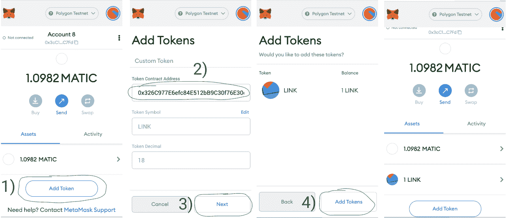
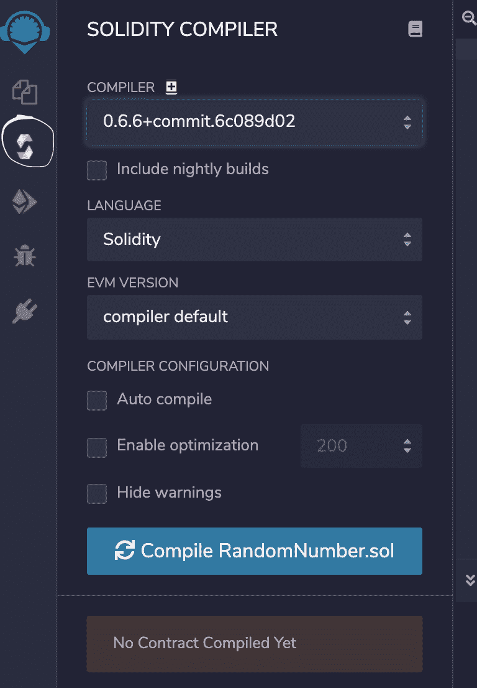
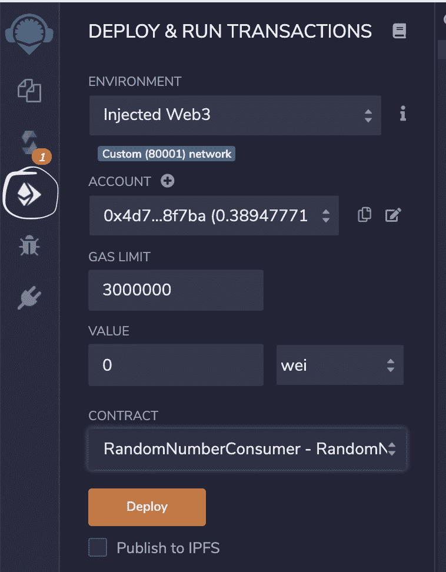
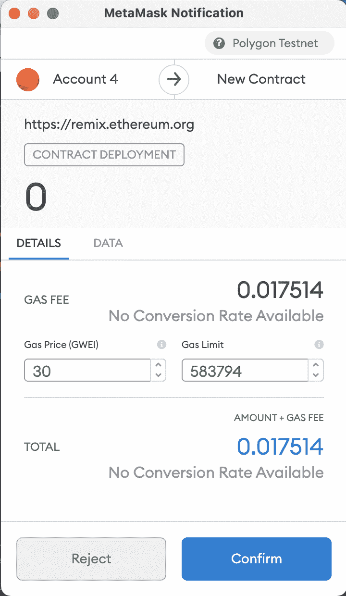
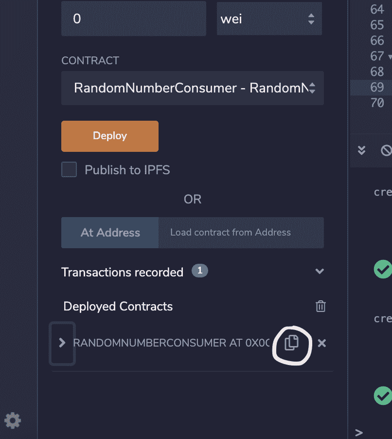
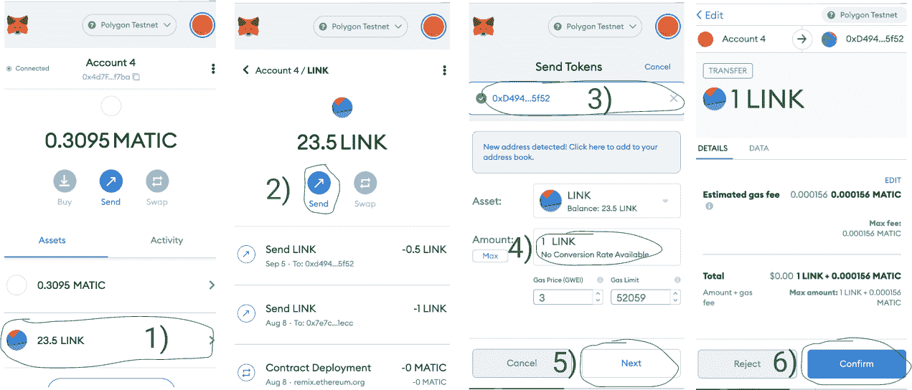
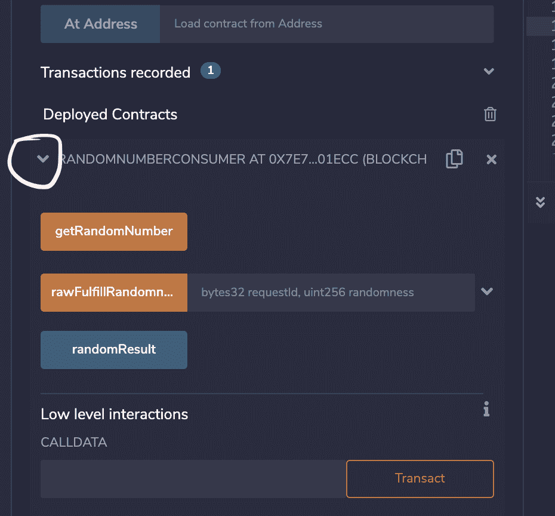
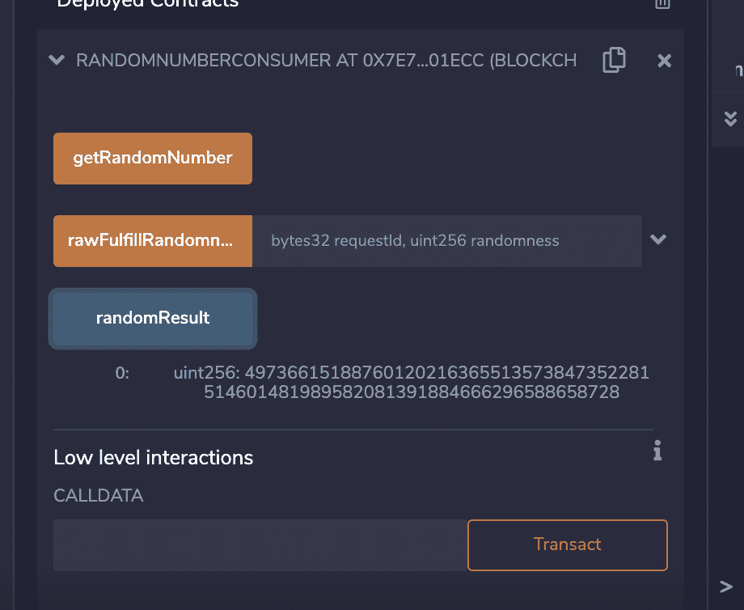
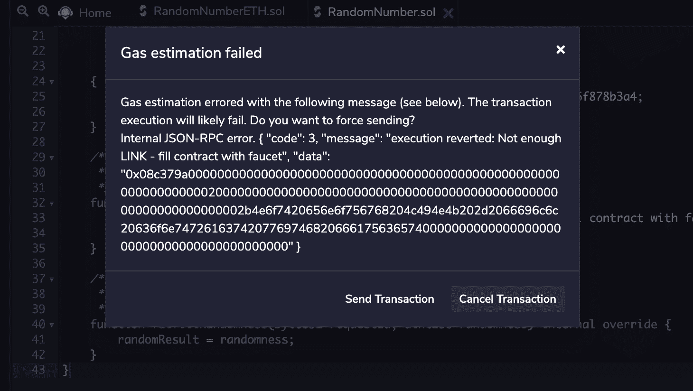

# polygon/chainlink-vrf-on-polygon-using-remix

> 原文：<https://github.com/figment-networks/learn-tutorials/blob/master/polygon/chainlink-vrf-on-polygon-using-remix.md>

本教程将向您介绍在 Solidity smart contracts 中使用链式 VRF ( [可验证随机函数](https://docs.chain.link/docs/chainlink-vrf/#generate-random-numbers-in-your-smart-contracts))生成随机数。链环 VRF 被用作链上随机性的可验证来源。我们将使用 Polygon (Matic) Mumbai testnet 和 Remix IDE。

# 为什么使用 VRF 链环？

可靠性合同是确定性的，因此任何人只要知道你的合同是如何产生随机性的，就可以预测其结果。Chainlink VRF 生成一个带加密证明的离线随机数，用于验证结果。

# 先决条件

要阅读本教程，你应该对 Solidity[smart contracts](https://solidity-by-example.org/)&[Remix IDE](https://remix.ethereum.org/)有一个基本的了解。你还应该完成[多边形(Matic)路径](https://learn.figment.io/network-documentation/matic/polygon-matic-pathway)。

# 要求

*   您需要安装[元掩码](https://metamask.io)浏览器扩展。

# 使用链环 VRF

## 获取 testnet 令牌

你将需要一些 testnet MATIC 和链接。这些可以从[多边形龙头](https://faucet.polygon.technology/)获得。自动令牌将用于支付合同部署和进行交易。链接令牌将用于支付随机的链接甲骨文。

打开元掩码，将活动网络更改为 Polygon (Matic) Mumbai testnet，并通过在元掩码窗口中单击它来复制您的钱包地址。如果您的元掩码中没有设置 Mumbai testnet，请阅读文章[在元掩码](https://docs.matic.network/docs/develop/metamask/config-polygon-on-metamask)上配置多边形。确保选择 Mumbai Testnet 选项卡来查看配置细节。

到[多边形龙头](https://faucet.polygon.technology/)通过粘贴你的钱包地址并点击“提交”来获得一些 MATIC 和 LINK testnet 令牌。

您可以通过在搜索栏中输入您的地址，访问此 URL[https://mumbai.polygonscan.com/](https://mumbai.polygonscan.com/)查看您的余额。

您可以在 Metamask 中查看您当前的 MATIC 和 LINK 余额，或者前往[https://mumbai.polygonscan.com/](https://mumbai.polygonscan.com/)&在搜索栏中输入您的地址。

要查看元掩码中的链接标记:

1.  单击添加令牌按钮
2.  在令牌合同地址文本字段中输入`0x326C977E6efc84E512bB9C30f76E30c160eD06FB`。当您输入代币合同地址时，代币符号和代币十进制文本字段将被预填充。
3.  单击下一步按钮
4.  点击确认按钮，将链接令牌添加到元掩码  中的资产列表

## 使用 Remix IDE

我们将使用 Remix IDE——一个智能合约的在线开发环境，由以太坊基金会提供。

前往[https://remix.ethereum.org](https://remix.ethereum.org/)。点击文件图标创建一个新文件，并将其命名为`RandomNumber.sol`。


## 创建智能合同

在`RandomNumber.sol`中，复制下面的整个智能合约代码并粘贴到 Remix 编辑器面板中。

```js
// SPDX-License-Identifier: MIT
pragma solidity 0.6.6;

import "@chainlink/contracts/src/v0.6/VRFConsumerBase.sol";

contract RandomNumber is VRFConsumerBase {
    bytes32 internal keyHash;
    uint256 internal fee;

    uint256 public randomResult;

    /**
 * Constructor inherits VRFConsumerBase
 * 
 * Network: Polygon (Matic) Mumbai Testnet
 * Chainlink VRF Coordinator address: 0x8C7382F9D8f56b33781fE506E897a4F1e2d17255
 * LINK token address:                0x326C977E6efc84E512bB9C30f76E30c160eD06FB
 * Key Hash: 0x6e75b569a01ef56d18cab6a8e71e6600d6ce853834d4a5748b720d06f878b3a4
 */
    constructor() 
        VRFConsumerBase(
            0x8C7382F9D8f56b33781fE506E897a4F1e2d17255, // VRF Coordinator
            0x326C977E6efc84E512bB9C30f76E30c160eD06FB  // LINK Token
        ) public
    {
        keyHash = 0x6e75b569a01ef56d18cab6a8e71e6600d6ce853834d4a5748b720d06f878b3a4;
        fee = 0.0001 * 10 ** 18; // 0.0001 LINK
    }

    /** 
 * Requests randomness 
 */
    function getRandomNumber() public returns (bytes32 requestId) {
        require(LINK.balanceOf(address(this)) > fee, "Not enough LINK - fill contract with faucet");
        return requestRandomness(keyHash, fee);
    }

    /**
 * Callback function used by VRF Coordinator
 */
    function fulfillRandomness(bytes32 requestId, uint256 randomness) internal override {
        randomResult = randomness;
    }
}
```

这将从 VRFConsumerBase 协定继承。VRFConsumerBase 构造函数接受两个参数:VRF 协调器的地址和链接令牌的地址。我们将使用`0x8C7382F9D8f56b33781fE506E897a4F1e2d17255`作为 VRF 协调器，使用`0x326C977E6efc84E512bB9C30f76E30c160eD06FB`作为将在孟买测试网上工作的链接令牌。

我们将使用契约哈希`0x6e75b569a01ef56d18cab6a8e71e6600d6ce853834d4a5748b720d06f878b3a4`来指定 oracle 要使用的链接，并将费用设置为 0.0001 LINK，以支付 oracle 可验证的随机输出。

```js
constructor() 
    VRFConsumerBase(
        0x8C7382F9D8f56b33781fE506E897a4F1e2d17255, // VRF Coordinator
        0x326C977E6efc84E512bB9C30f76E30c160eD06FB  // LINK Token
    ) public
{
    keyHash = 0x6e75b569a01ef56d18cab6a8e71e6600d6ce853834d4a5748b720d06f878b3a4;
    fee = 0.0001 * 10 ** 18; // 0.0001 LINK
}
```

这将从 chainlink oracle 获得一个随机数。`requestRandomness()`来自我们在智能合约顶部导入的`VRFConsumerBase`合约。

```js
function getRandomNumber() public returns (bytes32 requestId) {
    require(LINK.balanceOf(address(this)) > fee, "Not enough LINK - fill contract with faucet");
    return requestRandomness(keyHash, fee);
}
```

这是一个由 VRF 协调器使用的回调函数，用于确定数字是否实际上是随机的。

```js
function fulfillRandomness(bytes32 requestId, uint256 randomness) internal override {
    randomResult = randomness;
}
```

## 使用 Remix 部署合同

在 Remix 中，点击边栏上的 Solidity 编译器图标:



选择`0.6.6+commit.6c089d02`作为编译器，点击“编译 RandomNumber.sol”按钮编译合同。一旦编译完成，就可以部署到孟买测试网上了。

再次单击边栏上的 Solidity 编译器图标:



在下拉列表中选择“Injected Web3”作为环境。它将连接到您的元掩码，并找到网络 ID 和帐户地址。80001 是孟买测试网的网络 ID。

现在，在下拉列表中选择`RandomNumberConsumer - RandomNumber.sol`作为合同，并单击 Deploy 按钮。

Metamask 应该会弹出，允许您单击确认按钮来完成事务。这应该会将契约部署到 Mumbai testnet。




## 使用 LINK 为合同提供资金

您需要用链接令牌为您的合同提供资金，以支付 VRF 的 Chainlink oracle。单击复制图标复制您的合同地址。



转到您的元掩码:

1.  单击链接令牌
2.  单击发送按钮
3.  将您的合同地址粘贴到搜索栏中
4.  将金额设置为 1 个链接
5.  点击下一步按钮
6.  点击确认按钮确认交易

你可以去孟买街区浏览器[https://mumbai.polygonscan.com/](https://mumbai.polygonscan.com/)通过在搜索栏输入你的合同地址来查看你的合同余额。



## 使用合同

单击箭头图标查看您的合同方法



点击“getRandomNumber”按钮。您应该会看到一个元掩码弹出窗口。点击确认以确认交易。

交易成功后，点击“randomResult”按钮，应该会看到一个不为零的随机数！

**注意:**随机数的变化可能需要 1 分钟左右。



# 可能的错误和解决方案

如果您收到此错误，这意味着您的合同没有足够的链接令牌来支付 oracle 费用。为了解决这个问题，你应该发送一些链接令牌到你的合同地址。



# 结论

恭喜你！本教程向您介绍了链式可验证随机函数(VRF)。现在，您可以使用 Chainlink oracle 在智能合约中生成随机数。

要了解更多关于 Chainlink VRF 的信息，请访问 [Chainlink 文档](https://docs.chain.link/docs/chainlink-vrf/)。

# 关于作者

本教程由全栈开发人员 [You Song Hou](https://github.com/ysongh) 创建。

# 参考

*   https://docs.chain.link/docs/chainlink-vrf/ VRF 的 Chainlink 文档:
*   多边形(Matic)文档:[https://docs . Matic . network/docs/develop/getting-started](https://docs.matic.network/docs/develop/getting-started)