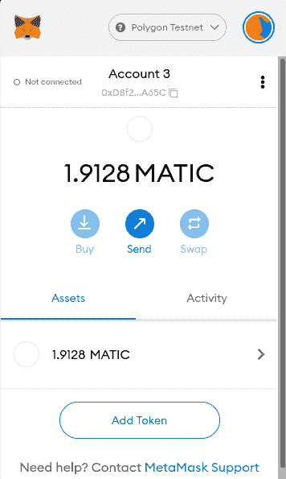
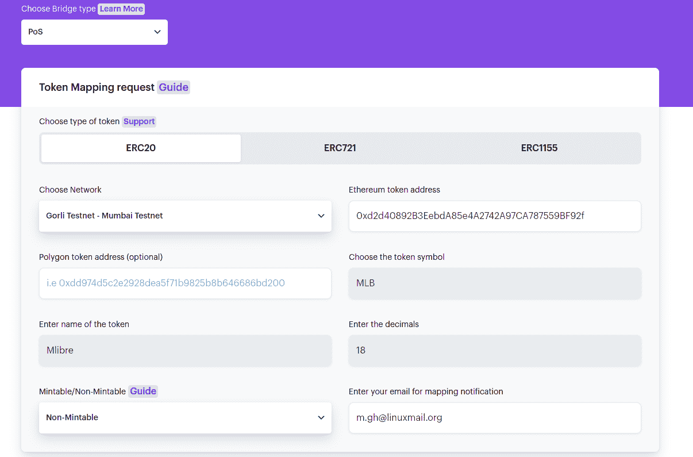
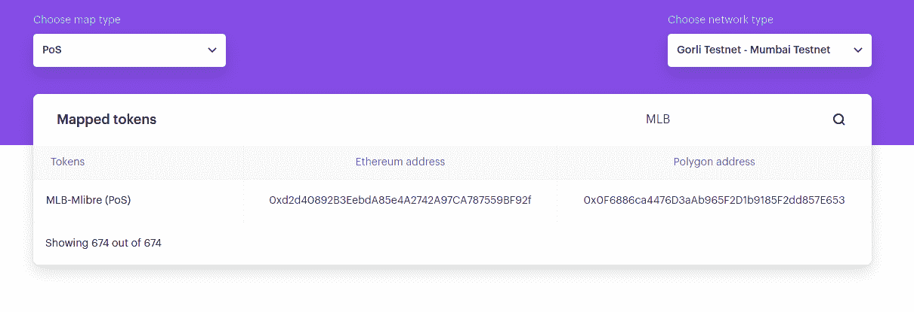
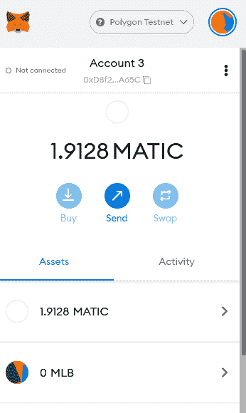
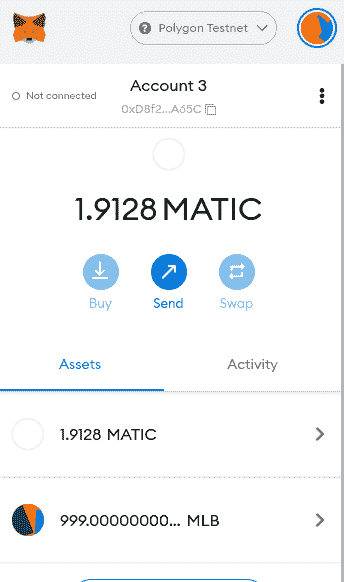
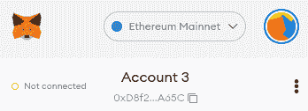
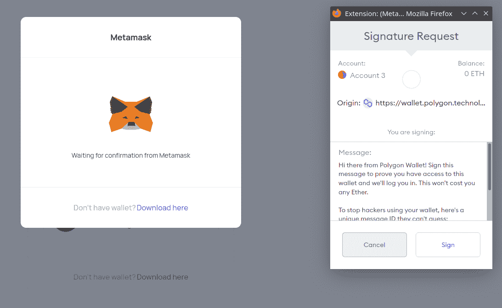
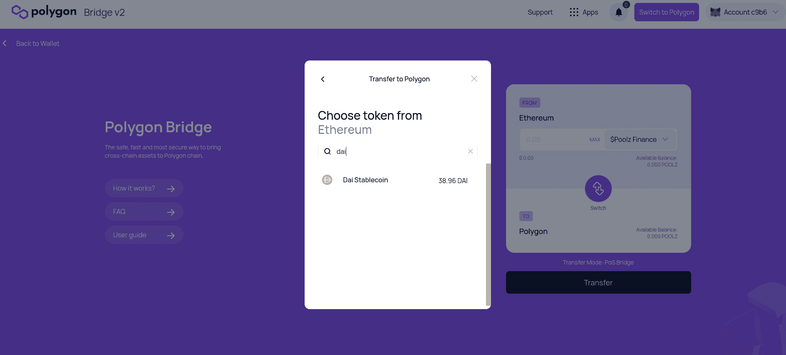
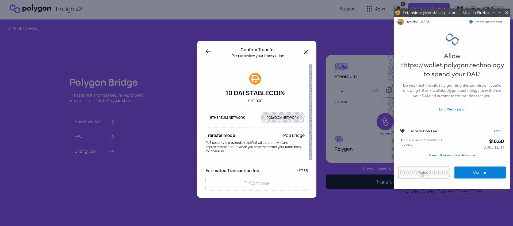

# 介绍

> 原文：<https://github.com/figment-networks/learn-tutorials/blob/master/polygon/erc20-pos-bridge-sdk.md>

在本教程中，我们将使用 Polygon PoS SDK 完成将 ERC-20 自定义令牌传输到 Polygon (Matic)链的过程。
我们将使用**以太坊 Goerli** 测试网和**多边形孟买**测试网，以及一个定制的 ERC-20 令牌，该令牌已经部署并在以太网扫描上验证了其源代码。还有本教程作者写的[一步一步指南](https://github.com/mlibre/blockchain/tree/master/Ethereum/ERC20)。
Polygon Proof of Stake(PoS)桥是以太坊和 Polygon 上的一种机制和一组合同，将帮助我们在**根**链和**子**链之间移动资产。
与[等离子电桥](https://docs.matic.network/docs/develop/ethereum-matic/plasma/getting-started/)相比，Polygon PoS 电桥速度更快，是寻求更快取款的 dApps 的更好选择。

# 先决条件

在本教程中，我们将使用元掩码作为我们的钱包。如果你不熟悉或者不知道怎么用，可以在 youtube 上查看[这个视频。
当您创建元掩码钱包时，它会给您一个秘密恢复短语(种子)。有了这个种子，你可以在 Metamask 中恢复**你所有的**账户。
我们将在本教程的后面使用这个种子。这里有一篇关于](https://www.youtube.com/watch?v=Af_lQ1zUnoM)[如何揭示你的秘密恢复短语](https://metamask.zendesk.com/hc/en-us/articles/360015290032-How-to-reveal-your-Secret-Recovery-Phrase)的文章

# 要求

*   [**Metamask**](https://metamask.io/)
*   [**Nodejs**](https://nodejs.org/en/download/)v 14 . 17 . 6 LTS 或更高版本安装
*   [**Geth**](https://geth.ethereum.org/docs/install-and-build/installing-geth):1 . 10 . 8 版本

# 入门指南

为了在**根**(以太坊)和**子**(多边形)契约之间转移资产，应该首先映射它们。这是一个在根链和子链之间镜像现有令牌契约的过程。
如果您想要转移的令牌已经存在于**多边形**上，这意味着您不需要执行**映射**。查看[官方文件](https://docs.matic.network/docs/develop/ethereum-matic/submit-mapping-request)以了解映射过程。

既然合同已经映射。是时候转移资产了。我们可以使用[多边形钱包 UI](https://wallet.polygon.technology/login/) 或者[多边形 SDK](https://polygon.technology/polygon-sdk/)

*   我们将 SDK 用于部署在 Goerli 测试网上的 ERC-20 令牌
*   对于部署在以太坊主网上的令牌，我们使用[多边形钱包 UI](https://wallet.polygon.technology/login/)

# 设置元掩码

在我们进入移动代币的细节之前，让我们设置**元掩码**，以便我们可以检查我们的 **ETH** 、 **MATIC** 和 **MLB** 代币余额。

## 格里

Goerli 测试网络是在 Metamask 的可用网络列表中预先配置的。您可以从元掩码界面顶部的下拉列表中选择它。

只要你愿意在一个有效的 Twitter 或脸书账户上发帖，你就可以从 Goerli 认证的水龙头上用 testnet Ether 为你的账户注资。如果这不是你想做的事情，在 [goerli 有一个替代的水龙头](https://goerli-faucet.slock.it/)

## 孟买

您可以打开[mumbai.polygonscan.com](https://mumbai.polygonscan.com/)并点击页面底部页脚处的“添加孟买网络”，*或*使用以下信息手动添加:

*   **网络名称:**多边形孟买测试网
*   **RPC 网址:**【https://rpc-mumbai.maticvigil.com/ T2】
*   **链号:** 80001
*   **货币符号:** MATIC
*   **屏蔽浏览器网址:**【https://mumbai.polygonscan.com/ T2】

[](https://github.com/figment-networks/learn-tutorials/raw/master/assets/erc20-pos-mumbai.png)

你可以在这里用 MATIC [为你的**孟买**账户注资](https://faucet.polygon.technology)

# MLB ERC20 合同

**MLB** 是我们将映射和传输的令牌(部署在 Goerli testnet 上)的符号，这是一个标准的 OpenZeppelin ERC-20 令牌。
你可以在这里找到创建 ERC-20 代币的分步指南

Token info:

```js
Name: Mlibre
Symbol: MLB
Owner: 0xD8f24D419153E5D03d614C5155f900f4B5C8A65C
Contract Address: 0xd2d40892B3EebdA85e4A2742A97CA787559BF92f
Goerli etherscan: https://goerli.etherscan.io/address/0xd2d40892B3EebdA85e4A2742A97CA787559BF92f 
```

为您打算映射的令牌收集此信息。

# 绘图

既然一切准备就绪。让我们映射我们的`MLB`令牌。

*   转到 [mapper.matic.today](https://mapper.matic.today/map/) 并完成表格

*   确保您要映射的令牌已在以太网扫描上验证了其[合同](https://etherscan.io/verifyContract)

*   选择**戈里测试网- >孟买测试网**

    [](https://github.com/figment-networks/learn-tutorials/raw/master/assets/erc20-pos-map.png)

*   此时，映射过程不会立即进行，可能需要 3 天才能得到确认。

然后打开 [mapper.matic.today](https://mapper.matic.today/) ，输入合同地址，看是否已经添加。

[](https://github.com/figment-networks/learn-tutorials/raw/master/assets/erc20-pos-mapped.png)

你可能注意到了，格里和孟买的合同地址是不一样的。让我们记住将它添加到 Metamask，这样当我们连接到孟买时它也会显示出来。

1.  Open Metamask
2.  从可用网络列表中选择孟买测试网
3.  添加令牌
4.  在那里粘贴合同地址(`0x0F6886ca4476D3aAb965F2D1b9185F2dd857E653`)

现在应该是这样的:

[](https://github.com/figment-networks/learn-tutorials/raw/master/assets/erc20-pos-metamask-after-map.png)

我们在孟买还没有任何 MLB 代币。我们可以通过桥转移一些，然后再检查我们的元掩码平衡。

# 使用 SDK 传输

让我们来看看使用 SDK 传输令牌的工作流:

1.  **批准:**代币的所有者必须批准**以太坊谓词合同**，该合同将**锁定**他们想要转移到 Polygon 的代币数量。
2.  **存款:**然后必须在`RootChainManger`合同上调用一个函数，这将触发孟买测试网上的`ChildChainManager`合同。然后，`ChildChainManager`合同将调用`Child token`合同的**存款**函数。
    **子**契约是**戈利**令牌契约在**孟买**的副本。

## 提供者

为了与 Goerli 和 Mumbai 进行交互，我们可以运行一个本地节点(这稍微有点困难)或者使用基础设施提供商的 RPC 端点，比如 DataHub 或 Infura(这简单得多)。

对于 **Goerli** ，我们将运行一个本地 Geth 节点。你也可以使用 [infura](https://infura.io) 。
对于**孟买**，我们将使用[数据中枢](https://datahub.figment.io/)

### 格里

[安装 Geth 客户端](https://geth.ethereum.org/docs/install-and-build/installing-geth)，如果尚未安装，则运行:

```js
geth --goerli --http --syncmode=light --http.api="eth,net,web3,personal,txpool" --allow-insecure-unlock  --http.corsdomain "*" 
```

默认端点是`127.0.0.1:8545`。
可以贴上看看是否一切正常:

```js
geth attach http://127.0.0.1:8545
eth.getBalance("0xD8f24D419153E5D03d614C5155f900f4B5C8A65C") 
```

### 孟买

*   注册一个[数据中心](https://datahub.figment.io/)
*   从[数据中心服务仪表板](https://datahub.figment.io/services/Polygon/)中选择多边形服务
*   向下滚动以查看多边形端点 URL
*   复制 Mumbai Testnet JSONRPC URL。它可能位于[这里](https://datahub.figment.io/services/Polygon/matic-mumbai--jsonrpc)
*   像这样形成 URL，用从 DataHub 获得的 API 密钥替换文本 YOUR _ API _ KEY:`https://matic-mumbai--jsonrpc.datahub.figment.io/apikey/YOUR_API_KEY/`

# 安装助手

现在我们已经有了需要的信息和其他重要的部分，我们可以使用 maticjs 客户端库和 Truffle 的 HDWalletProvider 类编写一些有用的代码。
我们需要用节点包管理器在命令行上安装这两个包。使用以下命令安装软件包，并将它们保存在项目清单中，`package.json`:

```js
npm install @maticnetwork/maticjs --save
npm install @truffle/hdwallet-provider --save 
```

# 批准 ERC20 存款

为了**批准****以太坊谓词合同**，我们只需要调用`approveERC20ForDeposit`函数。代码很简单:

```js
await maticPOSClient.approveERC20ForDeposit(rootToken, amount.toString(), {
	from,
	gasPrice: "10000000000"
});
```

# 存款 ERC20

接下来，我们将调用**以太坊谓词契约**的`depositERC20ForUser`函数:

```js
await maticPOSClient.depositERC20ForUser(rootToken, from, amount.toString(), {
	from,
	gasPrice: "10000000000",
});
```

为了将所有这些都放在可以在 web 浏览器或命令行上执行的 JavaScript 中，我们可以添加一些常量，并使用一个外部文件来保存敏感的 API 键和 wallet 种子短语。这是一个如何使用 maticjs 和 HDWalletProvider 类与 Polygon 上部署的智能合约进行通信的完整示例。使用以下代码作为构建您自己的解决方案的指南！

```js
// main.js
import { HDWalletProvider } from '@truffle/hdwallet-provider';
import { MaticPOSClient } from '@maticnetwork/maticjs');
import { secrets } from './secrets.json'

const from = "0xD8f24D419153E5D03d614C5155f900f4B5C8A65C";
const rootToken = "0xd2d40892B3EebdA85e4A2742A97CA787559BF92f";
const amount = 999 * (10 ** 18);

const parentProvider = new HDWalletProvider(secrets.seed, 'http://127.0.0.1:8545'); // Local Geth client address
const maticProvider = new HDWalletProvider(secrets.seed, secrets.mumbai)  // DataHub Mumbai Testnet JSONRPC URL

const maticPOSClient = new MaticPOSClient({
  network: "testnet",
  version: "mumbai",
  parentProvider,
  maticProvider,
});

(async () => {
  try {
    let result = await maticPOSClient.approveERC20ForDeposit(
      rootToken,
      amount.toString(),
      {
        from,
        gasPrice: "10000000000",
      }
    );
    let result_2 = await maticPOSClient.depositERC20ForUser(
      rootToken,
      from,
      amount.toString(),
      {
        from,
        gasPrice: "10000000000",
      }
    );
    console.log(result);
    console.log(result_2);
  } catch (error) {
    console.log(error);
  }
})();
```

**approveERC20ForDeposit** 的预期输出如下所示:

```js
{
  blockHash: '0x9616fab5f19fb93580fe5dc71da9062168f1f1f5a4a5297094cad0b2b3e2dceb',
  blockNumber: 5513011,
  contractAddress: null,
  cumulativeGasUsed: 46263,
  effectiveGasPrice: '0x2540be400',
  from: '0xd8f24d419153e5d03d614c5155f900f4b5c8a65c',
  gasUsed: 46263,
  logsBloom: '0x0000000000000000000000000000000000000000000000800000000000000000000080000000000000000000000000000000000000000000000000000000000000010000000000000000000000000000000000000010000000000000000000000',
  status: true,
  to: '0xd2d40892b3eebda85e4a2742a97ca787559bf92f',
  transactionHash: '0x3aba80ae8938ed1abbb18560cb061f4915d202a731e5e2ec443aded67169e28a',
  transactionIndex: 0,
  type: '0x0',
  events: {
    Approval: {
      address: '0xd2d40892B3EebdA85e4A2742A97CA787559BF92f',
      blockNumber: 5513011,
      transactionHash: '0x3aba80ae8938ed1abbb18560cb061f4915d202a731e5e2ec443aded67169e28a',
      transactionIndex: 0,
      blockHash: '0x9616fab5f19fb93580fe5dc71da9062168f1f1f5a4a5297094cad0b2b3e2dceb',
      logIndex: 0,
      removed: false,
      id: 'log_0e714fbf',
      returnValues: [Result],
      event: 'Approval',
      signature: '0x8c5be1e5ebec7d5bd14f71427d1e84f3dd0314c0f7b2291e5b200ac8c7c3b925',
      raw: [Object]
    }
  }
}
```

对于**用户**的存款人 20:

```js
{
  blockHash: '0x622989e0d1097ea59c557663bf4fa19b3064cfb858706021a6eecb11bb1c19b2',
  blockNumber: 5513012,
  contractAddress: null,
  cumulativeGasUsed: 89761,
  effectiveGasPrice: '0x2540be400',
  from: '0xd8f24d419153e5d03d614c5155f900f4b5c8a65c',
  gasUsed: 89761,
  logsBloom: '0x0200000000000000000000000000000800000040000000800000000000000000000080000000000000040008000000000000200000000000008000100020000000000000000000001000000a000000000000000000000100000000000000000000000000000008000000000400000014000000000000000000000010200000000000000000000000000000000200000000000000000000000000020000080000020000000200008000000000000000040000000000000800000000000000000000000002000000000000000000000002000000140000000000200000000000000010000000000000000000000000000000000000010000000000000000000000',
  status: true,
  to: '0xbbd7cbfa79faee899eaf900f13c9065bf03b1a74',
  transactionHash: '0x58a7f01edc2b9772f87fca57789f0912152615813e6231ab137e4759c8f6415f',
  transactionIndex: 0,
  type: '0x0',
  events: {
    '0': {
      address: '0xdD6596F2029e6233DEFfaCa316e6A95217d4Dc34',
      blockNumber: 5513012,
      transactionHash: '0x58a7f01edc2b9772f87fca57789f0912152615813e6231ab137e4759c8f6415f',
      transactionIndex: 0,
      blockHash: '0x622989e0d1097ea59c557663bf4fa19b3064cfb858706021a6eecb11bb1c19b2',
      logIndex: 0,
      removed: false,
      id: 'log_20b9b372',
      returnValues: Result {},
      event: undefined,
      signature: null,
      raw: [Object]
    },
    '1': {
      .
      .
      .
```

仅提及几件事:

*   `secrets.json`:包含地址(0xd8f2)的**种子**、**私钥**。以及**孟买 API URL** 。例如:

```js
{
	"privateKey": "This should be the private key of an account specifically made for use on the Goerli testnet",
	"seed": "This should be a Secret Recovery Phrase from Metamask and ONLY used on Ethereum testnets",
	"mumbai": "https://matic-mumbai--jsonrpc.datahub.figment.io/apikey/YOUR_API_KEY/"
}
```

*   `@truffle/hdwallet-provider`:处理签约交易流程
*   `from`:我们创建令牌并希望用来发送交易的 Goerli 地址
*   Goerli 测试网上的 ERC-20 合同地址
*   `amount`:我们要转移的**令牌**的数量。默认情况下， **open zeppelin** V4 `ERC20`契约使用一个值 **18** 为**小数**。这就是为什么 **999** 要乘以 **(10 ** 18)**

# 潜在错误

**无法运行 main.js**

如果您遇到这样的错误消息:

```js
Error: execution reverted: ERC20: approve to the zero address 
```

合同可能还没有映射。

** Geth 未运行**

如果您没有运行 Geth，您将得到如下错误:

```js
(node:3962) UnhandledPromiseRejectionWarning: Unhandled promise rejection. This error originated either by throwing inside of an async function without a catch block, or by rejecting a promise which was not handled with .catch(). To terminate the node process on unhandled promise rejection, use the CLI flag `--unhandled-rejections=strict` (see https://nodejs.org/api/cli.html#cli_unhandled_rejections_mode). (rejection id: 1)
(node:3962) [DEP0018] DeprecationWarning: Unhandled terminate the Node.js process with a non-zero exit code.
node_modules/safe-event-emitter/index.js:74
      throw err
      ^

Error: PollingBlockTracker - encountered an error while attempting to update latest block:
Error: connect ECONNREFUSED 127.0.0.1:8545 
```

**没有对等机可用**

如果您得到这样的错误:

```js
{
  code: -32000,
  message: 'getDeleteStateObject (0000000000000000000000000000000000000000) error: no suitable peers available'
}
```

等待几分钟，然后重试。

# 同步和确认

Mumbai 从 Goerli 链读取数据并自行同步最多需要 5 分钟。一旦同步，我们就可以检查元掩码中的令牌余额。

[](https://github.com/figment-networks/learn-tutorials/raw/master/assets/erc20-MLB-token.png)

# 使用 Web 用户界面传输

通过 **Web UI** 转移资产非常简单。
**注意**这里我们不能用**格利**到**孟买**。因为 **Web UI** 只支持以太坊和多边形 **mainnets** 。
所以我打算从我的**以太坊**账户中转移一些**真实代币**到**多边形**并支付费用。你可以按照下面的图片来看看这个过程是如何进行的。

1.  打开[钱包.多边形.技术](https://wallet.polygon.technology/login)

2.  确保在元掩码中选择了以太坊主网

    [](https://github.com/figment-networks/learn-tutorials/raw/master/assets/erc20-pos-metamask-eth-mainnet.png)

3.  点击**元掩码**。首次登录选项

4.  您将被要求签署一份**签名请求**，以确保您有权使用钱包。这是免费的

    [](https://github.com/figment-networks/learn-tutorials/raw/master/assets/erc20-pos-web-ui-login.png)

5.  我选择了以太坊的`DAI`令牌

    [](https://github.com/figment-networks/learn-tutorials/raw/master/assets/erc20-pos-web-ui-dai.png)

6.  点击**传送**

7.  然后查看交易细节，如汽油费和你发送代币的智能合同，然后点击**确认**

    [](https://github.com/figment-networks/learn-tutorials/raw/master/assets/erc20-pos-web-ui-transfer.png)

8.  一旦交易被挖掘，过程就完成了！完成传输大约需要 7 分钟，如前所述，Polygon 需要大约 5 分钟来同步。

# 结论

恭喜你！通过完成本教程，你学会了如何使用**多边形位置桥**。我们已经配置了 **Metamask** 和 **Geth** ，与 **Goerli** 测试网和 **Mumbai** 测试网进行通信。然后我们**在网络之间映射**一个 **ERC-20** 令牌，这样它就可以通过网桥传输。最后，我们调用 PoS 桥契约上的函数，并将我们的资产从以太坊移动到多边形。

# 关于作者

我是 mlibre，一个来自太阳系的陌生人。我对区块链理工感兴趣，发现它在很多事情上都很有用。
随时查看我的 [Github](https://github.com/mlibre)