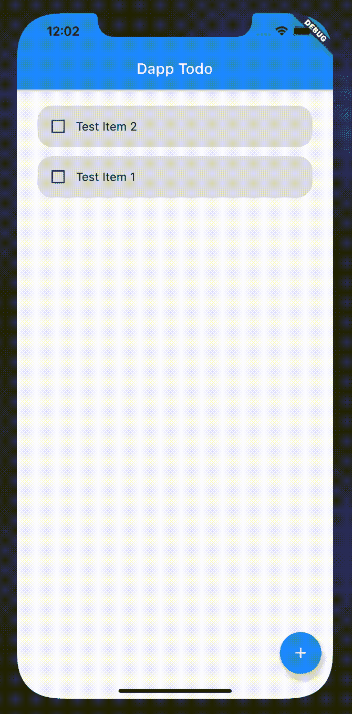
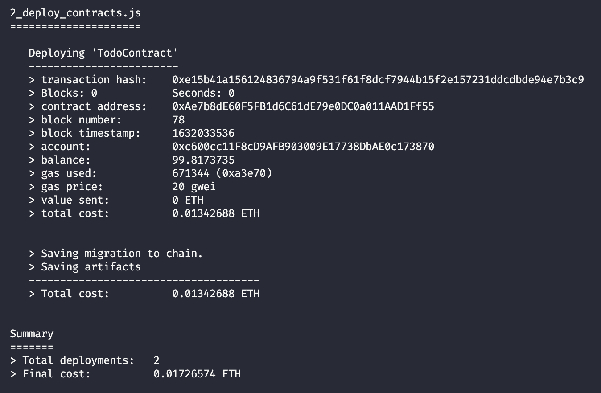
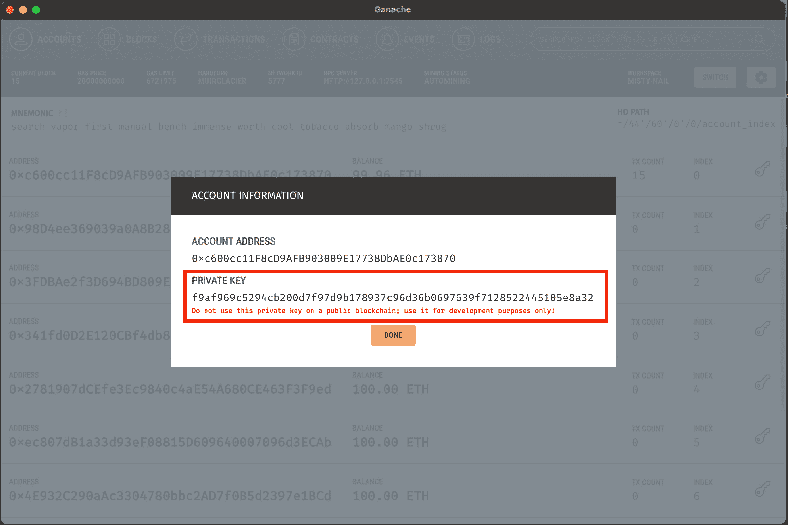
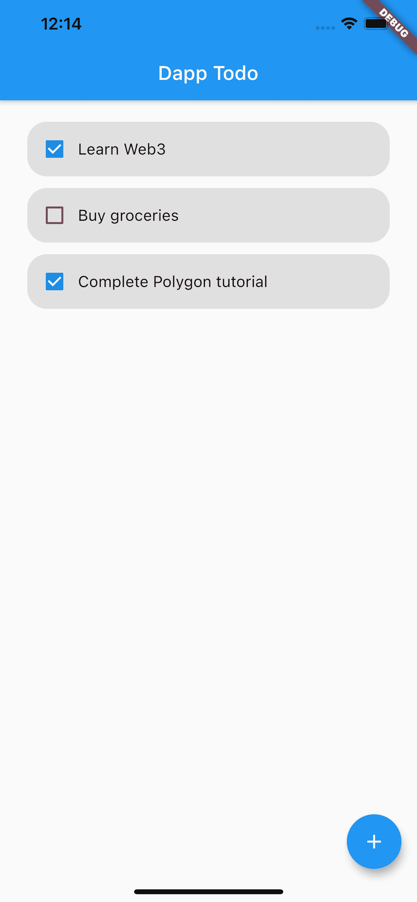
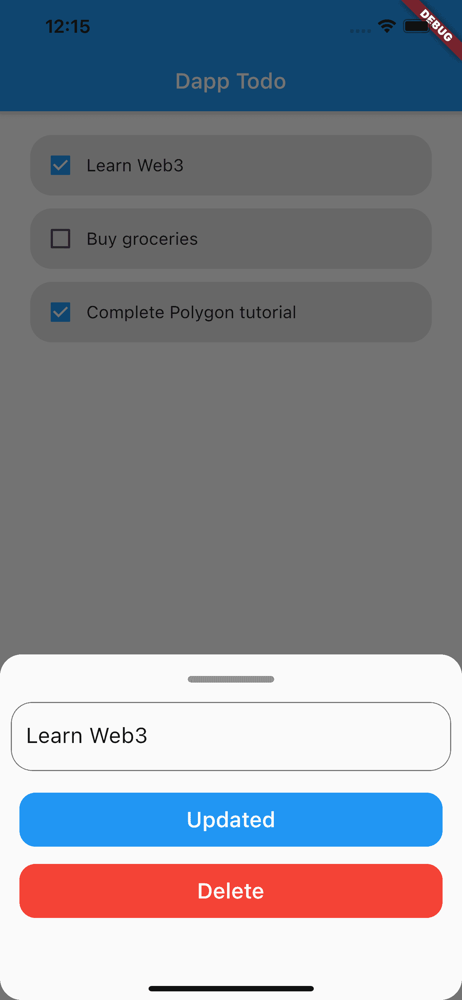

# 介绍

> 原文：<https://github.com/figment-networks/learn-tutorials/blob/master/polygon/flutter-starter-for-polygon-dapp.md>

在本教程中，我们将学习如何通过创建一个待办事项应用程序，在多边形网络上的 Flutter Dapp 中执行 CRUD(创建、读取、更新和删除)操作。

这是我们将创建的 dApp 的外观:

[](https://github.com/figment-networks/learn-tutorials/raw/master/assets/flutter-todo-dapp-demo.gif)

# 先决条件

要成功完成本教程，您需要了解区块链技术、智能合约的 Solidity 编程语言和 Flutter 框架的基础知识。

# 要求

*   块菌为创建和测试区块链应用程序提供了一个本地开发环境。
*   [Flutter](https://flutter.dev/docs/get-started/install) -用于创建一个 Android/iOS dApp。
*   建议使用代码编辑器或 IDE - VSCode 进行颤振开发。
*   [Figment DataHub](https://figment.io/datahub/) 帐户-我们将使用 DataHub 的 Polygon RPC URL 来部署智能合同。

如果您没有 DataHub 帐户，您可以创建一个免费帐户，并从仪表板获取 Polygon 的 API 密钥。

我们将使用 [web3dart](https://pub.dev/packages/web3dart) 在我们的 Flutter 应用程序中与区块链交互。web3dart 是通常用于 Flutter 生态系统的 web3js 的替代方案。

# 项目设置

运行以下命令安装软件包并创建项目目录:

```js
flutter create todo_dapp
cd todo_dapp

mkdir smartcontract
cd smartcontract

npm install -g truffle

truffle init 
```

命令`npm install -g truffle`将全局安装 Truffle，这样你可以从任何目录使用 Truffle。

这是初始设置后的文件夹结构:

[](https://github.com/figment-networks/learn-tutorials/raw/master/assets/flutter-dapp-folder-structure.png)

`truffle init`命令创建以下目录:

*   所有的智能合约都存放在这个目录下。
*   Truffle 用来部署智能合约的所有脚本都存储在这个目录中。
*   所有智能合约的测试脚本都存储在这个目录下。
*   `truffle-config.js`:包含松露的配置设置。

# 创建智能合同

在`contracts`目录中创建一个名为`TodoContract.sol`的新文件，并添加以下代码:

```js
// SPDX-License-Identifier: GPL-3.0
pragma solidity ^0.8.6;

contract TodoContract {
  uint256 public taskCount = 0;

  struct Task {
    uint256 index;
    string taskName;
    bool isComplete;
  }

  mapping(uint256 => Task) public todos;
  event TaskCreated(string task, uint256 taskNumber);
  event TaskUpdated(string task, uint256 taskId);
  event TaskIsCompleteToggled(string task, uint256 taskId, bool isComplete);
  event TaskDeleted(uint256 taskNumber);
}
```

*   `taskCount`是一个无符号的公共整数，存储智能合约中待办事项的总数。
*   `struct Task`是存储关于每个待办事项的信息(元数据)的数据结构。这包括待办事项的 id、taskName 和待办事项的 isComplete 布尔值。
*   `mapping(uint256 => Task) public todos;`是存储所有待办事项的映射，其中键是`id`，值是`Task`结构。
*   `TaskCreated`、`TaskUpdated`、`TaskIsCompleteToggled`和`TaskDeleted`是区块链上发出的事件，我们的 dApp 可以监听这些事件并相应地运行。

```js
function createTask(string memory _taskName) public {
  todos[taskCount] = Task(taskCount, _taskName, false);
  taskCount++;
  emit TaskCreated(_taskName, taskCount - 1);
}
```

*   `createTask`函数将接受待办事项的`_taskName`。我们可以用`taskCount`和`_taskName`创建一个新的`Task`结构，并在`todos`映射中将它赋给当前的`taskCount`值。
*   对于下一个待办事项，将`taskCount`的值增加 1。
*   一旦一切都完成了，我们必须发出`TaskCreated`事件。

```js
function updateTask(uint256 _taskId, string memory _taskName) public {
  Task memory currTask = todos[_taskId];
  todos[_taskId] = Task(_taskId, _taskName, currTask.isComplete);
  emit TaskUpdated(_taskName, _taskId);
}
```

*   `updateTask`函数接受一个要更新的待办事项的`_taskId`和一个更新的`taskName`。我们可以用这些值创建一个新的`Task`结构，并将其分配给与接收到的`_taskId`相对应的`todos`映射。
*   注意，在更新时，我们必须保留待办事项的`isComplete`值。首先，从地图中获取当前任务，然后将它存储在一个变量中，然后将它的`isComplete`值用于新的任务对象。
*   一旦一切都完成了，我们必须发出`TaskUpdated`事件。

```js
function deleteTask(uint256 _taskId) public {
  delete todos[_taskId];
  emit TaskDeleted(_taskId);
}
```

*   `deleteTask`接受要删除的待办事项的`_task`作为参数。首先，从接收到的`_task`对应的`todos`地图中移除`Task`对象，然后发出`TaskDeleted`事件。

```js
function toggleComplete(uint256 _taskId) public {
  Task memory currTask = todos[_taskId];
  todos[_taskId] = Task(_taskId, currTask.taskName, !currTask.isComplete);

  emit TaskIsCompleteToggle(
    currTask.taskName,
    _taskId,
    !currTask.isComplete
  );
}
```

*   `toggleComplete`函数接受待办事项的`_taskId`进行更新。我们首先从`todos`地图中获取`Task`对象，然后用这些值创建一个新的`Task`对象，并将`isComplete`设置为当前`isComplete`值的相反值。

智能合约到此结束，现在我们可以继续编译和迁移过程了。

# 用 Truffle 编译和部署

既然我们已经写好了智能合同，那么是时候编译它了。在`smartcontract`目录中打开您的终端并运行以下命令:

```js
truffle compile 
```

Truffle 将编译智能契约，您应该会看到类似于以下内容的输出:

[](https://github.com/figment-networks/learn-tutorials/raw/master/assets/flutter-dapp-truffle-compile.png)

为了将我们的联系人迁移到区块链，请转到`migrations`目录，创建一个名为`2_todo_contract_migration.js`的新文件，并添加以下代码:

```js
const TodoContract = artifacts.require("TodoContract");

module.exports = function (deployer) {
  deployer.deploy(TodoContract);
};
```

*   在开始迁移过程之前，确保您已经安装了 [Ganache](https://www.trufflesuite.com/ganache) 。在系统中启动 Ganache GUI 应用程序。
*   删除`truffle-config.js`现有的所有内容，替换为下面的代码。

```js
module.exports = {
  networks: {
    development: {
      host: "localhost",
      port: 7545,
      network_id: "*",
    },
  },
  contracts_directory: "./contracts",
  compilers: {
    solc: {
      optimizer: {
        enabled: true,
        runs: 200,
      },
    },
  },

  db: {
    enabled: false,
  },
};
```

*   在`truffle-config.js`中，我们正在定义松露的基本配置。目前，我们将把智能合约部署到本地主机:7545，我们的 Ganache 区块链在那里运行。
*   要在 Ganache 上部署智能合约，请运行以下命令:

```js
truffle migrate 
```

这将把契约部署到 Ganache 开发区块链，并给出如下所示的输出:

[](https://github.com/figment-networks/learn-tutorials/raw/master/assets/flutter-dapp-truffle-migrate.png)

# 使用 web3dart 连接到 Flutter 应用程序

创建并部署智能合同；我们可以开始将它与我们的 Flutter 应用程序集成。

打开`pubspec.yaml`文件并添加以下依赖项:

```js
dependencies:
  # Needed for smart contract interaction
  http: ^0.13.3
  web3dart: ^2.1.4
  web_socket_channel: ^2.1.0
  provider: ^5.0.0
```

将`TodoContract.json`文件作为资产添加到`pubspec.yaml`中，由`truffle compile`命令生成。

```js
assets:
  - smartcontract/build/contracts/TodoContract.json
```

为了开始使用 UI 和数据控制器，我们必须在`lib`目录中创建三个文件。

*   `TodoListModel.dart` -包含数据模型、契约函数和更新 UI 的通知程序类。
*   `TodoList.dart` -包含我们应用程序的主用户界面。
*   `TodoBottomSheet.dart` -包含创建和更新待办事项表单。

`lib/TodoListModel.dart`

```js
import 'dart:convert';
import 'dart:core';
import 'package:flutter/material.dart';
import 'package:flutter/services.dart';
import 'package:http/http.dart';
import 'package:web3dart/web3dart.dart';
import 'package:web_socket_channel/io.dart';

class TodoListModel extends ChangeNotifier {
  List<Task> todos = [];
  bool isLoading = true;
  int taskCount;
  final String _rpcUrl = "http://127.0.0.1:7545";
  final String _wsUrl = "ws://127.0.0.1:7545/";

  final String _privateKey = "f9af969c5294cb200d7f97d9b178937c96d36b0697639f71285224...";

  Web3Client _client;
  String _abiCode;

  Credentials _credentials;
  EthereumAddress _contractAddress;
  EthereumAddress _ownAddress;
  DeployedContract _contract;

  ContractFunction _taskCount;
  ContractFunction _todos;
  ContractFunction _createTask;
  ContractFunction _updateTask;
  ContractFunction _deleteTask;
  ContractFunction _toggleComplete;
}
```

*   最重要的是，我们正在导入所有需要的包。
*   创建一个从`Provider`包的`ChangeNotifier`类扩展而来的类`TodoListModel`。
*   为本地环境设置 Ganache 的`_rpcUrl`和`_wsUrl`。
*   从 Ganache 设置任何帐户的私钥(您可以通过单击 Ganache UI 中的密钥图标来获得)。

[](https://github.com/figment-networks/learn-tutorials/raw/master/assets/flutter-dapp-ganache-privatekey-demo.jpeg)

`Web3Client _client`用于通过 WebSockets 连接多边形区块链。`String _abiCode`用于存储我们的智能合约的 ABI。`Credentials _credentials`包含登录用户的`Credential`对象。`EthereumAddress _ownAddress`用于存储登录用户的公钥。`DeployedContract _contract`是我们的智能合约的一个实例，它最终将用于与智能合约进行通信。`_taskCount`、`_todos`、`_createTask`、`_updateTask`、`_deleteTask`、`_toggleComplete`是我们部署的智能合约的功能。

在所有变量声明之后，在`TodoListModel`类中添加以下函数:

```js
TodoListModel() {
  init();
}

Future<void> init() async {
  _client = Web3Client(_rpcUrl, Client(), socketConnector: () {
    return IOWebSocketChannel.connect(_wsUrl).cast<String>();
  });

  await getAbi();
  await getCredentials();
  await getDeployedContract();
}

Future<void> getAbi() async {
  String abiStringFile = await rootBundle
      .loadString("smartcontract/build/contracts/TodoContract.json");
  var jsonAbi = jsonDecode(abiStringFile);
  _abiCode = jsonEncode(jsonAbi["abi"]);
  _contractAddress =
      EthereumAddress.fromHex(jsonAbi["networks"]["5777"]["address"]);
}

Future<void> getCredentials() async {
  _credentials = await _client.credentialsFromPrivateKey(_privateKey);
  _ownAddress = await _credentials.extractAddress();
}

Future<void> getDeployedContract() async {
  _contract = DeployedContract(
      ContractAbi.fromJson(_abiCode, "TodoList"), _contractAddress);
  _taskCount = _contract.function("taskCount");
  _updateTask = _contract.function("updateTask");
  _createTask = _contract.function("createTask");
  _deleteTask = _contract.function("deleteTask");
  _toggleComplete = _contract.function("toggleComplete");
  _todos = _contract.function("todos");
  await getTodos();
}

```

在`TodoListModel`类的构造函数中，我们调用异步`init`函数。`init`函数包含`_client`对象的初始化，然后调用`getAbi`、`getCredentials`和`getDeployedContract`函数。

在`getAbi`函数中，我们获取智能合约的 ABI，并提取已部署合约的地址。在`getCredentials`函数中，我们通过传入我们的私钥来创建一个`Credentials`类的实例。

**注意**——建议在 Flutter 中以加密形式存储私钥。为了简化本教程，我们将私钥保存为字符串格式。

在`getCredentials`函数中，我们将使用`_abiCode`和`_contractAddress`创建智能合约的一个实例。一旦我们有了契约实例，我们就可以创建智能契约中所有函数的实例，如上面的代码所示。

现在我们已经初始化了所有的变量，是时候实现 CRUD 操作了。在`TodoListModel`中添加以下功能:

```js
getTodos() async {
  List totalTaskList = await _client.call(contract: _contract, function: _taskCount, params: []);

  BigInt totalTask = totalTaskList[0];
  taskCount = totalTask.toInt();
  todos.clear();
  for (var i = 0; i < totalTask.toInt(); i++) {
    var temp = await _client.call(contract: _contract, function: _todos, params: [BigInt.from(i)]);
    if (temp[1] != "")
      todos.add(
        Task(
          id: (temp[0] as BigInt).toInt(),
          taskName: temp[1],
          isCompleted: temp[2],
        ),
      );
  }
  isLoading = false;
  todos = todos.reversed.toList();

  notifyListeners();
}

addTask(String taskNameData) async {
  isLoading = true;
  notifyListeners();
  await _client.sendTransaction(
    _credentials,
    Transaction.callContract(
      contract: _contract,
      function: _createTask,
      parameters: [taskNameData],
    ),
  );
  await getTodos();
}

updateTask(int id, String taskNameData) async {
  isLoading = true;
  notifyListeners();
  await _client.sendTransaction(
    _credentials,
    Transaction.callContract(
      contract: _contract,
      function: _updateTask,
      parameters: [BigInt.from(id), taskNameData],
    ),
  );
  await getTodos();
}

deleteTask(int id) async {
  isLoading = true;
  notifyListeners();
  await _client.sendTransaction(
    _credentials,
    Transaction.callContract(
      contract: _contract,
      function: _deleteTask,
      parameters: [BigInt.from(id)],
    ),
  );
  await getTodos();
}

toggleComplete(int id) async {
  isLoading = true;
  notifyListeners();
  await _client.sendTransaction(
    _credentials,
    Transaction.callContract(
      contract: _contract,
      function: _toggleComplete,
      parameters: [BigInt.from(id)],
    ),
  );
  await getTodos();
}
```

在`getTodos`中，我们调用`_taskCount`函数，它给出了待办事项的总数，然后我们使用一个循环来获取所有待办事项，并将它们添加到一个列表中。一旦我们有了所有的待办事项，我们可以将`isLoading`设置为 false，并从`Provider`包中调用`notifyListeners`来更新我们的 UI。

在`addTask`中，我们接受任务名称作为参数，将`isLoading`设置为 true，然后使用`_contract`对象并传递`taskNameData`作为参数来调用`_createTask`函数。`updateTask`接受任务的`id`和更新的`taskNameData`，使用我们的智能合约凭证进行交易。注意，我们将`id`作为`BigInt`的一个实例发送，因为 web3dart 包要求所有数字都采用`BigInt`格式。`deleteTask`函数将接受要删除的任务的`id`,并调用我们的契约的`_deleteTask`函数从智能契约的`todos`映射中删除该特定任务。

`toggleComplete`函数将接受任务的`id`,并在我们的智能契约中切换`isComplete`布尔值。在`addTask`、`updateTask`、`deleteTask`和`toggleComplete`函数的末尾，我们调用`getTodos`来获取更新后的待办事项列表以更新 UI。或者，您也可以在调用智能合约功能之前更新本地待办事项列表，以即时显示结果并在后台更新列表。

在`TodoListModel`中创建一个`Task`模型类来存储待办事项列表。

```js
class Task {
  final int id;
  final String taskName;
  final bool isCompleted;
  Task({this.id, this.taskName, this.isCompleted});
}
```

现在我们已经完成了 Flutter 中的逻辑部分，让我们继续为我们的应用程序创建 UI。

`lib/TodoList.dart`

```js
class TodoList extends StatelessWidget {
  const TodoList({Key key}) : super(key: key);

  @override
  Widget build(BuildContext context) {
    var listModel = Provider.of<TodoListModel>(context, listen: true);
    return Scaffold(
      appBar: AppBar(
        title: Text("Dapp Todo"),
      ),
      floatingActionButton: FloatingActionButton(
        onPressed: () {
          showTodoBottomSheet(context);
        },
        child: Icon(Icons.add),
      ),
      body: listModel.isLoading
          ? Center(child: CircularProgressIndicator())
          : Column(
              children: [
                SizedBox(height: 16),
                Expanded(
                  child: ListView.builder(
                    itemCount: listModel.todos.length,
                    itemBuilder: (context, index) => ListTile(
                      title: InkWell(
                        onTap: () {
                          showTodoBottomSheet(
                            context,
                            task: listModel.todos[index],
                          );
                        },
                        child: Container(
                          margin: EdgeInsets.symmetric(
                            vertical: 2,
                            horizontal: 12,
                          ),
                          padding: EdgeInsets.all(4),
                          decoration: BoxDecoration(
                            color: Colors.grey[300],
                            borderRadius: BorderRadius.circular(20),
                          ),
                          child: Row(
                            children: [
                              Checkbox(
                                value: listModel.todos[index].isCompleted,
                                onChanged: (val) {
                                  listModel.toggleComplete(
                                      listModel.todos[index].id);
                                },
                              ),
                              Text(listModel.todos[index].taskName),
                            ],
                          ),
                        ),
                      ),
                    ),
                  ),
                ),
              ],
            ),
    );
  }
}
```

这里我们创建了一个无状态的小部件，`TodoList`。在构建函数中，我们监听`TodoListModel`并相应地渲染 UI。如果`isLoading`表单`TodoListModel`为真，我们正在渲染加载小部件；否则，我们将创建一个`ListView`，并在`TodoListModel`中循环`todos`的长度。在`ListView`中，我们返回一个复选框来切换待办事项的`isComplete`值和一个带有任务名称的容器。我们还创建了一个浮动的动作按钮，向待办事项列表添加一个新任务。

*   我们的待办事项清单应该是这样的:

[](https://github.com/figment-networks/learn-tutorials/raw/master/assets/flutter-todolist-home.png)

`TodoBottomSheet.dart`

```js
showTodoBottomSheet(BuildContext context, {Task task}) {
  TextEditingController _titleController =
      TextEditingController(text: task?.taskName ?? "");
  var listModel = Provider.of<TodoListModel>(context, listen: false);
  return showModalBottomSheet<void>(
    shape: RoundedRectangleBorder(borderRadius: BorderRadius.circular(20)),
    context: context,
    builder: (BuildContext context) {
      return Container(
        padding: EdgeInsets.only(top: 10),
        margin: EdgeInsets.all(10),
        height: 300,
        child: SingleChildScrollView(
          child: Column(
            children: [
              Container(
                height: 6,
                width: 80,
                decoration: BoxDecoration(
                  color: Colors.grey,
                  borderRadius: BorderRadius.circular(20),
                ),
              ),
              SizedBox(height: 18),
              TextField(
                controller: _titleController,
                decoration: const InputDecoration(
                  border: OutlineInputBorder(
                    borderRadius: BorderRadius.all(Radius.circular(20)),
                  ),
                  contentPadding: const EdgeInsets.only(
                    left: 14.0,
                    bottom: 20.0,
                    top: 20.0,
                  ),
                  hintText: 'Enter a search term',
                  hintStyle: TextStyle(
                    fontSize: 20,
                  ),
                ),
                style: TextStyle(
                  fontSize: 20,
                ),
              ),
              SizedBox(height: 12),
              if (task == null)
                buildButton("Created", () {
                  listModel.addTask(_titleController.text);
                  Navigator.pop(context);
                }),
              if (task != null)
                buildButton("Updated", () {
                  listModel.updateTask(task.id, _titleController.text);
                  Navigator.pop(context);
                }),
              if (task != null)
                buildButton("Delete", () {
                  listModel.deleteTask(task.id);
                  Navigator.pop(context);
                }),
            ],
          ),
        ),
      );
    },
  );
}

TextButton buildButton(String text, Function onPressed) {
  return TextButton(
    onPressed: onPressed,
    child: Container(
      child: Center(
        child: Text(
          text,
          style: TextStyle(
            color: Colors.white,
            fontSize: 20,
          ),
        ),
      ),
      height: 50,
      padding: EdgeInsets.symmetric(vertical: 10),
      width: double.infinity,
      decoration: BoxDecoration(
        color: text == "Delete" ? Colors.red : Colors.blue,
        borderRadius: BorderRadius.circular(15),
      ),
    ),
  );
}
```

我们正在创建两个函数，`showTodoBottomSheet`和`buildButton`。`showTodoBottomSheet`显示了一个底部表单，用户可以在其中创建、更新和删除任务，`buildButton`是一个典型的小部件，它返回一个专门设计的按钮。

在`showTodoBottomSheet`中，我们正在接受一个可选参数`task`，并且基于`task`的值，我们正在呈现底部的工作表 UI。如果`task`的值为空，我们将呈现 UI 以创建一个新的 Todo 任务，如果`task`不为空，我们将呈现更新和删除 UI。当用户点击浮动动作按钮时，我们将调用`showTodoBottomSheet`，其中`task`值为空，当用户点击来自`ListView`的任务项时，我们将调用任务值为用户点击的任务对象的`showTodoBottomSheet`。

当按下`Create`、`Update`和`Delete`按钮时，我们从我们的`TodoListModel`类中调用各自的智能合约函数。

这是底部板材的外观:

[](https://github.com/figment-networks/learn-tutorials/raw/master/assets/flutter-todolist-bottomsheet.png)

最后剩下的部分是从`main.dart`调用`TodoList`小部件来呈现我们的应用程序。

`lib/main.dart`

```js
void main() {
  runApp(MyApp());
}

class MyApp extends StatelessWidget {
  @override
  Widget build(BuildContext context) {
    return ChangeNotifierProvider(
      create: (context) => TodoListModel(),
      child: MaterialApp(
        title: 'Flutter TODO',
        home: TodoList(),
      ),
    );
  }
}
```

# 将智能合同发布到孟买测试网

我们可以通过在`truffle-config.js`中添加 testnet 的提供者细节，将我们的智能合同发布到 Polygon Mumbai testnet。

*   将您的元掩码连接到 Matic Mumbai testnet，并从元掩码中获取机密恢复短语。
*   在`smartcontract`目录中创建一个`.secret`文件，并将您的秘密恢复短语粘贴到该文件中。确保你已经在你的`.gitignore`中添加了`.secret`文件。
*   **注意** -部署智能合约需要支付燃气费，但由于我们是部署到 testnet，您可以在您的账户中从【Matic 水龙头】(Matic 水龙头)获得 0.1 Matic token。

运行以下命令安装`hdwallet-provider`通过你的账户支付燃气费。

```js
npm install @truffle/hdwallet-provider 
```

一旦一切设置正确，删除`truffle-config.js`的内容并添加以下代码。

```js
const HDWalletProvider = require("@truffle/hdwallet-provider");
const fs = require("fs");
const mnemonic = fs.readFileSync(".secret").toString().trim();

var DATAHUB_API_KEY = "YOU-DATAHUB-API-KEY-FOR-POLYGON";

module.exports = {
  networks: {
    development: {
      host: "localhost",
      port: 7545,
      network_id: "*",
    },
    matic: {
      provider: () =>
        new HDWalletProvider({
          mnemonic: {
            phrase: mnemonic,
          },
          providerOrUrl: `https://matic-mumbai--rpc.datahub.figment.io/apikey/${DATAHUB_API_KEY}/`,
          chainId: 80001,
        }),
      network_id: 80001,
      confirmations: 2,
      timeoutBlocks: 200,
      skipDryRun: true,
      chainId: 80001,
    },
  },
  contracts_directory: "./contracts",
  compilers: {
    solc: {
      optimizer: {
        enabled: true,
        runs: 200,
      },
    },
  },
  db: {
    enabled: false,
  },
};
```

修改`truffle-config.js`后，运行以下命令在 Polygon testnet 上部署您的智能契约。

```js
truffle migrate --network matic 
```

Truffle 会用你在 Metamask 的账户把合同部署到孟买。

你可以在 Github 上找到这个项目[的完整源代码。](https://github.com/viral-sangani/flutter-todo-dapp)

# 结论

恭喜你完成教程！感谢您抽出时间来完成它。在本教程中，你已经学会了如何使用`web3dart`从头开始创建一个 Flutter dApp。由于 Flutter 是一个多平台框架，web3dart 包支持所有平台——Android、iOS、Linux、macOS、web 和 Windows，因此您可以使用相同的代码库非常快速地构建多平台 dApps。

# 关于作者

我是 Viral Sangani，一个致力于区块链项目的技术爱好者&热爱 Web3 社区。请随时在 [Github](https://github.com/viral-sangani) 上与我联系。