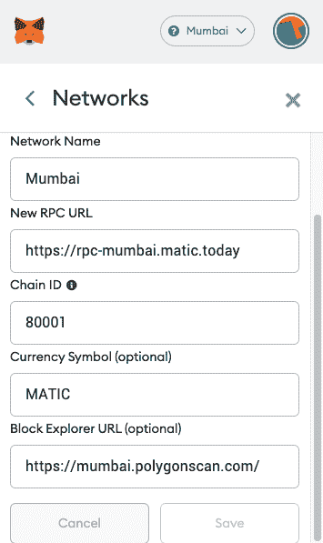
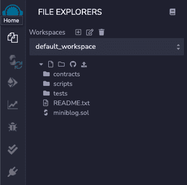
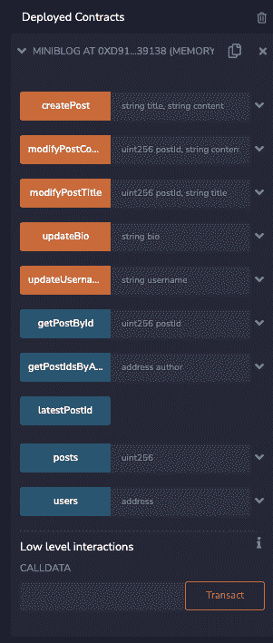
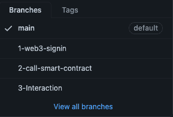
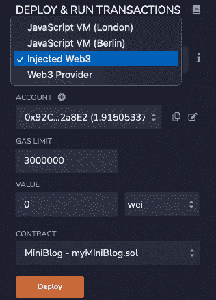
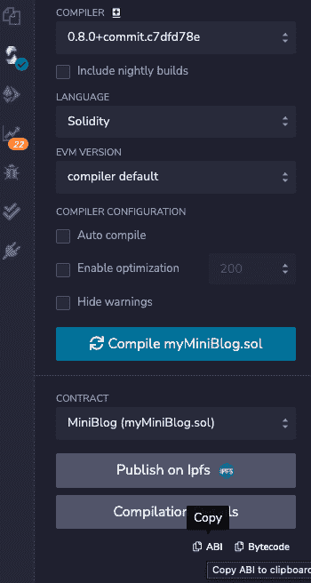
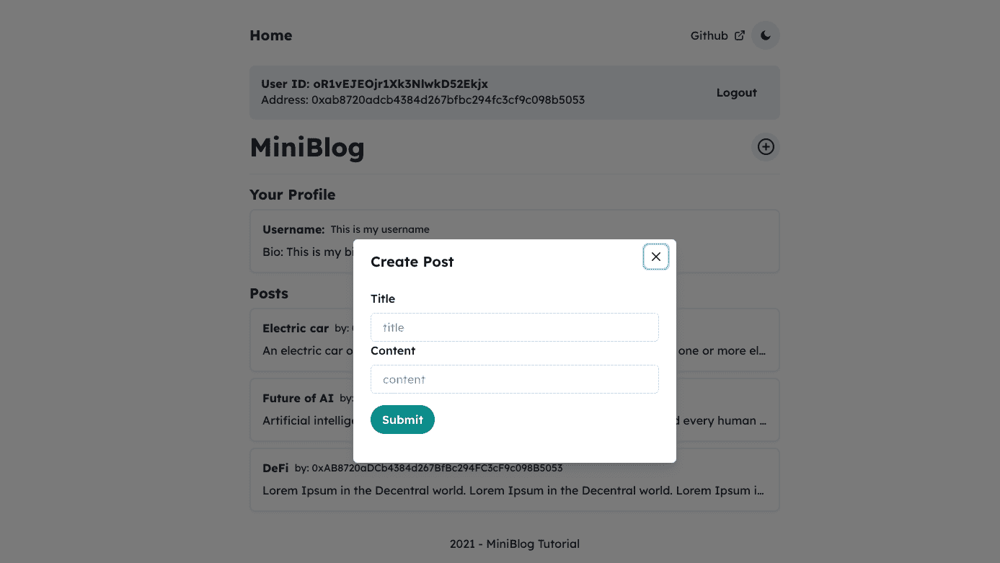
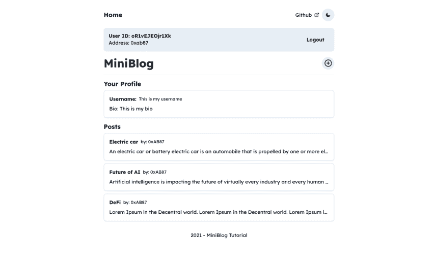

# 介绍

> 原文：<https://github.com/figment-networks/learn-tutorials/blob/master/polygon/polygon-miniposts-tutorial.md>

在本教程中，你将学习如何在 Polygon (Matic)上建立一个简单的博客网站。dapp 允许用户可视化他们的名字、传记和所有帖子的提要。用户还可以发布帖子。

我们将学习一些基本的坚固性元素，如映射或结构，以及如何在 Polygon Mumbai 测试网络上部署它。对于前端，我们将使用 Reactjs。

# 先决条件

*   [多边形路径](https://learn.figment.io/protocols/polygon)
*   建议熟悉元掩码、Solidity 和 Javascript。

# 要求

*   [教程的 Github repo](https://github.com/aeither/miniblog)
*   [Remix 以太坊](https://remix.ethereum.org/)浏览器坚固度编辑器
*   [元掩码](https://metamask.io/)浏览器扩展
*   [代码编辑器](https://code.visualstudio.com/download)例如 VS 代码
*   [GitHub 账户](https://github.com/)

强烈建议创建一个新的元掩码帐户进行测试。您会希望将这个新帐户的秘密恢复短语放在手边，因为部署智能合约需要它。



现在，您会注意到您的钱包中余额为零(0 MATIC)，要获得用于部署和测试的 test Matic，请转到 MATIC 水龙头[链接](https://faucet.matic.network) - >选择孟买- >粘贴您的钱包地址- >单击“提交”。

当这个完成时，检查你的元掩码&你会在那里看到一些 MATIC 标记。我们只需要少量的 MATIC 来部署和测试我们的 dApp。

# 创建合同

我们要完成的第一件事是创建一个有效的智能合同，允许每个人发布类似 twitter 的帖子。任何人都可以与智能合同进行交互，以发布他们的消息，其中每个消息都有其 id。

打开你的浏览器，进入 [Remix](https://remix.ethereum.org/) 这是用 Solidity 开发的最好的在线编辑器之一。你会看到几个文件夹，你可以删除，因为我们不会使用它们。按下**创建新文件**图标，在根目录下创建一个名为`miniblog.sol`的新实体文件。



在撰写本教程时，建议使用 0.8.0 以上的实度版本。前沿版本可能包含未知的问题，旧版本将迫使我们处理旧的和过时的代码。

```
// SPDX-License-Identifier: MIT
pragma solidity ^0.8.0;
```

我们需要两个结构来定义我们想要存储的数据的结构。第一个包含用户信息，第二个包含文章信息。

```
contract MiniBlog {

   struct User {
       string username;
       string bio;
       uint256[] postIds;
   }

   struct Post {
       string title;
       string content;
       address author;
       uint256 created;
   }

}
```

Solidity 中的映射就像任何其他语言中的哈希表或字典一样。这些用于将数据存储为键值对。我们创建 2 个`mapping`，一个`address`用于用户数据，一个 postId 用于发布信息。

```
  mapping (address => User) public users;
  mapping (uint256 => Post) public posts;
```

通过映射，我们可以使用 id 作为关键字来访问文章数据，比如标题或内容。比如`posts[2].title`。

添加文章 id，我们可以增加并分配给每个新文章。

```
contract MiniBlog {
  // Add latestPostId Here
  uint256 public latestPostId = 0;

  struct User {
    string username;
    string bio;
    uint256[] postIds;
    }
  // ...
}
```

在映射下面，我们创建了一个以标题和内容为参数的函数

```
   function createPost(string memory title, string memory content) public {
       latestPostId++;

       posts[latestPostId] = Post(title, content, msg.sender, block.timestamp);
       users[msg.sender].postIds.push(latestPostId);
   }
```

当调用该函数时，它创建一个新的 post 并将一个惟一的增量 Id 推入 post 映射中使用的数组。然后，我们将帖子的 id 推送到函数调用方的用户映射(msg.sender ),以便稍后我们可以跟踪该作者创建的所有帖子。

使用 require，我们可以限制只有帖子的作者可以编辑他的帖子。

```
 function modifyPostTitle(uint256 postId, string memory title) public {
   require(msg.sender == posts[postId].author, "Only the author can modify");

   posts[postId].title = title;
 }

 function modifyPostContent(uint256 postId, string memory content) public {
   require(msg.sender == posts[postId].author, "Only the author can modify");

   posts[postId].content = content;
 }
```

呼叫者可以通过更改用户名和传记来自定义他的个人资料。

```
 function updateUsername(string memory username) public {
   users[msg.sender].username = username;
 }

 function updateBio(string memory bio) public {
   users[msg.sender].bio = bio;
 }
```

为了获取文章数据，我们创建了两个函数。一种方法是获取由同一地址创建的所有文章 id 的数组。另一个用于获取文章 Id 内容。对于`getPostById`，我们可以通过映射 posts 变量直接访问，因为我们将它声明为`public`。

```
function getPostIdsByAuthor(address author)
   public
   view
   returns (uint256[] memory)
 {
   return users[author].postIds;
 }

 function getPostById(uint256 postId)
   public
   view
   returns (string memory title, string memory content)
 {
   title = posts[postId].title;
   content = posts[postId].content;
 }
```

在 Solidity 中，事件被分派是智能合约可以启动的信号。通过函数`createPost`，我们可以添加`emit`关键字来触发事件。

```
 function createPost(string memory title, string memory content) public {
   latestPostId++;

   posts[latestPostId] = Post(title, content, msg.sender, block.timestamp);
   users[msg.sender].postIds.push(latestPostId);

   emit NewPost(msg.sender, latestPostId, title);
 }
```

我们宣布事件被触发。您可以在 Etherscan 的 events 部分看到智能合约的事件。例:[https://ethers can . io/address/0x1f 9840 a 85 D5 af 5 BF 1d 1762 f 925 bdaddc 4201 f 984 #事件](https://etherscan.io/address/0x1f9840a85d5af5bf1d1762f925bdaddc4201f984#events)

```
event NewPost(address indexed author, uint256 postId, string title);
```

现在，将所有这些放在一起，我们应该有以下合同:

```
// SPDX-License-Identifier: MIT
pragma solidity ^0.8.0;

contract MiniBlog {
 uint256 public latestPostId = 0;

 struct User {
   string username;
   string bio;
   uint256[] postIds;
 }

 struct Post {
   string title;
   string content;
   address author;
   uint256 created;
 }

 mapping(address => User) public users;
 mapping(uint256 => Post) public posts;

 event NewPost(address indexed author, uint256 postId, string title);

 function createPost(string memory title, string memory content) public {
   latestPostId++;

   posts[latestPostId] = Post(title, content, msg.sender, block.timestamp);
   users[msg.sender].postIds.push(latestPostId);

   emit NewPost(msg.sender, latestPostId, title);
 }

 function modifyPostTitle(uint256 postId, string memory title) public {
   require(msg.sender == posts[postId].author, "Only the author can modify");

   posts[postId].title = title;
 }

 function modifyPostContent(uint256 postId, string memory content) public {
   require(msg.sender == posts[postId].author, "Only the author can modify");

   posts[postId].content = content;
 }

 function updateUsername(string memory username) public {
   users[msg.sender].username = username;
 }

 function updateBio(string memory bio) public {
   users[msg.sender].bio = bio;
 }

 function getPostIdsByAuthor(address author)
   public
   view
   returns (uint256[] memory)
 {
   return users[author].postIds;
 }

 function getPostById(uint256 postId)
   public
   view
   returns (string memory title, string memory content)
 {
   title = posts[postId].title;
   content = posts[postId].content;
 }
}
```

在 Remix 网站上，进入 Solidity Compiler，点击带有 compiler 0.8.0 的蓝色按钮:


这将成功编译智能合同。左侧选项卡中会有一个绿色图标。转到**部署&运行交易**。确保环境设置为 **JavaScript VM** 。部署合同。现在，您应该可以在已部署的合同下看到该合同。



你可以玩合同。更新您的用户名，创建几个帖子，更改它们，并通过获取帖子来检查结果。

杰出！我们已经创建了一个迷你博客智能合同。现在让我们为此构建前端。

# 创建前端

我们将使用一个已创建的存储库，以使其更容易跟踪。在这个仓库中有 3 个分支，你可以从 1 到 3 查看进度和变化。



通过在终端中运行 git clone 来克隆存储库。

```
git clone https://github.com/aeither/miniblog
cd miniblog 
```

使用命令签出到第一个分支:

```
git checkout 1-web3-signin 
```

打开终端并运行 yarn，然后运行 yarn dev 以在本地运行项目。我们使用 react-moralis 来允许用户使用元掩码登录。

导入使用道德。

```
// 1 Import useMoralis
import { useMoralis } from "react-moralis";

// ...

// 2 Use constants from Moralis
const { authenticate, isAuthenticated, user, logout } = useMoralis();
```

如果用户没有被认证，我们显示认证按钮。如果登录了，我们向用户显示他的地址和注销按钮。

```
// 3 Add Login Bar
const LoginBar = () =>
  !isAuthenticated ? (
    <Button onClick={() => authenticate()}>Authenticate</Button>
  ) : (
    <HStack
      rounded="8"
      background={GRAY}
      w="100%"
      p="4"
      my="4"
      justify="space-between"
    >
      <Box>
        <Heading size="sm">User ID: {user?.get("username")}</Heading>
        <Text>Address: {user?.get("ethAddress")}</Text>
      </Box>
      <Button onClick={() => logout()}>Logout</Button>
    </HStack>
  );
```

在 Metamask 中选择了孟买网络。在重新混合部署中，这次将环境设置为注入的 Web3



当您点击 deploy 时，元掩码应该显示一个事务确认。

现在我们需要 ABI 和智能合同地址。在编译器中，你可以直接复制 ABI。应用二进制接口(ABI)是两个二进制程序模块之间的接口。它允许我们与合同互动。



回到您的编辑器，在 src 文件夹中，我们创建一个 abi.json 文件并粘贴 abi。

从 Remix 或[https://mumbai.polygonscan.com/](https://mumbai.polygonscan.com/)的已部署合同中获取合同地址


导入 ABI 并添加智能合同地址。

```
// 1 Import ABI and contract address
import contractABI from "../abi.json";

const address = "ADDRESS";
```

从 useMoralis()导入道德

```
async function initContract() {
  const web3 = await Moralis.Web3.enable();
  const contract = new web3.eth.Contract(contractABI, address);
  setContract(contract);
}
// 3.2 Get user profile
async function getUserProfile() {
  if (contract !== undefined) {
    const profileData = await contract.methods.users(userAddress).call();
    setUserProfile({
      bio: profileData.bio,
      username: profileData.username,
    });
  }
}

// 3.3 Get latest posts
async function getPosts() {
  if (contract !== undefined) {
    const latestPostId = await contract.methods.latestPostId().call();
    // We only want the last 10 posts
    const last = latestPostId < 10 ? 0 : 10;
    const posts: Array<Post> = [];
    // eslint-disable-next-line no-plusplus
    for (let index = latestPostId; index > last; index--) {
      // eslint-disable-next-line no-await-in-loop
      const post = await contract.methods.posts(index).call();
      posts.push({
        author: post.author,
        content: post.content,
        created: post.created,
        title: post.title,
      });
    }
    setLatestPosts(posts);
  }
}
```

在里面`initContract`我们启用了 web3 提供商并创建了一个新的合同。`getUserProfile`调用函数 users，该函数返回用户简历和姓名。我们可以去 remix 并在那里添加姓名和简历，因为我们不会从前端覆盖交互。`getPosts`返回最新的 10 个帖子并设置为状态。

查看第三个分支，了解有关如何与合同进行交互的更多信息。

我们已经添加了 **react-hook-form** 作为依赖项，所以我们可以在`NewPostForm`中使用它。运行`yarn`来安装它，或者如果它还没有安装在你的项目中，运行`yarn add react-hook-form`。

```
<form onSubmit={handleSubmit(onSubmit)}>
  <FormControl>
    <FormLabel htmlFor="title">Title</FormLabel>
    <Input id="title" placeholder="title" {...register("title")} />
    <FormLabel htmlFor="content">Content</FormLabel>
    <Input id="content" placeholder="content" {...register("content")} />
  </FormControl>
  <Button mt={4} colorScheme="teal" isLoading={isSubmitting} type="submit">
    Submit
  </Button>
</form>
```

表单中有两个可用字段，标题和内容。当用户提交表单时，它将运行以下函数。

```
const onSubmit: SubmitHandler<IFormInput> = ({
  title,
  content,
}: IFormInput) => {
  contract?.methods
    .createPost(title, content)
    .send({ from: userAddress })
    .then((receipt: unknown) => {
      console.log(receipt);
    });
};
```

正如您可以观察到的，这次我们使用 send 而不是 call。该事务应由地址签名，因此 from: address 参数是必需的。

现在让我们看看结果。*确保你在孟买。确保用`yarn`或`npm install`安装依赖项，并用`yarn dev`运行。

我们应该可以通过访问 [http://localhost:3000](http://localhost:3000) 看到主页。使用元掩码扩展进行身份验证。


我们可以通过点击加号图标创建第一篇文章，然后提交一篇新文章。



如果我们更新用户名或修改来自 remix 的帖子，你可以通过刷新前端看到这些变化。



太棒了。我们成功了。现在你有了一个迷你的 post web 应用程序，你可以在 Matic 网络中启动你的旅程。

# 结论

在本教程中，我们制作了一个迷你的 posts Web 3 应用程序。我们学习了一些 Solidity 的基础知识:如何创建一个智能契约，如何部署它，如何与它交互，映射，结构和事件。然后，我们构建了前端，在这里我们可以看到如何通过 web 应用程序与合同进行交互。我们和来自 Moralis 的 web3js 玩了一会儿。

# 关于作者

Giovanni Fu 是一名 web 开发人员，是区块链的狂热爱好者，对软件开发和去中心化充满热情。请随时在 [GitHub](https://github.com/aeither) 上与我联系。

# 参考

*   Web3 docs: [https://web3js.readthedocs.io/en/v1.5.2/](https://web3js.readthedocs.io/en/v1.5.2/)
*   多边形(Matic)文档:[https://docs . Matic . network/docs/develop/getting-started](https://docs.matic.network/docs/develop/getting-started)
*   元掩模文件:[https://docs.metamask.io/guide/#why-metamask](https://docs.metamask.io/guide/#why-metamask)
*   反应文件:[https://reactjs.org/docs/getting-started.html](https://reactjs.org/docs/getting-started.html)
*   道德文件:[https://docs.moralis.io/moralis-server/tools/react-moralis](https://docs.moralis.io/moralis-server/tools/react-moralis)
*   前端回购:[https://github.com/aeither/miniblog](https://github.com/aeither/miniblog)
*   首发模板:[https://github.com/sozonome/nextarter-chakra](https://github.com/sozonome/nextarter-chakra)