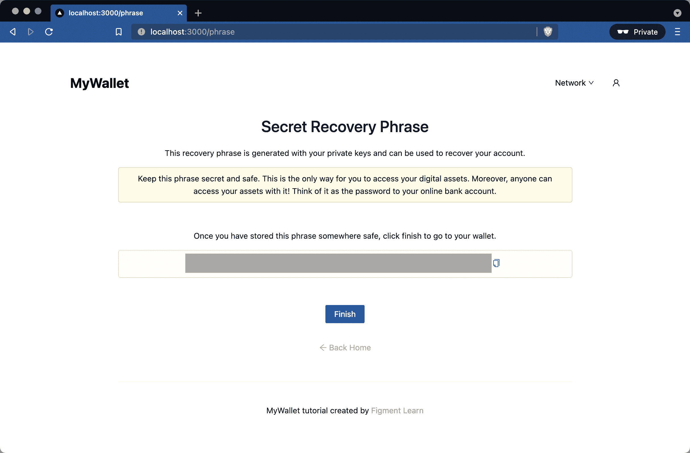
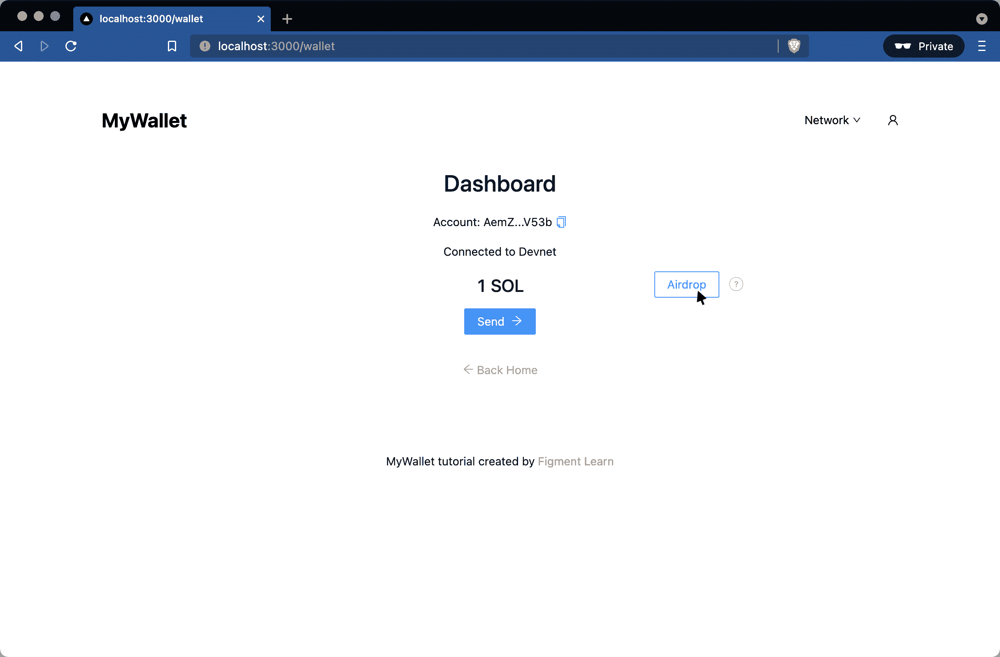
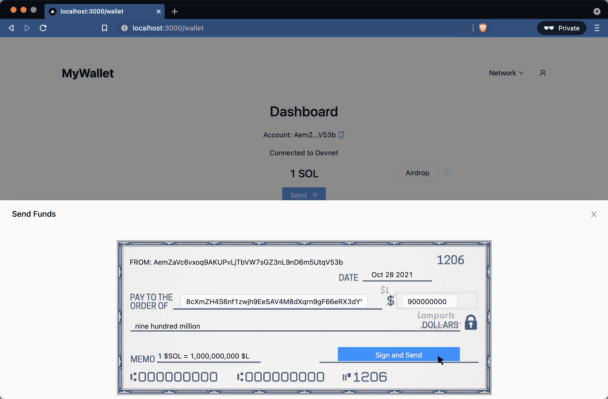
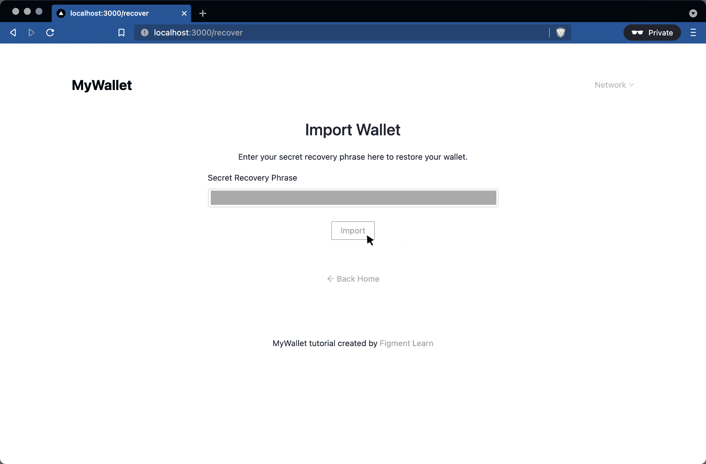

# 先决条件📋

> 原文：<https://github.com/figment-networks/learn-tutorials/blob/master/solana/solana-wallet/wallet-tutorial-intro.md>

你将要学习如何为 [Solana](https://solana.com/) 协议开发一个钱包。随着您的构建，我们将深入 Web 3 的一些基础知识，这样您就可以开始培养对区块链技术和分散应用程序(dApps)的理解。

本教程没有正式的区块链或 Web 3 先决条件，但是你应该有一些使用 [TypeScript](https://www.typescriptlang.org/) 和 [React](https://reactjs.org/) 的经验。理想情况下，您听说过 [Solana](https://solana.com/) ，并且知道它是一个公共区块链协议，能够运行具有显著可伸缩性优势的智能合约。

话虽如此，即使你不满足上述先决条件，也可以试一试，因为无论如何你都可能从中获得很多。只是要有额外的耐心，因为它可能会更难驾驭。

我们认为自己是你们的向导——在短暂的时间里——在你们建设一个更好的互联网的征途上。我们希望你离开时对 Web 3 技术有更好的理解，甚至对解决重大问题更有信心。

我们试着向你展示门(或者门的一部分)。你的工作是发现你的道路并勇敢地走下去。

[](https://raw.githubusercontent.com/figment-networks/learn-tutorials/master/solana/solana-wallet/assets/cat.jpeg?raw=true)

图 1:你服用红色药丸——你呆在仙境中，我向你展示兔子洞有多深

# 系统依赖性<g-emoji class="g-emoji" alias="computer" fallback-src="https://github.githubassets.cimg/icons/emoji/unicode/1f4bb.png">💻</g-emoji>

确保你已经安装了 [git](https://git-scm.com/book/en/v2/Getting-Started-Installing-Git) 、 [Node](https://nodejs.org/en/) 和 [yarn](https://yarnpkg.com/getting-started/install) 。

# 设置 <g-emoji class="g-emoji" alias="bricks" fallback-src="https://github.githubassets.cimg/icons/emoji/unicode/1f9f1.png">🧱</g-emoji>

您将在我们为您预先构建的 [Next.js](https://nextjs.org/) 应用程序的基础上构建 Solana 互动。这样你就可以跳过你熟悉的开发阶段(比如编写 React 组件和后续页面)，直接进入区块链特有的阶段。

首先，在您的系统中克隆[repo](https://github.com/figment-networks/wallet-tutorial)，并通过在您的终端中运行以下三个命令来安装应用程序依赖项:

##### *清单 1.1:设置在终端上运行的命令*

```
$ git clone https://github.com/figment-networks/wallet-tutorial.git
$ cd wallet-tutorial
$ yarn 
```

然后，在您的终端中运行`yarn dev`,在端口 3000 上启动开发服务器。终端应该打印类似于[清单 1.2](#listing-12-terminal-message-on-app-start-up) 中的输出，通知您可以在 [http://localhost:3000](http://localhost:3000) 查看该应用程序。

##### *清单 1.2:应用启动时的终端消息*

```
yarn run v1.22.11
$ yarn dev
ready - started server on 0.0.0.0:3000, url: http://localhost:3000
info  - Using webpack 5\. Reason: Enabled by default https://nextjs.org/docs/messages/webpack5
event - compiled successfully 
```

# 教程结构<g-emoji class="g-emoji" alias="building_construction" fallback-src="https://github.githubassets.cimg/icons/emoji/unicode/1f3d7.png">🏗</g-emoji>

本教程由一系列步骤组成，这些步骤分解了为预构建的 Next.js 应用程序开发钱包功能的过程。每一步都讨论了关键概念和心智模型，为您更好地理解我们正在构建的内容和原因创造了必要的背景。就当这是热身。

预热后，我们将提供功能的分步实施，包括完整解决方案的代码片段。热身后，我们会引导你完成实施的逻辑，并帮助你为主题搭建心智模型。

实现之后是一个挑战，目的是给你足够的说明和参考，让你可以自己实现功能，如果你想尝试一下的话。这可以让你锻炼[主动回忆](https://en.wikipedia.org/wiki/Active_recall)并增加你大脑建立联系的能力。

# 钱包预览<g-emoji class="g-emoji" alias="mag" fallback-src="https://github.githubassets.cimg/icons/emoji/unicode/1f50d.png">🔍</g-emoji>

当您完成本教程时，您将拥有一个能够通过接收和转移 onchain 资金来改变 Solana 区块链状态的功能性钱包。在[步骤 2](https://learn.figment.io/tutorials/solana-wallet-step-2) 中，我们将生成一个 12 个单词的短语，它将授予我们访问钱包的权限。



然后，我们将构建一个函数，在第[步第 3](https://learn.figment.io/tutorials/solana-wallet-step-3) 中获取我们新创建的钱包的余额，然后利用功能通过所谓的“空投”发布“测试令牌”，我们将在第[步第 4](https://learn.figment.io/tutorials/solana-wallet-step-4) 中探索这一点。



将资金添加到我们的钱包后，我们将使用银行支票作为脚手架类比，在[步骤 5](https://learn.figment.io/tutorials/solana-wallet-step-5) 中建立将资金转移到另一个钱包的能力。



最后，我们将使用我们在[步骤 2](https://learn.figment.io/tutorials/solana-wallet-step-2) 中生成的短语在[步骤 6](https://learn.figment.io/tutorials/solana-wallet-step-6) 中恢复对它的访问。



虽然构建一个像 [Phantom](https://phantom.app/) 或 [MetaMask](https://metamask.io/) 这样的生产就绪、非托管钱包超出了本教程的范围，但在本教程结束时，你将会建立一个判断的基础，这将让你在探索新项目时更好地分配学习时间。为此，我们将以一个[附加资源](https://learn.figment.io/tutorials/solana-wallet-conclusion#additional-resources)的列表来结束本教程，您将为探索这些资源做好充分准备。

[](https://raw.githubusercontent.com/figment-networks/learn-tutorials/master/solana/solana-wallet/assets/journey.jpeg?raw=true)

图 2:千里之行始于足下