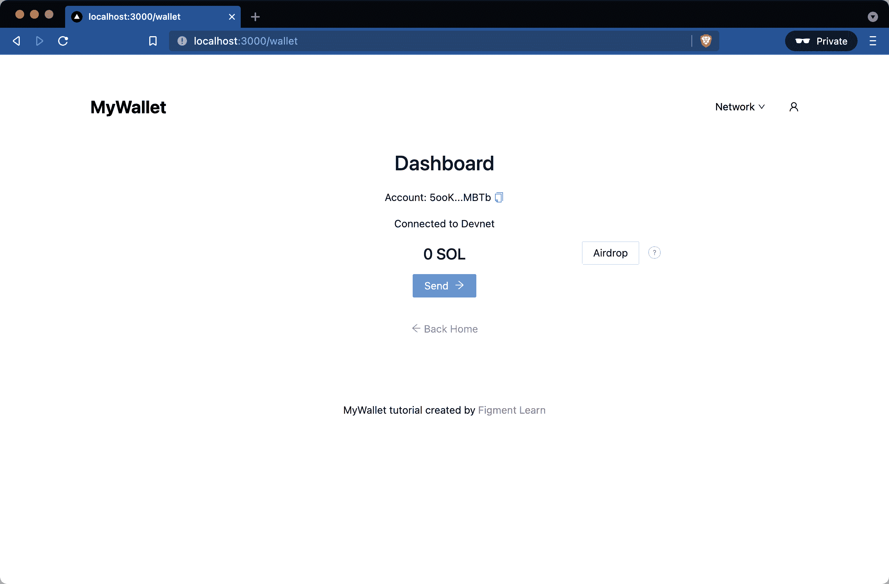

# solana/solana-wallet/wallet-tutorial-step-2

> 原文：<https://github.com/figment-networks/learn-tutorials/blob/master/solana/solana-wallet/wallet-tutorial-step-2.md>

加密钱包是区块链领域面向用户的最重要的基础设施。浏览器通过提供一个进入底层服务器和数据库的易于使用的网关，将 web 带给大众，同样，钱包也为用户提供了一个进入区块链协议的易于使用的网关。

钱包不太像你用来放信用卡的钱包，而更像一个钥匙链。如果你把区块链想象成一个装有数字保险箱的巨型银行保险箱，钱包就是你存放保险箱钥匙的钥匙链。一旦你有了一个盒子，你就可以通过接收、发送、保存和消费数字资产来管理它的内容。

[](https://raw.githubusercontent.com/figment-networks/learn-tutorials/master/solana/solana-wallet/assets/safe.jpeg?raw=true)

图 3:钱包在区块链上保存您的公共地址的私钥

我们可以把盒子本身想象成区块链上的一块内存。数字信箱位置被称为公钥，或者更直观地称为公共地址，可以与任何人共享，就像您可以共享您的地址以在家中接收邮件一样。顾名思义，这对于网络上的其他人来说是广泛可用的，并且它是其他人用来将数字资产发送到盒子的标识符。

可以打开保险箱的钥匙称为私人钥匙。任何能得到盒子私钥的人都可以得到盒子，这就是为什么保持密钥的私有性至关重要——因此得名私钥。

# 高清钱包

在本教程中，我们将构建一种称为分层确定性(HD)钱包的钱包。我们不需要在这里深入研究高清钱包的完整定义，但重要的是要知道，它们能够将私钥存储为 12、18 或 24 个单词的短语，称为秘密恢复短语或助记短语。您将使用一个名为 [Bip39](https://github.com/bitcoinjs/bip39) 的 JavaScript 库来帮助生成这个短语，这个短语又可以转换成一个私钥来创建一个钱包。

助记短语的概念是由比特币改进提案 39 (BIP39)引入的。术语“助记法”指的是一种使事物更容易记忆的模式。例如，你们中的一些人可能熟悉数学中的运算顺序记忆法:PEMDAS，或者“请原谅我亲爱的萨莉阿姨”。BIP39 的动机是“与处理钱包种子的原始二进制或十六进制表示相比，助记码或句子更适合人类交互。”

在浏览器中运行并打开该应用程序，网址为 [http://localhost:3000](http://localhost:3000) 。您会注意到前端为用户提供了创建新钱包或导入现有钱包的选项。

点击**创建新钱包**会将用户引导至一个`/generate`页面，告知用户点击**生成**，应用将生成一个关键短语，从而创建一个新钱包。但是当我们点击**生成**时，我们被路由到一个带有空短语容器的`/phrase`页面。

# 实施 <g-emoji class="g-emoji" alias="jigsaw" fallback-src="https://github.githubassets.cimg/icons/emoji/unicode/1f9e9.png">🧩</g-emoji>

为了让应用程序正常工作，我们需要实现一个函数来生成一个短语，并在`/phrase`页面呈现时用它来创建一个钱包。在您的编辑器中，导航到`pages/phrase.tsx`。

为了生成短语，我们需要利用一个满足 [BIP39 规范](https://github.com/bitcoin/bips/blob/master/bip-0039.mediawiki)的外部库，该规范为确定性键生成短语设置了标准。

幸运的是，还有 Bip39 库。它为我们提供了生成短语所需的功能，并在以后将其转换为生成 Solana 钱包密钥所需的种子。

当我们在设置期间运行`yarn`时，我们已经安装了这个库，因为我们将它包含在预建应用的[包中。所以我们需要做的就是导入它:](https://github.com/figment-networks/wallet-tutorial/blob/main/package.json)

```js
import * as Bip39 from "bip39";
```

## 恢复短语

回想一下，秘密恢复短语也称为助记符，Bip39 包括用于生成助记符短语的方法`generateMnemonic()`。我们可以调用它并替换当前赋给空字符串的变量:

```js
const generatedMnemonic = Bip39.generateMnemonic();
```

这允许我们在状态中设置短语，并显示给我们的用户安全地写下和存储。通过这一步，我们有效地创建了我们的钱包，因为短语本身将允许其持有者访问与之匹配的帐户。

尽管社区中的大多数人认为帐户是被创建的，但从技术上讲，区块链帐户是不能被创建或销毁的。这些帐户是系统中的数学地址，它们的存在从一开始就由系统的架构以数学方式确定。更准确地说，记忆术是获取进入一个预先存在的空账户的钥匙。

## 关键对和种子

然而，在连接到区块链上的帐户之前，我们需要将短语转换成区块链可以理解的形式。毕竟，助记短语是将一个长的、古老的数字转换成更人性化形式的抽象概念。

我们需要将这个短语转换成字节，这样 Solana web3.js 库就可以用它来生成一个`keypair`对象。`keypair`将是由可以加密数据的公钥和可以解密数据的私钥组成的钱包账户。

在高级别上，公钥加密是一种使用密钥对安全传输信息的加密系统。每个密钥对都由一个在系统中广为人知的公钥和一个私钥组成，私钥应该由其所有者保密。假设 Bob 想发送一条安全消息给 Alice，同时确保即使 Eve 截获了它，她也不能阅读它。Bob 将使用 Alice 的公钥加密该消息，然后发送该消息。由于一种叫做单向函数的东西，公钥不能用来解密消息。解密消息的唯一方法是使用与 Bob 使用的公钥互补的私钥，也就是 Alice 持有的私钥。鲍勃可以放心，除了爱丽丝，没有人能看到这条消息。无需预共享对称密钥就能加密信息是一项巨大的技术进步。如果你愿意，这些突破背后的历史非常值得研究。我们在教程的最后提供了一些建议作为额外的资源。

通过回顾 Solana 的 web3.js [文档](https://solana-labs.github.io/solana-web3.js/index.html)，我们看到有一个`Keypair`类被定义为“用于签署交易的账户密钥对”这正是我们需要使用助记短语生成的内容。

我们注意到`Keypair`类有一个从 32 字节种子生成 keypair 的`fromSeed`方法。它还提到种子需要是一个`Uint8Array`，这意味着我们需要一种方法将我们的`string`短语转换成`Uint8Array`。

回到 Bip39 库，我们看到一个名为`mnemonicToSeedSync(mnemonic)`的方法，它返回某种看起来像十六进制数列表的`Buffer`对象。我们可以通过在应用程序中运行它并传入我们生成的助记符来测试这一点:

```js
const seed = Bip39.mnemonicToSeedSync(generatedMnemonic);
console.log(seed)

// console:
> Uint8Array(64);
```

看起来我们很接近了。`Keypair`类需要一个 32 字节的`Uint8Array`，而我们得到的是一个 64 字节的`Uint8Array`。我们可以将种子切片，只保留前 32 个字节:

```js
const seed = Bip39.mnemonicToSeedSync(generatedMnemonic).slice(0, 32);
console.log(seed)

// console:
> Uint8Array(32);
```

有了正确格式的种子，我们可以使用`Keypair`的`fromSeed`方法来生成帐户密钥对:

```js
const newAccount = Keypair.fromSeed(seed);
```

然后，我们将帐户设置为上下文状态，我们就可以访问 Solana 钱包了。

实施该功能后，请确保在点击浏览器上的**完成**之前保存恢复短语。注销后，我们将在[步骤 6](https://learn.figment.io/tutorials/solana-wallet-step-6) 中使用它来访问钱包一次。

点击**完成**后，您将被转到显示账户仪表板的钱包页面。您会注意到该页面还包括一些其他功能。我们将在[步骤 3](https://learn.figment.io/tutorials/solana-wallet-step-3) 中讨论网络下拉菜单，同时实现向用户显示余额的关键功能。

在[步骤 4](https://learn.figment.io/tutorials/solana-wallet-step-4) 中，我们将投入空投并使**空投**按钮起作用，在[步骤 5](https://learn.figment.io/tutorials/solana-wallet-step-5) 中，我们将启用**发送**按钮并转移资金。

##### *清单 2.2:创建钱包的代码*

```js
const generatedMnemonic = Bip39.generateMnemonic();
setMnemonic(generatedMnemonic);

const seed = Bip39.mnemonicToSeedSync(generatedMnemonic).slice(0, 32);
const newAccount = Keypair.fromSeed(seed);
setAccount(newAccount);
```



# 挑战<g-emoji class="g-emoji" alias="weight_lifting" fallback-src="https://github.githubassets.cimg/icons/emoji/unicode/1f3cb.png">🏋️</g-emoji>

在您的编辑器中，导航到`pages/phrase.tsx`，按照注释中包含的步骤完成函数的编写。我们提供了一个描述，以及一个链接，链接到您为了实现每一行而需要查看的文档。相关的代码块也包含在下面的清单 2.1 中。

##### *清单 2.1:生成短语和创建钱包的指令*

```js
useEffect(() => {
  // *Step 2*: implement a function that generates a mnemonic when the page renders, and uses it to create a wallet (i.e. account)
  // (a) review the import guidance on lines 9 and 11
  // (b) generate a mnemonic phrase by importing Bip39 and then implementing the appropriate method on the imported Bip39 instance
  // Documentation Reference: https://github.com/bitcoinjs/bip39
  const generatedMnemonic = "";

  // This line saves the mnemonic phrase to context state so we can display it for the wallet user to copy
  setMnemonic(generatedMnemonic);

  // (c) convert the mnemonic to seed bytes and make sure it's 32-bytes (Hint: console log the seed to see how many bytes you have vs how many you need)
  // Documentation Reference: https://github.com/bitcoinjs/bip39
  const seed = new Uint8Array();

  // (d) use the seed to generate a new account (i.e. a new keypair)
  // Documentation Reference:
  //   https://solana-labs.github.io/solana-web3.js/classes/Keypair.html
  //   https://solana-labs.github.io/solana-web3.js/classes/Keypair.html#fromSeed
  const newAccount = null;

  // This line sets the account to context state so it can be used by the app
  setAccount(newAccount);
}, []);
```