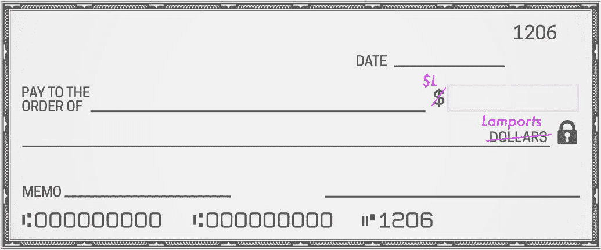

# 签名并发送

> 原文：<https://github.com/figment-networks/learn-tutorials/blob/master/solana/solana-wallet/wallet-tutorial-step-5.md>

现在我们已经用 devnet 上的测试令牌为我们的帐户提供了资金，我们可以开始考虑如何使用这些资金了。在现实世界的应用程序中，我们可能希望将 SOL 换成另一个令牌，用 SOL 支付商品或服务的费用，甚至赠送某人一些 SOL。为此，我们需要一种方法来让网络分类账知道我们的账户应该将资金转移到另一个账户。

从基本原则考虑，我们知道我们需要一个接受两个地址的函数——发送者和接收者。我们还知道我们需要传入一个数量——我们想要发送的 SOL 或 lamports 的数量。

但还有一个更重要的因素:我们需要向网络证明，我们实际上是这些资金的所有者，我们批准了这笔转账。

## 纸质支票

考虑一种传统的纸质支票，你可以用它来支付你的房东。支票的左上角印着你的名字和地址。它包括一个供您填写收款人姓名的字段，以及一个供您填写付款金额的字段。最后，它包括一个供您在支票上签名的字段，以向银行确认您批准了转账。

[](https://raw.githubusercontent.com/figment-networks/learn-tutorials/master/solana/solana-wallet/assets/check.jpeg)

图 8:加密交易就像数字支票(带有真实签名)

让我们假设银行实际上使用这些签名来验证你确实签署了支票，而不是其他人伪造了你的签名(剧透:他们在大多数情况下不会)。

## 区块链转移

转移资金的区块链模式非常相似。您需要一种方法来签署交易，以便网络可以确认它是有效的，并更改相应的余额。

加密签名的概念很吸引人，但是远远超出了本教程的范围。如果你想更深入地了解它，我们将在最后提供[额外的资源](#additional-resources),但是请记住，你的密钥、散列算法和单向函数就是为此目的而设计的。签名验证了发件人的身份，并向收件人证明邮件没有被泄露。

记住这些构件后，我们就可以搜索文档来寻找发送和确认交易的方法了。

# 实施 <g-emoji class="g-emoji" alias="jigsaw" fallback-src="https://github.githubassets.cimg/icons/emoji/unicode/1f9e9.png">🧩</g-emoji>

如果你点击钱包仪表板上的**发送**按钮，一个抽屉组件打开，显示一个纸质支票结构的表单，从而建立在我们上面的类比之上。它包括交易的所有组成部分，但是**签名和发送**按钮还没有工作。

导航到`components/TransactionLayout/index.tsx`，我们看到一个部分实现的`transfer`功能。

基于[步骤 3](https://learn.figment.io/tutorials/solana-wallet-step-3) 和[步骤 4](https://learn.figment.io/tutorials/solana-wallet-step-4) ，我们知道我们将需要一个到网络的连接。我们可以再次利用我们以前的代码:

```js
const connection = new Connection(clusterApiUrl(network), "confirmed");
```

## 处理

我们可以猜测，我们将需要构建某种事务对象，并通过连接发送它，但是我们如何做还不是很明显。通过搜索文档，看起来有两种发送事务的方法——`Connection`中的`sendTransaction`方法和通用函数`sendAndConfirmTransaction`。

我们想要请求确认，这样我们就可以在发送交易后更新我们的余额，所以后者似乎是一个不错的选择。

通读函数的规范，看起来我们需要传入一个`connection`、某种`transaction`对象和一个`signers array`。此外，描述说这个功能将“签署、发送和确认交易”，所以看起来我们是在正确的轨道上。我们可以从导入并使用这个函数开始，因为我们知道接下来要构建它的输入。

```js
const confirmation = await sendAndConfirmTransaction(
  connection,
  transaction,
  signers
);
```

我们已经有了一个`connection`，所以我们可以立即转向`transaction`参数。按照文档中对`Transaction`类的链接，看起来要创建一个`transaction`对象，我们可以使用它的构造函数。

```js
const transaction = new Transaction()
console.log(transaction)

// console:
> Transaction {signatures: Array(0), feePayer: undefined, instructions: Array(0), recentBlockhash: undefined, nonceInfo: undefined}
```

查看我们创建的事务，它显然缺少有效事务所需的任何组件，如`sender`、`recipient`和`amount`，但它似乎有一个我们应该能够填充的熟悉结构。你可以研究他们中的每一个，但是让我们直接进入`instructions`属性，因为它似乎是一个有前途的开始。

不幸的是，文档在如何进行方面不是很直观，但我们可以利用我们的技术复杂性。有一个非常有用的类叫做`SystemProgram`,带有一个`transfer`方法，它“生成一个事务指令，将 lamports 从一个帐户转移到另一个帐户。”这似乎正是我们所需要的。

## 转移

`transfer`方法接受一个`TransferParams`对象，该对象需要 lamports 中的`sender`、`recipient`和`amount`。这与我们希望用于交易的数据相匹配，我们可以从上下文状态中的帐户和表单输入中获得这些数据。生成的指令如下所示:

```js
const instructions = SystemProgram.transfer({
  fromPubkey: account.publicKey,
  toPubkey: new PublicKey(form.to),
  lamports: form.amount,
});
```

注意，我们必须为接收者实例化一个`PublicKey`,因为表单以字符串形式传入键，但是`toPubkey`属性需要一个`PublicKey`类型。为了将这些合并到我们的事务中，我们可以使用`add`方法:

```js
transaction.add(instructions);
```

或者通过一点即时重构，我们可以在创建指令后简单地实例化事务，并立即添加它们:

```js
const transaction = new Transaction().add(instructions);
```

我们已经为`sendAndConfirmTransaction`函数准备好了三个参数中的两个- `connection`和`transaction`。

## 签署

现在我们需要`signers array`。从函数的规范中，我们知道`signers`将是一个至少有一个`Signer`对象的数组。查看文档中的`Signer`类型，看起来它是一个具有两个属性的对象——`publicKey`和`privateKey`。我们可以从`account`中获得这两者，所以我们可以构建`signers array`。

```js
const signers = [
  {
    publicKey: account.publicKey,
    secretKey: account.secretKey,
  },
];
```

## 发送并确认

现在三个参数都完成了，我们终于可以调用`sendAndConfirmTransaction`并等待它的确认。

```js
const confirmation = await sendAndConfirmTransaction(
  connection,
  transaction,
  signers
);
```

这样，我们就有了一个能够在 Solana 账户之间转移资金的全功能特性。为了完成这个特性，我们需要确保调用`refreshBalance`函数来更新转账后的账户余额。

```js
const updatedBalance = await refreshBalance(network, account);
setBalance(updatedBalance);
```

## 试驾

如果您还没有，空投一些 devnet SOL 到您的帐户，并测试转移资金到另一个帐户。如果您有其他帐户可以使用，请随意使用。否则你可以把 devnet SOL 发送回给你的智能合约(这些叫水龙头)！下面是它的公开地址:9 b5 xszugdmaxcz 7 usqhpzdks 5 zqsmwxrmzcsvtj 6 ns 6g。

一旦你填写了收件人的公开地址和数量，比如一百万个 lamports，**签名和发送**按钮将被激活。一旦你点击**签名并发送**，你将会看到一条成功的信息显示在页面的顶部，同时在支票的左上方还有一个到[索拉纳区块浏览器](https://explorer.solana.com/?cluster=devnet)的链接。

## 块浏览器

Solana Block Explorer 是一个简单的仪表板，允许您通过网络搜索特定的块、账户、交易、合同和令牌。它显示与您搜索的项目相关的所有信息。

[](https://raw.githubusercontent.com/figment-networks/learn-tutorials/master/solana/solana-wallet/assets/explore.jpeg)

图 9:哦，你要去的地方！

在这种情况下，如果您点击支票上的链接，您将能够看到您刚刚签发的转账的基本概况。在页面中间，你会看到我们转账的信息——主要是，发件人(你的公开地址)和你发了多少 SOL 和接收者(另一个公共地址)以及他们收到了多少 SOL。事实上，您可以通过点击交易历史中的上一笔交易来检查您是否将 SOL 发送回发送给您的同一份合同。

您可能会注意到一个标记为“Fee (SOL)”的字段。如果您滚动到帐户输入，您还会注意到它已记入您的帐户。当收件人收到您指定的资金时，您的帐户将被扣除您发送的金额外加一笔小额费用。这些[交易费](https://docs.solana.com/transaction_fees)旨在奖励验证者处理交易所花费的计算能力。

在这一点上，你的索拉纳钱包几乎是完整的，除了一个重大缺陷。你可以创建一个钱包，甚至可以从中转移资金。但是你不能访问现有的钱包。我们将在[步骤 6](https://learn.figment.io/tutorials/solana-wallet-step-6) 中解决这个问题，我们将再次利用 Bip39 库根据助记短语访问账户。

##### *清单 5.2:转账代码*

```js
const transfer = async () => {
  if (!account) return;

  try {
    setTransactionSig("");

    const connection = new Connection(clusterApiUrl(network), "confirmed");

    const instructions = SystemProgram.transfer({
      fromPubkey: account.publicKey,
      toPubkey: new PublicKey(form.to),
      lamports: form.amount,
    });

    const transaction = new Transaction().add(instructions);

    const signers = [
      {
        publicKey: account.publicKey,
        secretKey: account.secretKey,
      },
    ];

    setSending(true);
    const confirmation = await sendAndConfirmTransaction(
      connection,
      transaction,
      signers
    );
    setTransactionSig(confirmation);
    setSending(false);

    const updatedBalance = await refreshBalance(network, account);
    setBalance(updatedBalance);
    message.success(`Transaction confirmed`);
  } catch (error) {
    message.error("Transaction failed, please check your inputs and try again");
    console.log(error);
  }
};
```

# 挑战<g-emoji class="g-emoji" alias="weight_lifting" fallback-src="https://github.githubassets.cimg/icons/emoji/unicode/1f3cb.png">🏋️</g-emoji>

在编辑器中导航到`components/TransactionLayout/index.tsx`,按照注释中包含的步骤完成`transfer`函数的编写。我们提供了一个描述，以及一个链接，链接到您为了实现每一行而需要查看的文档。相关代码块也包含在下面的[清单 5.1](#listing-51-instructions-for-writing-transfer-function) 中。

##### *清单 5.1:编写传递函数的指令*

```js
// *Step 5*: implement a function that transfer funds
const transfer = async () => {
  // This line ensures the function returns before running if no account has been set
  if (!account) return;

  try {
    // (a) review the import guidance on line 1
    // (b) instantiate a connection using clusterApiUrl with the active network passed in as an argument
    // Documentation References:
    //   https://solana-labs.github.io/solana-web3.js/classes/Connection.html
    //   https://solana-labs.github.io/solana-web3.js/modules.html#clusterApiUrl
    console.log("Sign and Send not yet implemented!");
    const connection = "";
    setTransactionSig("");
    // (c) leverage the SystemProgram class to create transfer instructions that include your account's public key, the public key from your sender field in the form, and the amount from the form
    // Documentation Reference:
    //   https://solana-labs.github.io/solana-web3.js/classes/SystemProgram.html
    //   https://solana-labs.github.io/solana-web3.js/classes/SystemProgram.html#transfer
    const instructions = {};

    // (d) instantiate a transaction object and add the instructions
    // Documentation Reference:
    //   https://solana-labs.github.io/solana-web3.js/classes/Transaction.html
    //   https://solana-labs.github.io/solana-web3.js/classes/Transaction.html#add
    const transaction = {};

    // (e) use your account to create a signers interface
    // Documentation Reference:
    //   https://solana-labs.github.io/solana-web3.js/interfaces/Signer.html
    //   note: signers is an array with a single item - an object with two properties
    const signers = [{}];

    setSending(true);
    // (f) send the transaction and await its confirmation
    // Documentation Reference: https://solana-labs.github.io/solana-web3.js/modules.html#sendAndConfirmTransaction
    const confirmation = "";
    setTransactionSig(confirmation);
    setSending(false);

    const updatedBalance = await refreshBalance(network, account);
    setBalance(updatedBalance);
    message.success(`Transaction confirmed`);
    // (g) You can now delete the console.log statement since the function is implemented!
  } catch (error) {
    console.log(error);
    message.error("Transaction failed, please check your inputs and try again");
  }
};
```