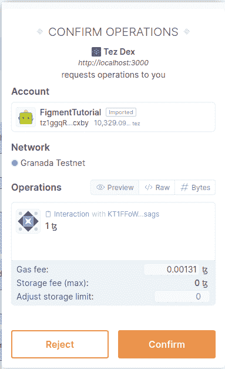
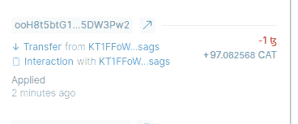

# 介绍

> 原文：<https://github.com/figment-networks/learn-tutorials/blob/master/tezos/tezos-dex-tutorial.md>

在本教程中，我们将创建一个简单的 DEX(分散交换),通过它我们将了解如何编写一个 DEX，以及 DEX 通常是如何工作的。

该 DEX 将使用恒定产品做市算法，并将基于 Uniswap 的 v1。如果您想了解更多关于 Uniswap 的恒定产品做市算法和 v1 的信息，您可以阅读此[白皮书](https://hackmd.io/@HaydenAdams/HJ9jLsfTz)。你也可以参考这个[视频](https://www.youtube.com/watch?v=-6HefvM5vBg)来了解 CPMM 算法。在我们开始编写大量代码之前，您可以从这个资源库中找到完整的源代码:【https://github.com/vivekascoder/tez-dex

# 先决条件

SmartPy、React、Taquito 和智能合约的基本知识。

# 要求

*   [NodeJs](https://nodejs.org/en/) (v14.18.1 或更高版本)
*   [纱线](https://yarnpkg.com/)
*   [寺庙钱包](https://templewallet.com/)

# 项目设置

使用`create-react-app`创建一个空的 React 项目，创建后安装下面的包。

> 注意:对于本教程，我将使用`tailwindcss`来设计组件的样式，但是这一步是完全可选的。你可以使用任何你想要的 UI 库/Css 框架。

1.  Taquito 和 BeconWallet

```js
yarn add @taquito/taquito @taquito/beacon-wallet 
```

2.  Tailwindcss(可选)

```js
yarn add --dev tailwindcss@npm:@tailwindcss/postcss7-compat postcss@^7 autoprefixer@^9 
```

关于用`create-react-app`设置 tailwindcss 的更多信息，你可以在这里阅读[。](https://tailwindcss.com/docs/guides/create-react-app)

安装完依赖项后，在根目录下创建一个名为`./contracts`的文件夹，我们将在其中保存所有的 smartpy 代码。

部署两个 FA1.2 令牌，即 **<g-emoji class="g-emoji" alias="cat" fallback-src="https://github.githubassets.cimg/icons/emoji/unicode/1f431.png">🐱</g-emoji>猫令牌**和 **LP 令牌**，我们将在本教程稍后使用。

# 处理智能合同

## 添加 dex.py

我们将通过在`contracts`目录中创建一个名为`dex.py`的文件来开始我们的智能合约，我们将在这里保存与我们的 DEX 功能相关的所有代码。

创建一个名为`Token`的演示 FA1.2 合同，我们将仅用于测试:

```js
import smartpy as sp
fa12 = sp.io.import_script_from_url("https://smartpy.io/templates/FA1.2.py")

class Token(fa12.FA12):
    """ Test FA1.2 Token """
    pass
```

在同一个文件中创建另一个契约，并将其命名为`Dex`，这将是我们的主 DEX 契约类。

```js
class Dex(sp.Contract):
    def __init__(self, _token_address, _lp_address):
        self.init(
            invariant=sp.nat(0),
            tez_pool=sp.mutez(0),
            token_pool=sp.nat(0),
            token_address=_token_address,
            lp_address=_lp_address,
        )
```

这里，`Dex`契约中的存储由 5 个事物组成，其中不变量表示池的不变量，它等于`tez_pool`和`token_pool`的乘积。`tez_pool`和`token_pool`跟踪我们池中 xtz 和 Cat 令牌的数量，这将用于确定交换令牌时的比率。这里`lp_address`和`token_address`跟踪我们的 LP 令牌和 Cat 令牌的地址，它们在进行合同间调用时使用。

我们现在将创建一些实用函数，用于进行传输，即`transfer_tokens`用于在合同间调用的帮助下将一定数量的令牌从一个地址传输到另一个地址，而`transfer_tez`仅用于将一定数量的 xtz 从地址池传输到特定地址。

```js
def transfer_tokens(self, from_, to, amount):
    """ Utility Function to transfer FA1.2 Tokens."""
    sp.verify(amount > sp.nat(0), 'INSUFFICIENT_TOKENS[transfer_token]')
    transfer_type = sp.TRecord(
        from_=sp.TAddress,
        to_=sp.TAddress,
        value=sp.TNat
    ).layout(("from_ as from", ("to_ as to", "value")))
    transfer_data = sp.record(from_=from_, to_=to, value=amount)
    token_contract = sp.contract(
        transfer_type,
        self.data.token_address,
        "transfer"
    ).open_some()
    sp.transfer(transfer_data, sp.mutez(0), token_contract)

def transfer_tez(self, to_, amount: sp.TMutez):
    """ Utility function to transfer tezos. """
    sp.send(to_, amount, message="SENDING_TEZ")
```

在允许其他人向我们的池提供流动性的同时，我们将不得不根据他们的流动性给予他们一定数量的 **LP 令牌**，为此我们将不得不铸造 LP 令牌，并在用户想要回他们的流动性时烧掉它们。为此，我们将有另外两个实用函数，即`mint_lp`和`burn_lp`，它们主要用于铸造和刻录 LP 令牌。

```js
def mint_lp(self, amount):
    """Mint `amount` LP tokens to `sp.sender` account."""
    transfet_type = sp.TRecord(
        address=sp.TAddress,
        value=sp.TNat,
    )
    transfer_value = sp.record(
        address=sp.sender,
        value=amount,
    )
    contract = sp.contract(
        transfet_type,
        self.data.lp_address,
        'mint'
    ).open_some()
    sp.transfer(transfer_value, sp.mutez(0), contract)

def burn_lp(self, amount):
    """ Burn `amount` LP Tokens. """
    transfet_type = sp.TRecord(
        address=sp.TAddress,
        value=sp.TNat,
    )
    transfer_value = sp.record(
        address=sp.sender,
        value=amount,
    )
    contract = sp.contract(
        transfet_type,
        self.data.lp_address,
        'burn'
    ).open_some()
    sp.transfer(transfer_value, sp.mutez(0), contract)
```

`mint_lp`方法获取要铸造的代币数量，然后它执行一个合同间调用，以与被称为`mint`的`entry_point`签订 LP 代币合同，从而铸造 LP 代币。同样的，`burn_lp`方法需要消耗 LP 令牌的数量。

> 注意:请注意，在这里，我们的 DEX 合同是 LP 令牌合同的管理，这就是为什么它可以铸造和燃烧令牌。

## 初始化 Exchange

现在，我们将致力于一个名为`initialize_exchange`的入口点，它将负责提供池中的初始流动性，并管理令牌和 xtz 之间的初始比率，我们将使用该比率来管理价格。

```js
@sp.entry_point
def initialize_enchange(self, token_amount):
    sp.if ((self.data.token_pool == sp.nat(0)) & (self.data.tez_pool == sp.mutez(0))):
        tez_amount = sp.amount
        sp.verify(token_amount > sp.nat(10), message="NOT_ENOUGH_TOKEN")
        sp.verify((tez_amount > sp.mutez(1)), message="NOT_EMOUGH_TEZ")

        self.data.tez_pool = tez_amount
        self.data.token_pool = token_amount
        self.data.invariant = token_amount * \
            sp.utils.mutez_to_nat(tez_amount)

        self.transfer_tokens(
            from_=sp.sender, 
            to=sp.self_address,
            amount=token_amount
        )
    sp.else:
        sp.failwith('ALREADY_INITIALIZED')
```

这个入口点首先检查 tez 和 token 的总量是否为零，这将限制用户只能在提供初始流动性后才能调用它。

然后我们检查 token amount 和 xtz amount 是否大于 0，然后我们更新`tez_pool`和`token_pool`以及不变量。然后，我们使用我们的实用函数`transfer_tokens`将令牌从用户转移到我们的合同。

## Tez 到令牌交换

现在我们将编写 dex 中最有趣的部分，将 tez 转换成令牌，反之亦然。我们将从 tez 到令牌交换开始，我们将创建一个名为`tez_to_token`的入口点，它将交换发送的 xtz 数量，即`sp.sender`，并根据当前的交换比率将其交换为 Cat 令牌。

在 CPMM 算法中，不变量需要是常数，这意味着`x.y=k`其中 x 和 y 分别代表 xtz 和令牌的数量。现在如果你想把 xtz 换成 token，那么新 xtz 的量会增加让我们称之为`x1`。

且让我们把新的代币金额称为`y1`，那么根据等式`x1.y1=k`。

这意味着池中的新代币数量将为`y1 = k / x1`。这就是我们计算`new_token_pool`的方法。

现在，用户将收到的用于交换他的`x` tez (x 是 mutez)的代币数量将是`token_out = y - y1`。这就是我们如何计算`token_out`。

> 注意:请注意，在将某些 xtz 兑换成代币后，池中的 xtz 数量将增加，代币数量将减少，这就是为什么在计算用户将收到的代币数量时，我们做的是`y - y1`而不是`y1 - y`。

计算完`tokens_out`之后，我们正在更新新的`tez_pool`和`token_pool`以及新的不变量。之后，我们使用我们的实用函数`transfer_tokens`向用户发送`token_out`数量的令牌。

```js
@sp.entry_point
def tez_to_token(self):
    sp.verify(sp.amount > sp.mutez(0), message="NOT_ENOUGH_TEZ")
    tez_in_nat = sp.utils.mutez_to_nat(sp.amount) 
    new_tez_pool = self.data.tez_pool + sp.amount
    new_token_pool = sp.local('new_token_pool', sp.nat(0))
    new_token_pool.value = self.data.invariant / sp.utils.mutez_to_nat(new_tez_pool) 
    token_out = sp.local('token_out', sp.as_nat(self.data.token_pool - new_token_pool.value))
    self.data.tez_pool = new_tez_pool
    self.data.token_pool = new_token_pool.value
    self.data.invariant = self.data.token_pool * sp.utils.mutez_to_nat(self.data.tez_pool)

    sp.if token_out.value > sp.nat(0):
        self.transfer_tokens(
            from_=sp.self_address,
            to=sp.sender, 
            amount=token_out.value
        )
```

## 令牌到 Tez 交换

将令牌交换到 tez 的过程也与我们在 tez 到令牌交换中所做的非常相似。

```js
@sp.entry_point
def token_to_tez(self, params):
    sp.set_type(params, sp.TRecord(token_amount=sp.TNat))
    sp.verify(params.token_amount > sp.nat(0), message="NOT_ENOUGH_TOKEN")
    new_token_pool = self.data.token_pool + params.token_amount
    new_tez_pool = self.data.invariant / new_token_pool
    self.data.tez_pool = sp.utils.nat_to_mutez(new_tez_pool)
    self.data.token_pool = new_token_pool
    self.data.invariant = new_token_pool * new_tez_pool

    self.transfer_tokens(
        from_=sp.sender, 
        to=sp.self_address, 
        amount=params.token_amount
    )

    tez_out = self.data.tez_pool - sp.utils.nat_to_mutez(new_tez_pool)
    self.transfer_tez(to_=sp.sender, amount=tez_out)
```

`self.transfer_tokens`函数将把`token_amount`传送到该合同的地址。`self.transfer_tez`将转移调进泰佐斯。

我们可以通过将用户发送给合同的令牌量与池中先前的令牌量相加来计算`new_token_pool`。我们通过用不变量除以`new_token_amount`来计算 xtz 的新量。

然后我们更新池中的值。

```js
new_token_pool = self.data.token_pool + params.token_amount
new_tez_pool = self.data.invariant / new_token_pool
self.data.tez_pool = sp.utils.nat_to_mutez(new_tez_pool)
self.data.token_pool = new_token_pool
self.data.invariant = new_token_pool * new_tez_pool
```

之后，我们将代币的数量，即`params.token_amount`从发送方转移到我们的合同地址。之后，我们计算代表用户将收到的 xtz(单位为 mutez)数量的`tez_out`。

最后，我们实际上将`tez_out` xtz 从我们的合同转移到发送方。

```js
self.transfer_tokens(
    from_=sp.sender, 
    to=sp.self_address, 
    amount=params.token_amount
)

tez_out = self.data.tez_pool - sp.utils.nat_to_mutez(new_tez_pool)
self.transfer_tez(to_=sp.sender, amount=tez_out)
```

## 投资流动性

我们已经完成了 tez 与代币的交换，反之亦然，但我们需要在合同中添加一种方式，允许其他人向池中添加新的流动性，为此，我们将添加两个入口点，即`invest_liquidty`和`divest_liquidity`，这将允许用户分别向池中添加新的流动性和从池中移除他们的流动性。

在深入研究`invest_liquidity`的代码之前，让我们看看它需要做哪些事情。

1.  检查调用入口点时在事务中发送的 xtz 是否大于 0。
2.  计算资金池的总流动性。
3.  计算我们将接受的代币金额，这是根据当前汇率和发送的 xtz 金额确定的。
4.  根据流动性计算我们必须为用户铸造的 LP 令牌的数量。
5.  铸造所需的 LP 令牌。
6.  更新合同的存储。

```js
@sp.entry_point
def invest_liquidity(self):
    sp.verify(sp.amount > sp.mutez(0), message="NOT_ENOUGH_TOKEN")

    total_liquidity = sp.utils.mutez_to_nat(self.data.tez_pool) + self.data.token_pool
    token_amount = sp.utils.mutez_to_nat(sp.amount) * self.data.token_pool / sp.utils.mutez_to_nat(self.data.tez_pool)
    liquidity_minted = sp.utils.mutez_to_nat(sp.amount) * total_liquidity / sp.utils.mutez_to_nat(self.data.tez_pool)

    self.mint_lp(liquidity_minted)

    self.data.tez_pool += sp.amount
    self.data.token_pool += token_amount
    self.data.invariant = sp.utils.mutez_to_nat(self.data.tez_pool) * self.data.token_pool

    self.transfer_tokens(
        from_=sp.sender, 
        to=sp.self_address, 
        amount=token_amount
    )
```

首先，我们正在计算`total_liquidity`，它是`tez_pool`和`token_pool`的当前值之和。然后，我们根据 token 和 xtz 之间的当前比率，计算我们需要的令牌数量以及发送的 xtz。

```js
sp.verify(sp.amount > sp.mutez(0), message="NOT_ENOUGH_TOKEN")

total_liquidity = sp.utils.mutez_to_nat(self.data.tez_pool) + self.data.token_pool
token_amount = sp.utils.mutez_to_nat(sp.amount) * self.data.token_pool / sp.utils.mutez_to_nat(self.data.tez_pool)
```

然后，我们计算我们必须为流动性提供者创造的流动性数量，这取决于发送到资金池的流动性数量。

之后，我们将使用我们的效用函数`mint_lp`铸造 LP 令牌，然后我们将更新合同的存储。

最后，我们将所需的令牌数量从发件人地址转移到我们的合同地址。

```js
liquidity_minted = sp.utils.mutez_to_nat(sp.amount) * total_liquidity / sp.utils.mutez_to_nat(self.data.tez_pool)

self.mint_lp(liquidity_minted)

self.data.tez_pool += sp.amount
self.data.token_pool += token_amount
self.data.invariant = sp.utils.mutez_to_nat(self.data.tez_pool) * self.data.token_pool

self.transfer_tokens(
    from_=sp.sender, 
    to=sp.self_address, 
    amount=token_amount
)
```

## 剥离流动性

现在，用户可以向我们的池中投资流动性，所以让我们致力于`divest_liquidity`，这将允许流动性提供者收回他们的流动性。

我们的`divest_liquidity`入口点只接受一个参数，即流动性提供者想要烧掉的 LP 令牌的数量，根据这个数量，我们将把流动性还给他们。

```js
@sp.entry_point
def divest_liquidity(self, lp_amount: sp.TNat):
    """ Burn LP and give back the liquidity """
    sp.verify(lp_amount > sp.nat(0), 'INVALID_AMOUNT')
    total_liquidity = sp.utils.mutez_to_nat(self.data.tez_pool) + self.data.token_pool

    tez_out = sp.utils.mutez_to_nat(self.data.tez_pool) * lp_amount / total_liquidity
    token_out = self.data.token_pool * lp_amount / total_liquidity

    self.data.tez_pool = self.data.tez_pool - sp.utils.nat_to_mutez(token_out)
    self.data.token_pool = sp.as_nat(self.data.token_pool - token_out)
    self.data.invariant = self.data.token_pool * sp.utils.mutez_to_nat(self.data.tez_pool)
    self.burn_lp(lp_amount)

    sp.if tez_out > sp.nat(0):
        self.transfer_tez(to_=sp.sender, amount=sp.utils.nat_to_mutez(tez_out))

    sp.if token_out > sp.nat(0):
        self.transfer_tokens(
            from_=sp.self_address,
            to=sp.sender, 
            amount=token_out
        )
    sp.else:
        sp.failwith('NOT_ENOUGH_TOKENS')
```

我们将从验证 LP 令牌的数量开始(需要大于 0)。然后我们计算这个池的总流动性。

现在，根据您正在消耗的 LP 令牌数量，我们正在计算代表流动性提供商将收回的 xtz 和令牌数量的`tez_out`和`token_out`。

```js
sp.verify(lp_amount > sp.nat(0), 'INVALID_AMOUNT')
total_liquidity = sp.utils.mutez_to_nat(self.data.tez_pool) + self.data.token_pool

tez_out = sp.utils.mutez_to_nat(self.data.tez_pool) * lp_amount / total_liquidity
token_out = self.data.token_pool * lp_amount / total_liquidity
```

现在，我们正在更新合同的存储，并使用我们的效用函数发送回流动性。

```js
self.data.tez_pool = self.data.tez_pool - sp.utils.nat_to_mutez(token_out)
self.data.token_pool = sp.as_nat(self.data.token_pool - token_out)
self.data.invariant = self.data.token_pool * sp.utils.mutez_to_nat(self.data.tez_pool)
self.burn_lp(lp_amount)

sp.if tez_out > sp.nat(0):
    self.transfer_tez(to_=sp.sender, amount=sp.utils.nat_to_mutez(tez_out))

sp.if token_out > sp.nat(0):
    self.transfer_tokens(
        from_=sp.self_address,
        to=sp.sender, 
        amount=token_out
    )
sp.else:
    sp.failwith('NOT_ENOUGH_TOKENS')
```

到目前为止，我们已经编码了所有需要的入口点。现在让我们移到前端。要获得完整的源代码，请查看这个库:[https://github.com/vivekascoder/tez-dex](https://github.com/vivekascoder/tez-dex)

# 在前端工作

我们将从在`App.jsx`文件中导入必要的东西开始。

> 注意:为了简单起见，我在`App.jsx`中写了所有的东西，但是你可以按照你喜欢的方式构建你的代码。

让我们导入项目中可能需要的所有必要的东西。这里我们使用`axios`来利用 **tzkt API** 来获取用户的余额。

```js
import React, { useState, useEffect } from "react";
import "./index.css";

import { TezosToolkit } from "@taquito/taquito";
import { BeaconWallet } from "@taquito/beacon-wallet";

import CONFIG from "./config.js";
import axios from "axios";
```

我们这里有一个名为`config.js`的文件，包含地址和其他有关我们合同的信息。

```js
const config = {
  rpcUrl: "https://granadanet.smartpy.io",
  tokenAddress: "KT1HrjGaoTmdZ8Znbup6bgV2gEpFF8tt9jo5",
  tokenDecimals: 10 ** 6,
  tokenBalanceBigMapId: 87342,
  dexAddress: "KT1FFoWsyFH7rJGxogvPRRuu8MwskY6Asags",
  lpTokenAddress: "KT1AEd7ZCSdpZhNNnEwZU9sNFSkib2s7e61f",
  lpDecimals: 10 ** 9,
  lpBalanceBigMapId: 87352,
  preferredNetwork: "granadanet",
};

export default config;
```

我们将在同一个`App.jsx`文件中创建两个独立的 JSX 组件，即负责显示任何消息的`Notification`和显示用户当前拥有的**猫令牌**和 **LP 令牌**的`Balance`。

```
function Notification({ error, setError }) {
  return (
    <div
      className={`fixed bottom-2 left-2 right-2 p-4 text-sm bg-purple-500 text-white shadow-md z-50 
 ${error ? "block" : "hidden"}`}
    >
      <div className="flex items-center space-x-4">
        <button
          onClick={() => {
            setError("");
          }}
        >
          ❎
        </button>
        <p className="flex-1">{error}</p>
      </div>
    </div>
  );
}

function Balances({catToken, lpToken}) {
  return (
    <div className="bg-gray-100 shadow-sm flex items-center justify-center p-4 mb-20 space-x-10">
      <span className="font-semibold text-sm">🐱 Cat Token: {catToken}</span>
      <span className="font-semibold text-sm">💦 LP Token: {lpToken}</span>
    </div>
  );
}
```js

现在，让我们启动主要的`App`组件，并使用 useState 创建一些状态变量，以便在我们的应用程序中创建特定的状态。

1.  `tezos`:跟踪`TezosToolkit`对象。
2.  `wallet`:跟踪用户的地址。
3.  `error`:跟踪将在`Notification`组件中显示的错误消息。
4.  `swapXtzAmount`:跟踪代表交换时要发送的 xtz 数量的输入框。
5.  `swapTokenAmount`:跟踪代表交换时要发送的令牌数量的输入框。
6.  `liquidityXtz`:在向池中添加流动性时，跟踪需要发送的 xtz 的数量。
7.  `lpToBurn`:在调用`divest_liquidity`时，跟踪需要烧录的 LP 令牌的数量。
8.  `lpBalance`:跟踪当前用户的 LP 令牌余额。
9.  `catBalance`:记录用户拥有的猫币数量。

```
function App() {
  const [tezos, setTezos] = useState(null);
  const [wallet, setWallet] = useState(null);
  const [error, setError] = useState("");

  // For the input boxes.
  const [swapXtzAmount, setSwapXtzAmount] = useState(0);
  const [swapTokenAmount, setSwapTokenAmount] = useState(0);
  const [liquidityXtz, setLiquidityXtz] = useState(0);
  const [lpToBurn, setLpToBurn] = useState(0);

  // For showing the balnces.
  const [lpBalance, setLpBalance] = useState(0);
  const [catBalance, setCatBalance] = useState(0);

  return (<div></div>);
}
```js

我们将创建一个实用函数，它可以在`tzkt` API 的帮助下获取用户的令牌余额。

```
async function getBalance(userAddress, bigmapId) {
  const {data} = await axios.get(
    `https://api.granadanet.tzkt.io/v1/bigmaps/${bigmapId}/keys`
  );
  const requiredEl = data.find((el) => {
    return el.key === userAddress;
  })
  if (requiredEl) {
    return parseInt(requiredEl.value.balance);
  } else {
    return 0;
  }
}
```js

我们将有一个函数来更新余额，这样无论何时我们想要更新余额，我们都可以直接通过调用这个方法来完成。

```
async function updateBalances() {
if (tezos) {
    const cat = await getBalance(
    wallet,
    CONFIG.tokenBalanceBigMapId
    );
    setCatBalance(cat);

    const lp = await getBalance(
    wallet,
    CONFIG.lpBalanceBigMapId
    );
    setLpBalance(lp);
    console.log({cat, lp})
}
}
```js

每当`wallet`改变时，让我们利用`useEffect`钩子来更新平衡。

```
useEffect( () => {
  async function runUseEffect () {
    await updateBalances()
    console.log('updates')
  }
  runUseEffect();
}, [wallet])
```js

我们来做一个连接**神庙钱包**的函数。

```
async function connectToWallet() {
  if (!tezos) {
    const t = new TezosToolkit(CONFIG.rpcUrl);
    const wallet = new BeaconWallet({
      name: "Tez Dex",
      preferredNetwork: CONFIG.preferredNetwork,
    });
    await wallet.requestPermissions({
      network: { type: CONFIG.preferredNetwork },
    });
    t.setWalletProvider(wallet);
    const pkh = await t.wallet.pkh();
    setTezos(t);
    setWallet(pkh);
  } else {
    setError("The wallet is already connected.");
  }
}
```js

当用户点击**交换**按钮时，我们将触发这个调用`tez_to_token`入口点的方法。

```
async function exchange() {
  try {
    const dexContract = await tezos.wallet.at(CONFIG.dexAddress);
    if (swapXtzAmount > 0) {
      // Swap Xtz -> Token
      console.log('Tez -> Token')
      const xtz = parseInt(swapXtzAmount * 10 ** 6);

      // Interacting with the entry_point
      const op = await dexContract.methods.tez_to_token().send({amount: xtz, mutez: true});
      setError(`Operation Hash: ${op.opHash}`)
      const result = await op.confirmation();
      console.log(result);
    } 
    else if(swapTokenAmount > 0) {
      console.log('Token-> Tez')
      // Swap Token -> Xtz
      const catAmount = parseInt(swapTokenAmount * CONFIG.tokenDecimals);
      const tokenContract = await tezos.wallet.at(CONFIG.tokenAddress);
      const batch = await tezos.wallet.batch()
      .withContractCall(
        tokenContract.methods.approve(
          CONFIG.dexAddress,
          catAmount,
        )
      )
      .withContractCall(
        dexContract.methods.token_to_tez(catAmount)
      )
      const batchOp = await batch.send();
      console.log("Operation hash:", batchOp.hash);
      setError(`Operation Hash: ${batchOp.hash}`)

      await updateBalances();
    } 
    else {
      setError(`Not a valid Value.`)
    }
  } catch(err) {
    setError(err.message)
  }
}
```js

同样，当用户点击 addLiquidity 表单的 **Add** 按钮时，我们将触发这个方法，调用`invest_liquidity`入口点。

这里需要注意的另一件很酷的事情是，我们还根据发送的 XTZ 数量和当前汇率计算需要批准的 Cat 令牌数量。

```
async function addLiquidity() {
  // Add the liquidity into the dex.
  const dexContract = await tezos.wallet.at(CONFIG.dexAddress);
  const tokenContract = await tezos.wallet.at(CONFIG.tokenAddress);

  const xtz = parseInt(liquidityXtz * 10 ** 6);
  const storage = await dexContract.storage();
  const tezpool = storage['tez_pool'].toNumber();
  const tokenPool = storage['token_pool'].toNumber();
  const tokenNeeded = parseInt(xtz * tokenPool / tezpool);

  const op = await tokenContract.methods.approve(
    CONFIG.dexAddress,
    tokenNeeded
  ).send();
  setError(`Operation Hash: ${op.opHash}`)
  const result = await op.confirmation();
  console.log(result);

  // Interacting with the entry_point
  const anotherOp = await dexContract.methods.invest_liquidity().send({amount: xtz, mutez: true});
  setError(`Operation Hash: ${anotherOp.opHash}`)
  const anotherResult = await anotherOp.confirmation();
  console.log(anotherResult);

  await updateBalances();
}
```js

现在，我们将创建一个方法，当用户点击 **Remove** 按钮并调用带有需要烧录的 LP 令牌数量的`divest_liquidity`入口点时，该方法将被触发。

```
async function removeLiquidity() {
  const lp = parseInt(lpToBurn * 10 ** 6);
  const dexContract = await tezos.wallet.at(CONFIG.dexAddress);

  // Remove the liquidity from the dex based on the amount of the LP Token burn.
  const op = await dexContract.methods.divest_liquidity(lp).send();
  setError(`Operation Hash: ${op.opHash}`)
  const result = await op.confirmation();
  console.log(result);

  await updateBalances();
}
```js

让我们在一些 HTML 和 tailwindcss 实用程序类的帮助下，开始编写实际的 UI。这里你可以看到我们正在有条件地渲染`Notification`组件，如果`error`有值，它会显示一个小弹出窗口。

之后，我们还要渲染`Balance`组件。

```
<div className="max-w-2xl mx-auto relative min-h-screen">
  {error ? <Notification error={error} setError={setError} /> : ""}
  <nav className="bg-gray-100 shadow-sm flex items-center justify-between p-4 mb-20">
    <h1 className="text-lg font-semibold">⚔️ Tez Dex</h1>
    <div className="flex space-x-3 items-center">
      <button className={btnClass} onClick={connectToWallet}>
        {wallet
          ? `${wallet.slice(0, 5)}...${wallet.slice(32, 36)}`
          : "💳️ Connect"}
      </button>
    </div>
  </nav>

  <Balances 
    catToken={catBalance / CONFIG.tokenDecimals}
    lpToken={lpBalance / CONFIG.lpDecimals}
  />
</div>
```js

之后，让我们开始为我们想要调用的不同动作编写一些表单，所有的表单都是相似的。

```
return (
    <div className="max-w-2xl mx-auto relative min-h-screen">
      {error ? <Notification error={error} setError={setError} /> : ""}
      <nav className="bg-gray-100 shadow-sm flex items-center justify-between p-4 mb-20">
        <h1 className="text-lg font-semibold">⚔️ Tez Dex</h1>
        <div className="flex space-x-3 items-center">
          <button className={btnClass} onClick={connectToWallet}>
            {wallet
              ? `${wallet.slice(0, 5)}...${wallet.slice(32, 36)}`
              : "💳️ Connect"}
          </button>
        </div>
      </nav>

      <Balances 
        catToken={catBalance / CONFIG.tokenDecimals}
        lpToken={lpBalance / CONFIG.lpDecimals}
      />
      <div className="m-2 p-4 bg-gray-200">
        <p className="text-xs text-gray-500">⚔️ Tez Dex / Exchange</p>
        <form
          className="space-y-4 mt-4"
          onSubmit={(e) => {
            e.preventDefault();
            exchange();
          }}
        >
          <input
            type="number"
            placeholder="Amount of XTZ"
            name="tez"
            className="block text-sm w-full"
            value={swapXtzAmount}
            onChange={(e) => {setSwapXtzAmount(e.target.value);}}
          />
          <input
            type="number"
            placeholder="Amount of Token"
            name="token"
            className="block text-sm w-full"
            value={swapTokenAmount}
            onChange={(e) => {setSwapTokenAmount(e.target.value);}}
          />
          <button
            className={btnClass}
          >
            🔃 Swap
          </button>
        </form>
      </div>

      <div className="m-2 p-4 bg-gray-200">
        <p className="text-xs text-gray-500">⚔️ Tez Dex / Add Liquidity</p>
        <form className="space-y-4 mt-4" onSubmit={(e) => {e.preventDefault(); addLiquidity();}}>
          <div className="flex space-x-2">
            <input
              type="number"
              placeholder="Amount of XTZ"
              name="tez"
              className="text-sm w-full flex-1"
              value={liquidityXtz} 
              onChange={(e) => {setLiquidityXtz(e.target.value)}}
            />
            <button className={btnClass}>💦 Add</button>
          </div>
        </form>
      </div>

      <div className="m-2 p-4 bg-gray-200">
        <p className="text-xs text-gray-500">⚔️ Tez Dex / Remove Liquidity</p>
        <form className="space-y-4 mt-4" onSubmit={(e) => {e.preventDefault(); removeLiquidity();}}>
          <div className="flex space-x-2">
            <input
              type="number"
              placeholder="Amount of LP Tokens to burn"
              name="tez"
              className="text-sm w-full flex-1"
              value={lpToBurn} 
              onChange={(e) => {setLpToBurn(e.target.value)}}
            />
            <button className={btnClass}>🔥 Remove</button>
          </div>
        </form>
      </div>

      <p className="absolute bottom-2 right-2 text-xs font-semibold">
        Coded by{" "}
        <a href="https://github.com/vivekascoder" className="text-blue-500">
          @vivekascoder
        </a>
      </p>
    </div>
  );
```

您可以使用命令`yarn start`启动 React 项目。然后打开你的网络浏览器到`http://localhost:3000`，你会看到类似下图的东西:

[](https://camo.githubusercontent.com/21c213a5a7723fb8f8b8df63e29ed8599a353b097c0c3c7a2b8e28665e547112/68747470733a2f2f692e696d6775722e636f6d2f5149456c4e375a5f642e776562703f6d617877696474683d37363026666964656c6974793d6772616e64)

## 把 Tez 换成 token。

在 xtz 中输入一些金额(比如说 1)后，单击交换按钮。

[](https://camo.githubusercontent.com/b780126ffd4781884a021c761f3d901e1e2086a846b147c58b83cbaa45aa64fa/68747470733a2f2f692e696d6775722e636f6d2f47554773706a4d2e706e67)

您可以看到，根据当前比率，兑换 1 枚 tez 后，我们将获得大约 97 枚 cat token。[](https://camo.githubusercontent.com/8fe17594e3d69caaf9c6df3a54cb3dd54fd2d0424f868306d2c6d4c8ed063e4a/68747470733a2f2f692e696d6775722e636f6d2f346c48636b55532e706e67)

# 关于作者

我是 Vivek Kumar，你可以在我的 GitHub 个人资料中找到更多关于我的信息[！](https://github.com/vivekascoder)

# 参考

1.  [Uniswap v1 白皮书](https://hackmd.io/@HaydenAdams/HJ9jLsfTz)
2.  [讲解 DEX 的视频](https://hackmd.io/@HaydenAdams/HJ9jLsfTz)