# 介绍

> 原文：<https://github.com/figment-networks/learn-tutorials/blob/master/tezos/tezos-mint-fungible-tokens.md>

本教程解释了如何在泰佐斯区块链上铸造可替换的代币。在本教程中，我们将在 SmartPy 中编写一个智能合同，并将其部署在 Granadanet 上，将令牌元数据上传到 IPFS，然后使用 better-call.dev 创建令牌。我们还将介绍如何使用 React 和 taquito 创建令牌。

# 先决条件

*   smarty 的基础知识
*   功能组件和反应钩子的基本知识(主要是使用状态)

# 要求

*   安装在您浏览器中的 Temple Wallet。从[https://templewallet.com/](https://templewallet.com/)得到它
*   你的钱包账户里需要一些格兰纳达测试网上的 xtz。要得到它们，你可以参考本教程[中的水龙头和太阳穴钱包部分。](https://learn.figment.io/tutorials/using-the-smartpy-ide-to-deploy-tezos-smart-contracts#faucet-and-temple-wallet)。
*   [NodeJS](https://nodejs.org/en/download/) v14 LTS 或更高版本，安装了 npm
*   安装了 git

# 自作聪明的人

SmartPy 是 Tezos 的一个直观而强大的智能合约开发平台。它为构建和分析 Tezos 智能合约提供了一个 Python 库。使用 SmartPy IDE，我们可以在浏览器中快速编写代码。我们也可以从浏览器部署我们的代码。不需要本地设置。所以，让我们开始吧！打开[https://smartpy.io/ide](https://smartpy.io/ide)

[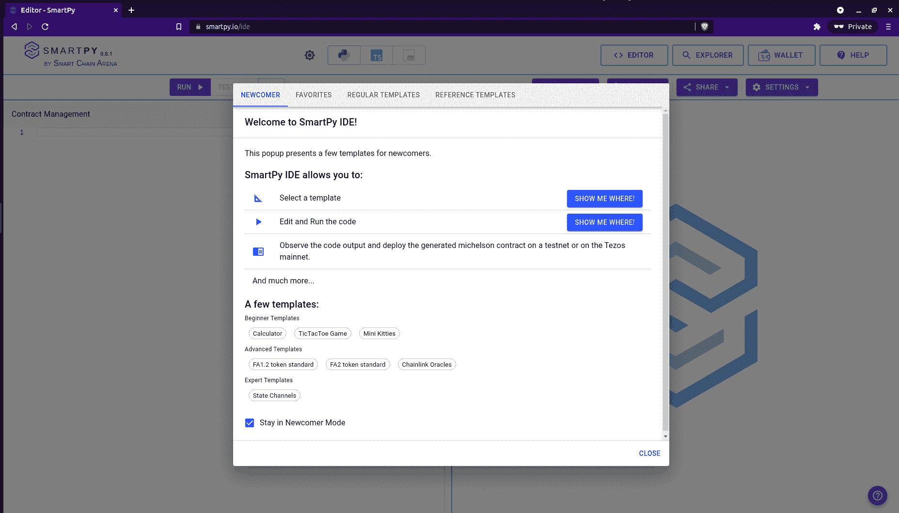](https://github.com/figment-networks/learn-tutorials/raw/master/assets/mint_smartpy_1.png)

您可以探索并查看给出的模板代码。
要移动到编辑器，单击关闭。

# 代币合同与 FA2 标准

左边的面板是我们将要编码的地方。我们的令牌将遵循 FA2 令牌标准( [TZIP-12](https://tzip.tezosagora.org/proposal/tzip-12/) )。

首先，我们将导入 SmartPy 库。

```js
import smartpy as sp
```

现在我们将导入 FA2 模板。我们需要的大多数功能(薄荷，转移)已经在这个模板中实现。

```js
FA2 = sp.io.import_template("FA2.py")
```

我们可以使用这个模板，并在令牌类中继承它。由于本教程所需的入口点已经在模板中，我们不需要更改类，只需传递它即可。这将是我们的合同。

```js
class Token(FA2.FA2):
    pass
```

让我们为我们的合同写一些测试。

我们需要一些账户进行测试；让我们添加两个测试帐户，Tom 和 Jerry。我们还需要为我们的合同设置一个管理员。对于 admin，您可以使用一个测试帐户，稍后在部署时从 storage JSON 将您的地址设置为 admin，但我更喜欢将其放在测试本身中。

```js
@sp.add_test(name="tests")
def test():
    jerry = sp.test_account("Jerry")
    tom = sp.test_account("Tom")
    admin = sp.address("tz1aV2DuPYXEK2mEVc4VBhP9o4gguFGxBky4")
```

将传递给`sp.address`的地址更改为您的地址(您的钱包帐户公钥)。

我们需要创建`test_scenario`，并使用`scenario.h1`为其指定一个标题。

```js
    scenario = sp.test_scenario()
    scenario.h1("tutorial tests")
```

现在我们将开始我们的代币合同。当我们继承`FA2`模板时，我们需要理解需要什么参数，这样我们就可以根据需要改变它们。我们需要发送配置，管理和元数据到我们的合同。

`FA2`模板为我们提供了`FA2_config`，我们将使用它来配置令牌的行为。有多种选择，但我们需要的是`single_asset`和`non_fungible`。因为我们希望我们的令牌是可替换的，我们将设置`non_fungible`为假。我们只希望令牌是一种类型，为此我们将设置`single_asset`为真。

对于管理员，我们传递我们创建的管理员地址。
对于元数据，我们将使用`big_map`，其中我们设置从哪里寻找元数据——从`tezos-storage:content`。我们知道我们需要在存储中查找内容，我们将把元数据定义为名称和描述。

合同元数据的详细信息，请参见 [TZIP-16](https://tzip.tezosagora.org/proposal/tzip-16/) 。

```js
    token = Token(FA2.FA2_config(single_asset=True), admin=admin, metadata= sp.big_map({"": sp.utils.bytes_of_string("tezos-storage:content"),"content": sp.utils.bytes_of_string("""{"name": "Tutorial Contract", "description": "Fungible Token contract for the tutorial"}""")}))
```

将令牌添加到场景中。

```js
    scenario += token
```

测试 mint 入口点。我们向 mint 入口点发送三个参数。

*   `token_id`:令牌 id 必须始终为 0，作为 single_asset。
*   `address`:我们要把令牌铸造到的地址。
*   对于令牌元数据，我们使用 IPFS(将在本教程稍后介绍)。元数据存储在一个`map(string, bytes)`中，因此，我们需要将字符串转换成使用`sp.utils.bytes_of_string`的 IPFS。
    现在，使用相同的 IPFS URL(ipfs://bafkreirfve 4 w 57 gccc 546 mnhdzxoyjfcse 2 pajplxsqe 5 u 3 fjnclaakloi)

在这里，我们铸造了一枚给杰瑞的代币和十枚给汤姆的代币。记住，只有管理员可以运行 mint 查询。

```js
    token.mint(token_id=0, address=jerry.address, amount=1, metadata = sp.map({"": sp.utils.bytes_of_string("ipfs://bafkreifrve4w57gccc546mnhdzxoyjfcse2pajplxsqe5u3fjnclaakloi")})).run(sender=admin)
    token.mint(token_id=0, address=tom.address, amount=10, metadata = sp.map({"": sp.utils.bytes_of_string("ipfs://bafkreifrve4w57gccc546mnhdzxoyjfcse2pajplxsqe5u3fjnclaakloi")})).run(sender=admin)
```

让我们也测试一下传输入口点。对于转移，我们将使用 FA2 标准中定义的`batchtransfer`助手。它将采用`from_`和`txs`参数。`txs`是包含`to_`、`amount`和`token_id`的事务数组。

在这里，我们从汤姆向杰里发送 2 个令牌。

```js
    token.transfer([
        token.batch_transfer.item(
            from_ = tom.address,
            txs = [
                sp.record(to_=jerry.address, amount=2, token_id=0)
            ])
    ]).run(sender = admin)
```

为了检查传输是否正常，还要输出存储在令牌存储中的数据:

```js
    scenario.show(token.data)
```

我们的合同到此为止。以下是您可以参考的完整代码:

```js
import smartpy as sp
FA2 = sp.io.import_template("FA2.py")

class Token(FA2.FA2):
    pass

@sp.add_test(name="tests")
def test():
    jerry = sp.test_account("Jerry")
    tom = sp.test_account("Tom")
    admin = sp.address("tz1aV2DuPYXEK2mEVc4VBhP9o4gguFGxBky4")
    scenario = sp.test_scenario()
    scenario.h1("tutorial tests")
    token = Token(FA2.FA2_config(single_asset=True), admin=admin, metadata= sp.big_map({"": sp.utils.bytes_of_string("tezos-storage:content"),"content": sp.utils.bytes_of_string("""{"name": "Tutorial Contract", "description": "Fungible Token contract for the tutorial"}""")}))
    scenario += token
    token.mint(token_id=0, address=jerry.address, amount=1, metadata = sp.map({"": sp.utils.bytes_of_string("ipfs://bafkreifrve4w57gccc546mnhdzxoyjfcse2pajplxsqe5u3fjnclaakloi")})).run(sender=admin)
    token.mint(token_id=0, address=tom.address, amount=10, metadata = sp.map({"": sp.utils.bytes_of_string("ipfs://bafkreifrve4w57gccc546mnhdzxoyjfcse2pajplxsqe5u3fjnclaakloi")})).run(sender=admin)

    token.transfer([
        token.batch_transfer.item(
            from_ = tom.address,
            txs = [
                sp.record(to_=jerry.address, amount=2, token_id=0)
            ])
    ]).run(sender = admin)

    scenario.show(token.data)
```

使用左侧(编辑器)面板上方的 Run 按钮在 SmartPy 中运行代码。您也可以在 Windows 上使用 CTRL+Enter，或者在 macOS 上使用 CMD+Enter。

[](https://github.com/figment-networks/learn-tutorials/raw/master/assets/fungible_smartpy_run.png)

如果没有错误，我们将在正确的终端中获得输出。
我们可以根据定义的测试进行检查。我们将测试中的标题`h1`定义为“教程测试”，所以我们可以在顶部看到它。然后，我们在杰里的地址上铸造了一枚代币，在汤姆的地址上铸造了十枚代币；我们也可以看到。然后是转移，我们把两个代币从汤姆转移到杰里。所以这看起来很完美，我们的合同运行正常。

[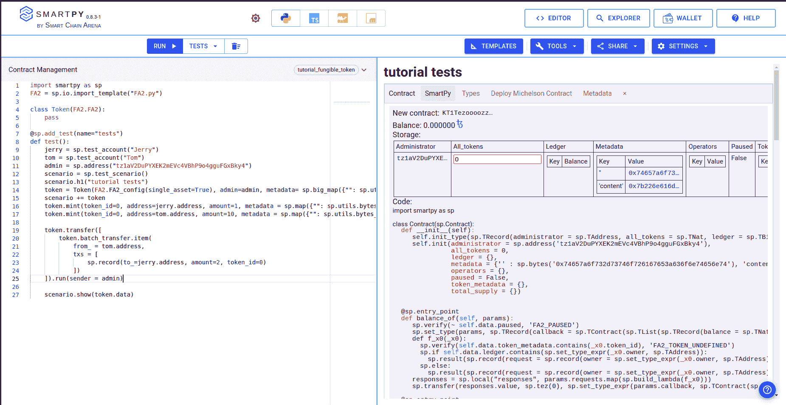](https://github.com/figment-networks/learn-tutorials/raw/master/assets/fungible_smartpy_output.png)

最后，契约存储显示 Tom 的地址中有八个令牌，Jerry 的地址中有三个令牌，根据我们的测试，这是正确的。

[](https://github.com/figment-networks/learn-tutorials/raw/master/assets/fungible_smartpy_storage.png)

# 部署合同

是时候部署这个合同了。对于本教程，我们将在 Granada testnet 上部署合同。我们可以使用 Smartpy IDE 本身来部署契约。运行测试后，我们在输出面板中获得了部署 Michelson 契约的选项。

单击“部署 Michelson 合同”按钮。

[](https://github.com/figment-networks/learn-tutorials/raw/master/assets/fungible_smartpy_deployButton.png)

将会打开一个新标签页。

[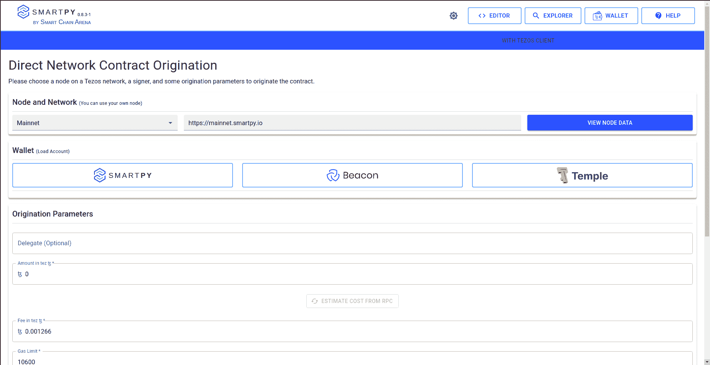](https://github.com/figment-networks/learn-tutorials/raw/master/assets/fungible_smartpy_originate.png)

在节点中选择 Granadanet。现在点击寺庙钱包。选择一个帐户(如果您有多个帐户)。然后按连接。

满载成功的账户将会到来。[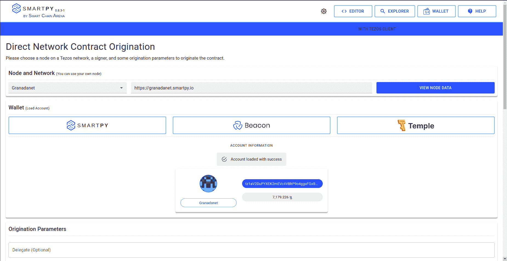](https://github.com/figment-networks/learn-tutorials/raw/master/assets/fungible_smartpy_loaded.png)

向下滚动并单击“从 RPC 估算成本”。会刷新成本。之后，单击“部署合同”按钮。[](https://github.com/figment-networks/learn-tutorials/raw/master/assets/fungible_smartpy_estimate.png)

接受预签名信息。

然后你的钱包弹出窗口就会出现。按下标志。

将显示成功生成的合同。复制合同地址(kt 1 vuvsqdzdberbnfdhwjti 8 txs cas 5 yexi)并保存。

[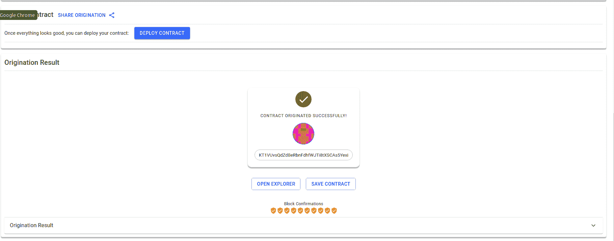](https://github.com/figment-networks/learn-tutorials/raw/master/assets/fungible_smartpy_deployed.png)

万岁，我们成功部署了我们的合同。

# IPFS 吗

IPFS 是一个分布式系统，用于存储和访问文件、网站、应用程序和数据。此外，我们将使用 IPFS 来存储令牌的元数据。为了将我们的文件上传到 IPFS，我们将使用 nft.storage.
在本教程中，我们将把 JSON 格式的令牌元数据上传到 IPFS。

对于令牌元数据，根据 FA2 标准,“小数”是必填字段。强烈建议使用名称和符号字段。还可以使用其他字段。你可以在 Tezos 改进提案 [TZIP-21](https://tzip.tezosagora.org/proposal/tzip-21/) 中读到所有这些的细节。
我们将把元数据存储在一个 JSON 文件中。创建`token.json`并在你选择的任何编辑器中打开它。

```js
{
  "name": "Tutorial Token",
  "symbol": "TUT",
  "decimals": 0,
  "shouldPreferSymbol": true
}
```

根据需要编辑名称、符号、小数和 shouldPreferSymbol。如果 shouldPreferSymbol 设置为 true，则在索引器、钱包中，符号优先于名称。

所以要上传文件，请访问 [nft.storage](https://nft.storage/) 。

[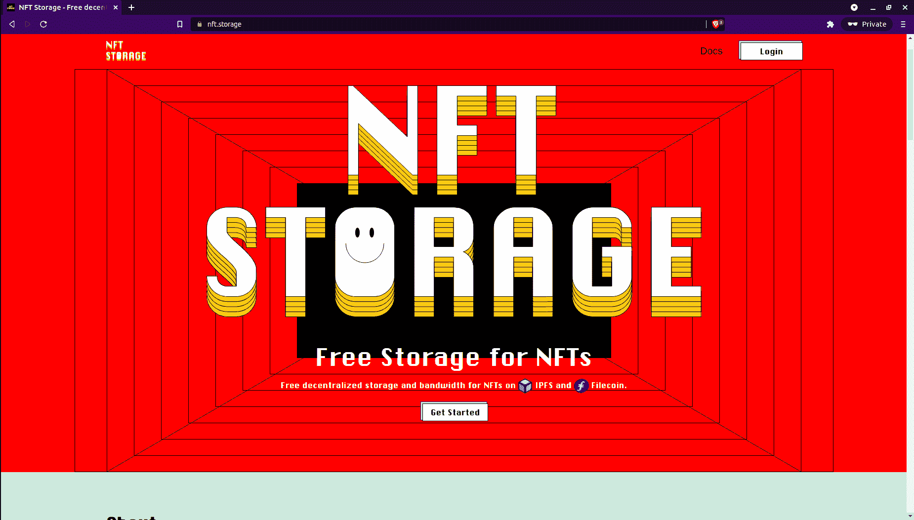](https://github.com/figment-networks/learn-tutorials/raw/master/assets/mint_ipfs_1.png)

登录并点击上传，选择`token.json`并上传。

[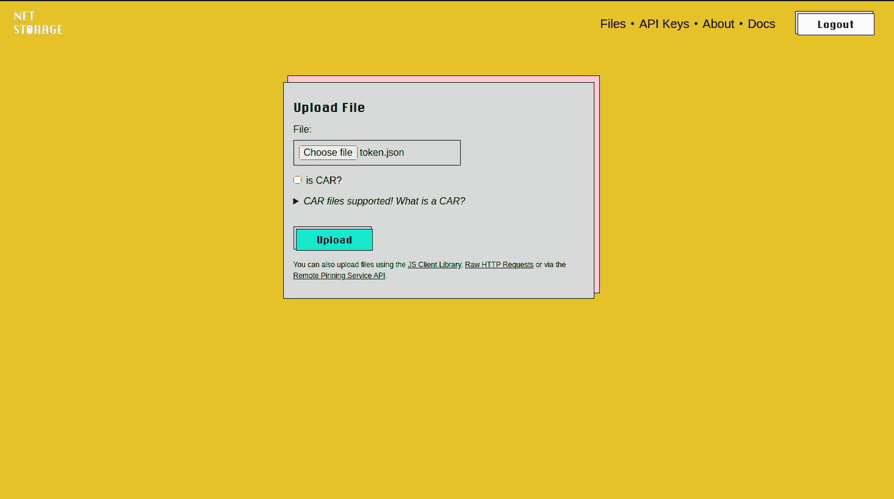](https://github.com/figment-networks/learn-tutorials/raw/master/assets/fungible_ipfs_upload.png)

现在上传。文件将被上传，这是你的散列。

[](https://github.com/figment-networks/learn-tutorials/raw/master/assets/fungible_ipfs_hash.png)

您可以访问 ipfs://{hash}来查看您的文件-如果您的浏览器不支持 ipfs，您可以使用[https://ipfs.io/ipfs/{hash}](https://ipfs.io/ipfs/%7Bhash%7D)

# Mint 使用 better-call.dev

是时候铸造我们的信物了。打开 [better-call.dev](https://better-call.dev/) 。

移动到交互标签，从右边栏打开 mint。把你想要铸造代币的数量和地址放进去。`token_id`应该是 0，因为我们的合同是`single_asset`。对于元数据，我们将获取上面上传的`token.json`文件的散列，并使用 ipfs://{hash}来设置令牌元数据。但是对于令牌元数据，ipfs URL 需要以字节为单位。你可以把字符串从[转换成字节，这里是](https://tutorial-mint-nfts.vercel.app/char2bytes)。

[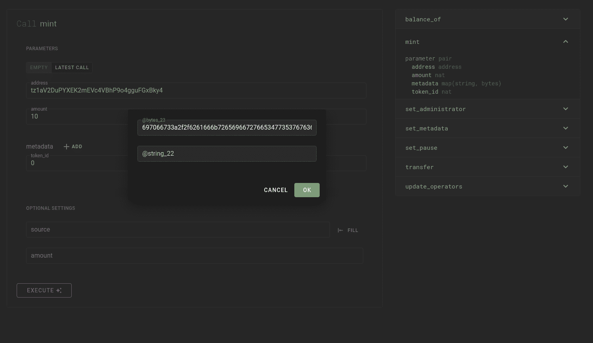](https://github.com/figment-networks/learn-tutorials/raw/master/assets/fungible_bcd_bytes.png)

按执行并选择钱包选项。从钱包列表中选择 temple 钱包。然后使用合同中设置为 admin 的帐户。这很重要；我们不能用其他地址造币。只有管理员可以根据我们的智能合同铸币。

[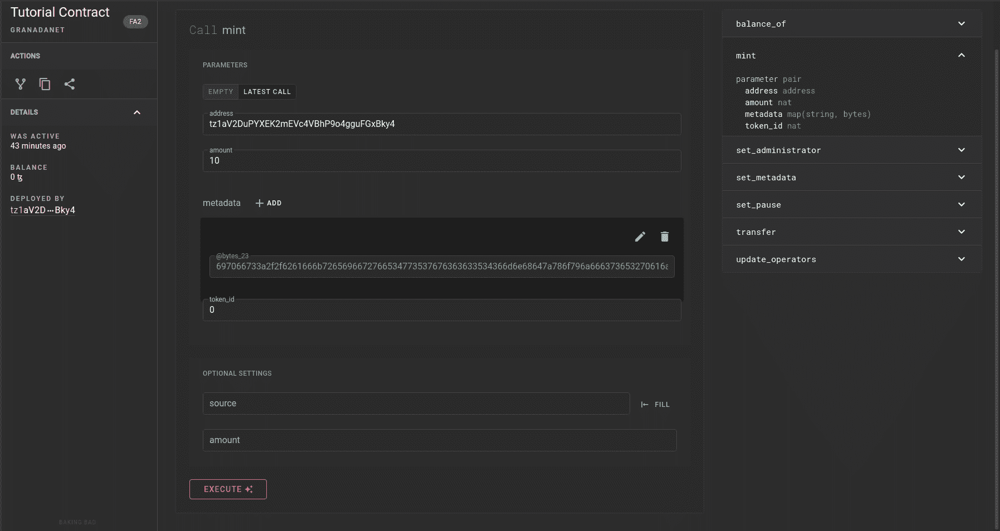](https://github.com/figment-networks/learn-tutorials/raw/master/assets/fungible_bcd_mint.png)

您可以查看费用，也可以探索钱包将要发送的操作。然后单击确认。

[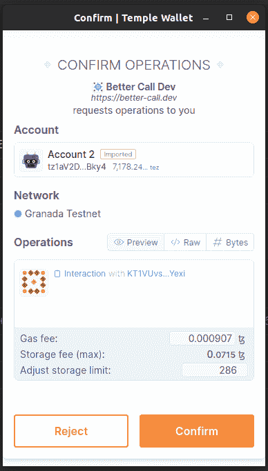](https://github.com/figment-networks/learn-tutorials/raw/master/assets/fungible_bcd_temple.png)

如果成功发送，消息就会到达。

[](https://github.com/figment-networks/learn-tutorials/raw/master/assets/fungible_bcd_successful.png)

几秒钟后，刷新并转到操作选项卡。你可以看到造币厂的运作。

[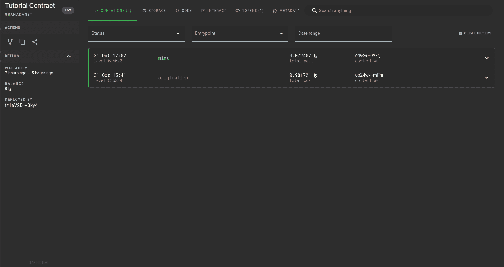](https://github.com/figment-networks/learn-tutorials/raw/master/assets/fungible_bcd_operations.png)

您可以在令牌部分查看令牌的元数据。

[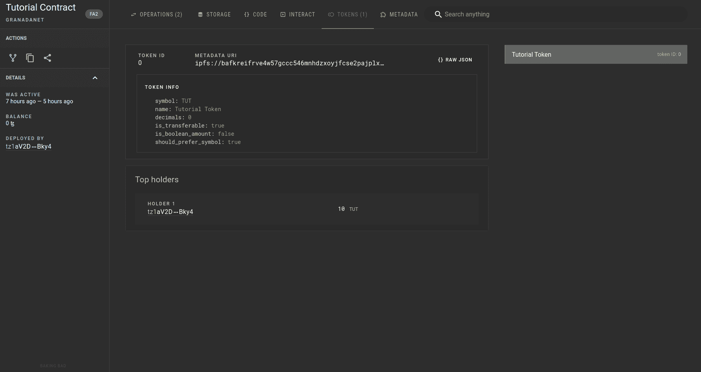](https://github.com/figment-networks/learn-tutorials/raw/master/assets/fungible_bcd_tokens.png)

万岁，我们铸造了我们的令牌。

# 前端

使用下面的命令导入这个样板代码。

```js
git clone -b boilerplate --single-branch https://github.com/PriyanshuDangi/Tutorial_Fungible_Tokens.git 
```

进入由`git clone`命令创建的目录:

```js
cd Tutorial_Fungible_Tokens 
```

安装所有依赖项

```js
npm i 
```

尝试使用运行应用程序

```js
npm start 
```

并访问 localhost:3000 查看应用程序。截至目前还不多，我们来建吧。

样板文件有一个文件夹结构和两个页面。

*   铸造(铸造代币的形式)
*   转移(转移代币的表格)

打开`src/config/config.js`。这是我们存储配置的地方。

```js
export const NAME = 'Tutorial'; // the name of the app
export const CONTRACT_ADDRESS = 'KT1VUvsQdZdBeRbnFdhfWJTi8tXSCAs5Yexi';
export const RPC_URL = 'https://granadanet.smartpy.io'; // network rpc url
export const NETWORK = 'granadanet';
```

相应地更改名称和合同地址，当我们部署到 Granada Testnet 时，我们正在使用该网络。如果部署在任何其他网络上，可以相应地进行更改。

让我们导入 TezosToolkit 和 beacon SDK，我们将使用它们来连接钱包。我们还需要从 Taquito 实用程序中导入我们的配置对象和 char2Bytes。

```js
import {TezosToolkit, MichelsonMap} from '@taquito/taquito';
import {BeaconWallet} from '@taquito/beacon-wallet';
import * as config from '../config/config';
import {char2Bytes} from '@taquito/utils';
```

接下来，我们将配置信标 wallet 选项并设置 wallet 提供者。

```js
const Tezos = new TezosToolkit(config.RPC_URL);

const options = {
  name: config.NAME,
  iconUrl: 'https://tezostaquito.io/img/favicon.png',
  preferredNetwork: config.NETWORK,
};

const wallet = new BeaconWallet(options);

Tezos.setWalletProvider(wallet);
```

接下来，我们将编写连接钱包(请求用户许可)和断开钱包的函数。

```js
const connectWallet = async () => {
  await wallet.requestPermissions({
    network: {
      type: config.NETWORK,
    },
  });
  return wallet;
};

const disconnectWallet = async () => {
  await wallet.clearActiveAccount();
};
```

要获得用户的公钥散列(pkh)并获得合同，请使用以下函数。

```js
const getPKH = async () => {
  const pkh = await wallet.getPKH();
  return pkh;
};

const getContract = async () => {
  const contract = await Tezos.wallet.at(config.CONTRACT_ADDRESS);
  return contract;
};
```

现在要铸造令牌，我们需要用户连接他们的钱包，然后签署铸造方法。使用我们上面上传的`token.json`的 IPFS 网址。

```js
const mint = async (address, amount) => {
  await disconnectWallet();
  await connectWallet();
  const token_id = 0;
  let url = 'ipfs://bafkreifrve4w57gccc546mnhdzxoyjfcse2pajplxsqe5u3fjnclaakloi';
  const contract = await getContract();
  url = char2Bytes(url);
  const op = await contract.methods.mint(address, amount, MichelsonMap.fromLiteral({'': url}), token_id).send();
  return await op.confirmation(3);
};
```

对于转账功能，我们需要用户连接他们的钱包并签署转账方法。

```js
const transfer = async (address, transactions) => {
  await disconnectWallet();
  await connectWallet();
  const token_id = 0;
  const txs = transactions.map((transaction) => {
    return {
      to_: transaction.to,
      amount: transaction.amount,
      token_id: token_id,
    };
  });
  const contract = await getContract();
  const op = await contract.methods
    .transfer([
      {
        from_: address,
        txs: txs,
      },
    ])
    .send();
  return await op.confirmation(3);
};
```

记得在最后从文件中导出`mint`和`transfer`函数。

```js
export {mint, transfer};
```

这是我们的`src/utils/wallet.js`。

现在我们已经完成了这些实用程序，我们可以编写页面来使用这些实用程序。

让我们从我们的`src/components/mint/Mint.jsx`开始(去掉已经存在的代码)。
让我们先导入 React、useState 和我们的 mint util。

```js
import React, {useState} from 'react';

import {mint} from '../../utils/wallet';
```

现在我们将使用 React 挂钩`useState`设置初始应用程序状态:

```js
const Mint = () => {
  const [loading, setLoading] = useState(false);
  const [message, setMessage] = useState('');
```

在我们的提交函数中，我们从输入字段中获取地址和金额，然后调用 mint util。

```js
const submit = async (event) => {
  try {
    event.preventDefault();
    setLoading(true);
    const address = event.target.address.value;
    const amount = event.target.amount.value;

    const op = await mint(address, amount);

    console.log(op);
    setMessage('Minted Successfully!');

    setLoading(false);
  } catch (err) {
    console.log(err);
    setLoading(false);
    setMessage('Error: Not Able to Mint');
  }
};
```

为了结束祝酒词，我们将消息设置为空。

```js
const closeMessage = () => {
  setMessage('');
};
```

这是我们的页面代码。

```js
  return (
    <div className="container">
      {message && (
        <div className="position-fixed top-0 end-0 p-3" style={{zIndex: 11}}>
          <div id="liveToast" className="toast fade show d-flex" role="alert" aria-live="assertive" aria-atomic="true">
            <div className="toast-body">{message}</div>
            <button type="button" className="btn-close me-2 m-auto" onClick={closeMessage}></button>
          </div>
        </div>
      )}
      <form onSubmit={submit}>
        <div className="mb-3">
          <label htmlFor="address" className="form-label">
            Address
          </label>
          <input type="text" className="form-control" id="address" aria-describedby="address" required />
        </div>
        <div className="mb-3">
          <label htmlFor="amount" className="form-label">
            Amount
          </label>
          <input type="number" className="form-control" id="amount" aria-describedby="amount" required min="1" step="1" />
        </div>
        <button type="submit" className="btn btn-primary" disabled={loading}>
          {loading && <span className="spinner-border spinner-border-sm" role="status" aria-hidden="true"></span>}
          Mint
        </button>
      </form>
    </div>
  );
};

export default Mint;
```

记住导出`Mint`组件作为默认导出。

现在在`src/components/transfer/Transfer.jsx`中制作传输组件(删除已经存在的代码)。它将大部分与薄荷成分相同，只有轻微的变化。让我们先导入 React、useState 和我们的 transfer util:

```js
import React, {useState} from 'react';

import {transfer} from '../../utils/wallet';
```

现在我们将使用 React 挂钩`useState`设置初始应用程序状态:

```js
const Transfer = () => {
  const [loading, setLoading] = useState(false);
  const [message, setMessage] = useState('');
```

在我们的`submit`函数中，我们从输入字段中获取地址 amount to，然后调用 transfer util。这里我们只向一个帐户转账，但是可以向 transactions 数组中添加更多的转账。

```js
const submit = async (event) => {
  try {
    event.preventDefault();
    setLoading(true);
    const address = event.target.address.value;
    const to = event.target.to.value;
    const amount = event.target.amount.value;

    const transactions = [
      {
        to,
        amount,
      },
    ];

    const op = await transfer(address, transactions);

    console.log(op);
    setMessage('Transfered Successfully!');

    setLoading(false);
  } catch (err) {
    console.log(err);
    setLoading(false);
    setMessage('Error: Not Able to Transfer');
  }
};
```

和 Mint 中一样，为了关闭 toast，我们将消息设置为空。

```js
const closeMessage = () => {
  setMessage('');
};
```

这是我们的页面代码。

```js
  return (
    <div className="container">
      {message && (
        <div className="position-fixed top-0 end-0 p-3" style={{zIndex: 11}}>
          <div id="liveToast" className="toast fade show d-flex" role="alert" aria-live="assertive" aria-atomic="true">
            <div className="toast-body">{message}</div>
            <button type="button" className="btn-close me-2 m-auto" onClick={closeMessage}></button>
          </div>
        </div>
      )}
      <form onSubmit={submit}>
        <div className="mb-3">
          <label htmlFor="address" className="form-label">
            From
          </label>
          <input type="text" className="form-control" id="address" aria-describedby="address" required />
        </div>
        <div>
          <div className="mb-3">
            <div className="mb-3">
              <label htmlFor="to" className="form-label">
                To
              </label>
              <input type="text" className="form-control" id="to" aria-describedby="to" required />
            </div>
            <label htmlFor="amount" className="form-label">
              Amount
            </label>
            <input
              type="number"
              className="form-control"
              id="amount"
              aria-describedby="amount"
              required
              min="1"
              step="1"
            />
          </div>
        </div>
        <button type="submit" className="btn btn-primary" disabled={loading}>
          {loading && <span className="spinner-border spinner-border-sm" role="status" aria-hidden="true"></span>}
          Transfer
        </button>
      </form>
    </div>
  );
};

export default Transfer;
```

它有一个表单，其中有`From`、`To`和`Amount`输入字段，`Transfer`按钮提交表单。最后，我们关闭传递函数并默认导出它。

要启动服务器以便您可以在 web 浏览器中查看应用程序，请运行终端命令:

```js
npm start 
```

打开浏览器，导航到 locah host:3000。现在，您可以从默认页面路由`/`铸造令牌，并在`/transfer`路由上传输令牌。

我们完成了前端。你可以在 [Github](https://github.com/PriyanshuDangi/Tutorial_Fungible_Tokens) 上查看完整的代码。

# 结论

在本教程中，我们学习了如何在 SmartPy 中进行编码、在区块链上部署合同以及使用 better-call.dev 与合同进行交互。我们还使用 React 构建了前端，并学习了如何使用 taquito 进行交互。

最重要的是，我们学会了如何在 Tezos 上铸造和转让可替换的代币。

# 关于作者

本教程由 Priyanshu Dangi 撰写，他是 Tezos India 2.0 研究员。你可以在 Github 上联系到他。