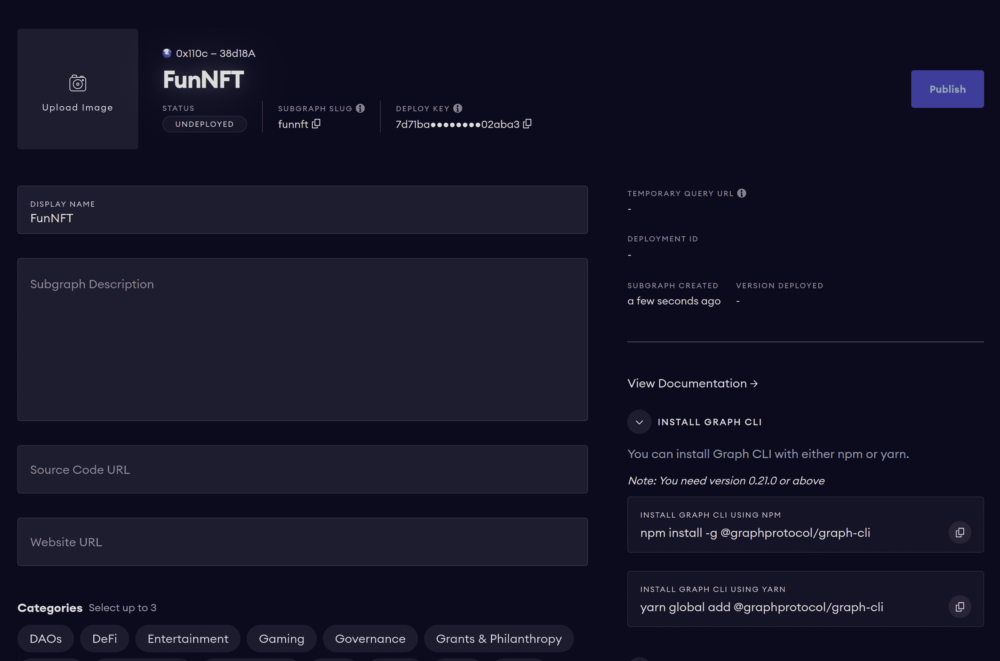

# 介绍

> 原文：<https://github.com/figment-networks/learn-tutorials/blob/master/thegraph/deploy-subgraph-using-polygon.md>

在本教程中，您将学习如何使用 HardHat 将 Solidity smart contract 部署到 Polygon Mumbai testnet，然后创建其子图并将其部署到 Subgraph Studio。

[](https://github.com/figment-networks/learn-tutorials/raw/master/assets/graph.png)

在 subgraph studio 中，您可以使用 Studio UI 创建子图，使用 Graph Protocol CLI 部署子图，在运动场中测试它(在运动场中您可以运行 GraphQL 查询而不会产生任何查询费用)，添加关于子图的元数据，部署子图的多个版本，以及将它们发布到分散的 Graph Explorer。

当您部署一个子图时，只有您可以访问它。但是当你发布你的子图时，任何人都可以在操场上访问和测试你的子图。所以基本上，你可以完全控制你的子图。

在本教程中，您将学习如何使用多边形智能契约创建子图并将其部署到 Subgraph Studio。

# 先决条件

要成功完成本教程，您需要对 Polygon 和 NodeJS 生态系统有一个基本的了解。你还需要有扎实的高级知识。

# 要求

*   您需要在浏览器中安装元掩码。你可以从 https://metamask.io/安装它
*   您需要安装 Node.js 的最新版本。为了兼容，我们建议使用 v14.18.1 LTS。

# 项目设置

运行以下命令以全局安装 yarn package manager 和 Graph Protocol CLI。这些是构建和部署子图所必需的。

```js
npm i -g yarn @graphprotocol/graph-cli 
```

然后运行以下命令创建一个名为`nft`的新目录，切换到该目录，然后在其中创建一个新的 yarn 包:

```js
mkdir nft
cd nft
yarn init --yes 
```

## 设置安全帽

运行下面的命令来安装`hardhat`作为项目的开发依赖项(意味着它是一个只需要本地开发和测试的包)。

```js
yarn add --dev hardhat 
```

然后运行`npx hardhat`来初始化 Hardhat 项目。这将输出:

```js
888    888                      888 888               888
888    888                      888 888               888
888    888                      888 888               888
8888888888  8888b.  888d888 .d88888 88888b.   8888b.  888888
888    888     "88b 888P"  d88" 888 888 "88b     "88b 888
888    888 .d888888 888    888  888 888  888 .d888888 888
888    888 888  888 888    Y88b 888 888  888 888  888 Y88b.
888    888 "Y888888 888     "Y88888 888  888 "Y888888  "Y888

Welcome to Hardhat v2.6.5

? What do you want to do? …
▸ Create a basic sample project
  Create an advanced sample project
  Create an advanced sample project that uses TypeScript
  Create an empty hardhat.config.js
  Quit 
```

您可以使用键盘上的箭头键选择上述 5 个菜单选项中的任何一个。选择“创建一个空的 hardhat.config.js”并按回车键。这会输出:`Config file created`。

现在您将创建一个`hardhat.config.js`文件，其内容如下:

```js
/**
 * @type import('hardhat/config').HardhatUserConfig
 */
module.exports = {
  solidity: "0.7.3",
};
```

将实体版本更新为`0.8.0`，如下图所示:

```js
/**
 * @type import('hardhat/config').HardhatUserConfig
 */
module.exports = {
  solidity: "0.8.0",
};
```

HardHat 将使用 solc 的指定版本(v0.8.0)来编译您的智能合约。

运行以下命令安装编译和部署 solidity smart contract 所需的 Hardhat 插件:

```js
yarn add --dev @nomiclabs/hardhat-ethers ethers @nomiclabs/hardhat-waffle hardhat-abi-exporter 
```

# 撰写智能合同

为了简化 NFT 智能合同的编写，我们将使用 OpenZeppelin 合同 npm 包。您可以通过运行以下命令将其作为开发依赖项安装:

```js
yarn add --dev @openzeppelin/contracts 
```

我们将使用三个 OpenZeppelin 智能合约:

*   **计数器** -跟踪每个生成的 NFT 的增量令牌 Id
*   **ERC 721 uri storage**——存储 NFT 元数据，如 tokenURI(包含一些元数据和图像)
*   **ERC721** -提供 ERC721 标准的一些基本功能

创建一个名为`contracts`的新目录，然后在其中创建一个名为`nft.sol`的文件。

将该实体代码粘贴到该文件中:

```js
// SPDX-License-Identifier: MIT

pragma solidity ^0.8.0;

import "@openzeppelin/contracts/utils/Counters.sol";
import "@openzeppelin/contracts/token/ERC721/extensions/ERC721URIStorage.sol";
import "@openzeppelin/contracts/token/ERC721/ERC721.sol";

contract FunNFT is ERC721URIStorage {
    using Counters for Counters.Counter;
    Counters.Counter private _tokenIds;

    struct Collection {
      uint tokenId;
      uint price;
      bool forSale;
    }

    mapping(uint => Collection) collections;

    constructor() ERC721("FunNFT Collection", "FUN") {}

    function mint(string memory tokenURI, uint price) public returns (uint tokenId) {
        // increment the counter, to get the next tokenId.
        _tokenIds.increment();
        tokenId = _tokenIds.current();

        // mint the new NFT and then set its tokenURI.
        _mint(msg.sender, tokenId);
        _setTokenURI(tokenId, tokenURI);

        // add it to the collection.
        Collection memory collection = Collection(
            tokenId,
            price,
            false
        );
        collections[tokenId] = collection;
    }

    function buy(uint tokenId) public payable {
        // verify that the NFT exists.
        require(_exists(tokenId));

        // verify that owner of the token is not the one calling this function.
        require(msg.sender != ownerOf(tokenId));

        Collection memory collection = collections[tokenId];

        // verify that the price sent is greater than equal to NFT's price.
        require(msg.value >= collection.price);

        // verify that the NFT is available to buy
        require(collection.forSale);

        // transfer the NFT from the owner to the buyer.
        address owner = ownerOf(tokenId);
        payable(owner).transfer(msg.value);
        _transfer(owner, msg.sender, tokenId);

        // update the mapping.
        collection.forSale = false;
        collections[tokenId] = collection;
    }

    function toggleForSale(uint tokenId) public {
        // verify that the NFT exists.
        require(_exists(tokenId));

        // verify that owner of the token is the one calling this function.
        require(msg.sender == ownerOf(tokenId));

        // get the NFT from mapping and store it in memory.
        Collection memory collection = collections[tokenId];

        collection.forSale = !collection.forSale;

        // update the NFT in the mapping.
        collections[tokenId] = collection;
    }
}
```

# 编译智能合同

默认情况下，Hardhat 在编译 solidity smart 契约后不会导出 ABI。但是有了 ABI，就更容易为它创建子图。

您可以通过更新您的`hardhat.config.js`文件来导出 ABI:

```js
// Load the Hardhat plugins
require('@nomiclabs/hardhat-waffle');
require('hardhat-abi-exporter');

module.exports = {
  solidity: '0.8.0',
  abiExporter: {
    path: './abi/',
    clear: true,
  },
};
```

*   **path** :您的 ABI 导出目录的路径(相对于 HardHat 项目的根目录)。如果该目录不存在，将会创建它。
*   **clear** :一个布尔值，决定编译时是否从指定路径删除旧文件。

你可以在这里阅读关于安全帽 ABI 出口商[支持的全套选项。](https://hardhat.org/plugins/hardhat-abi-exporter.html#usage)

运行`npx hardhat compile`来编译您的智能合同。假设没有错误或警告，这将输出:

```js
Compiling 1 file with 0.8.0
Compilation finished successfully 
```

`nft.sol`智能合同现已成功编译。ABI 将被存储在`abi/contracts/nft.sol/FunNFT.json`中。

# 部署智能合同

在您的`hardhat.config.js`文件中添加常量`MUMBAI_PRIVATE_KEY`和`DATAHUB_API_KEY`以及一个**网络**条目:

```js
require('@nomiclabs/hardhat-waffle');
require('hardhat-abi-exporter');

// Replace this private key with your Mumbai wallet private key
const MUMBAI_PRIVATE_KEY = 'YOUR_MUMBAI_PRIVATE_KEY';

// Replace this with your Datahub api key
const DATAHUB_API_KEY = 'YOUR_DATAHUB_API_KEY';

module.exports = {
  solidity: '0.8.0',
  abiExporter: {
    path: './abi/',
    clear: true,
  },
  networks: {
    mumbai: {
      url: `https://matic-mumbai--jsonrpc.datahub.figment.io/apikey/${DATAHUB_API_KEY}`,
      accounts: [`0x${MUMBAI_PRIVATE_KEY}`],
    },
  },
};
```

## 获取您的 Datahub API 密钥

要获得您的`DATAHUB_API_KEY`，请前往[https://datahub.figment.io/signup](https://datahub.figment.io/signup)并创建一个免费账户。

[](https://github.com/figment-networks/learn-tutorials/raw/master/assets/datahub_signup.png)

点击您将在电子邮件中收到的验证链接。通过电子邮件验证后，您将被重定向到[https://datahub.figment.io/](https://datahub.figment.io/)。

使用 Polygon 协议在 DataHub 上创建新的应用程序。您可以选择过渡环境，选择多边形协议，然后单击创建应用程序。

[](https://raw.githubusercontent.com/figment-networks/learn-tutorials/master/assets/create-dh-app.png)

在你的 app **Overview** 选项卡上，找到文本“API Key”旁边的 **View Key** 按钮。您还可以从 Protocols 视图中复制包含 API 密钥的 HTTP 端点 URL。

## 获取元掩码私钥

您需要按照下面的说明将一个到 Polygon Mumbai testnet 的连接添加到您的元掩码中(记住用您实际的 DataHub API 键替换 JSON-RPC URL 中的`<YOUR_DATAHUB_API_KEY>`):

*   登录到元掩码

*   点击`Network`下拉菜单

*   选择`Custom RPC`

*   填写详细信息:

    *   **网络名称**:多边形孟买测试网
    *   **新的 RPC URL** : `https://matic-mumbai--jsonrpc.datahub.figment.io/apikey/<YOUR_DATAHUB_API_KEY>`
    *   **ChainID** : `80001`
    *   **符号** : `MATIC`
    *   **探险家** : `https://mumbai.polygonscan.com/`

    你还需要在你的 Metamask 钱包里放一些孟买 MATIC 代币。请遵循以下说明:

    *   前往[https://faucet.polygon.technology/](https://faucet.polygon.technology/)，粘贴你的 Metamask 钱包地址。
    *   选择孟买网络和 MATIC 令牌。
    *   一旦您的交易被挖掘，您将获得 0.1 个自动令牌

要获取您的`MUMBAI_PRIVATE_KEY`，请打开您的浏览器并打开 Metamask。选择**多边形孟买测试网**网络。点击账户详情，然后点击`Export Private Key`。

永远不要与任何人分享你的私人密钥！

## 部署您的智能合同

在 HardHat 项目中创建一个名为`scripts`的子目录，将下面的代码粘贴到`scripts`目录下的一个新文件`deploy.js`中:

```js
async function main() {
  const [deployer] = await ethers.getSigners();

  console.log("Deploying contracts with the account:", deployer.address);
  console.log("Account balance:", (await deployer.getBalance()).toString());

  const FunNFT = await ethers.getContractFactory("FunNFT");
  const funNFT = await FunNFT.deploy();

  console.log("Contract address:", funNFT.address);
}

main()
  .then(() => process.exit(0))
  .catch((error) => {
    console.error(error);
    process.exit(1);
  });
```

要使用 HardHat 将智能合约部署到 Mumbai testnet，请运行以下命令:

```js
npx hardhat run scripts/deploy.js --network mumbai 
```

这将输出:

```js
Deploying contracts with the account: <YOUR MUMBAI WALLET ADDRESS>
Account balance: <YOUR MUMBAI WALLET BALANCE>
Contract address: <YOUR MUMBAI SMART CONTRACT ADDRESS> 
```

恭喜你！您刚刚成功地将您的智能合同部署到 Mumbai testnet！

在创建子图时，您将需要合同地址，所以记得复制它。

# 创建子图

运行以下命令，通过从 Mumbai testnet 下载合同 ABI 来创建子图。将创建一个名为`funnft`的新目录，所有节点依赖项将自动安装。

```js
graph init --contract-name FunNFT --index-events --studio \
  --from-contract <YOUR MUMBAI SMART CONTRACT ADDRESS> \
  --abi abi/contracts/nft.sol/FunNFT.json \
  --network mumbai \
  funnft 
```

从上面用您部署的 FunNFT 智能合同地址替换`<YOUR MUMBAI SMART CONTRACT ADDRESS>`。

如果您是 Windows 用户，请将上面命令中的`\`字符替换为`^`字符。

这将输出:

```js
✔ Subgraph slug · funnft
✔ Directory to create the subgraph in · funnft
✔ Ethereum network · mumbai
✔ Contract address · <YOUR MUMBAI SMART CONTRACT ADDRESS>
✔ ABI file (path) · abi/contracts/nft.sol/FunNFT.json
✔ Contract Name · FunNFT
———
  Generate subgraph from ABI
  Write subgraph to directory
✔ Create subgraph scaffold
✔ Initialize subgraph repository
✔ Install dependencies with yarn
✔ Generate ABI and schema types with yarn codegen

Subgraph funnft created in funnft

Next steps:

  1\. Run `graph auth` to authenticate with your deploy key.

  2\. Type `cd funnft` to enter the subgraph.

  3\. Run `yarn deploy` to deploy the subgraph.

Make sure to visit the documentation on https://thegraph.com/docs/ for further information. 
```

# 在 Subgraph Studio 中创建项目

首先，你会想去位于 https://thegraph.com/studio/的子图工作室。

[](https://github.com/figment-networks/learn-tutorials/raw/master/assets/graph_connect.png)

点击**连接钱包**按钮。选择用于登录的元掩码 wallet。一旦你被认证，你将看到下面的屏幕，在这里你可以创建你的第一个子图。

[](https://github.com/figment-networks/learn-tutorials/raw/master/assets/graph_create_subgraph.png)

接下来，你需要给你的子图取一个名字。取名字为 **FunNFT** 。完成后，您将看到以下屏幕:

[](https://github.com/figment-networks/learn-tutorials/raw/master/assets/graph_fun_nft.png)

在这个屏幕上，您可以看到关于子图的详细信息，比如您的部署键、子图 slug 和状态。

# 部署子图

在您可以部署您的子图之前，您需要从[https://thegraph.com/studio/subgraph/funnft/](https://thegraph.com/studio/subgraph/funnft/)获得您的部署密钥。这用于向 Subgraph Studio 验证您的帐户。

运行以下命令来设置您的部署密钥。

```js
cd funnft
graph auth --studio <DEPLOY_KEY> 
```

您应该会看到以下输出:

```js
Deploy key set for https://api.studio.thegraph.com/deploy/ 
```

一旦完成，您就可以运行`yarn deploy`将子图部署到 Subgraph Studio。当系统提示您输入版本标签时，您可以选择`v1.0.0`。您应该会看到以下输出:

```js
yarn run v1.22.15
$ graph deploy --node https://api.studio.thegraph.com/deploy/ funnft
✔ Version Label (e.g. v0.0.1) · v1.0.0
  Skip migration: Bump mapping apiVersion from 0.0.1 to 0.0.2
  Skip migration: Bump mapping apiVersion from 0.0.2 to 0.0.3
  Skip migration: Bump mapping apiVersion from 0.0.3 to 0.0.4
  Skip migration: Bump mapping apiVersion from 0.0.4 to 0.0.5
  Skip migration: Bump mapping specVersion from 0.0.1 to 0.0.2
✔ Apply migrations
✔ Load subgraph from subgraph.yaml
  Compile data source: FunNFT => build/FunNFT/FunNFT.wasm
✔ Compile subgraph
  Copy schema file build/schema.graphql
  Write subgraph file build/FunNFT/abis/FunNFT.json
  Write subgraph manifest build/subgraph.yaml
✔ Write compiled subgraph to build/
  Add file to IPFS build/schema.graphql
                .. QmbVoYXPnjucXQv8cRDVRF8BH77YMSFWCvVu9sFQEQGhWg
  Add file to IPFS build/FunNFT/abis/FunNFT.json
                .. QmNiduSnZPvFKuiyhxdp1V8FSfhxgdtNx6TRkifugbL1XA
  Add file to IPFS build/FunNFT/FunNFT.wasm
                .. QmcKpXkdPTAjofYwqXCNreKk3AnRma7qxdk5v3jAyJSE8y
✔ Upload subgraph to IPFS

Build completed: QmVyyxKVJgGae8AC6SYLzg11huUKNmjSGos81B9ghXXWfe

Deployed to https://thegraph.com/studio/subgraph/funnft

Subgraph endpoints:
Queries (HTTP):     https://api.studio.thegraph.com/query/8676/funnft/v1.0.0
Subscriptions (WS): https://api.studio.thegraph.com/query/8676/funnft/v1.0.0

Done in 14.68s. 
```

您现在已经将子图部署到您的子图工作室帐户了！

# 结论

祝贺您完成本教程！您已经学习了如何使用 HardHat 将智能合约部署到 Polygon Mumbai testnet。您还学习了如何在 Subgraph Studio 上为智能契约创建和部署子图。

# 关于作者

我叫罗宾·托马斯，是一名区块链爱好者，有几年使用各种区块链协议的经验。请随时在 [GitHub](https://github.com/robin-thomas) 上与我联系。