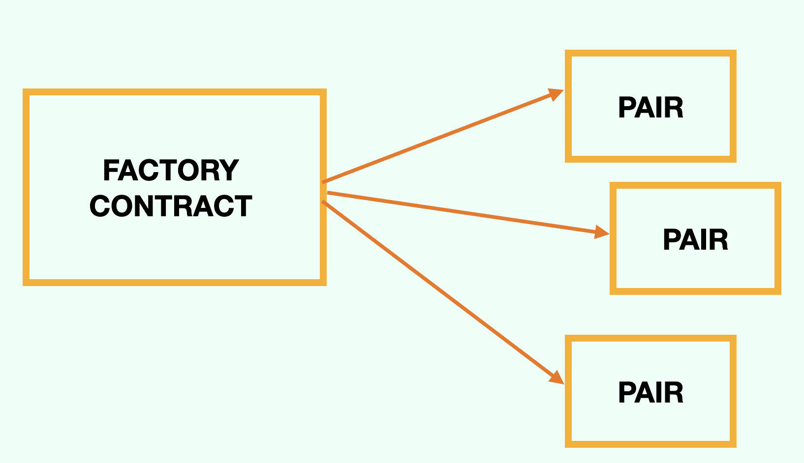
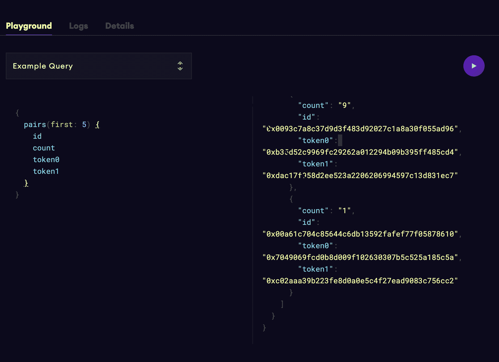

# 介绍

> 原文：<https://github.com/figment-networks/learn-tutorials/blob/master/thegraph/multiple_smartcontracts_subgraph.md>

大多数 dapps 跨越多个智能合约，其中许多是动态创建的。本教程演示了如何使用运行时部署的契约为复杂的多智能契约 dapp 构建子图。

它使用 Uniswap AMM 市场合同作为例子，因为读者可能熟悉它。我们将从部署 Uniswap 对的工厂契约开始，然后使用事件将新创建的对添加到我们的子图中。

[](https://github.com/figment-networks/learn-tutorials/raw/master/assets/graph.png)

# 先决条件

要成功完成本教程，您需要对以太坊、坚固性、图形和 Uniswap 生态系统有一个基本的了解。

# 要求

和前面的教程一样，要完成本教程，您需要安装图形命令行界面:[https://www.npmjs.com/package/@graphprotocol/graph-cli](https://www.npmjs.com/package/@graphprotocol/graph-cli)

# 创建图表项目

安装 graph-cli 后，您可以使用`graph init command`创建一个新的子图

```
graph init uni-subgraph 
```

对于较新的 Macbooks，您可能需要`yarn exec graph init uni-subgraph`，这取决于您的系统权限。

[](https://github.com/figment-networks/learn-tutorials/raw/master/assets/graphinit.png)

对于网络，选择 mainnet。Uniswap 工厂合同的合同地址是“0 x5c 69 bee 701 ef 814 a2 b 6 a3 edd 4 b 1652 CB 9 cc 5 aa 6 f ”,它在所有测试网络中保持不变。

Graph 将为您获取此合同的 ABI，并初始化一些文件。

# Uniswap 对创建和卷跟踪

在本教程中，我们将跟踪 Uniswap 对中的令牌储备。如您所知，Uniswap 中的配对是由工厂契约动态创建的。工厂合约部署配对合约，然后用户可以向这些合约添加流动性。由于事先不知道对协定地址，我们将从工厂协定发出的事件中动态获取对的地址。每当创建新对时，都会发出 PairCreated 事件。我们将监听该事件，并在创建新的配对契约时将其添加为数据源。

[](https://github.com/figment-networks/learn-tutorials/raw/master/assets/graphuniswap.png)

# 下载 ABIs

对于本教程，您还需要 pair 契约的 ABI(应用程序二进制接口),因为我们将监听 pair 契约和工厂契约中的事件。这里有官方的 ABI。

# 定义数据模式

我们必须定义要索引的数据的模式。这是在`schema.graphql`文件中完成的

```
type Pair @entity {
  id: ID!
  count: BigInt!
  token0: Bytes! # address
  token1: Bytes! # address
  reserve0: BigInt!
  reserve1: BigInt!
}
```

pair 实体代表一个令牌对，并直接映射到以太坊上的单个智能合约。`ID` -配对契约的地址`count` -该对被添加流动性的次数(使用 PairCreated 事件)`token0` -第一令牌的地址`token1` -第二令牌的地址`reserve0` -配对契约中第一令牌的总储备`reserve1` -配对契约中第二令牌的总储备

# 创建子图配置文件

我们将从`subgraph.yaml`文件开始。Graph CLI 将自动为您初始化该文件中的一些设置。该信息将取自它将从 Etherscan 下载的 ABI。我们将添加工厂合同作为数据源。这就是它的样子:

```
specVersion: 0.0.2
schema:
  file: ./schema.graphql
dataSources:
  - kind: ethereum/contract
    name: UniswapFactory
    network: mainnet
    source:
      address: "0x5C69bEe701ef814a2B6a3EDD4B1652CB9cc5aA6f"
      abi: UniswapFactory
      startBlock: 13081816
    mapping:
      kind: ethereum/events
      apiVersion: 0.0.5
      language: wasm/assemblyscript
      entities:
        - PairCreated
      abis:
        - name: UniswapFactory
          file: ./abis/UniswapFactory.json
      eventHandlers:
        - event: PairCreated(indexed address,indexed address,address,uint256)
          handler: handlePairCreated
      file: ./src/mapping.ts
```

对于本教程，我们将开始块设置为一个最近的值。这样我们可以在 graph studio 中快速测试我们的图形。索引整个以太坊链中的所有线对可能需要几个小时。

对于本教程，我们将开始块设置为一个最近的值。这样我们可以在 graph studio 中快速测试我们的图形。如果不指定最近的块高度作为起点，索引整个以太坊链中的所有令牌对可能需要很长时间。

将智能合约、startBlock 和 ABI 的地址放在 source 字段中。

在映射部分，我们将监听 PairCreated 事件，因此我们需要在实体部分以及我们将使用的 ABI 中提到它。

在 eventHandlers 中，像在 ABI 中一样添加事件，然后添加处理程序。这是 AssemblyScript 函数，它将创建新对并将它们添加为数据源。

因为当 PairCreated 事件发出时，我们只知道地址对的地址，所以我们必须创建一个 datasource 模板。这个模板就像是每一对的骨架，它将使用 AssemblyScript 动态初始化。

```
templates:
  - kind: ethereum/contract
    name: Pair
    network: mainnet
    source:
      abi: Pair
    mapping:
      kind: ethereum/events
      apiVersion: 0.0.5
      language: wasm/assemblyscript
      file: ./src/mapping.ts
      entities:
        - Pair
      abis:
        - name: Pair
          file: ./abis/Pair.json
        - name: UniswapFactory
          file: ./abis/UniswapFactory.json
      eventHandlers:
        - event: Sync(uint112,uint112)
          handler: handleSync
```

请注意，template 的格式与普通的 datasource 完全相同，但是它没有将它绑定到特定实例的源契约和地址。

出于本教程的目的，我们将处理`Sync`事件，该事件提供了 pair 契约中两个令牌的保留。每当 pair 协定中发生交换或其他操作时，都会触发该事件。

# 生成类型

在编写 assemblyscript 映射文件之前，我们需要为契约和数据源生成类型。您可以使用以下命令来完成此操作

```
yarn codegen 
```

```
$ graph codegen
  Skip migration: Bump mapping apiVersion from 0.0.1 to 0.0.2
  Skip migration: Bump mapping apiVersion from 0.0.2 to 0.0.3
  Skip migration: Bump mapping apiVersion from 0.0.3 to 0.0.4
  Skip migration: Bump mapping apiVersion from 0.0.4 to 0.0.5
  Skip migration: Bump mapping specVersion from 0.0.1 to 0.0.2
✔ Apply migrations
✔ Load subgraph from subgraph.yaml
  Load contract ABI from abis/UniswapFactory.json
✔ Load contract ABIs
  Generate types for contract ABI: UniswapFactory (abis/UniswapFactory.json)
  Write types to generated/UniswapFactory/UniswapFactory.ts
✔ Generate types for contract ABIs
  Generate types for data source template Pair
  Write types for templates to generated/templates.ts
✔ Generate types for data source templates
  Load data source template ABI from abis/Pair.json
  Load data source template ABI from abis/UniswapFactory.json
✔ Load data source template ABIs
  Generate types for data source template ABI: Pair > Pair (abis/Pair.json)
  Write types to generated/templates/Pair/Pair.ts
  Generate types for data source template ABI: Pair > UniswapFactory (abis/UniswapFactory.json)
  Write types to generated/templates/Pair/UniswapFactory.ts
✔ Generate types for data source template ABIs
✔ Load GraphQL schema from schema.graphql
  Write types to generated/schema.ts
✔ Generate types for GraphQL schema

Types generated successfully

✨  Done in 2.09s. 
```

这将创建一个包含所有生成类型的生成文件夹。

# 编写 AssemblyScript 映射

在映射文件中，我们需要编写两个函数。一个用于处理新对，一个用于处理每对的`Sync`事件。先说`handleNewPair`事件。让我们从生成的文件夹中导入类型以及`BigInt`类型:

```
import { BigInt } from "@graphprotocol/graph-ts"
import { Pair } from "../generated/schema"
import {
  PairCreated
} from "../generated/UniswapFactory/UniswapFactory"
import {
  Pair as PairTemplate
} from "../generated/templates"
```

注意，datasource 模板也称为 Pair，与我们的 graphql 模式类型相同。所以我们将其作为 PairTemplate 导入。

```
export function handlePairCreated(event: PairCreated): void {
  // Entities can be loaded from the store using a string ID; this ID
  // needs to be unique across all entities of the same type
  let pair = Pair.load(event.transaction.from.toHex())

  // Entities only exist after they have been saved to the store;
  // `null` checks allow to create entities on demand
  if (!pair) {
    pair = new Pair(event.transaction.from.toHex())

    // Entity fields can be set using simple assignments
    pair.count = BigInt.fromI32(0)

    //set reserves to 0
    pair.reserve0 = BigInt.fromI32(0)
    pair.reserve1 = BigInt.fromI32(0)
  }

  pair.count = pair.count + BigInt.fromI32(1)

  //  fields can be set based on event parameters
  pair.token0 = event.params.token0
  pair.token1 = event.params.token1

  PairTemplate.create(event.params.pair)
  // Entities can be written to the store with `.save()`
  pair.save()

}
```

让我们看看函数的每一行。第一行试图从子图中加载对。如果该对为空，它将使用从事件中获取的地址创建一个新对。由于我们的数据类型是一个`ID`，我们需要使用`toHex()`函数将其转换成一个`ID`类型。`BigInt.fromI32(0)`将`count`初始化为 0。

接下来，我们简单地将从事件参数中获取的标记地址存储到我们的标记值中。

现在，我们简单地将储备设置为 0，因为不可能从 PairCreated 事件中获得储备。

线`PairTemplate.create(event.params.pair)`至关重要。如果没有这个，子图将不会知道它必须开始监听来自这个智能契约的事件。它在`event.params.pair`添加一对作为数据源。

对于`handleSync`事件，我们首先导入所需的类型。

```
import {
  Sync
} from "../generated/templates/Pair/Pair"
```

然后在`handleSync`函数中，我们简单地更新来自同步事件的储备。如果您注意到在我们的 ABI 中，事件的类型是 uint112，所以我们必须将其类型转换为 BigInt。

```
export function handleSync(event: Sync): void {

    let pair = Pair.load(event.address.toHex())

    if(pair) {
      pair.reserve0 = BigInt.fromI32(event.params.reserve0.toI32())
      pair.reserve1 = BigInt.fromI32(event.params.reserve1.toI32())
      pair.save()
    }
}
```

# 部署子图

现在我们准备部署我们的子图。为了将子图部署到图中，我们首先将它部署到 graph studio 并测试它。

为此，我们需要去工作室[https://thegraph.com/studio/](https://thegraph.com/studio/)并获得部署密钥。

在 subgraph studio 中，从仪表板中复制 deploy 键。

在 cli 中，现在您可以使用以下命令进行身份验证。

```
graph auth --product subgraph-studio uni-subgraph 
```

认证完成后，您可以将您的图部署到 subgraph studio。

```
yarn deploy 
```

您现在可以以`vmajor.minor.patch`格式输入您喜欢的任何版本。您应该在终端上看到子图部署成功。

```
yarn run v1.22.10
$ graph deploy --node https://api.studio.thegraph.com/deploy/ uni-subgraph
✔ Version Label (e.g. v0.0.1) · v0.1.0
  Skip migration: Bump mapping apiVersion from 0.0.1 to 0.0.2
  Skip migration: Bump mapping apiVersion from 0.0.2 to 0.0.3
  Skip migration: Bump mapping apiVersion from 0.0.3 to 0.0.4
  Skip migration: Bump mapping apiVersion from 0.0.4 to 0.0.5
  Skip migration: Bump mapping specVersion from 0.0.1 to 0.0.2
✔ Apply migrations
✔ Load subgraph from subgraph.yaml
  Compile data source: UniswapFactory => build/UniswapFactory/UniswapFactory.wasm
  Compile data source template: Pair => build/UniswapFactory/UniswapFactory.wasm (already compiled)
✔ Compile subgraph
  Copy schema file build/schema.graphql
  Write subgraph file build/UniswapFactory/abis/UniswapFactory.json
  Write subgraph file build/Pair/abis/Pair.json
  Write subgraph file build/Pair/abis/UniswapFactory.json
  Write subgraph manifest build/subgraph.yaml
✔ Write compiled subgraph to build/
  Add file to IPFS build/schema.graphql
                .. QmNYFqNjWcJBskJXf5uaKjfWLyWv6dHoGign8zY38Hxp4p
  Add file to IPFS build/UniswapFactory/abis/UniswapFactory.json
                .. QmZ55G1yYFzde8Vcq4cpLfNgPSEibpLi9aYCqS1jEvCKQ9
  Add file to IPFS build/UniswapFactory/UniswapFactory.wasm
                .. QmRQ5iRV3JqkY6W9L16pANppNbhEa19KK2p5KC7LHnPjD7
  Add file to IPFS build/Pair/abis/Pair.json
                .. QmbPLMADBP8L6LBVP3ZBQ8RgG7ghamD8DvbdUxHAjZrLgm
  Add file to IPFS build/Pair/abis/UniswapFactory.json
                .. QmZ55G1yYFzde8Vcq4cpLfNgPSEibpLi9aYCqS1jEvCKQ9 (already uploaded)
  Add file to IPFS build/UniswapFactory/UniswapFactory.wasm
                .. QmRQ5iRV3JqkY6W9L16pANppNbhEa19KK2p5KC7LHnPjD7 (already uploaded)
✔ Upload subgraph to IPFS

Build completed: QmZHBED1WzxvEeCNySwJ8FoQVwGsb3CABByLNbRPyiPGMo

Deployed to https://thegraph.com/studio/subgraph/uni-subgraph

Subgraph endpoints:
Queries (HTTP):     https://api.studio.thegraph.com/query/4570/uni-subgraph/v0.1.0
Subscriptions (WS): https://api.studio.thegraph.com/query/4570/uni-subgraph/v0.1.0 
```

你现在可以去[https://thegraph.com/studio/subgraph/uni-subgraph/](https://thegraph.com/studio/subgraph/uni-subgraph/)玩你的子图了。您应该会看到一个`syncing`状态，一旦进度达到 100，您就可以开始进行查询。

[](https://github.com/figment-networks/learn-tutorials/raw/master/assets/graphplayground.png)

# 结论

祝贺您完成本教程！您学习了如何为具有多个 smartcontracts 的 dapp 创建子图，以及如何将 smartcontracts 添加到动态创建的子图中。

# 关于作者

我是 Mohit Jandwani，加密投资者和软件工程师。我在我的 Youtube 频道上教授如何从加密中获得被动收入。请随时在[推特](https://twitter.com/mohitjandwani)上与我联系。