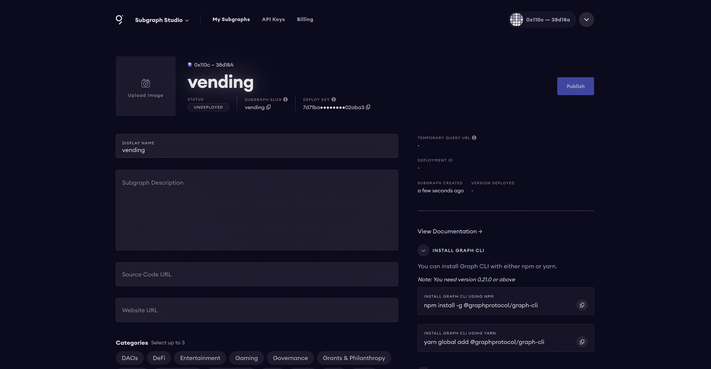
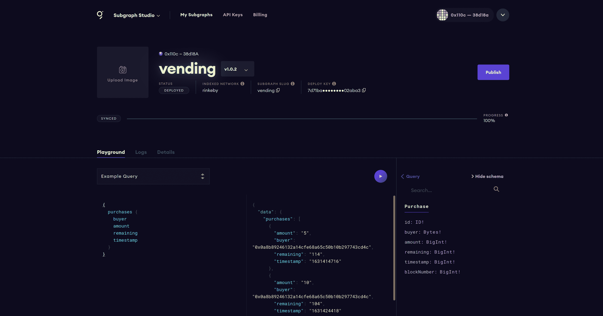
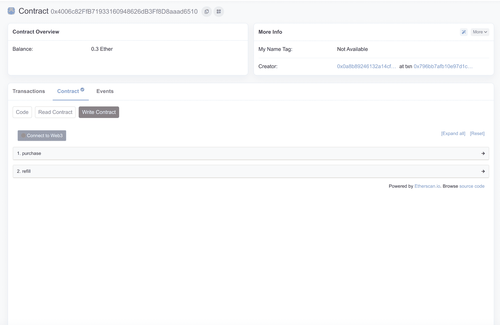
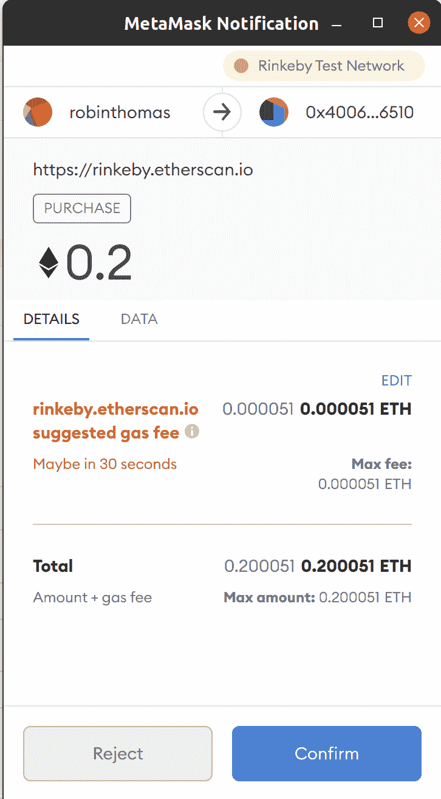

# 介绍

> 原文：<https://github.com/figment-networks/learn-tutorials/blob/master/thegraph/query-ethereum-data-with-the-graph.md>

在本教程中，您将学习如何从以太坊 Rinkeby testnet 上已经部署的智能契约创建子图，将其部署到 Subgraph Studio，然后使用 Subgraph Studio Playground 查询子图。

[](https://github.com/figment-networks/learn-tutorials/raw/master/assets/graph.png)

# 先决条件

要成功完成本教程，您需要对以太坊、Metamask 钱包和 NodeJS 生态系统有一个基本的了解。

# 要求

*   您需要在浏览器中安装元掩码。你可以从 https://metamask.io/安装它
*   您需要安装 Node.js 的最新版本。为了兼容，我们建议使用 v14.17.6 LTS。

本教程涵盖的主题:

*   在子图工作室中创建子图
*   下载合同 abi，然后从中创建一个子图
*   将子图部署到 Subgraph Studio
*   使用 Subgraph Studio Playground 查询子图
*   使用元掩码与 Rinkeby 智能合约进行交互

本教程中未涉及的主题:

*   编写智能合同，然后将其部署到 Rinkeby testnet

# 项目设置

运行以下命令以全局安装 npm 依赖项。这些是构建和部署子图所必需的。

```js
npm i -g yarn
npm i -g @graphprotocol/graph-cli 
```

# 在 Subgraph Studio 中创建图形项目

首先，你会想去位于 https://thegraph.com/studio/的子图工作室。

[](https://github.com/figment-networks/learn-tutorials/raw/master/assets/graph_connect.png)

点击**连接钱包**按钮。选择用于登录的元掩码 wallet。一旦你被认证，你将看到下面的屏幕，在这里你可以创建你的第一个子图。

[](https://github.com/figment-networks/learn-tutorials/raw/master/assets/graph_create_subgraph.png)

接下来，你需要给你的子图取一个名字。赐名为**售货**。完成后，您将看到以下屏幕:

[](https://github.com/figment-networks/learn-tutorials/raw/master/assets/graph_subgraph_created.png)

在这个屏幕上，您可以看到关于子图的详细信息，比如您的部署键、子图 slug 和状态。

# 创建和部署子图

*   运行以下命令，通过从 Rinkeby testnet 下载合同 ABI 来创建子图。将创建一个名为`vending`的新目录，所有节点依赖项将自动安装。

```js
graph init --contract-name VendingMachine --index-events --studio --from-contract 0x4006c82FfB71933160948626dB3Ff8D8aaad6510 --network rinkeby vending 
```

这将从作为参数传递给`--from-contract`的 Rinkeby 智能契约中获取 ABI，并将其存储在`./vending/abis`目录中。图形 CLI 将从智能合同 ABI 中自动生成映射。您可以在`./vending/src/mapping.ts`中查看映射。

> 通过传入`--index-events`，CLI 将根据契约发出的事件在`schema.graphql`和`src/mapping.ts`中为我们自动填充一些代码。

输出:

```js
✔ Subgraph slug · vending
✔ Directory to create the subgraph in · vending
✔ Ethereum network · rinkeby
✔ Contract address · 0x4006c82FfB71933160948626dB3Ff8D8aaad6510
✔ Fetching ABI from Etherscan
✔ Contract Name · VendingMachine
———
  Generate subgraph from ABI
  Write subgraph to directory
✔ Create subgraph scaffold
✔ Initialize subgraph repository
✔ Install dependencies with yarn
✔ Generate ABI and schema types with yarn codegen

Subgraph vending created in vending

Next steps:

  1\. Run `graph auth` to authenticate with your deploy key.

  2\. Type `cd vending` to enter the subgraph.

  3\. Run `yarn deploy` to deploy the subgraph.

Make sure to visit the documentation on https://thegraph.com/docs/ for further information. 
```

*   运行以下命令来设置部署密钥。用你从[https://thegraph.com/studio/subgraph/vending/](https://thegraph.com/studio/subgraph/vending/)那里得到的钥匙替换

```js
graph auth --studio <DEPLOY_KEY>
Deploy key set for https://api.studio.thegraph.com/deploy/ 
```

*   要创建子图，运行以下命令。您的新子图将在一个`subgraph.yaml`文件中创建。

```js
cd vending
graph codegen && graph build 
```

这将在`vending/build`下生成一个`build`目录。

输出:

```js
Skip migration: Bump mapping apiVersion from 0.0.1 to 0.0.2
Skip migration: Bump mapping apiVersion from 0.0.2 to 0.0.3
Skip migration: Bump mapping apiVersion from 0.0.3 to 0.0.4
Skip migration: Bump mapping specVersion from 0.0.1 to 0.0.2
✔ Apply migrations
✔ Load subgraph from subgraph.yaml
Load contract ABI from abis/VendingMachine.json
✔ Load contract ABIs
Generate types for contract ABI: VendingMachine (abis/VendingMachine.json)
Write types to generated/VendingMachine/VendingMachine.ts
✔ Generate types for contract ABIs
✔ Generate types for data source templates
✔ Load data source template ABIs
✔ Generate types for data source template ABIs
✔ Load GraphQL schema from schema.graphql
Write types to generated/schema.ts
✔ Generate types for GraphQL schema

Types generated successfully

Skip migration: Bump mapping apiVersion from 0.0.1 to 0.0.2
Skip migration: Bump mapping apiVersion from 0.0.2 to 0.0.3
Skip migration: Bump mapping apiVersion from 0.0.3 to 0.0.4
Skip migration: Bump mapping specVersion from 0.0.1 to 0.0.2
✔ Apply migrations
✔ Load subgraph from subgraph.yaml
Compile data source: VendingMachine => build/VendingMachine/VendingMachine.wasm
✔ Compile subgraph
Copy schema file build/schema.graphql
Write subgraph file build/VendingMachine/abis/VendingMachine.json
Write subgraph manifest build/subgraph.yaml
✔ Write compiled subgraph to build/

Build completed: /temp/vending/build/subgraph.yaml 
```

以下命令会将子图部署到 Subgraph Studio:

```js
graph deploy --studio vending 
```

将提示您输入版本标签。可以选择`1.0.1`。

输出:

```js
✔ Version Label (e.g. v0.0.1) · v1.0.1
  Skip migration: Bump mapping apiVersion from 0.0.1 to 0.0.2
  Skip migration: Bump mapping apiVersion from 0.0.2 to 0.0.3
  Skip migration: Bump mapping apiVersion from 0.0.3 to 0.0.4
  Skip migration: Bump mapping specVersion from 0.0.1 to 0.0.2
✔ Apply migrations
✔ Load subgraph from subgraph.yaml
  Compile data source: VendingMachine => build/VendingMachine/VendingMachine.wasm
✔ Compile subgraph
  Copy schema file build/schema.graphql
  Write subgraph file build/VendingMachine/abis/VendingMachine.json
  Write subgraph manifest build/subgraph.yaml
✔ Write compiled subgraph to build/
  Add file to IPFS build/schema.graphql
                .. QmWEbGspWEL95ipBPxDCFFrddswSBsprwx1Ktm35Xk2t5M
  Add file to IPFS build/VendingMachine/abis/VendingMachine.json
                .. QmPvqMksRmuchK4Q7kL2KpKg4ZZEsBXwHE34PE55YZUd1Y
  Add file to IPFS build/VendingMachine/VendingMachine.wasm
                .. QmYR3nJToYt9HeuLhXeZ4rw11JrNJyu1NE5n4LQ8DCYsyi
✔ Upload subgraph to IPFS

Build completed: QmZMbjNuaEm1KvAhVaqE29Hz4EJfdNcDwtHgmGifWNrutV

Deployed to https://thegraph.com/studio/subgraph/vending

Subgraph endpoints:
Queries (HTTP):     https://api.studio.thegraph.com/query/8676/vending/v1.0.1
Subscriptions (WS): https://api.studio.thegraph.com/query/8676/vending/v1.0.1 
```

Subgraph Studio 可能需要几分钟时间来同步 Rinkeby testnet 中的图形。等待同步过程完成。

一旦同步完成，您可以访问操场上的子图来运行您的查询。

# 查询图表

前往[https://thegraph.com/studio/subgraph/vending/](https://thegraph.com/studio/subgraph/vending/)开始查询游乐场的数据。

[](https://github.com/figment-networks/learn-tutorials/raw/master/assets/graph_playground.png)

这是我们创建的子图的一个基本 GraphQL 查询:

```js
{
  purchases {
    buyer
    amount
    remaining
    timestamp
  }
}
```

我们可以使用`orderBy`和`orderDirection`设置订单方向:

```js
{
  purchases(
    orderBy: timestamp
    orderDirection: desc
  ) {
    buyer
    amount
    remaining
    timestamp
  }
}
```

或者使用`first`子句获得第一个`x`结果:

```js
{
  purchases(
    orderBy: timestamp
    orderDirection: desc
    first: 2
  ) {
    buyer
    amount
    remaining
    timestamp
  }
}
```

或者使用`skip`子句向前跳过结果:

```js
{
  purchases(
    orderBy: timestamp
    orderDirection: desc
    skip: 2
  ) {
    buyer
    amount
    remaining
    timestamp
  }
}
```

或者使用`where`子句按特定条件过滤结果:

```js
{
  purchases(
    orderBy: timestamp
    orderDirection: desc
    where: { amount_gt: 5 }
  ) {
    buyer
    amount
    remaining
    timestamp
  }
}
```

## 创建数据和查询数据

进入[https://rinkeby . ethers can . io/address/0x 4006 c 82 FFB 71933160948626 db 3 ff 8d 8 aaad 6510 # write contract](https://rinkeby.etherscan.io/address/0x4006c82ffb71933160948626db3ff8d8aaad6510#writeContract)查看 rinke by 智能合约。

[](https://github.com/figment-networks/learn-tutorials/raw/master/assets/graph_rinkeby_contract.png)

点击**连接到网络 3** 按钮。从钱包选项中选择**元掩码**。使用 Metamask 认证后，您将看到**已连接- Web3【地址】**，而不是之前的按钮。确保您连接到 **Rinkeby** 测试网络。

点击**购买**行。您需要填写**购买**和**金额**字段。

[](https://github.com/figment-networks/learn-tutorials/raw/master/assets/graph_rinkeby_contract_purchase.png)

将**购买**填写为 **0.2** ，将**金额**填写为 **20** 。点击**写**按钮。

它将打开 Metamask 提示符。确保您在 **Rinkeby** 测试网络上。

[](https://github.com/figment-networks/learn-tutorials/raw/master/assets/graph_metamask.png)

一旦你点击**确认**按钮，等待你的交易被挖掘。

然后回到 Playground，运行下面的查询(在用您的元掩码钱包地址替换`<YOUR_ADDRESS>`之后):

```js
{
  purchases(
    orderBy: timestamp
    orderDirection: desc
    where: { buyer: "<YOUR_ADDRESS>" }
  ) {
    buyer
    amount
    remaining
    timestamp
  }
}
```

您将看到您刚刚创建的购买信息！

```js
{
  "data": {
    "purchases": [
      {
        "amount": "20",
        "buyer": "<YOUR_ADDRESS>",
        "remaining": "84",
        "timestamp": "1631577213"
      }
    ]
  }
}
```

# 结论

祝贺您完成本教程！您已经学习了如何创建和部署您的第一个子图，以及使用 Subgraph Studio Playground 查询子图。

# 关于作者

我叫罗宾·托马斯，是一名区块链爱好者，有几年使用各种区块链协议的经验。请随时在 [GitHub](https://github.com/robin-thomas) 上与我联系。