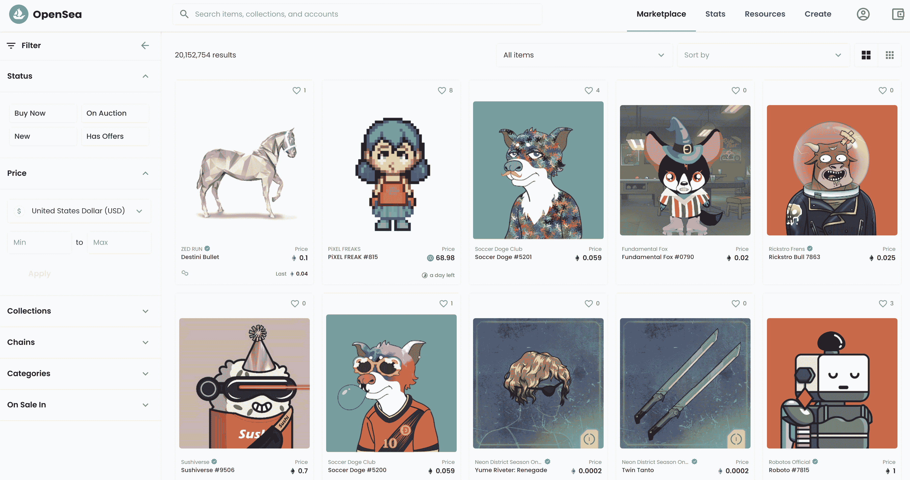
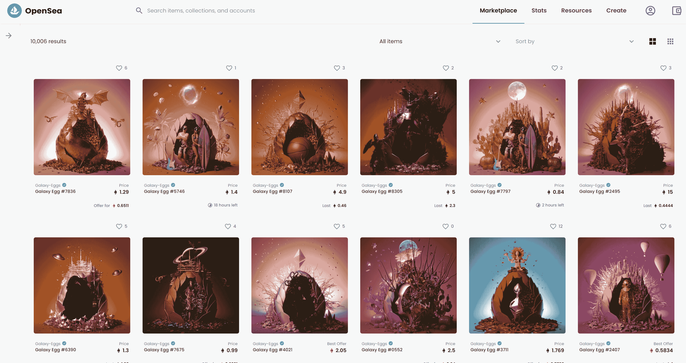
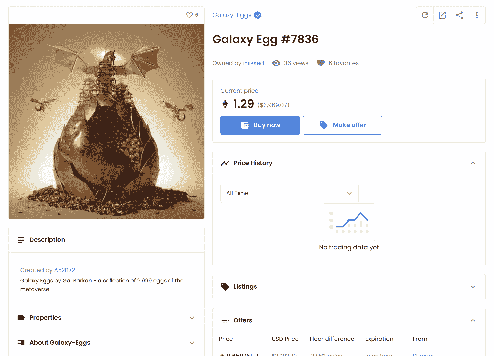
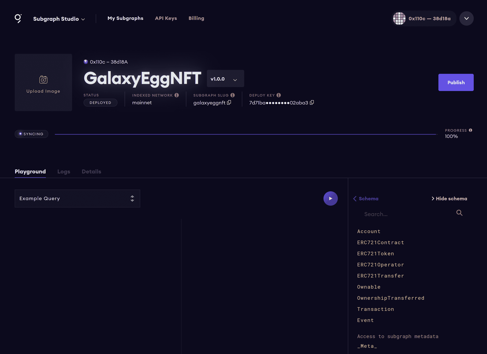

# thegraph/query-nft-data-with-openzeppelin-subgraphs

> 原文：<https://github.com/figment-networks/learn-tutorials/blob/master/thegraph/query-nft-data-with-openzeppelin-subgraphs.md>

在本教程中，您将学习如何从以太坊主网上的 ERC-721 智能合约创建子图，将其部署到子图工作室，然后使用子图工作室游乐场来查询子图以获取有关索引事务的信息。

[](https://github.com/figment-networks/learn-tutorials/raw/master/assets/graph.png)

OpenZeppelin 子图是一个强大的库，可以方便地索引 OpenZeppelin 合同的活动。它通过支持 OpenZeppelin 契约中一些最流行的模块来简化子图的构建，比如`erc20`、`erc721`、`ownable`等等。我们将在本教程中使用`erc721`和`ownable`模块。

如果您知道智能协定的地址，就可以构建一个子图模式。在本教程中，您将学习如何使用 OpenSea NFT 市场检索一些流行的 NFT 收藏的智能合同地址。

Subgraph Studio 是您可以构建和创建子图的地方。您可以向图中添加元数据(甚至在部署子图之后)，部署子图的多个版本，以及将它们发布到分散的图浏览器。您还可以在操场上测试您的子图，在那里您可以运行 graphql 查询，而不会产生任何查询费用。在本教程中，您还将学习如何创建子图并将其部署到 Subgraph Studio，以及使用 Playground 查询它。

# 要求

*   您需要安装 Node.js 的最新版本。为了兼容，我们建议使用 v14.17.6 LTS。

# 项目设置

运行以下命令以全局安装图形协议 CLI。这是部署您的子图所必需的。

```js
npm i -g @graphprotocol/graph-cli@0.21.1 
```

因为最新版本的图形协议 CLI 破坏了与 OpenZeppelin 子图的兼容性，所以对于本教程，您需要专门安装 **v0.21.1** 而不是最新版本。

# 获取 NFT 智能合同地址

前往 NFT 最大的市场——OpenSea。

[](https://github.com/figment-networks/learn-tutorials/raw/master/assets/opensea_assets.png)

从上面的截图可以看出，有超过 2000 万的 NFT 在售！

点击左侧的**收藏**标签。在那里，我们可以看到许多受欢迎的 NFT 收藏，如 CryptoPunks、Art Blocks 策展、Galaxy-Eggs 等。让我们选择**银河蛋** NFT 收集本教程。点击**银河-彩蛋**链接，会带你去[https://opensea.io/collection/galaxyeggs9999](https://opensea.io/collection/galaxyeggs9999)。

[](https://github.com/figment-networks/learn-tutorials/raw/master/assets/opensea_galaxyeggs.png)

单击任一 NFT 查看其显示页面:

[](https://github.com/figment-networks/learn-tutorials/raw/master/assets/opensea_galaxyeggs_7836.png)

在这里您可以点击**详情**标签，查看 NFT 的合同地址:[https://ethers can . io/address/0xa 08126 F5 E1 ed 91 a 635987071 E6 ff 5 EB 2 aeb 67 c 48](https://etherscan.io/address/0xa08126f5e1ed91a635987071e6ff5eb2aeb67c48)。

# 在 Subgraph Studio 中创建项目

现在您已经有了想要使用图协议索引的智能合同的地址，您可以前往位于[https://thegraph.com/studio/](https://thegraph.com/studio/)的子图工作室。

[](https://github.com/figment-networks/learn-tutorials/raw/master/assets/graph_connect.png)

点击页面右上角的**连接按钮**。选择用于登录的元掩码 wallet。通过验证后，您将进入 Studio 主页，在这里您可以创建您的第一个子图:

[](https://github.com/figment-networks/learn-tutorials/raw/master/assets/graph_create_subgraph.png)

单击“创建子图”按钮开始。你需要给你的子图取一个名字。目前，将名称命名为 *GalaxyEggNFT* (此名称仅用于显示，可随时更改)。一旦完成，您就可以看到关于子图的细节，比如您的 deploy 键、子图 slug 和状态。

[](https://github.com/figment-networks/learn-tutorials/raw/master/assets/graph_galaxyeggs_nft.png)

# 创建子图

在您的本地机器或远程开发环境中，创建一个名为`galaxyEggsNFT`的目录，切换到该目录，然后通过运行以下命令将其初始化为一个新的 **npm** 项目:

```js
mkdir galaxyEggsNFT
cd galaxyEggsNFT
npm init --yes 
```

接下来，您需要安装 OpenZeppelin 子图包:

```js
npm install --save-dev @openzeppelin/subgraphs 
```

为了存储子图配置，创建一个名为`subgraphconfig.json`的文件，其内容如下:

```js
{
  "output": "generated/",
  "chain": "mainnet",
  "datasources": [
    { "address": "0xa08126f5e1ed91a635987071e6ff5eb2aeb67c48", "startBlock": 13200000, "module": [ "erc721", "ownable" ] }
  ]
}
```

*   **输出**:存放你的子图的目录
*   **数据源**:一个`datasource`的数组，其中每个数据源定义了以下属性:
    *   **地址** -创建子图的智能合同地址
    *   **startBlock** (可选)-开始子图索引的块，加速索引过程
    *   **模块** -我们要索引的模块数组

OpenZeppelin 子图支持以下模块:

*   `accesscontrol`
*   `erc20`
*   `erc721`
*   `governor`
*   `ownable`
*   `pausable`
*   `timeblock`

由于 NFT 是`erc721`模块，我们将使用它和`ownable`模块进行索引。要构建子图，请运行以下命令:

```js
npx graph-compiler --config subgraphconfig.json --include node_modules/@openzeppelin/subgraphs/src/datasources --export-schema --export-subgraph 
```

这将输出:

```js
- Schema exported to generated/schema.graphql
- Manifest exported to generated/subgraph.yaml 
```

它还创建了一个名为`generated`的目录，其中包含两个文件:

*   `subgraph.yaml`:存储[子图清单](https://thegraph.academy/developers/working-with-the-graph/)
*   `schema.graphql`:这定义了要存储的数据以及如何使用 GraphQL 查询这些数据

现在我们准备部署子图。

# 部署子图

运行以下命令为您的子图项目设置部署键:

```js
graph auth --studio <DEPLOY_KEY> 
```

用工作室页面[https://thegraph.com/studio/subgraph/galaxyeggnft/](https://thegraph.com/studio/subgraph/galaxyeggnft/)中的部署键替换`<DEPLOY_KEY>`。您应该会看到以下输出:

```js
Deploy key set for https://api.studio.thegraph.com/deploy/ 
```

完成后，我们可以运行以下命令将子图部署到 Subgraph Studio:

```js
cd generated
graph deploy --studio galaxyeggnft 
```

当系统提示您输入版本标签时，您可以选择`v1.0.0`。您应该会看到以下输出:

```js
✔ Version Label (e.g. v0.0.1) · v1.0.0
  Skip migration: Bump mapping apiVersion from 0.0.1 to 0.0.2 (graph-ts dependency not installed yet)
  Skip migration: Bump mapping apiVersion from 0.0.2 to 0.0.3 (graph-ts dependency not installed yet)
  Skip migration: Bump mapping apiVersion from 0.0.3 to 0.0.4 (graph-ts dependency not installed yet)
  Skip migration: Bump mapping specVersion from 0.0.1 to 0.0.2
✔ Apply migrations
✔ Load subgraph from subgraph.yaml
  Compile data source: erc721 => build/erc721/erc721.wasm
  Compile data source: ownable => build/ownable/ownable.wasm
✔ Compile subgraph
  Copy schema file build/schema.graphql
  Write subgraph file build/node_modules/@openzeppelin/contracts/build/contracts/IERC721Metadata.json
  Write subgraph file build/node_modules/@openzeppelin/contracts/build/contracts/Ownable.json
  Write subgraph manifest build/subgraph.yaml
✔ Write compiled subgraph to build/
  Add file to IPFS build/schema.graphql
                .. QmPDKw3SDB138wUFYYvzAN1GatHRX6NvFwnDcvDfZsjwYp
  Add file to IPFS build/node_modules/@openzeppelin/contracts/build/contracts/IERC721Metadata.json
                .. QmXVNNtLfETmLrarDMwR18Tk2kNUXyczLf7LdES4aFZkLi
  Add file to IPFS build/node_modules/@openzeppelin/contracts/build/contracts/Ownable.json
                .. QmVjhxbJvwq39tGZCNxTDuY6rjW5HYiHzCm9kQnm1bLJ1M
  Add file to IPFS build/erc721/erc721.wasm
                .. QmUKy3JTwyeYNUn5BMa7SAWj3C6PAx47XBJQNfNG1X6Jb4
  Add file to IPFS build/ownable/ownable.wasm
                .. QmQg39Jp9zLUdShCcXoYjrnkhevLLpYerT3RcvYaxgZPph
✔ Upload subgraph to IPFS

Build completed: QmYDdVUPh6br4VqrgQzhM2i4Pedw7ysvDmhovvYVcA1Nu2

Deployed to https://thegraph.com/studio/subgraph/galaxyeggnft

Subgraph endpoints:
Queries (HTTP):     https://api.studio.thegraph.com/query/8676/galaxyeggnft/v1.0.0
Subscriptions (WS): https://api.studio.thegraph.com/query/8676/galaxyeggnft/v1.0.0 
```

您现在已经将子图部署到您的子图工作室帐户了！

这将触发一个同步过程，其中图节点将检查以太坊主网区块链的历史块，以检索该子图的任何数据。新的区块一开采出来就要接受检查。等待同步过程完成。

您还可以访问操场，在那里您可以运行您的查询，如下所示。

[](https://github.com/figment-networks/learn-tutorials/raw/master/assets/graph_galaxyeggs_nft_subgraph.png)

现在，只有你可以在 Subgraph Studio 中访问这个子图。为了让其他人能够访问您的子图，您需要将它发布到图网络。

[](https://github.com/figment-networks/learn-tutorials/raw/master/assets/graph_publish.png)

发布意味着将你的子图上链到以太坊主网或以太坊 Rinkeny testnet。这将允许您在[图形浏览器](https://thegraph.com/explorer/)中查看您的子图是如何工作的。

现在，让我们跳过发布这个子图。

# 查询 NFT 数据

您的子图由名为`Entities`的模式类型组成，在`schema.graphql`文件中定义。对于每个实体，图形将生成一个`entity`和`entities`字段，如【https://thegraph.com/studio/subgraph/galaxyeggnft】中的[所示](https://thegraph.com/studio/subgraph/galaxyeggnft)。

要检索所有创建的 Galaxy-Eggs NFT(以及它们的标识符和 uri)，请在操场上使用下面的查询:

```js
{
  erc721Tokens {
    identifier
    uri
  }
}
```

您将得到如下输出:

```js
{
  "data": {
    "erc721Tokens": [
      {
        "identifier": "0",
        "uri": "ipfs://QmfB3KH8GuZA9xoTCNwwiMEMk9hZBUaUZnMMWKra57oUse/0.json"
      },
      {
        "identifier": "1",
        "uri": "ipfs://QmfB3KH8GuZA9xoTCNwwiMEMk9hZBUaUZnMMWKra57oUse/1.json"
      },

      ...

    ]
  }
}
```

这里`identifier`表示用于 NFT 的唯一 id。例如，在 NFT **银河蛋#2074** ， **2074** 是标识符。

注意，我们在查询中使用的是`erc721Tokens`而不是`erc721Token`。如果我们想要检索一个特定的 NFT，我们必须使用`erc721Token`:

```js
{
  erc721Token(id: "0xa08126f5e1ed91a635987071e6ff5eb2aeb67c48/0x0") {
    identifier
    uri
  }
}
```

但在这种情况下,`id`字段是强制性的，必须是一个字符串。它将输出:

```js
{
  "data": {
    "erc721Token": {
      "id": "0xa08126f5e1ed91a635987071e6ff5eb2aeb67c48/0x0",
      "identifier": "0",
      "uri": "ipfs://QmfB3KH8GuZA9xoTCNwwiMEMk9hZBUaUZnMMWKra57oUse/0.json"
    }
  }
}
```

如果你访问上面的 IPFS 链接，你会得到**银河彩蛋#0** NFT 的详细信息:

```js
{
  "name": "Galaxy Egg #0",
  "description": "(art)tificial is an art studio that explores the boundaries of technology and art. Our first project is Galaxy Eggs - a generative collection of 9,999 Eggs of the metaverse that live on the Ethereum Blockchain. Our Art Director, Gal Barkan, has been creating futuristic and sci-fi art for the past 20 years - this collection is the culmination of a lifetime of work on one hand, and the beginning of a new chapter in taking part in the creation of the metaverse. For more info about (art)ificial and Galaxy Eggs, visit - artificial.art",
  "image": "ipfs://QmUM1uGBE6H8pQ2zQSUj2BTzbpLSvuX6jtpBCB38xSiz2q/"
}
```

为了检索 NFT 的购买，我们将使用`transactions`实体(以及它的`id`字段)。运行以下查询:

```js
{
  transactions {
    id
  }
}
```

您将得到如下输出:

```js
{
  "data": {
    "transactions": [
      {
        "id": "0x0003b95db41b4bdadddb234d4d932fdc26bf9890267073e488e4b6f9fdb27400"
      },
      {
        "id": "0x000a9c8ddadffcd8832723fd2227c98d5401df2f83f9297205386fc59e8de13b"
      },

      ...

    ]
  }
}
```

每个`id`的值都是以太坊主网上的有效交易散列。例如，如果您查看第一个事务散列( [0x0003b95db...](https://etherscan.io/tx/0x0003b95db41b4bdadddb234d4d932fdc26bf9890267073e488e4b6f9fdb27400))在以太扫描块浏览器上，可以看到这是一笔 NFT **银河彩蛋#8331** 的购买交易！

您可以使用以下查询从操场获取详细信息:

```js
{
  erc721Transfers (orderBy: timestamp, orderDirection: desc) {
    token {
      identifier
    }
    to {
      id
    }
    transaction {
      id
    }
  }
}
```

`orderBy`和`orderDirection`属性可用于按特定字段对结果进行排序。在本例中，让我们根据购买时间戳按降序对其进行排序，这意味着最后一次购买将出现在结果的最前面。

`to`字段内的`id`字段表示 NFT 被传送到的地址。

您将获得以下输出:

```js
{
  "data": {
    "erc721Transfers": [
      {
        "to": {
          "id": "0x98c2f3a23a967ed100b6c51dcab8e354804e05d1"
        },
        "token": {
          "identifier": "2174"
        },
        "transaction": {
          "id": "0x31663947a5619c75217d127caa7c128d868c5b4cc3d8145d9b78e0e9a6e4a155"
        }
      },

      ...

    ]
  }
}
```

您可以在 Etherscan ( [0x31663947a)上查看交易...](https://etherscan.io/tx/0x31663947a5619c75217d127caa7c128d868c5b4cc3d8145d9b78e0e9a6e4a155))。如你所见，这是账户`0x98c2...05d1`出售的**银河彩蛋#2174** ，这正是输出中的内容！

# 结论

祝贺您完成本教程！您已经学习了如何从 OpenSea 中检索 NFT 集合的智能合约地址。您还学习了如何在 Subgraph Studio 上为 NFT 集合创建和部署子图，以及使用 GraphQL 和 Subgraph Studio Playground 查询子图的特定信息。

# 关于作者

我叫罗宾·托马斯，是一名区块链爱好者，有几年使用各种区块链协议的经验。请随时在 [GitHub](https://github.com/robin-thomas) 上与我联系。