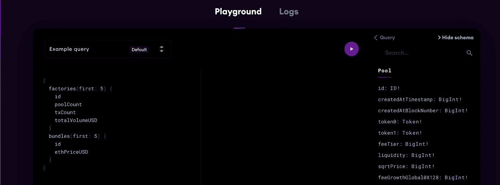
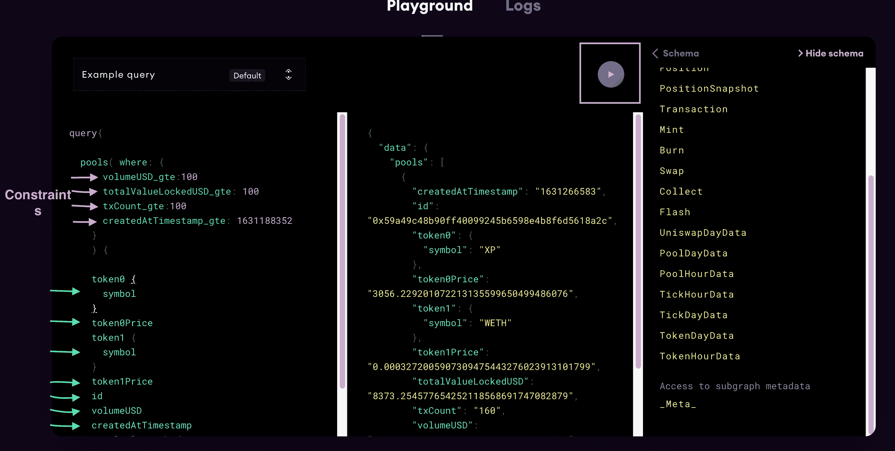
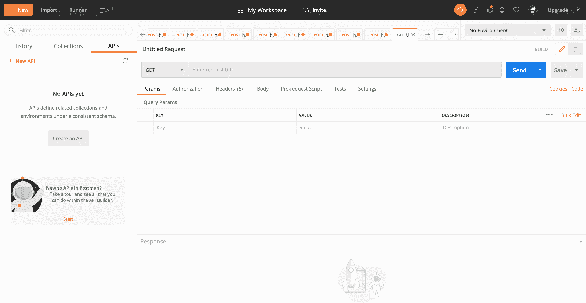
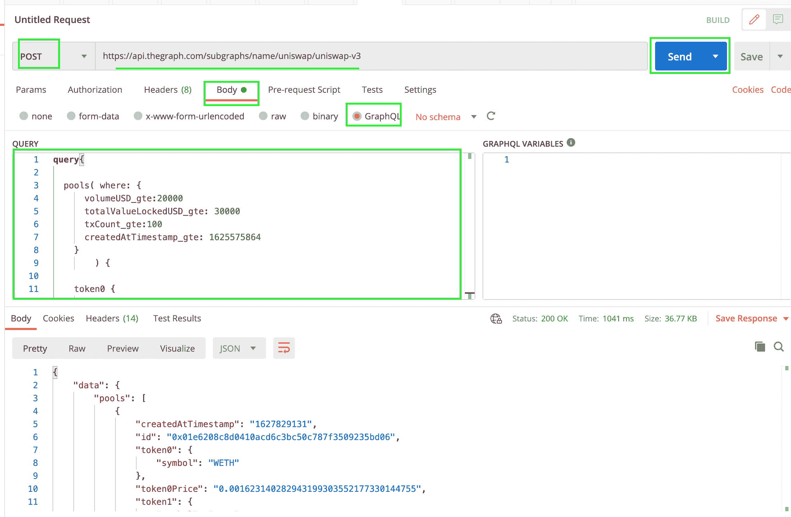
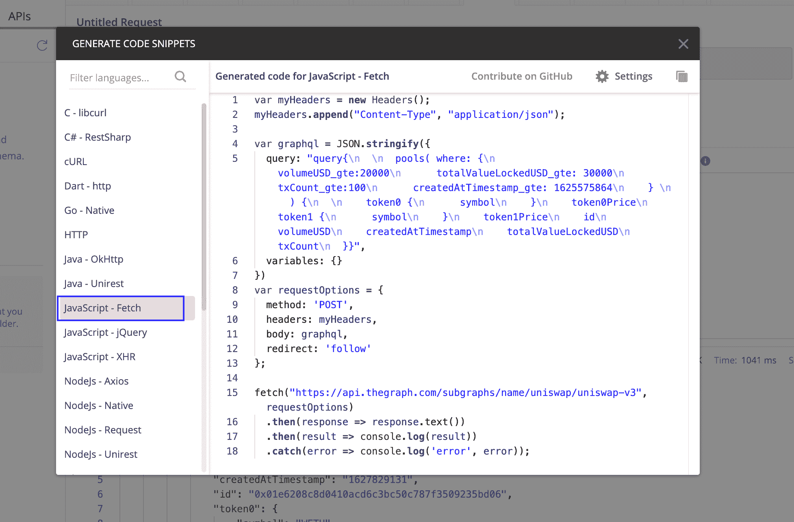
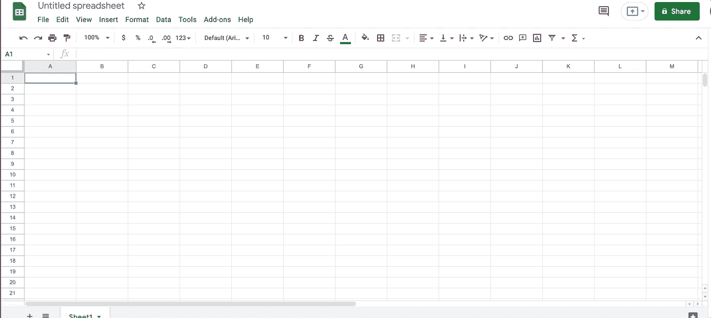
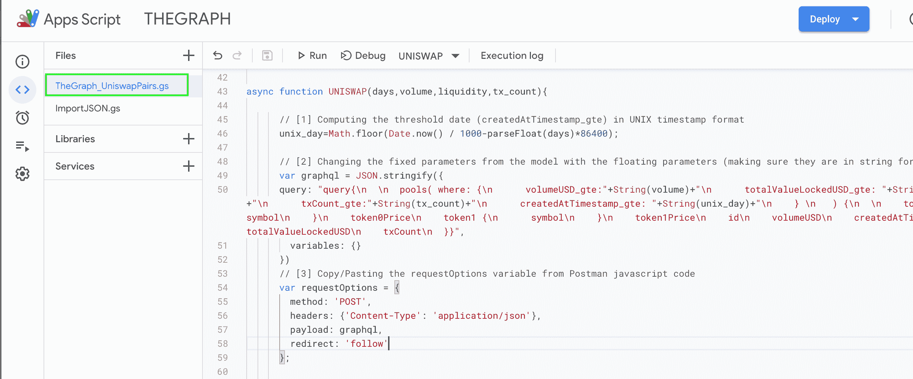
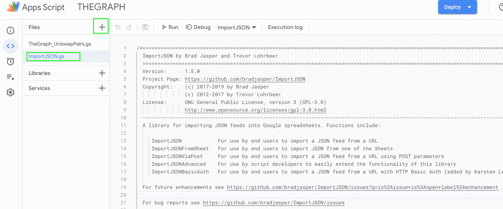

# thegraph/uniswap_latestpairs

> 原文：<https://github.com/figment-networks/learn-tutorials/blob/master/thegraph/uniswap_latestpairs.md>

本教程旨在帮助非技术人员了解如何与图形交互，以及如何将链上数据连接到 Google Sheets 中。几年来，我一直致力于在 Google Sheets 中收集加密数据，我发现 Sheets 是一个有用的界面，可以过滤分散交易所中新列出的配对。在本教程中，您将**学习如何在图上找到 UniswapV3 子图，发出 GraphQL 请求，使用 Postman 翻译 Javascript (Google Sheet 的编程语言)中的查询，最后使用用户定义的公式检索工作表中的对子。**

[](https://github.com/figment-networks/learn-tutorials/raw/master/assets/UNISWAP.gif)

# 先决条件

适合具有基本编码技能的初学者。本培训假设您有一个 Gmail/Google 帐户，因为我们将基于 Google Sheets 进行培训。如果你能访问 Postman，就能更容易地了解如何测试来自 Graph 的 GraphQL 请求，并将其转换成 Javascript 代码，这是 Google Sheet 的官方编程语言，这也会有所帮助。

*   GraphQL &有 Javascript 知识者优先。可以借助 Postman 和 Graph 的网站直接写代码。
*   **Postman 的**软件让 API 开发更简单。
*   代码:
    *   GS——用于通过 Graph API 检索 uniswap 的最新对(稍后在教程中解释)
    *   用于在 Google Sheets 中处理 Json 对象(稍后在教程中解释)

# 第一，什么是 Uniswap？

[Uniswap](https://academy.binance.com/en/articles/what-is-uniswap-and-how-does-it-work) 是建立在以太坊上的**去中心化交换协议。**更准确地说，这是一个自动化的流动性协议。交易不需要指令簿或任何集中方。Uniswap 允许用户在没有中介的情况下进行交易，具有高度的分散性和对审查的抵抗力。

Uniswap 的分散交换看起来是这样的: [](https://github.com/figment-networks/learn-tutorials/raw/master/assets/Uniswap_exchange.gif)

# 熟悉 Graph 和 GraphQL

[图](https://graphql.org/)是用于索引和查询来自区块链的数据的**分散协议。它能够查询以太坊这样的网络，而且由于 Uniswap 是建立在以太坊之上的，它将允许我们获得它的链上数据。**

## 在图上寻找 Uniswap V3 子图

在本教程中，我们将重点关注在 Uniswap 版本 3 上获取区块链数据。你所需要做的就是在图形的浏览器栏中搜索 Uniswap V3。下图显示了图的样子以及我们将使用的子图:

*   [https://the graph . com/legacy-explorer/subgraph/unis WAP/unis WAP-v3](https://thegraph.com/legacy-explorer/subgraph/uniswap/uniswap-v3)

[](https://github.com/figment-networks/learn-tutorials/raw/master/assets/uniswapv3-subgraph.gif)

## 构建 GraphQL 查询

[GraphQL](https://en.wikipedia.org/wiki/GraphQL) 是一个用于 API 的**开源数据查询和操作语言，**是一个用现有数据完成查询的运行时。GraphQL 是脸书在 2012 年内部开发的，2015 年公开发布。

在 playgroud 模式的 Graph 界面上，有一个 GraphQL 查询的例子。该查询获取 id、poolCount、txCount 和 totalVolumeUSD 的前 5 个工厂，以及 id 和 ethPriceUSD 的前 5 个包。

[](https://github.com/figment-networks/learn-tutorials/raw/master/assets/playground.gif)

出于我们的目的，我们只需要稍微调整一下查询来请求池对。我们感兴趣的是根据硬币活跃的天数、交易量($)、流动性($)和交易次数进行过滤。当您查看池参数时，您会发现构建我们的约束所需的以下对应关系:

*   天数->创建日期时间戳
*   成交量($) ->成交量美元
*   流动性($) ->总值锁定 d
*   交易数量->交易计数

现在，我们不再使用标准的(first:5)子句，而是需要用上面的变量来构建我们的 GraphQL 约束。为了做到这一点，我们需要**构建一个“where”子句**，告诉匹配引擎我们正在寻找在某个日期(时间戳)之后创建的池对，其流动性、交易量和数量都大于用户定义的数量。

在 GraphQL 中，为了表示你需要一个大于的量，你需要在变量的末尾加上 _**GTE**。

这是约束子句与理论值的关系示例:

```js
where: {
      volumeUSD_gte:20000
      totalValueLockedUSD_gte:30000
      txCount_gte:100
      createdAtTimestamp_gte: 1625575864
    } 
```

随后，为了创建查询的其余部分，您需要显示该对令牌的符号、价格、id(合约地址)、交易量、流动性、交易数量和时间戳。

最终的 graphQL 查询如下所示:

```js
query{
  pools( where: {
      volumeUSD_gte:20000
      totalValueLockedUSD_gte: 30000
      txCount_gte:100
      createdAtTimestamp_gte: 1625575864
    } 
  ) {
    token0 {
      symbol
    }
    token0Price
    token1 {
      symbol
    }
    token1Price
    id
    volumeUSD
    createdAtTimestamp
    totalValueLockedUSD
    txCount
  }}
```

您可以用这个新查询替换示例查询，然后在操场上按 play。你应该看看结果。

[](https://github.com/figment-networks/learn-tutorials/raw/master/assets/PLAYGROUNDCONSTRAINTS.png)

## 使用 Postman 测试模型并将查询翻译成 javascript

*   [下载邮差](https://www.postman.com/downloads/)

下载完 Postman 后，您可以打开一个新窗口，如下所示:

[](https://github.com/figment-networks/learn-tutorials/raw/master/assets/postmanempty.png)

要在 Postman 中获取数据，您需要:

1.  在 url 框中插入来自 Uniswap V3 子图([https://api.thegraph.com/subgraphs/name/uniswap/uniswap-v3](https://api.thegraph.com/subgraphs/name/uniswap/uniswap-v3))的 HTTP 查询 URL
2.  更改发布请求
3.  将上面的 GraphQL 查询复制/粘贴到正文中，并选择 GraphQL
4.  点击发送

您应该得到与图表上相同的 JSON 表。

[](https://github.com/figment-networks/learn-tutorials/raw/master/assets/postmanconstraints.png)

# 通过 Google Sheet 连接模型

一旦确认查询在 Postman 中正常工作，就可以使用 Save 按钮下面的 code 按钮将代码转换成 Javascript Fetch 请求(对于 Google Sheet)。

[](https://github.com/figment-networks/learn-tutorials/raw/master/assets/postmanjavascript.png)

在 Google 中保存应用程序脚本的重要部分是:

```js
var graphql = JSON.stringify({
  query: "query{\n  \n  pools( where: {\n      volumeUSD_gte:20000\n      totalValueLockedUSD_gte: 30000\n      txCount_gte:100\n      createdAtTimestamp_gte: 1625575864\n    } \n		) {\n  \n    token0 {\n      symbol\n    }\n    token0Price\n    token1 {\n      symbol\n    }\n    token1Price\n    id\n    volumeUSD\n    createdAtTimestamp\n    totalValueLockedUSD\n    txCount\n  }}",
  variables: {}
})
var requestOptions = {
  method: 'POST',
  headers: {'Content-Type': 'application/json'},
  body: graphql,
  redirect: 'follow'
};
```

## 在工作表中构建 javascript 函数

我们希望函数中有浮动参数，以便根据不同的参数过滤新的参数对:

*   自配对创建以来的天数:[createdAtTimestamp_gte]
*   以美元为单位的最小交易量阈值:[volumeUSD_gte]
*   最低美元流动性阈值:[totalValueLockedUSD_gte]
*   自创建日期以来的最小交易数:[txCount_gte]

让我们用这 4 个参数作为输入来定义一个异步函数

```js
async function UNISWAP(days,volume,liquidity,tx_count){
}
```

1.  为了发出 TheGraph post 请求，我们需要一个 UNIX 时间戳格式的阈值日期(createdAtTimestamp_gte)。我们可以计算它，如下面的代码所示。
2.  然后，我们只需要用变量 graphql 中的浮动参数(确保它们在字符串中)来更改模型中的固定参数。
3.  之后，我们可以从 Postman 复制/粘贴 requestOptions 变量
4.  最后，我们使用为 Google sheets(由 Brad Jasper 和 Trevor Lohrbeer 版)创建的 ImportJSONAdvanced 函数调用 URLfetch，使用 Uniswap V3 子图中的 API 端点、requestOptions 以及 ImportJSONAdvanced 函数的标准参数。

```js
// Only for access to files in which the add-on or script is used, rather than all of a user's spreadsheets

/**
* @OnlyCurrentDoc
*/

// Adding description for the function
/**UNISWAP
 * Returns new tradable pairs on Uniswap
 *
 * =UNISWAP(5,10000,10000,100)
 *
 * @param {days}                    the number of Days since the pair is active
 * @param {volume}                  the minimum Volume ($)
 * @param {liquidity}               the minimum Liquidity ($)
 * @param {tx_count}                the number of Transactions existant since creation
 * @customfunction
 *
 * @return a table with all new tradable pairs on Uniswap and their number of Days since Active, the Volume ($), the Liquidity ($), the number of Transactions 
 **/

async function UNISWAP(days,volume,liquidity,tx_count){

	// [1] Computing the threshold date (createdAtTimestamp_gte) in UNIX timestamp format
	unix_day=Math.floor(Date.now() / 1000-parseFloat(days)*86400);

	// [2] Changing the fixed parameters from the model with the floating parameters (making sure they are in string format)
	var graphql = JSON.stringify({
      query: "query{\n  \n  pools( where: {\n      volumeUSD_gte:"+String(volume)+"\n      totalValueLockedUSD_gte: "+String(liquidity)+"\n      txCount_gte:"+String(tx_count)+"\n      createdAtTimestamp_gte: "+String(unix_day)+"\n    } \n		) {\n  \n    token0 {\n      symbol\n    }\n    token0Price\n    token1 {\n      symbol\n    }\n    token1Price\n    id\n    volumeUSD\n    createdAtTimestamp\n    totalValueLockedUSD\n    txCount\n  }}",
        variables: {}
      })

      // [3] Copy/Pasting the requestOptions variable from Postman javascript code
      var requestOptions = {
        method: 'POST',
        headers: {'Content-Type': 'application/json'},
        payload: graphql,
        redirect: 'follow'
      };

      // [4] Calling the URLfetch using the ImportJSONAdvanced function (by Brad Jasper and Trevor Lohrbeer version 1.5) that was created for Google sheets
      return ImportJSONAdvanced('https://api.thegraph.com/subgraphs/name/uniswap/uniswap-v3',requestOptions,'','noInherit',includeXPath_,defaultTransform_);
}
```

## 在 Google Sheet 中复制/粘贴代码

打开您希望使用 Uniswap 功能的 Google 表单->转到**工具/脚本编辑器**

[](https://github.com/figment-networks/learn-tutorials/raw/master/assets/googlesheetmacro.gif)

用我们刚刚创建的代码替换空函数。

[](https://github.com/figment-networks/learn-tutorials/raw/master/assets/uniswapgs.png)

添加 Brad Jasper 和 Trevor Lohrbeer 版本 1.5 的 [ImportJSON 脚本](https://raw.githubusercontent.com/Eloise1988/ImportJSON/master/ImportJSON.gs)

[](https://github.com/figment-networks/learn-tutorials/raw/master/assets/importjsongs.png)

保存代码后，您需要激活[工作表](https://developers.google.com/apps-script/guides/services/authorization)的手动授权范围。

## Uniswap 公式

完成所有这些步骤后，您应该能够在 Uniswap 上请求最新的可交易货币对，给出货币对活跃的天数、交易量($)、流动性($)和交易数量的限制。

[](https://github.com/figment-networks/learn-tutorials/raw/master/assets/UNISWAP.gif)

*   [这是对实时模板表](https://docs.google.com/spreadsheets/d/1tME9nMh79KzZP4Wmld7lezom6je4BOw_0T9ABf5GKXE/edit?usp=sharing)的访问

例如，如果我想获得新的 Uniswap 对，其中池在过去 2 天内启动，日交易量大于 1，000 美元，流动性高于 10，000 美元，并且自启动以来已有超过 10 笔交易。公式为: **=UNISWAP(2，1000，10000，10)**

这将返回一个表(见上面的 GIF ),其中包含 Uniswap 上所有新的可交易对及其自活跃以来的天数、成交量($)、流动性($)、交易数量、价格和硬币符号。通过 TheGraph API 可以添加更多的功能。

# 结论

使用 Google Sheet 与图形协议交互的用户友好界面。在本教程中，您学习了如何:

1.  在图上找到一个 UniswapV3 子图
2.  发出 GraphQL 请求
3.  使用 Postman 翻译 Javascript (Google Sheet 的编程语言)中的查询
4.  在特定约束条件下，使用用户定义的公式检索工作表中的最新配对

# 关于作者

Eloise 收集加密货币数据，以帮助用户在 Google Sheets 中导入和评估他们的加密投资组合。她在[媒体](https://eloise88.medium.com/)上发表她的作品，希望你能从中受益。

对于希望直接在 [Github](https://github.com/Eloise1988) 上检查她的工作的开发者，她构建了用于定价的 [COINGECKO](https://github.com/Eloise1988/COINGECKO) 存储库以及用于余额、赌注、指数价格等的 [CRYPTOBALANCE](https://github.com/Eloise1988/CRYPTOBALANCE) 存储库。

非常欢迎反馈。一个[电报聊天](https://t.me/TheCryptoCurious)也可用于支持。如果这个项目为你增加了任何价值，或者正在你的谷歌表单上寻找个性化编码，请不要犹豫，留下你的信息。非常感谢您花时间阅读这篇文章。在这个充满挑战的时代，照顾好你自己&和你的家人！

# 参考

*   [https://github.com/Eloise1988/THEGRAPH](https://github.com/Eloise1988/THEGRAPH)
*   [https://github.com/bradjasper/ImportJSON](https://github.com/bradjasper/ImportJSON)